# 课程 01：人工智能与数学中的机器辅助 🧠➗

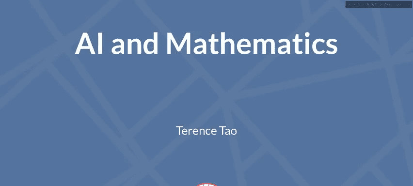

在本节课中，我们将学习陶哲轩教授关于人工智能及更广泛的机器辅助在数学研究中的应用。我们将回顾机器辅助数学的历史，探讨现代工具如形式化证明助手、机器学习和大型语言模型如何改变数学研究的方式，并展望未来的可能性。

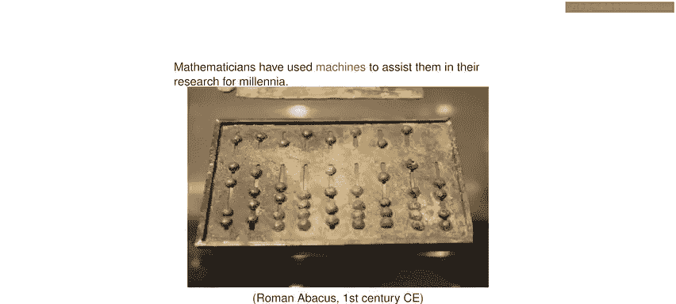

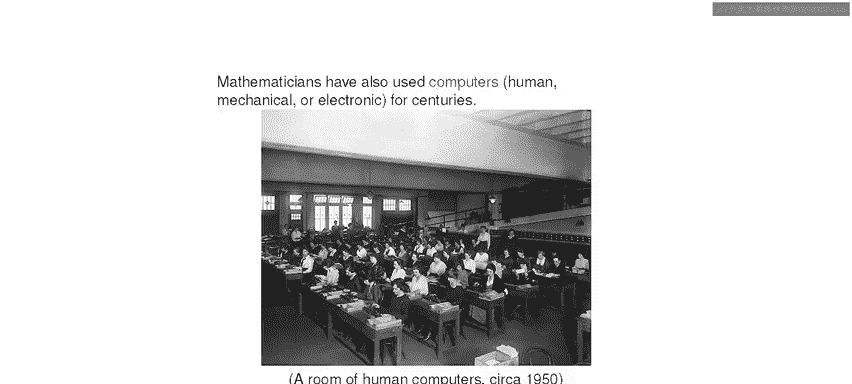

---

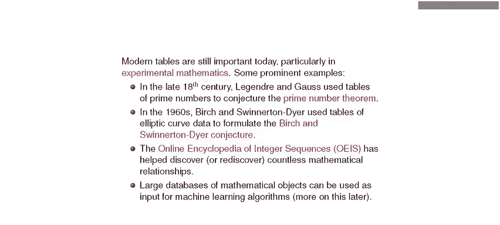

大家好。你们中的一些参赛者非常年轻，所以可能不知道陶哲轩教授是谁。因此，简单介绍一下。

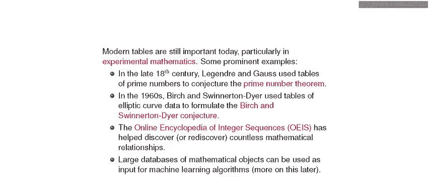

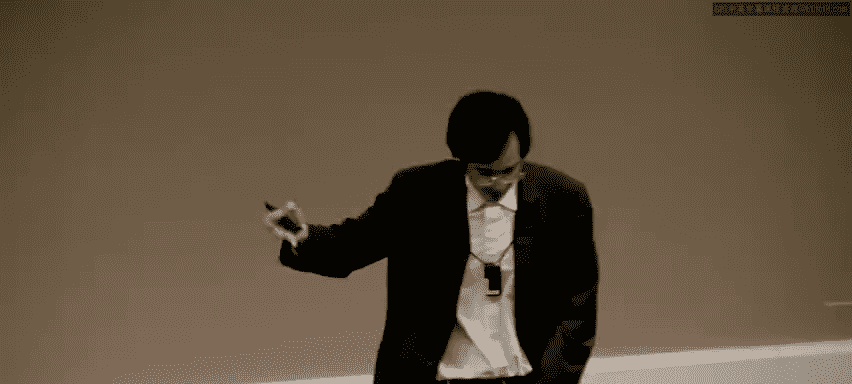

他第一次参加国际数学奥林匹克竞赛时是11岁，并获得了一枚铜牌。第二年，他再次参赛，获得了一枚银牌。之后，在13岁时，他获得了一枚金牌，成为获得金牌的最年轻参赛者。然后，他可能觉得有些乏味，便去上了大学，不再参加国际数学奥林匹克竞赛。现在，他是加州大学洛杉矶分校的教授。可以说，他无疑是国际数学奥林匹克竞赛最大的明星，当然也是我们这个时代最有影响力的数学家之一，尤其是对你们来说，陶哲轩教授。😊

谢谢。很高兴能回到国际数学奥林匹克竞赛。我参加国际数学奥林匹克竞赛的时光是我一生中最有趣的时光之一，我至今仍怀念它。我希望大家不仅是在比赛中，无论成绩好坏，也在社交活动中都玩得开心，他们在这里总是举办非常棒的活动。😊

我的演讲是关于人工智能，以及更广泛的数学中的机器辅助。你们都听说过人工智能，以及它如何改变一切。我想今天早些时候，DeepMind有一个演讲，介绍了他们发布的新产品AlphaGeometry，现在可以解答一些国际数学奥林匹克竞赛的几何问题。实际上，在我的演讲之后，紧接着会有一个关于AI数学奥林匹克竞赛的演示，所以请在我的演讲结束后留下来观看。因此，我将更多地讨论这些工具如何开始改变研究数学，这与竞赛数学不同。研究数学不是用三个小时左右来解决问题，而是需要数月时间。有时你无法解决问题，然后你必须改变问题。这绝对与数学竞赛不同，尽管有一些重叠的技能。

所以这非常令人兴奋，并且开始具有变革性。但另一方面，也有一种延续感。实际上，我们使用计算机和机器来做数学已经很久了。只是我们使用它们的方式正在改变，但它实际上延续了机器辅助的悠久传统。😊

那么，我们使用机器做数学有多久了？答案是数千年。我的意思是，这是罗马人用来做数学的机器——算盘，甚至还有更早的机器。好吧，这有点无聊。这不是一个非常聪明的机器。那么计算机呢？我们使用计算机做数学有多久了？大约是300到400年。我想这有点奇怪，因为你知道，现代计算机直到20世纪30年代和40年代才出现电子计算机。但计算机并不总是电子的，之前是机械的，再之前是人工的。“计算机”实际上是一种职业，指进行计算的人。

这是一群在二战期间工作的“计算机”，用于计算弹道和其他事情。他们有一整群“计算机”，主要是女孩，因为男人都去打仗了。他们使用加法机，基本上有程序员告诉这些女孩该做什么。当时计算能力的基本单位不是CPU，而是“千女孩小时”。即1000个女孩像这样工作一小时能完成多少计算。

但是，正如我所说，我们使用计算机实际上比那更早，自18世纪甚至更早。那时计算机最基本的用途是制作表格。比如纳皮尔的对数表，如果你想计算正弦和余弦等，你会使用计算机生成这些巨大的表格。我上高中时，我们的课程中仍然学习如何使用这些表格，当时它们正被淘汰，因为现在我们有了计算器和计算机。我们今天仍然使用表格，在数学研究中，我们依赖表格，现在我们称之为数据库，但本质上是相同的东西。

数学中有许多重要的结果最初是通过表格发现的。在数论中，一个最基本的结果被称为素数定理。它大致告诉你，在一个大数X以内有多少个素数。它是由勒让德和高斯发现的。他们无法证明它，但他们猜想它是真的，因为高斯等人基本上有“计算机”。事实上，高斯本人就有点像一台“计算机”，他计算了前一百万个素数的表格，试图寻找规律。

几个世纪后，又有一个非常重要的猜想。素数定理最终在1907年左右被证明。但数论中还有一个非常核心的问题，称为伯奇和斯温纳顿-戴尔猜想，我想在这里谈谈。它最初也是通过查看大量关于椭圆曲线的数据表格发现的。

现在许多数学家（包括我自己）使用的一个表格，叫做“在线整数序列百科全书”。也许你自己也遇到过它。你可能仅凭记忆就认出许多整数序列，比如如果我告诉你序列1, 1, 2, 3, 5, 8, 13，你知道那是什么（斐波那契数列）。OEIS是一个包含数十万个类似序列的数据库。很多时候，当数学家研究一个研究问题时，会有一个相关的自然数列，也许是一个依赖于n的空间序列，你计算其维数、基数等。你可以计算前五六个或十个这样的数字，然后输入OEIS进行比对。如果你幸运的话，这个序列已经被其他人输入了，并且它来自研究某个完全不同的数学问题。这确实给了你一个很大的线索，表明两个问题之间存在联系。许多富有成效的研究就是这样开始的。

好的，表格是我们最早使用计算机的方式之一。当你想到使用计算机做数学时，最著名的是数值计算，其旧称是科学计算。你只是想做一个非常大的计算，然后进行大量算术运算，你把它交给计算机。我们从20世纪20年代就开始这样做了。也许第一个真正进行科学计算的人是亨德里克·洛伦兹。我想是荷兰政府委托他弄清楚会发生什么，他们想建造一个巨大的堤坝——阿夫鲁戴克大堤，想知道水流情况。所以他们有模型和流体方程。他实际上使用了一大群人工“计算机”来计算。他不得不发明浮点运算来做这件事。他意识到，如果你想让很多人快速完成大量计算，你应该用浮点数表示不同量级的数字。

当然，我们现在使用计算机来模拟各种事情。如果你在解线性方程或偏微分方程，想进行一些组合计算，你也可以解决代数问题。原则上，你在奥林匹克竞赛中看到的所有几何问题（虽然不是全部，但很多）都可以通过科学计算来解决。有一些代数软件包可以将任何涉及10个点、一些直线和圆的几何问题转化为一个包含20个实变量和20个未知数的方程组，然后输入到Sage或Maple等软件中。不幸的是，一旦问题规模超过一定大小，复杂性就会呈指数级甚至双指数级增长。因此，直到最近，仅用标准代数软件包暴力破解这些问题还不太可行，但现在有了人工智能辅助，前景更加光明。你今天早上已经听到了相关的演讲。

另一种变得相当强大的科学计算类型是SAT求解器（可满足性求解器）。它们基本上解决逻辑谜题。如果你有10个或1000个真或假的陈述，并且你知道，如果第三个陈述为真且第六个陈述为真，那么第七个陈述必须为假。如果你给出一大堆这样的约束，SAT求解器会尝试利用所有这些信息，并得出结论，比如能否证明这些句子的某种组合。还有一个更高级的SAT求解器版本，叫做SMT求解器（可满足性模理论求解器），其中你还有一些变量X、Y、Z，并假设一些定律，比如可能有一个额外的运算是交换和结合的，你把这些定律以及其他一些事实输入进去，然后尝试暴力推导，看能否从一些有限的假设中推导出某个结论。这些求解器相当强大。但不幸的是，它们的扩展性也不好。同样，解决它们的时间复杂度呈指数增长。所以一旦命题数量超过1000左右，这些求解器就很难在合理时间内运行。

但它们实际上可以解决一些问题。例如，最近的一个成功案例。这是一个组合学中的问题，可能只能通过计算机解决。我认为没有辅助的情况下，人类不可能解决它。它涉及所谓的毕达哥拉斯三元组问题，直到这个大型计算机SAT求解器计算之前一直未解决。问题是，你取自然数，用两种颜色（红色或蓝色）给它们着色。但问题是，无论你如何用这两种颜色给自然数着色，是否其中一种颜色必然包含一个毕达哥拉斯三元组a, b, c，即三个数满足勾股定理，如3, 4, 5？这以前不知道是否成立。我们没有人类证明，但我们有计算机证明。现在已知，事实上，你不需要所有自然数，只需要到7824。无论你如何用两种颜色给1到7824着色，其中一种颜色都会包含一个毕达哥拉斯三元组。现在有2^7824种着色方式，你无法通过暴力枚举完成。所以你必须有点技巧，但这是可能的。然后，一旦你有了7825，你就必须有一个毕达哥拉斯三元组。实际上，存在一个7824的例子，其中没有毕达哥拉斯三元组。所以这是一个证明。实际上，我认为在当时，这是世界上最长的证明。我想现在它是第二长的证明。这个证明需要7个CPU年的计算，并生成了一个证明证书。实际的证明有200 TB，尽管后来被压缩到仅86 GB。😊

这是一种使用计算机进行大规模案例分析的方式。这是使用计算机的一种相当明显的方式。但近年来，我们开始以更具创造性的方式使用计算机。

我认为有三种方式正在被用来做数学，当它们相互结合，并与更经典的数据库、表格和符号计算、科学计算结合时，尤其令人兴奋。

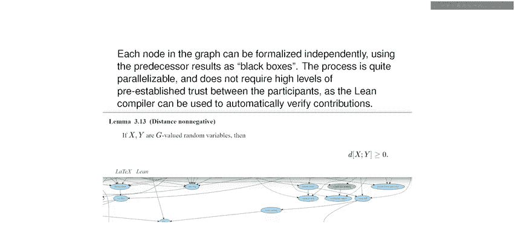

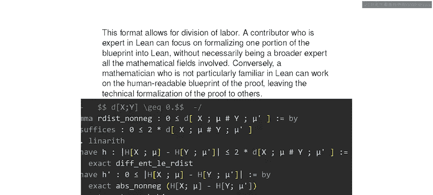

首先，我们使用机器学习、神经网络来发现新的联系，并找出不同类型的数学之间以人类不易察觉的方式相关联的模式。特别是大型语言模型，在某种意义上，它们是机器学习算法的非常庞大的版本，可以处理像ChatGPT和Claude这样的自然语言。它们有时可以生成可能的问题证明方法，有时有效，有时无效。实际上，在接下来的演讲中你会看到更多这方面的例子。

但还有另一种技术，刚刚开始被日常数学家使用，称为形式化证明助手。这些是语言，就像你用来编写可执行代码程序、做事情的计算机语言一样，形式化证明助手是你用来检查事物、检查某个论证是否真实、是否从数据中得出结论的语言。直到最近，使用它们还相当麻烦，现在它们变得有些容易使用了，并且正在促进许多没有这些证明助手就不可能实现的、有趣的数学项目。在未来，它们将与我在这里描述的其他工具很好地结合。

所以，我想谈谈这些更现代的使用机器和计算机做数学的方式。我想从证明助手开始。

历史上第一个真正的计算机辅助证明可能是四色定理的证明：每个平面地图都可以用四种颜色着色。该证明于1976年完成，这是在证明助手出现之前。按照现在的标准，它不会被称为计算机证明。它是一个大规模计算，其中一半由计算机完成，一半由人类完成。证明四色定理的方法是，你基本上对国家数量进行归纳，并证明如果你有一个巨大的地图，存在一些国家的子图。他们有一个包含大约100到2000个特殊子图的列表，每个大的国家图在某种意义上必须包含这些子图之一。这是他们必须检查的一件事。然后他们必须检查，每当你有一个子图，你可以用更简单的东西替换它，如果你能为更简单的东西着色，你就能为原图着色。他们必须为这1000个左右的图检查这些性质，我想他们称之为可放电性和可约性。我认为其中一项任务他们可以用计算机完成，尽管那是20世纪70年代的计算机，我想他们必须手动将每个图输入到一个程序中并检查。另一项任务实际上是由一个人类“计算机”完成的，其中一位作者的女儿之一不得不花费数小时手动检查可约性，这非常繁琐。这个过程并不完美，有很多小错误，他们不得不更新表格。😊

所以，按照现代标准，这不是一个计算机可验证的证明。直到90年代，才出现了一个更简单的证明，仅使用了大约700个图。但现在所有需要检查的东西都有一个非常精确、定义良好的属性列表。你可以用你喜欢的计算机语言（如C或Python）编写代码，在现代计算机上用几页代码、几百行代码，在几分钟内检查完毕。然后，要实际检查从数学公理一直推导下来的完整证明，是在2005年使用一种名为Coq（我想现在改名为Rocq）的证明语言完成的。嗯，所以这是最早的证明之一。你看，从证明首次出现到我们能够用计算机完全验证，中间有巨大的差距。

另一个著名的例子是开普勒猜想的球体堆积问题。这是开普勒在17世纪提出的一个非常古老的猜想，表述非常简单：你取一堆单位球体，想尽可能高效地覆盖三维空间。有一种明显的堆积球体的方式，就像水果店堆橙子那样的三角堆积（抱歉，应该是面心立方堆积），还有一种对偶堆积叫做立方堆积，具有相同的密度，大约74%。问题是，这是否是最好的可能方式？结果证明这是一个异常困难的问题。在二维空间中，证明最佳堆积并不太难。只有在8维和24维中，我们最近才知道答案，这是Maryna Viazovska的伟大工作，也许她昨天谈到了。嗯，但三维是我们知道的除了平凡情况（一维）之外的唯一其他情况。但确实，证明起来非常困难。同样，没有完全人类可读的证明。有一个策略。当然，问题在于这些球体有无穷多个，密度是一个渐近概念。所以这不是一个有限问题，你不能直接交给计算机。

但你可以尝试将其简化为一个有限问题。托特在50年代提出了一个策略。每当你有一个堆积时，它将空间细分为这些多面体，称为Voronoi区域，即一个球体的多面体，包含所有比到其他球体中心更接近该球体中心的点。所以你可以将空间分割成所有这些多面体，这些多面体有一定的体积，你还可以计算它们的面数和表面积等。它们都有这些统计数据。堆积密度与这些区域的平均体积密切相关。所以，如果你能说明这些体积或多面体的平均行为，那么你至少可以得到这些堆积效率的上界，并且你可以尝试建立这些多面体之间的关系，比如如果一个多面体很大，可能迫使附近的多面体很小，所以你也许可以找到一些连接一个单元体积与另一个单元的不等式。因此，也许你应该收集大量这样的不等式，然后进行一些线性规划，希望你能从这个神奇的π/√18（即最优密度）推导出正确的上界。人们尝试过，甚至有人声称成功，但没有一个被接受为实际的证明。😊

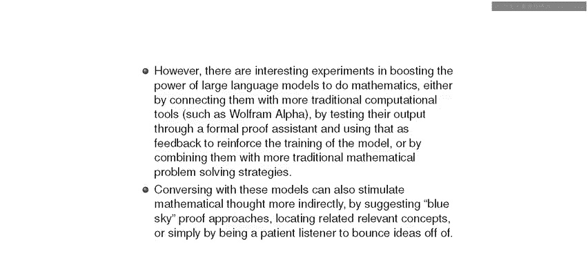

这个问题最终由托马斯·黑尔斯及其合作者解决。他基本上采用了相同的策略，但使用了大量的技术调整。他将单元从Voronoi单元改为稍微更复杂的单元。他没有直接使用体积，而是发明了一个“得分”，分配给每个单元，它是可能的体积减去许多特定的调整。但同样，目的是尝试创建这些不同得分之间的线性不等式，最终得到密度的上界，并希望恰好达到最优密度。

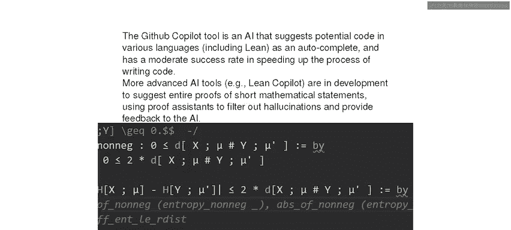

这是一个非常灵活的方法，太灵活了，因为你可以尝试的东西太多，有太多方法可以设置得分等等。这里有一句引述。黑尔斯和弗格森意识到，每次在尝试最小化函数等过程中遇到问题时，他们都可以改变得分再试一次。但每次他们检查的东西都必须重做。所以得分函数变得越来越复杂，他们为此工作了近十年，变得越来越复杂，但每次改变都削减或使用了我的工作。😊 这种无休止的调整让我的同事们很不满。每次我在会议上展示我的工作进展时，我都在最小化一个不同的函数。更糟的是，这个函数与我早期论文中的工作略有冲突，这需要回去修补早期的论文。嗯，但他们最终还是做到了。所以在1998年，他们宣布终于找到了一个得分，它满足150个变量的一整套线性不等式，他们进行了最小化并得到了结果。最初他们并没有计划将其作为计算机辅助证明，但随着项目变得越来越复杂，不可避免地需要使用越来越多的计算机。是的，按照1998年的标准，这个证明非常庞大：250页的笔记和3 GB的计算机程序和数据。实际上，它经历了非常艰难的审稿过程。它被送到顶级数学期刊之一《数学年鉴》，由两位审稿人审稿，花了四年时间。最后他们说，他们99%确定证明的正确性，但无法认证计算机计算的正确性。他们做了一件非常不寻常的事情：在发表论文时加了一个编者注说明这一点。后来他们实际上已经移除了那个说明。当时，关于计算机辅助证明是否算作实际证明存在很多争议，现在我想我们已经坦然多了。

但即使在发表之后，人们仍然怀疑它是否真的是一个证明。所以这可能是第一个备受瞩目的重大问题，它真正激励了人们去用形式化证明语言将其完全形式化到第一原理。因此，黑尔斯创建了一种语言（实际上是现有语言的修改版）来做这件事。他称之为Flyspeck项目。他估计需要20年时间来形式化他的证明，但实际上在21位合作者的帮助下，他最终只用了12年，于2014年完成。😊

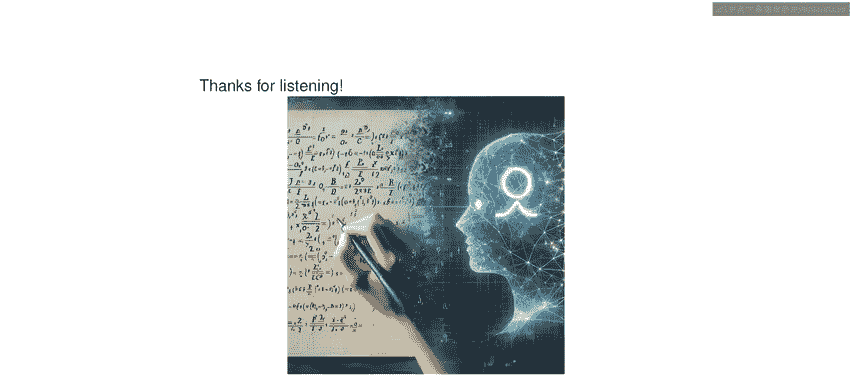

好的，所以我们现在对这个特定结果有了完全的信心，但这个过程相当痛苦。现在，在最近几年，我们已经为如何形式化找到了更好的工作流程。它仍然繁琐，但正在变得更好。例如，彼得·舒尔茨是一位非常杰出的年轻数学家，他是菲尔兹奖得主。他以许多事情闻名，但他创建了这个非常有前景的数学领域，叫做凝聚数学。它运用代数、范畴论以及所有代数工具的力量，应用于泛函分析，如巴拿赫空间等函数空间的理论。分析学一直对代数方法有抵抗力，但这个数学领域原则上允许人们用代数方法解决至少泛函分析中的某些类型问题。他建立了这个整个范畴，这些叫做凝聚群和凝聚向量空间的东西（解释“凝聚”是什么意思需要太长时间）。基本上，他的论点是，我们在研究生课程中学到的所有函数空间范畴都是不正确的，或者不是特别自然的，有性质更好的范畴。😊

但他建立了这个理论。然而，有一个非常重要的消失定理需要证明。我在这里陈述了它，但不会解释这些符号是什么意思。他需要计算某个范畴上同调群的消失，没有这个，整个理论就没有任何有趣的结论。所以这是他理论的基础。他写了一篇关于这个结果的博客文章。他说他花了整整一年时间沉迷于这个定理的证明，几乎要疯了。最后，他能够在纸上写出一个论证，但没有人敢看细节。所以他仍然有挥之不去的疑虑。是的，凝聚数学能否成功应用于泛函分析，取决于这个定理。这是最基础的重要性。所以99.9%确定是不够的。他说他很高兴看到世界各地有许多关于凝聚数学的学习小组，但它们都停在这个定理的证明之前。这个证明并不有趣。所以他说，这可能是我最重要的成果，最好确保它是正确的。😊

因此，他也有强烈的动机在更现代的语言中形式化这个定理，这种语言叫做Lean。Lean是一种近年来发展迅速的语言，有一个众包开发的大型数学库。因此，与其从数学公理开始推导一切（这非常繁琐，越高级越繁琐），这种数学非常高级。所以Lean有一个核心数学库，已经证明了许多中间结果，比如你在本科数学课程中会看到的东西，如基础微积分、群论或拓扑学等。这些已经被形式化了。所以你有一个基础，你不是从公理开始，而是从大约本科水平的数学教育开始。要达到你需要的地方仍有很大差距，但这有帮助。但是，为了形式化这个定理，他们必须添加许多额外的东西。数学库并不完整，现在仍然不完整。数学的许多领域，如同调代数、层论等，需要添加到这个库中。但在仅仅18个月内，他们就能够形式化这个定理。😊

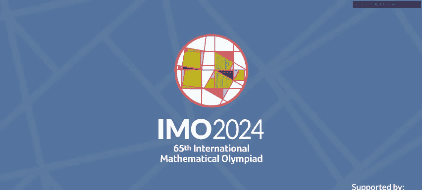

证明基本上是正确的。有一些小的技术问题，但没有发现什么重大问题。他们找到了一些很好的简化。有些技术步骤太难形式化，所以他们被迫找到了一些捷径。但实际上，这个项目的价值更多是间接的。首先，他们极大地丰富了Lean的数学库。所以现在数学库可以处理更多的抽象代数，比以前程度高得多。而且