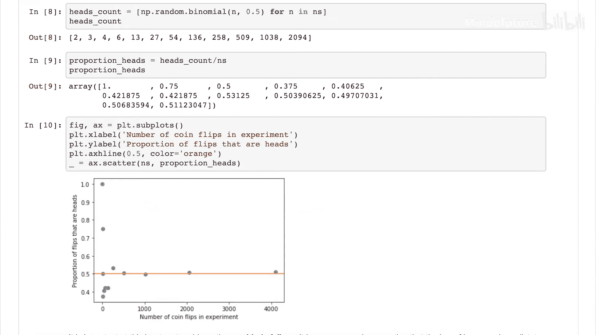
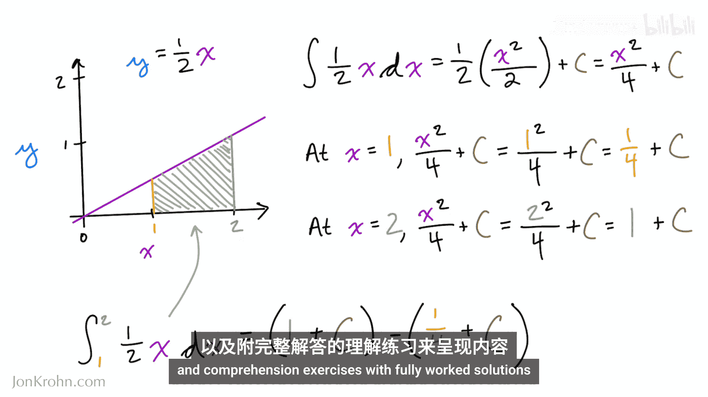

# 001：机器学习基础-欢迎踏上旅程 🚀

在本节课中，我们将开启机器学习基础系列课程的学习旅程。本系列旨在为你打下坚实的理论基础，无论你是机器学习新手，还是希望巩固底层知识的资深从业者。

我是约翰·科恩博士，Maine Learning公司Untapped的首席数据科学家，畅销书《深度学习图解》的作者，并创作了数十小时广受欢迎的视频教程。基于多年的教学经验，我总结出一套对成为优秀机器学习实践者至关重要的核心知识体系。

与以往我创作的深度学习材料一样，本机器学习基础系列的内容将通过生动的全彩插图、Jupyter笔记本中简洁明了的Python代码示例，以及附带完整解答的理解练习，变得栩栩如生。

正如你可以在关联的GitHub仓库（Github.com/jochroone/mfounds）中阅读到的更多细节，本机器学习基础系列的八个主题被组织成四个对子。

以下是本系列涵盖的八个核心主题：

*   **线性代数入门**
*   **线性代数2：矩阵运算**
*   **微积分1：极限与导数**
*   **微积分2：偏导数与积分**
*   **概率论与信息论**
*   **统计学入门**
*   **算法与数据结构**
*   **优化**

掌握这八个主题将为任何人打下坚实的基础，无论你是刚刚开始接触机器学习，还是希望巩固底层理论的机器学习软件库资深用户。

后续主题会建立在前面主题的内容之上，因此建议按照提供的顺序学习。当然，你也可以根据自己的兴趣或对材料的熟悉程度，自由选择单个主题甚至单个视频进行学习。

我尽力减少了对观众背景的假设。所有代码演示都将使用Python——这是数据科学和机器学习领域应用最广泛的软件语言。如果你熟悉Python或其他面向对象的编程语言，将有助于理解代码示例。如果你能轻松处理定量信息，例如理解图表和重组简单方程，那么你应该能很好地跟上所有的数学内容。

无论你现有的背景如何，这个实用且深入的视频系列将极大地扩展你处理和建模数据的能力。在旅程结束时，你将深刻理解支撑当代机器学习方法（包括深度学习和其他AI技术）的所有基础学科。

让我们开始吧。😊

---

本节课中，我们一起学习了机器学习基础系列课程的目标、内容结构以及学习建议。本系列旨在通过直观的图解、实践代码和练习，帮助你构建坚实的理论基础，为深入探索机器学习世界做好准备。