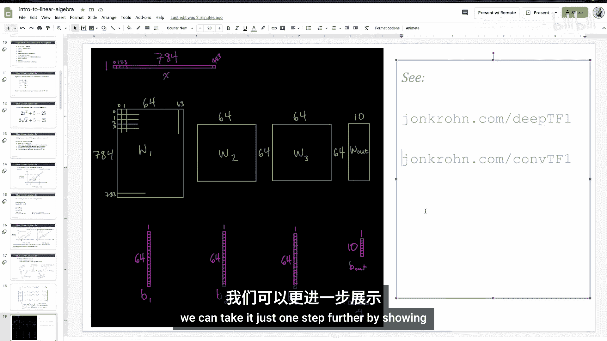
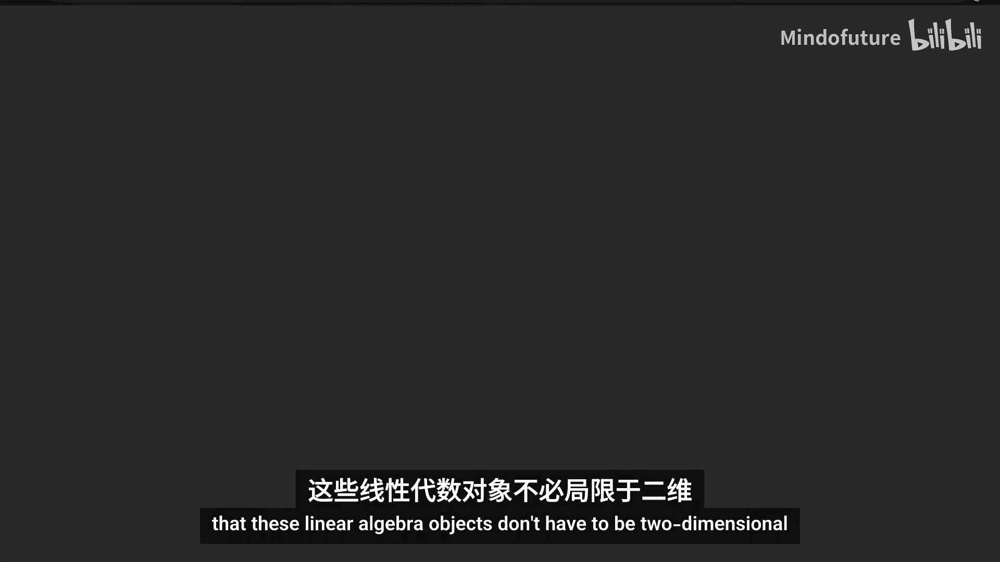
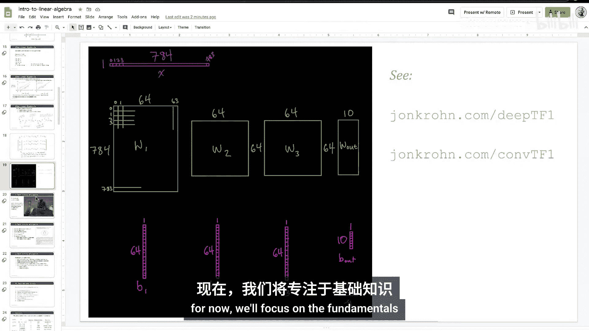

# 002：什么是线性代数 📚

在本节课中，我们将要学习线性代数的基本概念，了解其历史背景，并探讨它在机器学习中的核心应用。我们将从代数的基础定义开始，逐步深入到线性代数的具体含义，并通过实例展示如何用线性代数解决实际问题。

## 概述

线性代数是研究线性方程组、向量空间以及线性变换的数学分支。在机器学习中，它是理解和构建模型（如线性回归和深度学习）的基石。本节课将介绍线性代数的定义，并通过一个追及问题的例子，展示如何用线性代数求解。我们还将简要回顾代数的历史，并展望线性代数在后续课程中的重要性。

## 什么是线性代数？

首先，我们来讨论代数的一般含义。代数是包含非数值实体（如变量X）的算术。

以下是一个简单的例子：方程 `2x + 5 = 25`。我们可以从等式两边减去5，得到 `2x = 20`，然后两边除以2，得出 `x = 10`。你可以验证，当 `x = 10` 时，原方程成立，因此这是该方程的唯一解。这就是代数。

现在，进一步探讨线性代数。如果一个方程包含指数项，例如 `2x² + 5`，那么它就不是线性的，因为平方是非线性变换。同样，包含平方根的方程也不是线性的。

为了给出线性代数的精确定义，我们可以说：**线性代数是求解线性方程组中的未知数**。

## 线性方程组

线性方程组涉及多个线性方程，同时求解多个未知数（如x）。以下是一个例子：

假设警车的速度为每小时180公里。银行劫匪的车速稍慢，为每小时150公里。但劫匪比警车提前5分钟出发。警车需要多长时间才能追上劫匪？追上时他们行驶了多远的距离？为简化问题，我们忽略加速、交通等因素，并假设他们沿直线同向行驶。

我们可以用图表法解决这个问题。注意到150公里/小时对应2.5公里/分钟，180公里/小时对应3公里/分钟。绘制时间（分钟）与距离（公里）的关系图，劫匪的行程用绿线表示（斜率为2.5），警车的行程用另一条线表示（斜率为3，但起始时间延迟了5分钟）。两条线的交点就是警车追上劫匪的时刻。

或者，我们可以用代数方法求解。代表劫匪行程的方程是：`D = 2.5t`。代表警车行程的方程是：`D = 3(t - 5)`。由于两者都等于D，我们可以建立等式：`2.5t = 3(t - 5)`。

展开方程：`2.5t = 3t - 15`。将 `3t` 移到等式左边：`2.5t - 3t = -15`，得到 `-0.5t = -15`。两边除以 `-0.5`，解得 `t = 30` 分钟。

现在我们知道警车需要30分钟追上劫匪。要计算距离，可以将 `t = 30` 代入任意一个方程。例如，`2.5 * 30 = 75` 公里，或 `3 * (30 - 5) = 75` 公里。结果一致。

在这个线性方程组中，我们得到了唯一解。然而，线性方程组可能只有三种结果：唯一解、无解或无穷多解。如果警车和劫匪速度相同，则无解；如果速度相同且同时出发，则有无穷多解。线性方程组的直线不可能交叉多次，这是线性代数的关键特性。

## 机器学习中的线性方程组

在一个给定的方程组中，可能包含许多方程和许多未知数。在上面的例子中，有两个方程和两个未知数。现在，考虑一个机器学习中的例子：回归模型。

在这个模型中，我们试图预测房价。对于每栋房子，我们预测其价格 `y`，并收集多个特征或变量（如到学校的距离、卧室数量等）来帮助预测。假设有 `M` 个特征。

回归模型的基本方程形式为：
`y = a + b*x1 + c*x2 + ... + m*xM`
其中，`a` 是截距项，`b, c, ..., m` 是每个特征对应的系数（参数），`x1, x2, ..., xM` 是特征的具体数值。

我们通常拥有大量数据（例如，数千栋房子的信息），因此会有 `N` 个方程（行），每个方程对应一栋房子。所有方程共享相同的未知参数 `a, b, c, ..., m`。我们的目标是找到一组最优的参数值，使得模型能最好地拟合所有数据。

用线性代数的集合符号表示，对于第 `i` 栋房子，其方程可写为：
`y_i = a + b*x_i1 + c*x_i2 + ... + m*x_iM`
其中，`i` 从1到 `N`。

在典型的机器学习问题中，`N`（行数）可能非常大（例如，数百万张图像），`M`（特征数或参数数）也可能非常多（例如，高分辨率图像的像素数）。线性代数提供了高效处理这种大规模方程组的方法。

## 线性代数在深度学习中的体现

线性代数的概念同样适用于更复杂的模型，如深度学习。在深度学习中，数据通常以**张量**的形式组织。

以下是一些核心的线性代数对象在代码中的体现：
*   **标量**：单个数值，例如 `a = 5`
*   **向量**：一维数组，例如 `v = [1, 2, 3]`
*   **矩阵**：二维数组，例如 `M = [[1, 2], [3, 4]]`
*   **高阶张量**：三维及以上的数组，例如在处理图像批次时。

在TensorFlow或PyTorch等深度学习框架中，模型的输入（如图像像素）、权重和偏置参数都被表示为张量。例如，一个全连接层的操作可以表示为矩阵乘法和向量加法：
`output = activation(input @ weights + biases)`
其中 `@` 表示矩阵乘法。

通过优化算法调整这些权重和偏置张量，模型能够学习从输入到输出的映射。卷积神经网络等模型则进一步使用了更高维度的张量来有效处理空间数据。

## 代数的历史背景 📜

了解代数的起源十分有趣。波斯数学家**阿布·贾法尔·穆罕默德·伊本·穆萨·花拉子密**（约公元780-850年）对代数的发展做出了关键贡献。他撰写了《还原与对消计算概要》一书，书名中的“还原”一词在阿拉伯语中即为“代数”。因此，他不仅是代数史上的重要人物，英文单词“算法”也源于他的名字。

中世纪伊斯兰阿拉伯帝国对现代符号代数的发展贡献最为显著，尽管后来在17世纪经法国数学家如勒内·笛卡尔等人进一步完善。

许多其他文明也独立发展了代数：
*   **巴比伦人**早在公元前1900年就发展了口述代数。
*   **埃及人**在公元前1650年的纸莎草卷轴上记载了线性代数问题。
*   **印度数学家**在公元前6世纪左右开始研究线性方程。
*   **希腊人**，如欧几里得（约公元前300年），在其著作《几何原本》中阐述了几何代数。
*   **中国**在公元前250年的著作《九章算术》中解决了线性方程问题。

欧洲人在中世纪后期（12世纪）通过将阿拉伯文本翻译成拉丁文开始接触代数，到13世纪，欧洲数学已能与其他文化媲美。15世纪后，随着伊斯兰帝国的衰落，欧洲接过了代数发展的接力棒，直至今日。

## 线性代数的现代应用

如今，借助强大的计算能力，线性代数在全球数十亿设备中有着广泛的应用：
*   **求解机器学习算法中的未知参数**：包括深度学习，这是我们本系列课程的主要焦点。
*   **降维**：例如使用主成分分析处理高维数据。
*   **网页排名**：使用特征向量等方法（如PageRank算法）。
*   **推荐系统**：使用奇异值分解等技术。
*   **自然语言处理**：用于主题建模和语义分析。

在本机器学习基础系列中，本次线性代数入门课程是后续课程的重要基础：
*   **线性代数2**：涵盖矩阵操作、特征值、奇异值分解和主成分分析。
*   **微积分1与2**：理解极限、导数、偏导数和积分的基础。
*   **概率论与信息论**及**统计学入门**：这些领域大量使用线性代数工具。
*   **优化方法**：最后的优化课程将整合所有知识，详细展示现代机器学习算法如何优化参数。

唯一关联性较弱的是第7主题“算法与数据结构”，但前七个主题均为最终的优化主题奠定了坚实基础。

## 总结

本节课我们一起学习了线性代数的核心定义：它是求解线性方程组中未知数的数学。我们通过一个生动的追及问题实例演示了其应用，并探讨了线性代数在机器学习和深度学习中的核心地位，即通过张量表示和操作数据与模型参数。我们还简要回顾了代数从古波斯、古希腊到现代欧洲的悠久历史，并展望了线性代数在数据降维、推荐系统等领域的广泛应用。在接下来的课程中，我们将深入探讨**张量**的具体概念和操作。

---
**接下来**，我们将正式介绍**张量**是什么。我已经多次提到它，在下一个视频中，我们将深入探讨其确切定义和类型。敬请关注。

为确保不错过本系列的任何教程，请订阅我的频道。感谢参与本教程，如果你喜欢，请点赞和评论。你也可以访问 [johncron.com](https://johncron.com) 注册我的电子邮件通讯。欢迎在LinkedIn上加我为好友，只需说明你是机器学习基础系列的观众。你也可以在Twitter上关注我。下次见！