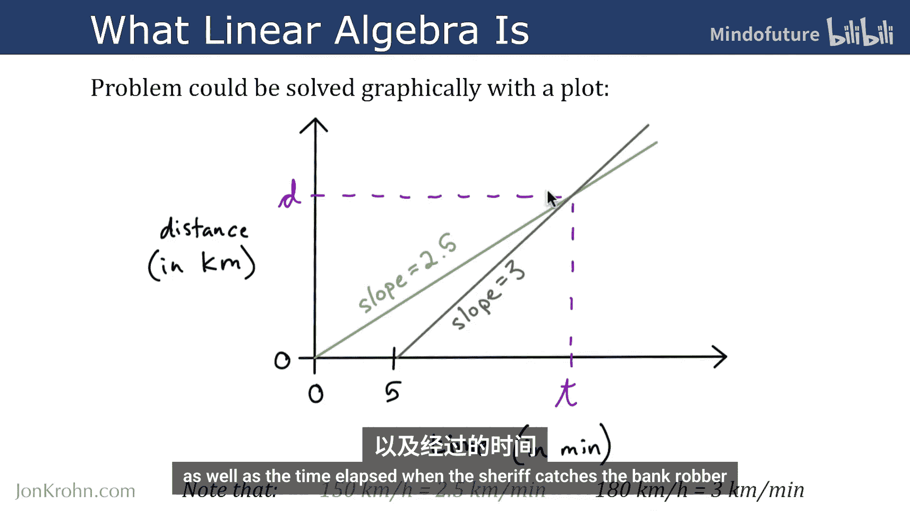
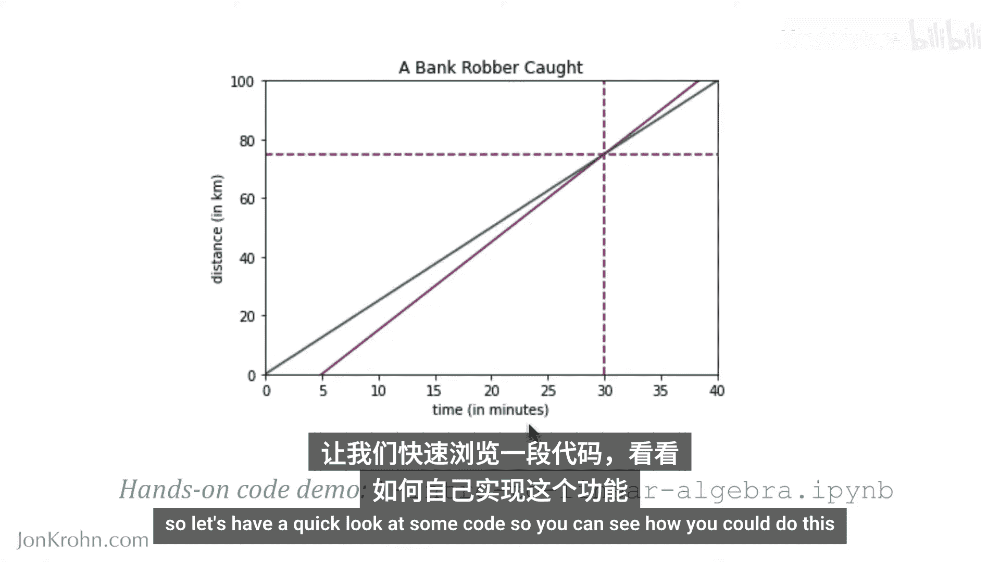
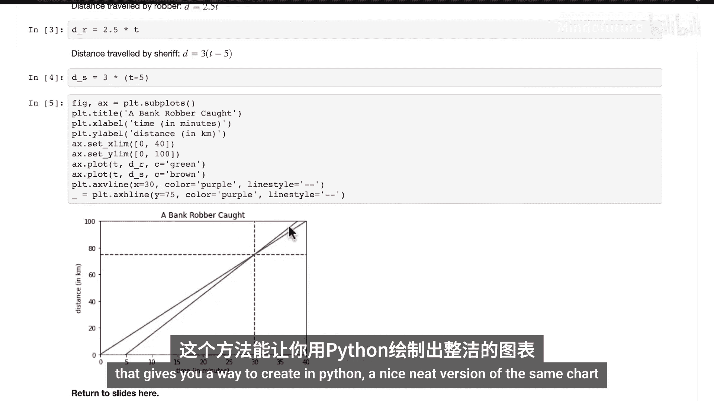
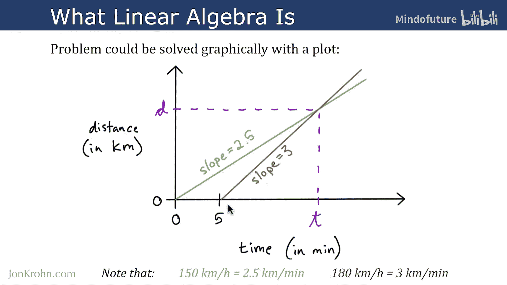
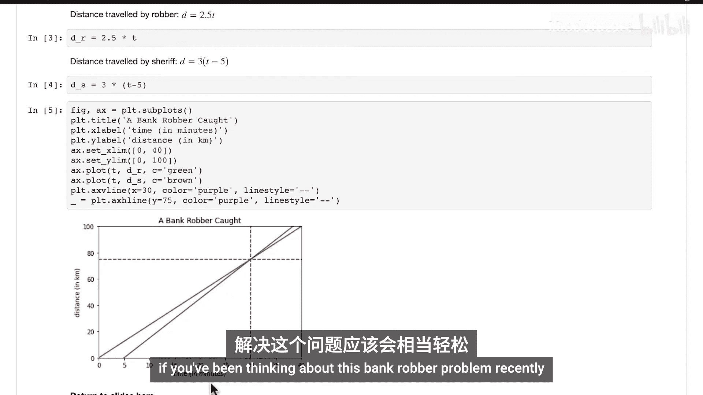

# 003：绘制线性方程组 📈

在本节课中，我们将学习如何使用Python代码精确地绘制线性方程组，从而直观地解决我们之前讨论过的“警长追捕银行劫匪”问题。我们将把之前手工绘制的草图转化为一个精确的图表。

## 概述

在上一节关于“什么是线性代数”的视频中，我们通过手工绘图的方式，图形化地求解了线性方程组。虽然手工绘图有效，但不够精确。本节中，我们将使用Python的`NumPy`和`Matplotlib`库，通过代码来创建相同的图表，实现更精确的可视化。

## 代码实现步骤



以下是使用Python绘制线性方程组的详细步骤。我们将逐步构建图表，模拟警长追捕银行劫匪的场景。



### 1. 导入必要的库


首先，我们需要导入用于数值计算和绘图的库。


```python
import numpy as np
import matplotlib.pyplot as plt
```


### 2. 创建时间数据


我们需要定义一个时间范围。从劫匪出发的时间`0`分钟开始，到超过我们已知解（30分钟）的某个时间点结束，以确保图表能完整显示交点。

```python
# 创建从0到40分钟的1000个时间点
t = np.linspace(0, 40, 1000)
```

### 3. 定义距离函数

根据上一节的推导，我们可以定义劫匪和警长行驶距离的函数。

*   劫匪的距离函数：`d_robber = 2.5 * t`
*   警长的距离函数：`d_sheriff = 3 * (t - 5)` （注意：警长在`t=5`分钟后出发）

```python
# 计算劫匪和警长在不同时间点的行驶距离
d_robber = 2.5 * t
d_sheriff = 3 * (t - 5)
```

### 4. 创建图表并设置基本属性

现在，我们创建一个图表，并设置标题、坐标轴标签以及显示范围。

```python
# 创建图表
plt.figure()
plt.title('银行劫匪追捕')
plt.xlabel('时间 (分钟)')
plt.ylabel('距离 (公里)')

# 设置坐标轴范围
plt.xlim(0, 40)
plt.ylim(0, 100)
```

### 5. 绘制两条直线

使用定义好的距离数据，在图表上绘制代表劫匪和警长移动路径的直线。

```python
# 绘制劫匪（绿色）和警长（棕色）的路径
plt.plot(t, d_robber, color='green', label='劫匪')
plt.plot(t, d_sheriff, color='brown', label='警长')
plt.legend() # 显示图例
```

### 6. 标记交点

最后，我们在解（`t=30`分钟，`d=75`公里）处添加垂直和水平的虚线，以清晰标记交点。

```python
# 在交点处添加虚线
plt.axvline(x=30, color='purple', linestyle='--') # 垂直虚线
plt.axhline(y=75, color='purple', linestyle='--') # 水平虚线



# 显示图表
plt.show()
```



运行以上代码，你将得到一个精确的图表，清晰地显示两条直线在`(30, 75)`处相交，直观地验证了我们的代数解。

## 总结

本节课中，我们一起学习了如何将线性代数问题从手工绘图转化为Python代码实现。我们使用`NumPy`生成数据，用`Matplotlib`绘制图表，精确地可视化了“警长追捕银行劫匪”这一线性方程组的解。这种方法不仅更精确，也为处理更复杂的机器学习数据可视化打下了基础。



在接下来的视频中，我们将进行一个纸笔练习，解决一个关于太阳能电池板收集能量的全新问题，进一步巩固对线性方程组求解的理解。