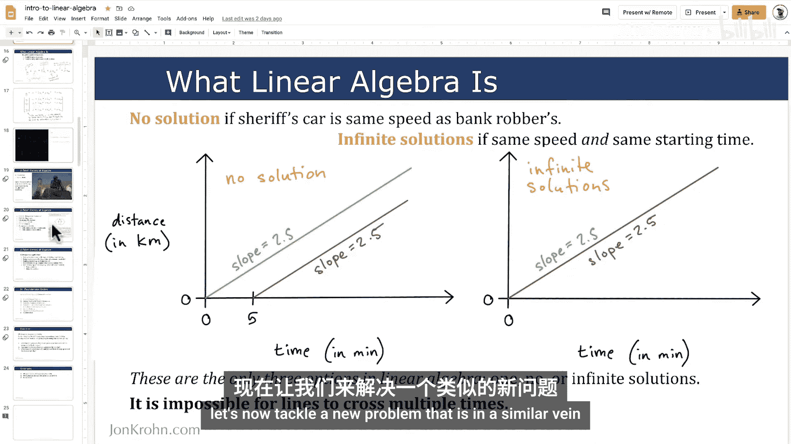
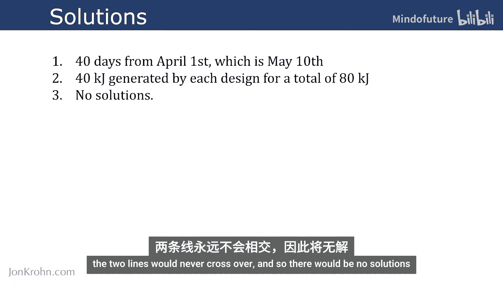

# 004：线性代数练习 — 主题2

在本节课中，我们将通过一个具体的练习来巩固对线性方程组的理解。我们将分析一个与上节课“警长与银行劫匪”例子相似的实际问题，并学习如何建立和求解方程组。

上一节我们介绍了线性代数的基本概念，包括线性方程组的定义以及图解法和代数解法。本节中我们来看看如何应用这些知识解决一个实际问题。

## 问题描述

假设吉尔将设计太阳能板作为业余爱好。
*   她的 Mark 1 设计于 4 月 1 日开始发电，每天产生 1 千焦能量。
*   她的 Mark 2 设计于 5 月 1 日开始发电，每天产生 4 千焦能量。

我们需要回答以下两个问题：
1.  在哪一天，Mark 2 设计产生的**总能量**与 Mark 1 设计产生的总能量相等？
2.  到那一天，两个设计一共产生了多少总能量？

此外，我们还需要思考：如果 Mark 2 设计每天也只产生 1 千焦能量，上述两个问题的答案会是什么？

## 建立方程组

首先，我们需要用数学语言描述这个问题。我们以“天数”作为变量。

设 **`x`** 为从 4 月 1 日开始计算的天数。
*   Mark 1 从第 0 天（4月1日）开始运行，因此到第 `x` 天时，其产生的总能量为：**`E1 = 1 * x`**。
*   Mark 2 从第 30 天（5月1日，因为4月有30天）开始运行，因此到第 `x` 天时，其运行了 `(x - 30)` 天，产生的总能量为：**`E2 = 4 * (x - 30)`**。

我们要找的是 `E1 = E2` 的那一天，即求解方程：
**`1 * x = 4 * (x - 30)`**

## 求解与解释

以下是求解过程：

1.  展开方程：`x = 4x - 120`
2.  移项：`x - 4x = -120`
3.  合并同类项：`-3x = -120`
4.  解得：**`x = 40`**

这意味着从 4 月 1 日算起的第 40 天，两个设计产生的总能量相等。4月有30天，所以这一天是 **5 月 10 日**。

现在，我们可以回答第二个问题。将 `x = 40` 代入任一能量公式：
*   `E1 = 1 * 40 = 40` 千焦
*   `E2 = 4 * (40 - 30) = 40` 千焦

因此，到 5 月 10 日，每个设计各产生了 40 千焦能量，**总能量为 80 千焦**。

## 特殊情况分析

最后，我们考虑如果 Mark 2 每天也只产生 1 千焦能量的情况。此时，能量方程变为：
**`1 * x = 1 * (x - 30)`**

简化后得到 `x = x - 30`，这显然是一个不成立的等式（`0 = -30`）。从图形上看，这代表两条直线平行，永远不会有交点。

因此，在这种情况下，**不存在使两者总能量相等的日期**。这也对应了线性方程组**无解**的一种情况。

---

本节课中我们一起学习了如何将一个现实世界的时间-产量问题转化为线性方程组，并通过代数方法求解。我们求得了具体解（5月10日，总能量80千焦），也分析了一种无解的特殊情况。这个练习展示了线性代数在建模和解决实际问题中的实用性。