# 005：张量 — 主题3 🧮

在本节课中，我们将要学习线性代数的基本构建单元——张量。张量是机器学习中一个核心且基础的概念，理解它对于掌握后续的线性代数运算至关重要。

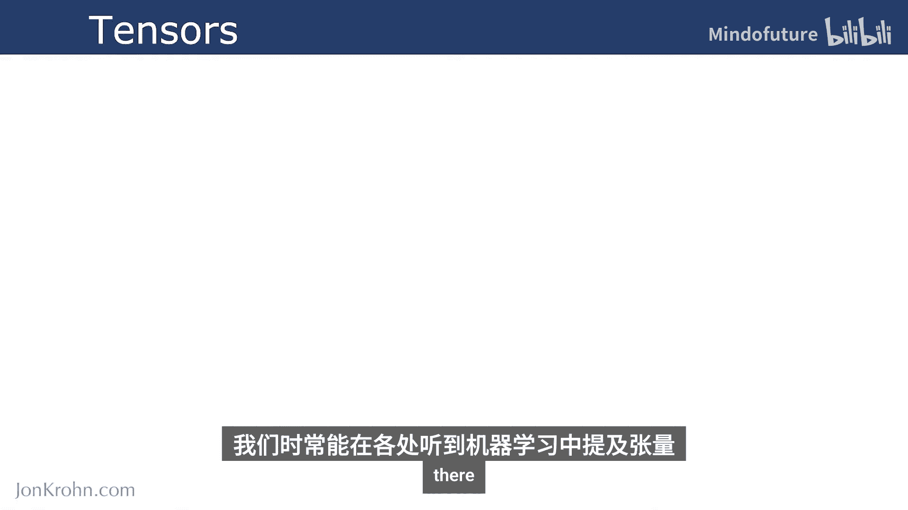

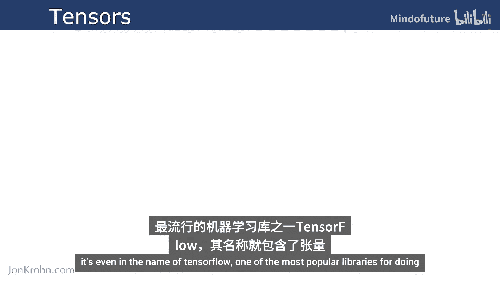

上一节我们介绍了线性代数的整体概览，本节中我们来看看张量究竟是什么。

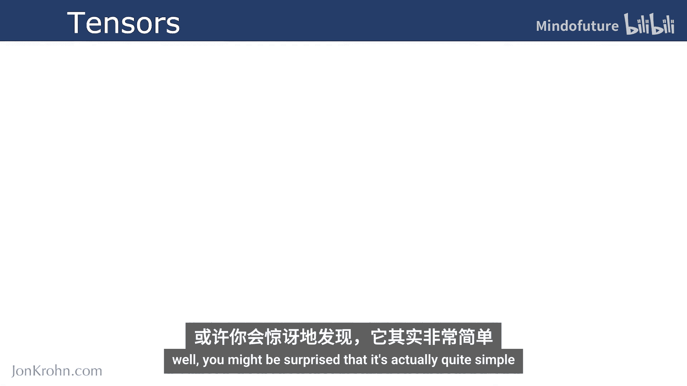

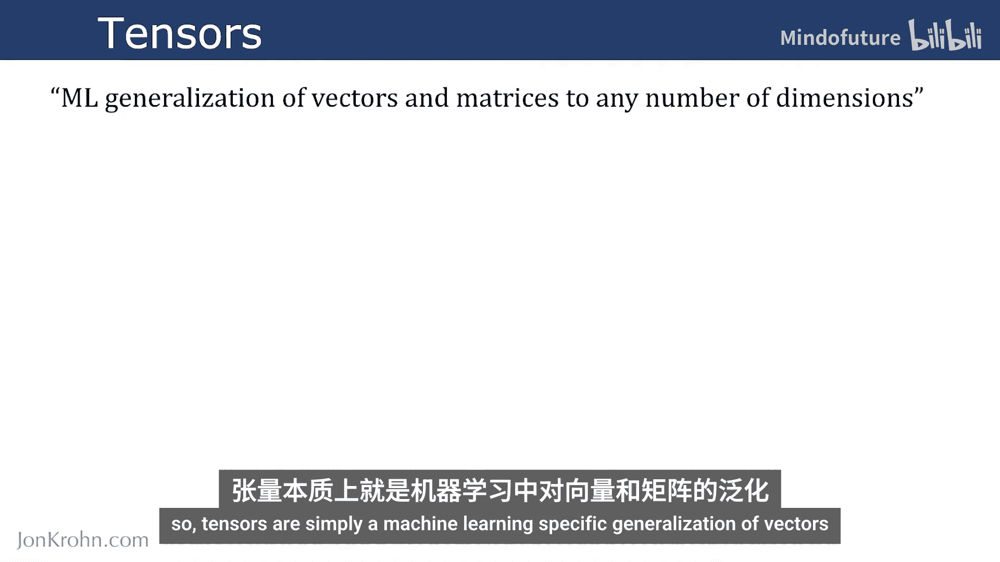

## 什么是张量？🤔

张量是向量和矩阵在机器学习领域的一个通用化推广，它可以扩展到任意数量的维度。我们经常在机器学习中听到张量，例如流行的深度学习库TensorFlow就以其命名。

你可能会惊讶地发现，张量的概念其实相当简单。

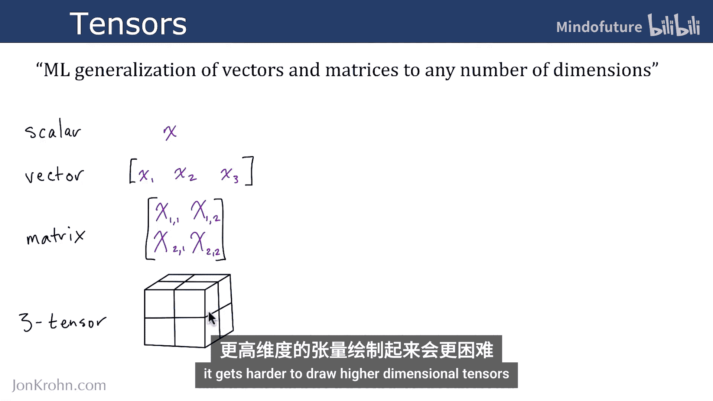

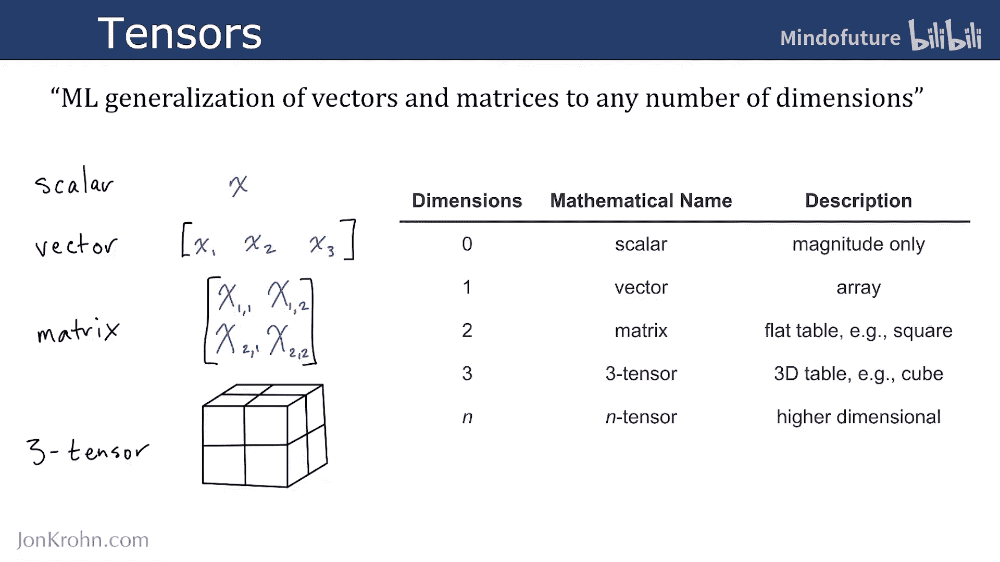

## 张量的维度 📊

张量根据其维度有不同的名称和特性。以下是不同维度张量的介绍：

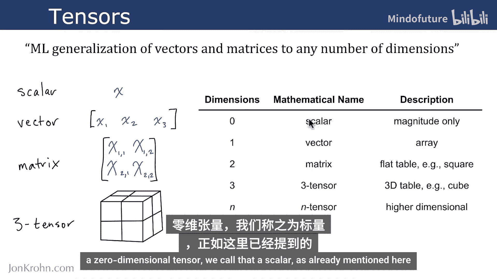

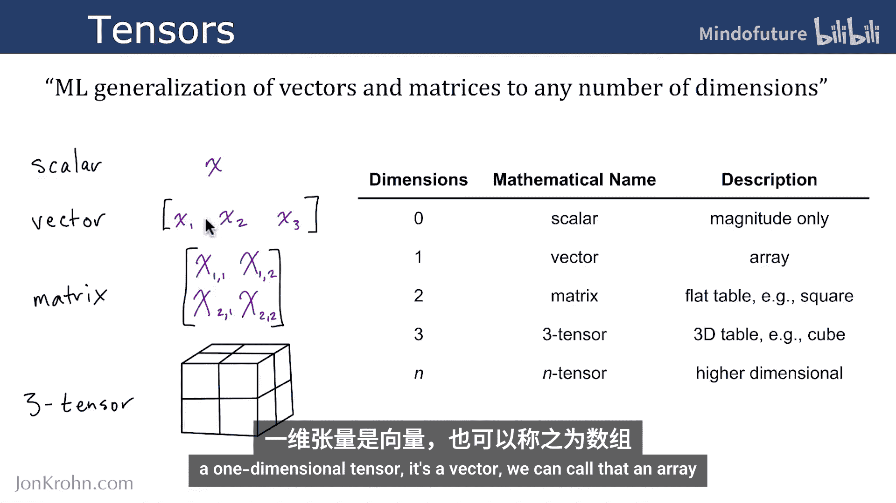

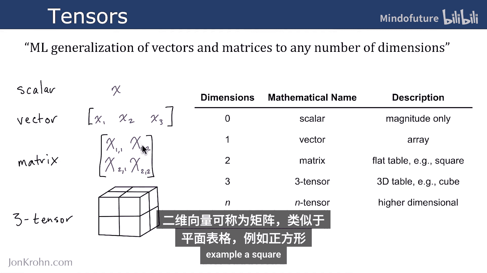

*   **零维张量**：称为**标量**。它仅包含一个单独的数值，只有大小，没有方向。例如：`5` 或 `3.14`。
*   **一维张量**：称为**向量**。它是一个线性排列的数值数组。例如：`[1, 2, 3, 4]`。
*   **二维张量**：称为**矩阵**。它类似于一个扁平的表格，例如一个正方形。例如：`[[1, 2], [3, 4]]`。
*   **三维张量**：可以称为**三阶张量**。它类似于一个三维的表格或立方体。例如，一个形状为 `(2, 2, 2)` 的张量。
*   **N维张量**：张量可以推广到任意数量（N）的维度，例如四维张量、十二维张量等。这些高维张量超出了我们人脑直观想象的能力，但在数学和计算上是完全定义的。

## 总结与预告 📝

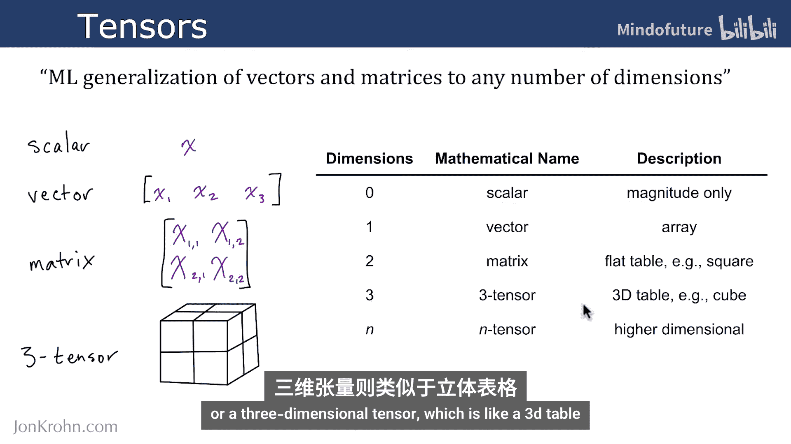

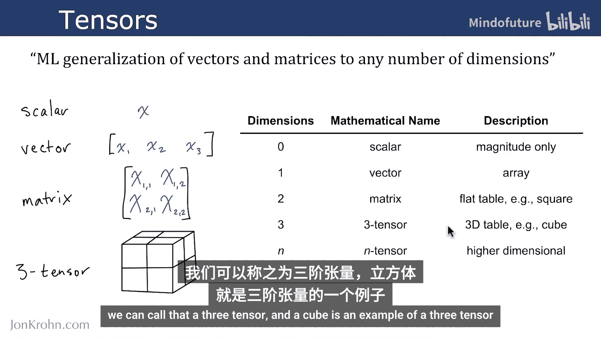

本节课中我们一起学习了张量的基本概念。我们了解到，张量是标量、向量和矩阵的泛化，是机器学习中表示数据的核心结构。标量是零维张量，向量是一维张量，矩阵是二维张量，而更高维度的数组则统称为N维张量。

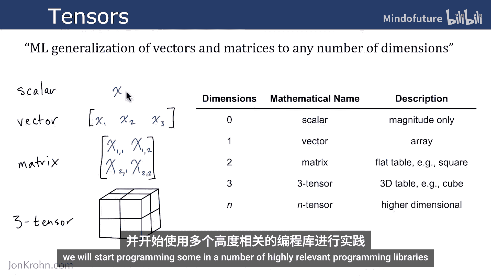

接下来，我们将详细探讨标量张量的具体细节，并开始使用几个高度相关的编程库进行实践编程。