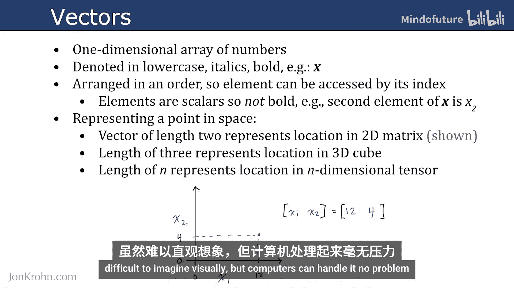
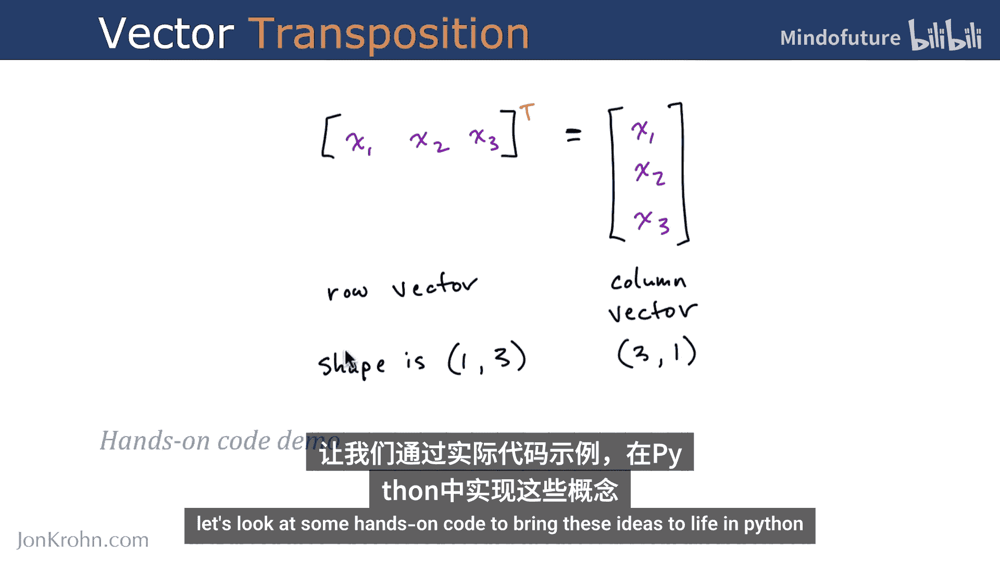
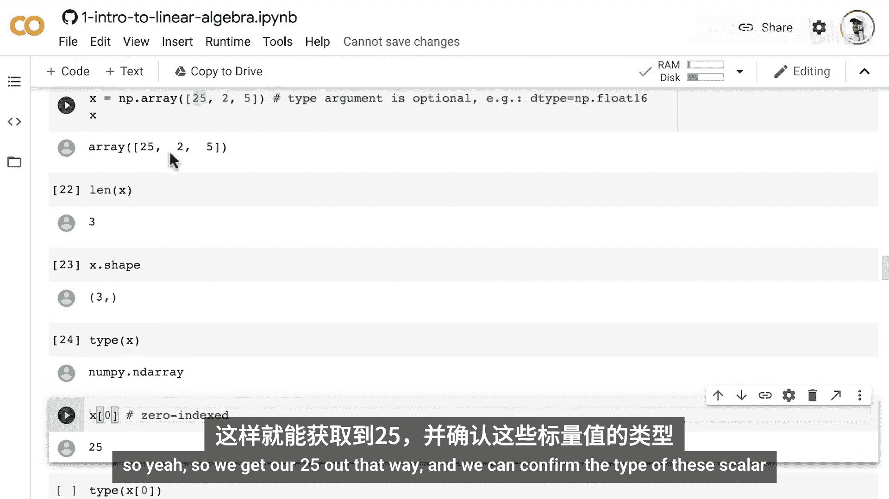
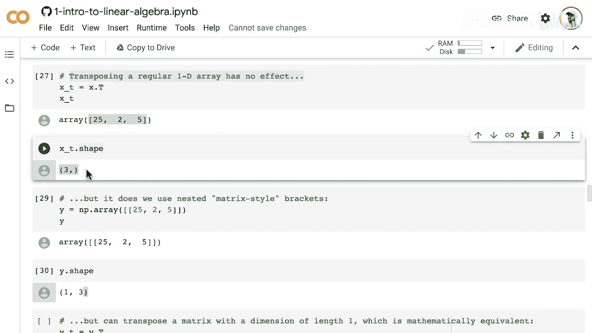
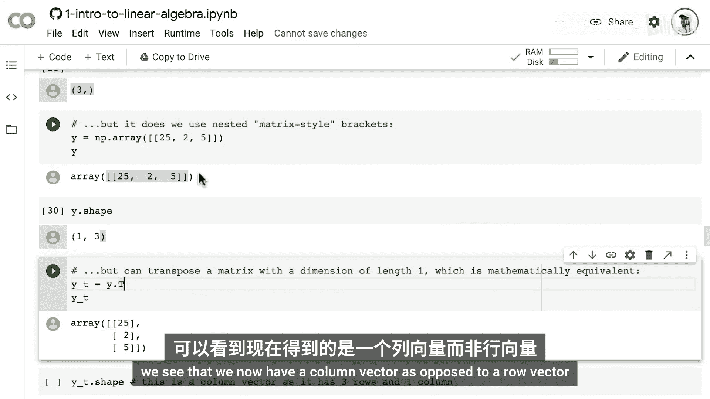
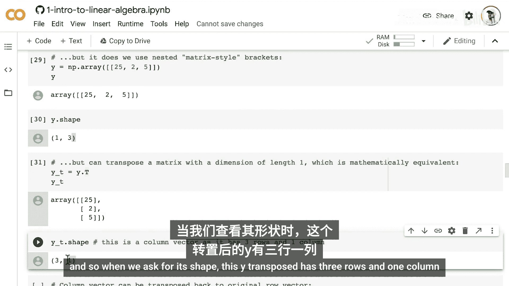
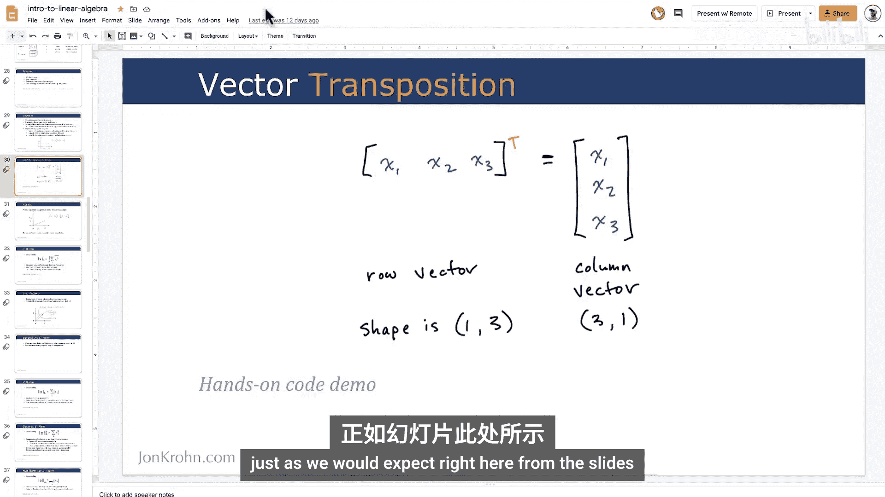
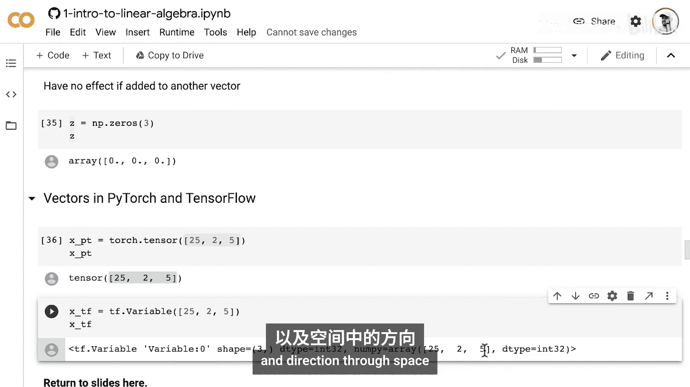

# 007：向量和向量转置 🧮

在本节课中，我们将学习一维张量，即向量。我们将了解向量的定义、几何意义，并学习如何在Python中使用NumPy、TensorFlow和PyTorch创建和转置向量。

## 概述

在之前的视频中，我们介绍了张量的基本概念，并深入探讨了零维张量——标量。本节中，我们将讨论扩展到一维张量，也就是向量。我们还将演示如何在Python中操作张量的主要库——NumPy、TensorFlow和PyTorch中创建和转置向量。

## 什么是向量？

向量是一维的数字数组。在数学表示中，向量通常用小写、斜体、粗体字母表示，例如 **x**。这与标量（小写、斜体、非粗体，如 *x*）形成对比。

向量中的元素按特定顺序排列，我们可以通过索引访问向量中的每个元素。向量中的每个元素本身都是标量。例如，如果我们想表示向量 **x** 中的第二个元素，我们使用 *x*₂（非粗体）。对于一个长度为2的向量，其第二个元素 *x*₂ 就是数字4。

我们可以将向量视为空间中一个特定的点。一个长度为2的向量代表二维空间中的一个位置。例如，一个包含值12和4的向量，可以表示在x₁轴上12个单位、x₂轴上4个单位的一个点。

类似地，一个长度为3的向量代表三维空间中的一个点。推而广之，一个长度为 *n* 的向量代表某个 *n* 维空间中的一个位置。虽然难以直观想象，但计算机可以轻松处理。

## 向量转置

介绍完向量是什么之后，让我们讨论一个在向量上非常常用的简单操作——向量转置。



我们用大写字母 **T** 作为上标来表示转置，例如 **x**ᵀ。转置操作将行向量转换为列向量，或者将列向量转换为行向量。

当我们转置一个向量时，向量中的所有元素保持不变，并且顺序不变。向量只是从行变成了列。在矩阵表示法中，形状总是“行×列”。因此，一个行向量的形状是（1行，3列）。转置后，元素的顺序不变，但向量的形状变为（3行，1列）。

## Python代码实现

现在，让我们通过一些动手代码，在Python中将这些概念具体化。

### 在NumPy中创建向量



我们将继续在线性代数入门笔记本中进行。我们已经讨论了标量（秩为0的张量），并使用基础Python、TensorFlow和PyTorch创建了标量。现在，我们将使用NumPy库来创建向量。

我们使用NumPy的 `array` 方法来创建任意维度的张量，包括一维张量（秩为1的张量，即向量）。在 `array` 调用中，我们指定一个列表，其中包含我们向量（或任何形状的张量）中的标量值。

你可以选择性地指定一个额外的参数 `dtype`（数据类型）。这里，因为向量中的所有值都是整数，所以默认是整数类型。然而，如果你选择性地添加这个参数，指定为16位浮点数，那么所有元素都将变为16位浮点数，从而可以拥有小数值。

```python
import numpy as np

# 创建一个向量
x = np.array([25, 2, 5])
print(x)  # 输出: [25 2 5]
print(len(x))  # 输出: 3
print(x.shape)  # 输出: (3,)
print(type(x))  # 输出: <class 'numpy.ndarray'>

# 访问向量元素（Python使用0索引）
print(x[0])  # 输出: 25
```

### 在NumPy中转置向量

转置是一个非常常见的操作，NumPy提供了 `.T` 属性，我们可以将其添加到任何给定的向量末尾来进行转置。



然而，让我们看看这个情况：如果我们对一个常规的一维数组（用一组方括号指定）进行转置，它似乎没有任何效果，形状保持不变。这是因为常规的一维NumPy数组只有一个维度，转置时没有第二个维度可以转换。

但是，如果我们使用嵌套的矩阵风格括号（两组方括号）创建向量，那么该向量就有两个维度可以操作。当我们查看其形状时，会看到它有1行3列，这与之前只显示长度（3）不同。一旦我们指定了嵌套的方括号，我们就在处理一个二维空间，此时使用 `.T` 操作符进行转置，就会得到一个列向量。

```python
# 使用嵌套括号创建行向量（二维表示）
y = np.array([[25, 2, 5]])
print(y)      # 输出: [[25 2 5]]
print(y.shape) # 输出: (1, 3)  # 1行，3列

# 转置行向量为列向量
y_transposed = y.T
print(y_transposed)
# 输出:
# [[25]
#  [ 2]
#  [ 5]]
print(y_transposed.shape) # 输出: (3, 1)  # 3行，1列

# 再次转置，变回行向量
y_back = y_transposed.T
print(y_back.shape) # 输出: (1, 3)
```

### 零向量

零向量是全部由零组成的向量。你可以使用NumPy的 `zeros` 方法创建它们。如果你只指定一个维度，那么它会假设你想要一个特定长度的张量。



```python
# 创建零向量
zero_vector = np.zeros(5)
print(zero_vector)  # 输出: [0. 0. 0. 0. 0.]
```

你会在很多地方遇到零向量，了解它们是什么很重要。





### 在PyTorch和TensorFlow中创建向量



一旦你知道如何在PyTorch和TensorFlow中创建任何类型的张量（就像我们在上一节创建标量一样），创建向量就非常容易了。我们使用相同的方法。

**在PyTorch中：**
我们使用 `torch.tensor` 方法，以与NumPy相同的方式指定我们想要在向量中拥有的元素。

```python
import torch

# 在PyTorch中创建向量
pytorch_vector = torch.tensor([25, 2, 5])
print(pytorch_vector)  # 输出: tensor([25, 2, 5])
```

**在TensorFlow中：**
我们使用 `Variable` 方法（或 `constant`），传入与PyTorch和NumPy中相同的表示法。

```python
import tensorflow as tf

# 在TensorFlow中创建向量
tf_vector = tf.Variable([25, 2, 5])
print(tf_vector)  # 输出: <tf.Variable 'Variable:0' shape=(3,) dtype=int32, numpy=array([25, 2, 5])>
```

## 总结

本节课中，我们一起学习了一维张量——向量。我们了解了向量的定义、其表示空间点的几何意义，以及向量转置的操作。我们还在Python中实践了如何使用NumPy、PyTorch和TensorFlow创建和转置向量，并简单介绍了零向量。



现在我们已经了解了向量和向量转置。接下来，我将解释向量如何不仅能表示空间中的一个点，还能通过空间表示特定的大小和方向。