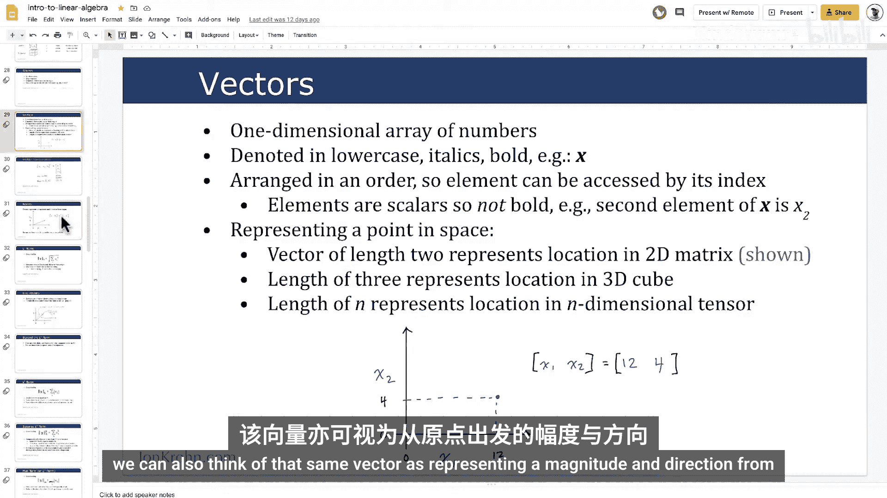
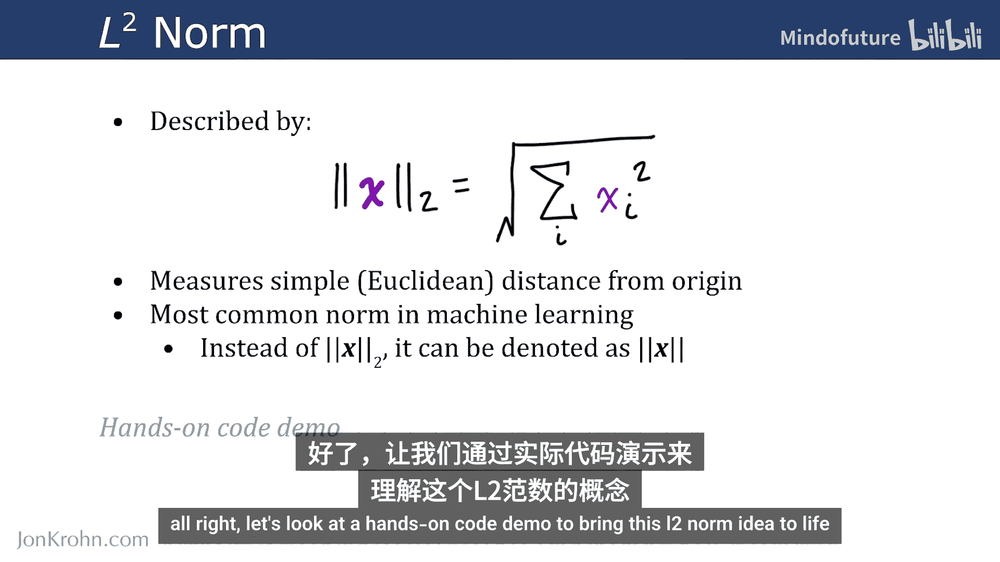
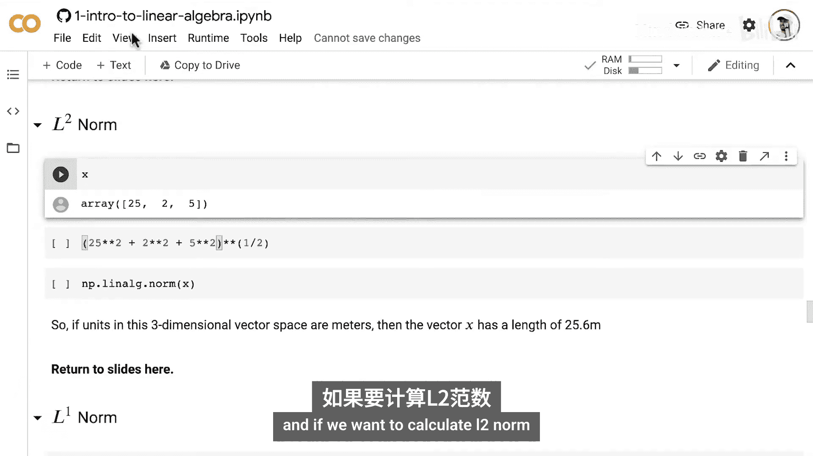
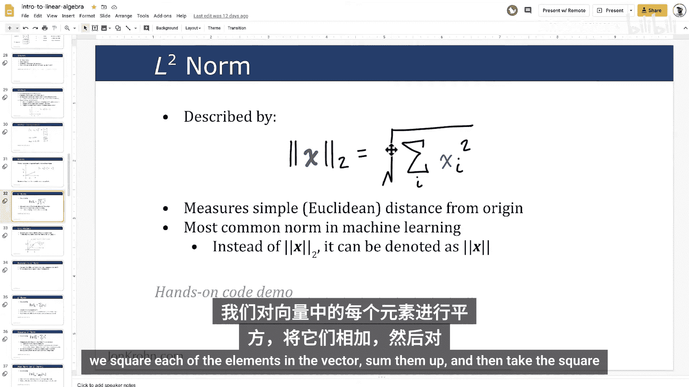
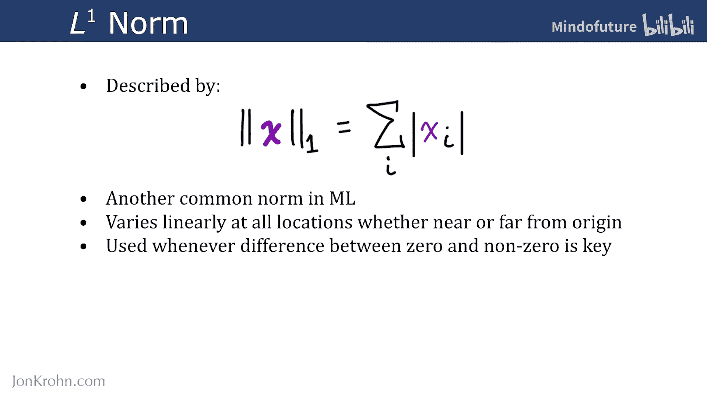
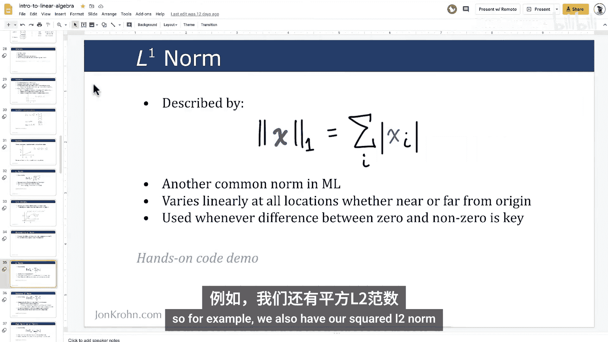
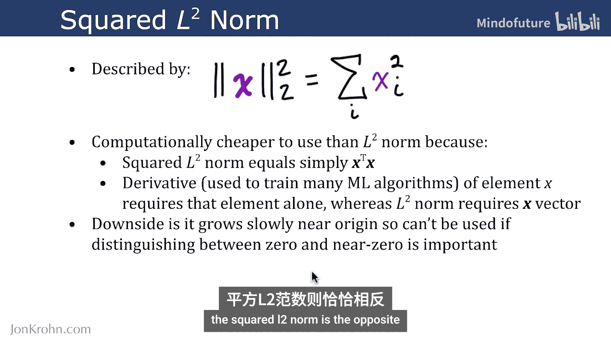
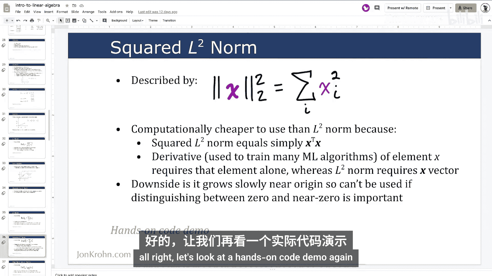
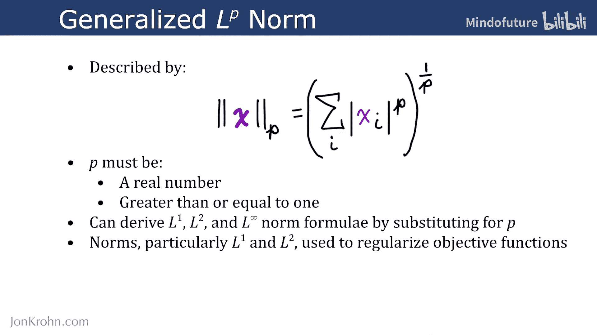

# 008：范数与单位向量 📏

在本节课中，我们将学习向量的另一个重要视角：它不仅代表空间中的一个点，还代表一个具有大小和方向的量。我们将重点介绍**范数**，这是一种量化向量大小的函数，并了解其中最重要的一种——L2范数。最后，我们将认识一种特殊的向量：**单位向量**。

---

## 向量的两种视角



上一节我们介绍了向量可以表示空间中的一个点。例如，一个长度为2的向量 `x = [12, 4]` 可以表示二维空间中坐标为 (12, 4) 的点。

我们也可以将同一个向量视为从**原点** (0, 0) 出发，指向该点 (12, 4) 的一个**箭头**。这个箭头就代表了向量的**大小（长度）**和**方向**。


---

## 什么是范数？ 📐

范数是一类函数，用于量化向量的**大小**或**长度**。在众多范数中，最常见和最重要的是 **L2范数**。

L2范数的计算公式如下：

**公式：**
`||x||₂ = √(x₁² + x₂² + ... + xₙ²)`

计算步骤是：
1.  将向量中每个元素**平方**。
2.  将所有平方值**求和**。
3.  对求和结果取**平方根**。

L2范数衡量的是从原点到向量所代表点的**直线距离**，这种距离也称为**欧几里得距离**。它是我们日常生活中最常使用的距离概念。



在机器学习中，L2范数如此普遍，以至于其下标“2”经常被省略。当我们看到 `||x||` 而没有下标时，通常默认指的就是L2范数。



---

## L2范数的Python实现 💻



让我们通过代码来具体计算L2范数。假设我们有一个三维向量 `x = [25, 2, 5]`。

**代码：**
```python
import numpy as np

x = np.array([25, 2, 5])

# 手动计算L2范数
l2_norm_manual = np.sqrt(np.sum(x**2))
print(f"手动计算的L2范数: {l2_norm_manual}")

# 使用NumPy的线性代数模块计算
l2_norm_numpy = np.linalg.norm(x)
print(f"NumPy计算的L2范数: {l2_norm_numpy}")
```

**输出结果：**
```
手动计算的L2范数: 25.573423705088842
NumPy计算的L2范数: 25.573423705088842
```

如果向量的单位是米，那么这个向量代表的箭头长度约为25.6米。

---

## 单位向量 ⚖️

理解了L2范数后，我们可以定义一种特殊的向量：**单位向量**。

单位向量是指其L2范数（长度）恰好等于 **1** 的向量。在图中，这意味着从原点到向量端点的橙色线段长度为1。




---

## 其他常见的范数

除了L2范数，机器学习中还会用到其他几种范数。下面我们快速浏览一下：



### L1范数

L1范数的计算公式是取向量每个元素的绝对值，然后求和。

**公式：**
`||x||₁ = |x₁| + |x₂| + ... + |xₙ|`

L1范数在**区分零值和非零值**的场景中非常有用。让我们用代码计算同一个向量 `x` 的L1范数。

**代码：**
```python
# 计算L1范数
l1_norm = np.sum(np.abs(x))
print(f"L1范数: {l1_norm}")
```

**输出结果：**
```
L1范数: 32
```

可以看到，同一个向量，用L1范数衡量的大小（32）与用L2范数衡量的大小（25.57）是不同的。



### 平方L2范数



平方L2范数就是L2范数计算过程中省去最后一步平方根的结果。

**公式：**
`||x||₂² = x₁² + x₂² + ... + xₙ²`

它的优点是计算更简单、更快，因为 `||x||₂² = xᵀx`（向量与自身转置的点积）。但其缺点是在原点附近增长缓慢，不擅长区分零值和接近零的值。

**代码：**
```python
# 计算平方L2范数
squared_l2_norm = np.sum(x**2)
print(f"平方L2范数: {squared_l2_norm}")

# 通过点积计算验证
squared_l2_via_dot = np.dot(x.T, x)
print(f"通过点积计算的平方L2范数: {squared_l2_via_dot}")
```

**输出结果：**
```
平方L2范数: 654
通过点积计算的平方L2范数: 654
```

### 最大范数（L∞范数）

最大范数是取向量所有元素绝对值的最大值。

**公式：**
`||x||∞ = max(|x₁|, |x₂|, ..., |xₙ|)`

**代码：**
```python
# 计算最大范数
max_norm = np.max(np.abs(x))
print(f"最大范数 (L∞): {max_norm}")
```

**输出结果：**
```
最大范数 (L∞): 25
```

---

## 范数的通用形式与用途

以上介绍的所有范数，其实都是 **Lp范数** 的特殊情况。Lp范数的通用公式如下：

**公式：**
`||x||ₚ = (|x₁|ᵖ + |x₂|ᵖ + ... + |xₙ|ᵖ)^(1/p)`

其中，`p` 是一个大于等于1的实数。
*   当 `p=1` 时，得到 L1范数。
*   当 `p=2` 时，得到 L2范数。
*   当 `p→∞` 时，得到最大范数。

在机器学习中，**L1和L2范数** 常被用作**正则化项**添加到目标函数中，以防止模型过拟合。如果你听说过“L1正则化”或“L2正则化”，指的就是这里介绍的范数概念。

---




## 总结 🎯

本节课我们一起学习了：
1.  **向量的双重含义**：既可以表示空间中的点，也可以表示具有大小和方向的箭头。
2.  **范数的概念**：用于量化向量大小的函数。
3.  **L2范数**：最重要的范数，计算欧几里得距离，公式为 `√(Σxᵢ²)`。
4.  **单位向量**：长度为1（L2范数为1）的特殊向量。
5.  **其他范数**：包括L1范数（`Σ|xᵢ|`）、平方L2范数（`Σxᵢ²`）和最大范数（`max(|xᵢ|)`），它们都是Lp范数的特例。
6.  **范数的应用**：在机器学习中常用于模型正则化。


下一节，我们将介绍其他几种特殊的向量。请继续关注本系列教程。