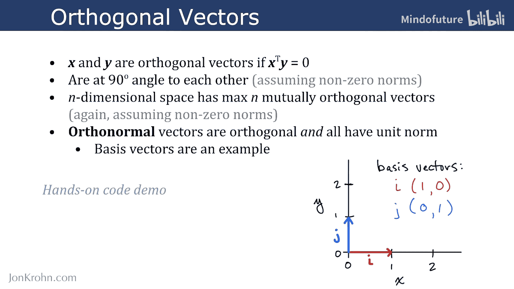
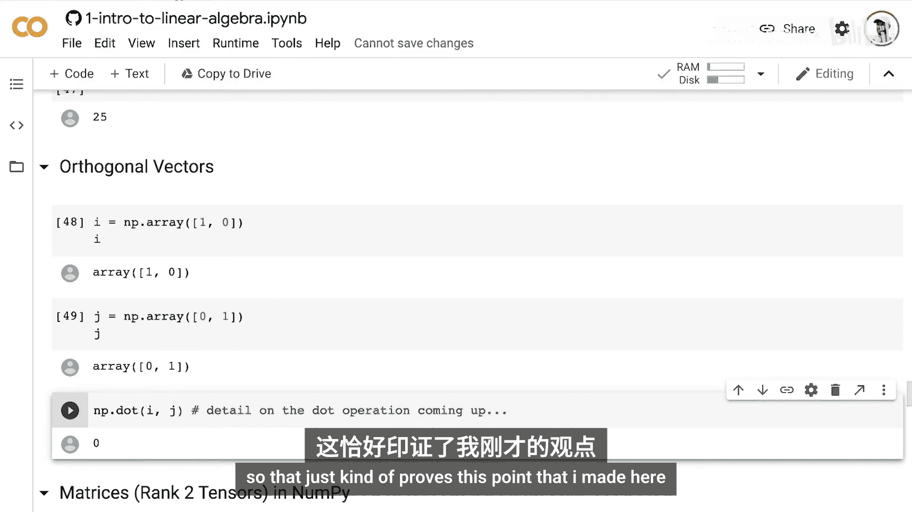
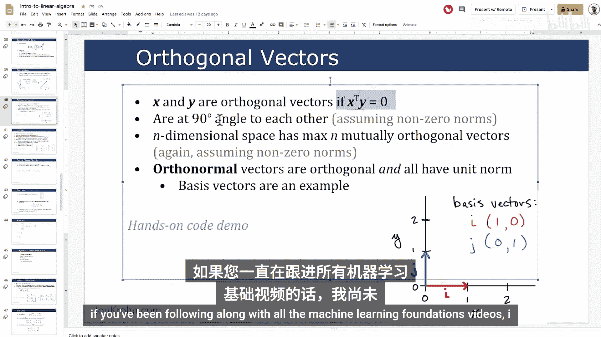
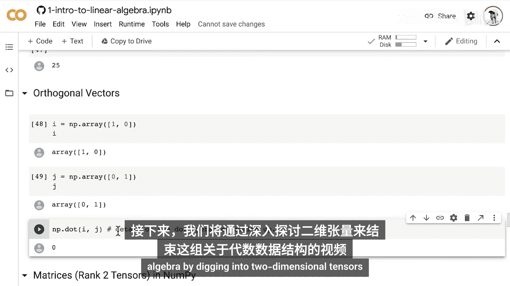

# 009：基向量、正交向量与标准正交向量

在本节课中，我们将学习向量空间中的三个核心概念：**基向量**、**正交向量**和**标准正交向量**。这些概念是理解向量表示、空间几何以及后续矩阵运算的基础。我们将通过定义、几何解释和简单的Python代码示例来阐明这些概念。

上一节我们介绍了向量范数和单位向量，它们帮助我们量化向量的大小。本节中，我们将以此为基础，探讨几类特殊的向量集合。

## 基向量

基向量是一组能够通过缩放和组合来表示给定向量空间中**任何**向量的向量集合。我们通常使用沿着向量空间坐标轴方向的单位向量作为基向量。

让我解释一下这意味着什么。假设我们有一个二维向量空间，我们可以用x轴和y轴来表示它。典型的基向量就是单位向量，例如 **i** 和 **j**。

*   向量 **i** 从原点 (0, 0) 延伸到坐标 (1, 0)，即 x=1， y=0。
*   向量 **j** 从原点 (0, 0) 延伸到坐标 (0, 1)，即 x=0， y=1。

**i** 和 **j** 这两个基向量可以通过缩放和相加来表示二维空间中的任何向量。例如，向量 **v** 从原点延伸到点 (1.5， 2)。这个向量 **v** 可以通过缩放 **i** 和 **j** 并相加来描述：

**v** = 1.5 * **i** + 2 * **j**

## 正交向量

正交向量是指满足特定条件的一组向量。假设在二维空间中，我们有两个向量 **x** 和 **y**。当我们计算这两个向量的**点积**时，结果为0，则它们是正交的。

点积的公式为：**x · y** = Σ (x_i * y_i)

关于点积的细节我们稍后会详细讲解。但这里需要理解的核心是：如果两个向量**x**和**y**的长度都不为零（即具有非零范数），那么点积为零意味着这两个向量彼此成90度角。

需要注意的一点是：在一个n维空间中，**最多**存在n个**相互正交**的向量。这意味着在二维空间中最多有两个相互正交的向量，在三维空间中最多有三个，依此类推。当然，这里假设所有向量都具有非零长度。

## 标准正交向量

标准正交向量是正交向量的一个特例。它们不仅彼此正交，而且每个向量的范数（长度）都为1，即都是单位向量。

我们其实已经见过标准正交向量的例子了。前面提到的**基向量**就是一组标准正交向量。

*   它们是正交的（彼此成90度角）。
*   它们是标准正交的，因为它们的范数为1（欧几里得长度为1）。

## 代码示例

现在，让我们通过一个简单的Python代码示例来验证这些概念。

```python
import numpy as np



# 定义基向量 i 和 j
i = np.array([1, 0])
j = np.array([0, 1])

# 计算它们的点积
dot_product = np.dot(i, j)
print(f"向量 i 和 j 的点积是：{dot_product}")
# 输出：0，证明它们是正交的

# 验证它们是否是单位向量（范数为1）
norm_i = np.linalg.norm(i)
norm_j = np.linalg.norm(j)
print(f"向量 i 的范数是：{norm_i}")
print(f"向量 j 的范数是：{norm_j}")
# 输出均为 1.0，证明它们是标准正交的
```



## 总结



本节课中，我们一起学习了向量空间中的三个关键概念：

1.  **基向量**：一组可以线性组合出空间中任何向量的向量，通常选用坐标轴方向的单位向量。
2.  **正交向量**：点积为零的向量，在几何上表现为相互垂直（成90度角）。
3.  **标准正交向量**：既是正交向量，又是单位向量的集合。基向量 **i** 和 **j** 就是一个典型的例子。



理解这些概念对于掌握线性代数在机器学习中的应用至关重要。接下来，我们将结束关于代数数据结构的系列视频，深入探讨二维张量，也就是通常所说的**矩阵**。