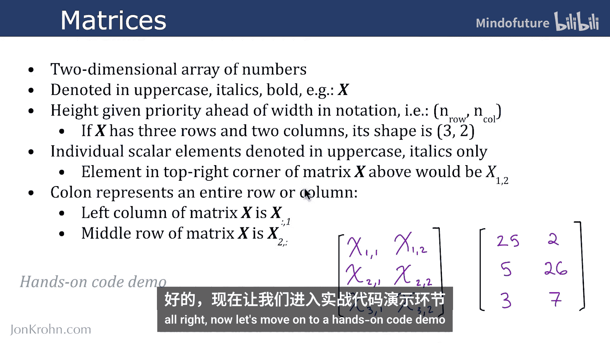
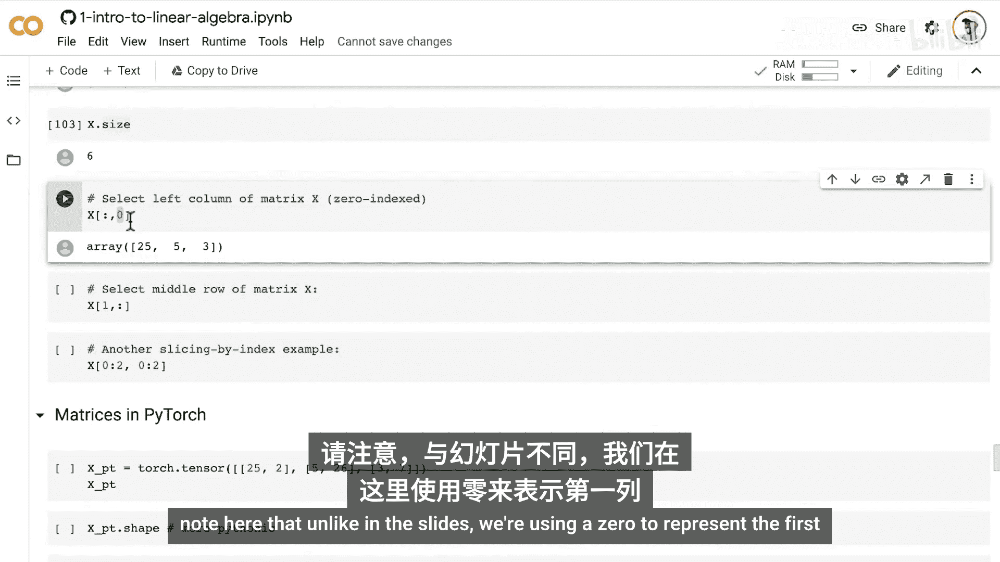
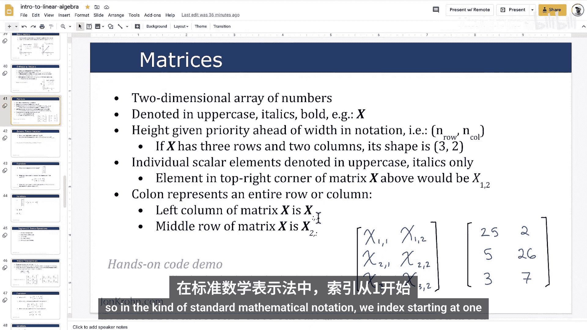
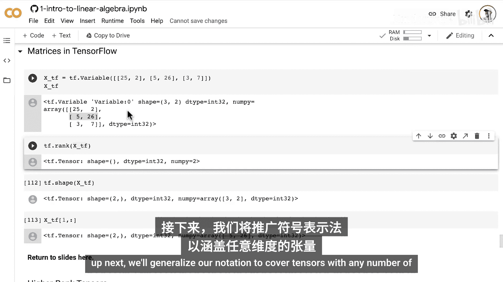

# 010：矩阵张量 📊

在本节课中，我们将学习机器学习中一个核心的数据结构：矩阵。我们将介绍矩阵的基本概念、数学表示方法，并学习如何在Python的三大主流库（NumPy, PyTorch, TensorFlow）中创建和操作矩阵。

在上一节中，我们介绍了零维的张量（标量）和一维的张量（向量）。本节中，我们将维度提升一级，引入矩阵，也就是二维张量。

## 矩阵的定义与表示法

矩阵是一个二维的数字数组。我们可以将其视为数字在行和列两个维度上的排列。

我们用**大写、斜体、粗体**的字母来表示矩阵，例如 **X**。这与表示向量的**小写、斜体、粗体**字母（如 **x**）形成对比。

在描述矩阵的维度时，我们遵循 **（行数， 列数）** 的约定。例如，一个具有3行2列的矩阵 **X**，其形状表示为 `(3, 2)`。

矩阵中的单个标量元素用**大写、斜体、非粗体**的字母表示，并通过下标来定位。下标遵循 **行优先** 的原则。例如，矩阵 **X** 中第一行第二列的元素表示为 `X_1,2`。

我们可以使用冒号 `:` 来表示整行或整列。
*   `X_:,1` 表示矩阵 **X** 的第一列（所有行，第一列）。
*   `X_2,:` 表示矩阵 **X** 的第二行（第二行，所有列）。

## 代码实践：在Python中创建与操作矩阵



以下是使用NumPy、PyTorch和TensorFlow创建和操作矩阵的示例。

### 1. 使用NumPy创建矩阵

在NumPy中，我们使用嵌套的列表来创建矩阵（即二维数组）。外层列表定义行，内层列表定义每行的元素。

```python
import numpy as np

# 创建一个3行2列的矩阵X
X = np.array([[1, 2],
              [5, 26],
              [19, -3]])
print("矩阵 X:")
print(X)
print("形状 (shape):", X.shape)
print("元素总数 (size):", X.size)
```

### 2. 矩阵的索引与切片



在Python中，索引从0开始，这与数学中从1开始的惯例不同。以下是切片操作的示例。



```python
# 选择第一列（索引0）
first_column = X[:, 0]
print("第一列:", first_column)

# 选择第二行（索引1）
second_row = X[1, :]
print("第二行:", second_row)

# 选择子矩阵：前两行和前两列
sub_matrix = X[0:2, 0:2]
print("子矩阵 (前两行，前两列):")
print(sub_matrix)
```

### 3. 使用PyTorch创建矩阵

PyTorch的操作与NumPy非常相似。

```python
import torch

# 使用PyTorch创建相同的矩阵
X_torch = torch.tensor([[1, 2],
                        [5, 26],
                        [19, -3]])
print("PyTorch 矩阵 X:")
print(X_torch)
print("形状:", X_torch.shape)

# 切片操作同样适用
print("第二行 (PyTorch):", X_torch[1, :])
```

### 4. 使用TensorFlow创建矩阵

TensorFlow的创建方式也类似，但访问属性时可能需要调用特定方法。

```python
import tensorflow as tf

# 使用TensorFlow创建相同的矩阵
X_tf = tf.constant([[1, 2],
                    [5, 26],
                    [19, -3]])
print("TensorFlow 矩阵 X:")
print(X_tf)
print("张量阶数 (rank):", tf.rank(X_tf).numpy()) # 矩阵是二阶张量
print("形状:", X_tf.shape)

# 切片操作
print("第二行 (TensorFlow):", X_tf[1, :].numpy())
```

## 总结

本节课中，我们一起学习了机器学习中的二维张量——矩阵。
*   我们了解了矩阵的数学表示法，包括其符号、维度表示和元素索引规则。
*   我们通过实践，掌握了如何在NumPy、PyTorch和TensorFlow这三个核心库中创建矩阵。
*   我们还学习了如何使用Python的索引和切片语法来访问矩阵中的特定行、列或子区域。



理解矩阵是理解后续更复杂线性代数运算（如矩阵乘法、求逆等）的基础。在下一节中，我们将把张量的概念推广到任意维度。