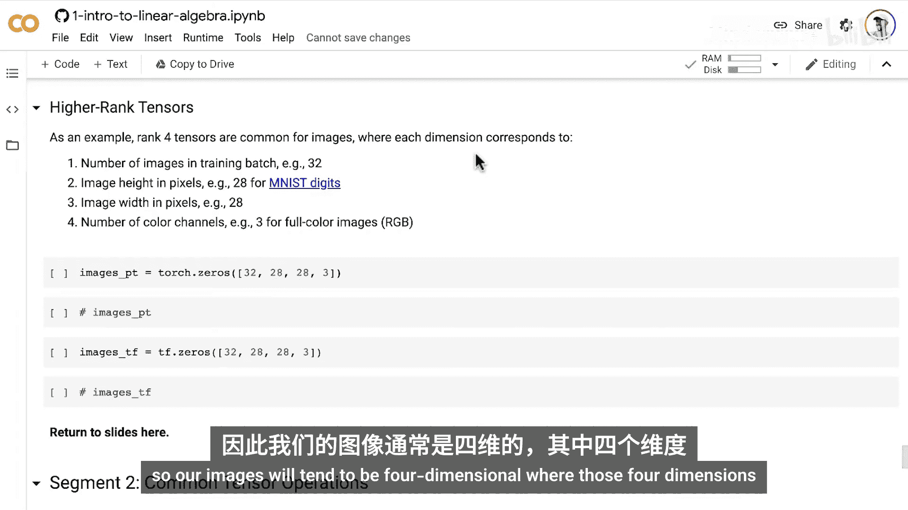
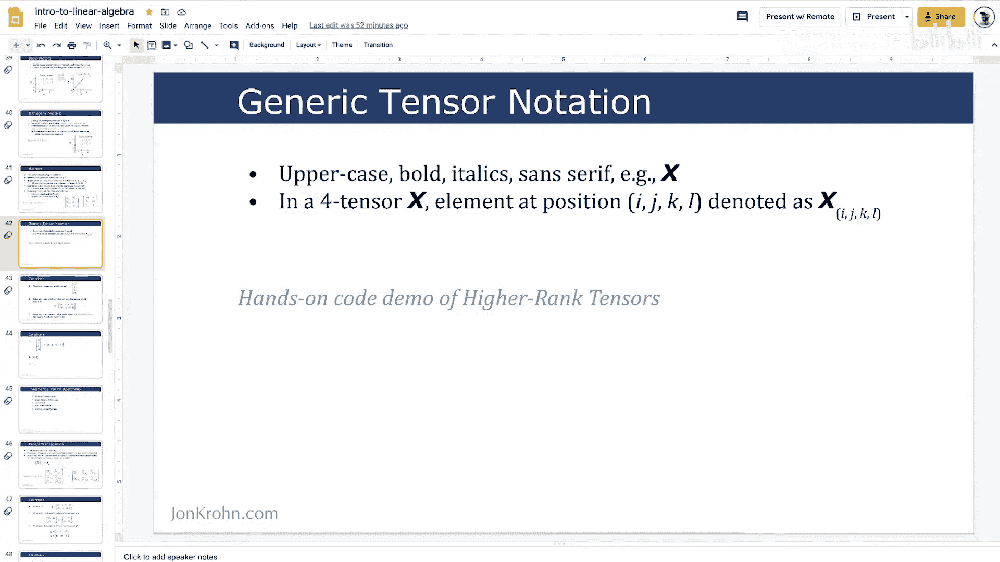
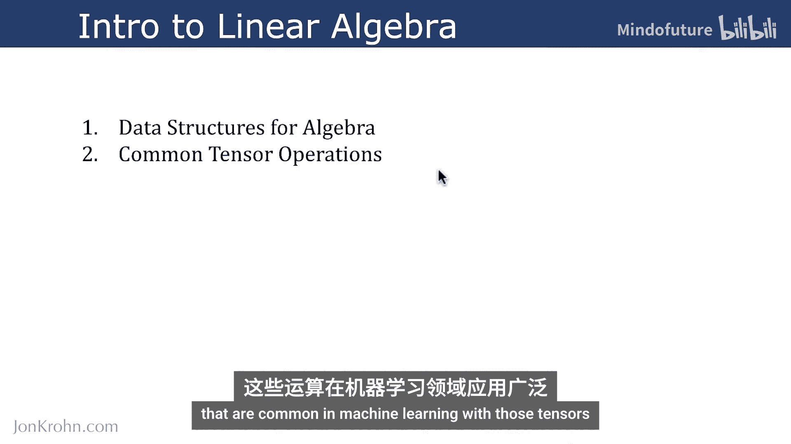
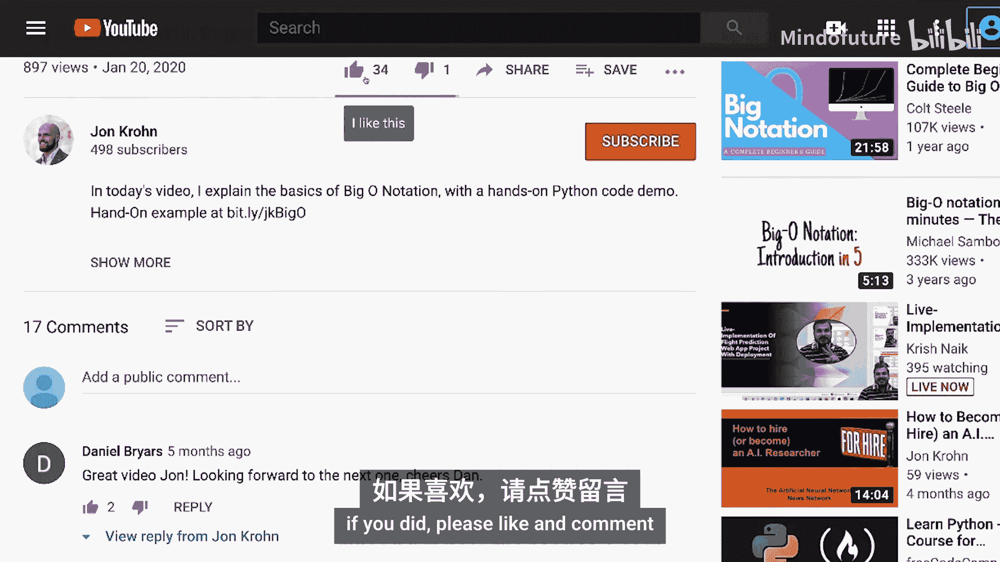

# 011：通用张量记法

在本节课中，我们将学习如何表示任意维度的张量，特别是机器学习模型中常见的高维张量。我们将介绍通用的张量记法，并通过Python代码演示如何创建高维张量。

## 通用张量记法

在前面的视频中，我们详细介绍了零维标量张量、一维向量张量和二维矩阵张量。本节中，我们将推广我们的记法，使其能够表示任意维度的张量。

为了表示比标量、向量和矩阵更一般的张量，我们使用**大写、粗体、斜体**的**无衬线字体**来表示张量。这与矩阵的记法非常相似，但矩阵使用的是衬线字体。衬线字体在笔画末端有额外的装饰性小短线，而无衬线字体则没有这些装饰，显得更简洁。

例如，一个四维张量 **X**，其位于索引 `i, j, k, l` 处的元素可以表示为：
**X**<sub>i, j, k, l</sub>

理解这个概念的最佳方式是进入一个动手实践的代码演示。





## 动手实践：创建高维张量

以下是高维张量（特别是四维张量）在机器学习中非常常见的一种使用场景。近年来，在深度学习架构中，我们经常将输入张量输入到机器视觉模型中，该张量通常是四维的。

这些图像的四个维度（可以用 `i, j, k, l` 表示）分别是：
*   **训练批次中的图像数量**：这可以是任意数字，例如，我们在一轮模型训练中使用32张图像。
*   **图像的高度（像素）**：例如，在机器视觉的“Hello World”数据集MNIST手写数字中，图像高度为28像素。
*   **图像的宽度（像素）**：同样，在MNIST数据集中，图像宽度也是28像素。
*   **颜色通道的数量**：MNIST数字是单色（黑白）图像，因此只需要一个颜色通道。但我们通常处理全彩图像，这需要三个颜色通道，通常是红、绿、蓝（RGB）。

我们不会在此处加载数据并查看具体案例，这将在后续的机器学习基础视频中深入探讨。现在，让我们直接创建几个四维张量，一个使用PyTorch，另一个使用TensorFlow。

### 在PyTorch中创建四维张量

我们将使用 `torch.zeros` 方法创建一个四维张量，其四个维度的大小分别为32、28、28和3。

```python
import torch

# 创建一个四维张量，形状为 (32, 28, 28, 3)，并用零填充
four_tensor_torch = torch.zeros(32, 28, 28, 3)
print(four_tensor_torch)
```

你可以通过取消注释打印行来查看这个四维张量的样子。它的结构与矩阵类似，只是多了一层方括号，允许我们查看另一个维度。这里所有值都是零，如果输入的是真实图像，每个像素点将包含实际的信息。

### 在TensorFlow中创建四维张量

我们可以在TensorFlow中做几乎完全相同的事情，只是调用的是TensorFlow库。

```python
import tensorflow as tf

# 创建一个四维张量，形状为 (32, 28, 28, 3)，并用零填充
four_tensor_tf = tf.zeros([32, 28, 28, 3])
print(four_tensor_tf)
```

通过取消注释打印行，你可以看到它的输出，看起来与PyTorch中的张量非常相似，只是包含了我们习惯在TensorFlow张量输出中看到的一些额外信息。

## 本节总结



在本节课中，我们一起学习了通用张量记法。我们介绍了如何使用大写、粗体、斜体的无衬线字体来表示任意维度的张量，并通过索引来定位其中的元素。我们还通过动手实践，在PyTorch和TensorFlow中创建了四维张量，这是机器视觉等深度学习任务中常见的数据结构。



至此，我们完成了线性代数入门第一部分的全部内容。在这部分中，我们全面介绍了线性代数的概念以及张量数据结构，包括标量、向量、矩阵和高维张量这些线性代数的基石。我们特别关注了特殊类型的向量、用于测量向量长度的范数，以及如何在NumPy、TensorFlow和PyTorch等主要的Python库中创建张量。


接下来将有一些理解性问题，之后我们将开始第二部分的学习：常见的张量运算。我们将从静态地处理张量，转向在机器学习中执行那些常见的张量运算。