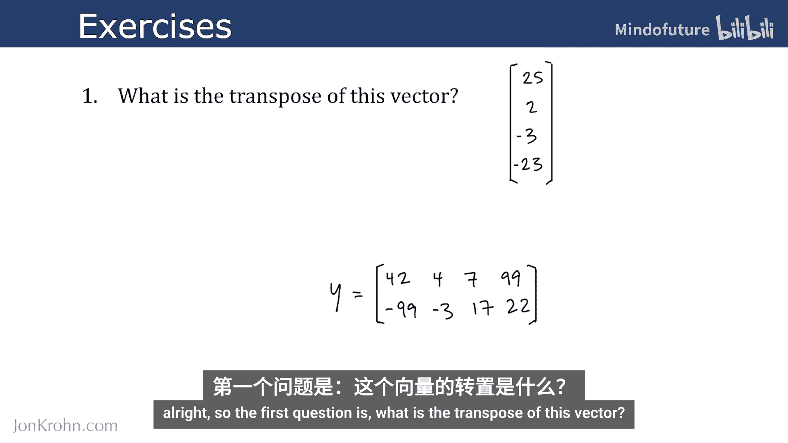
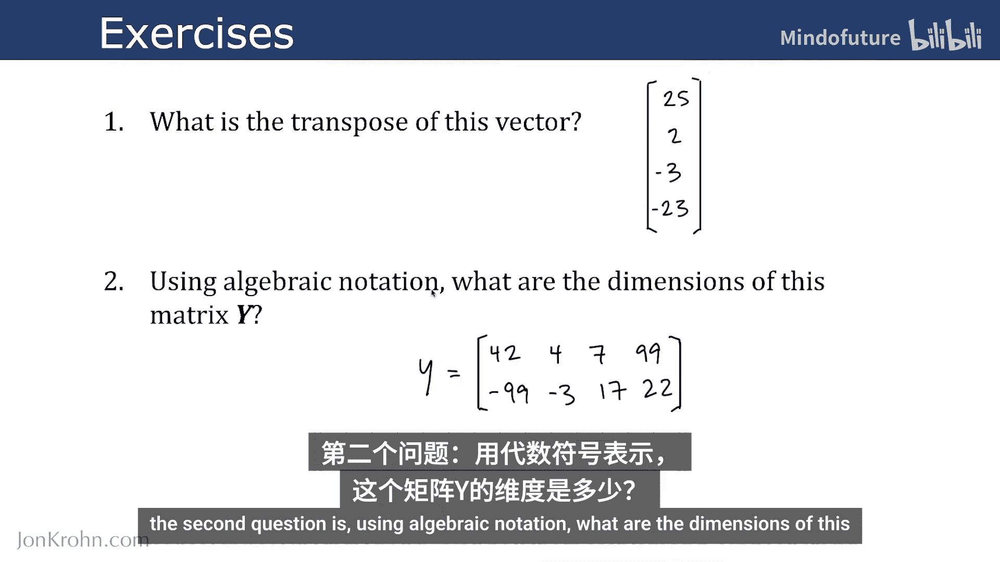
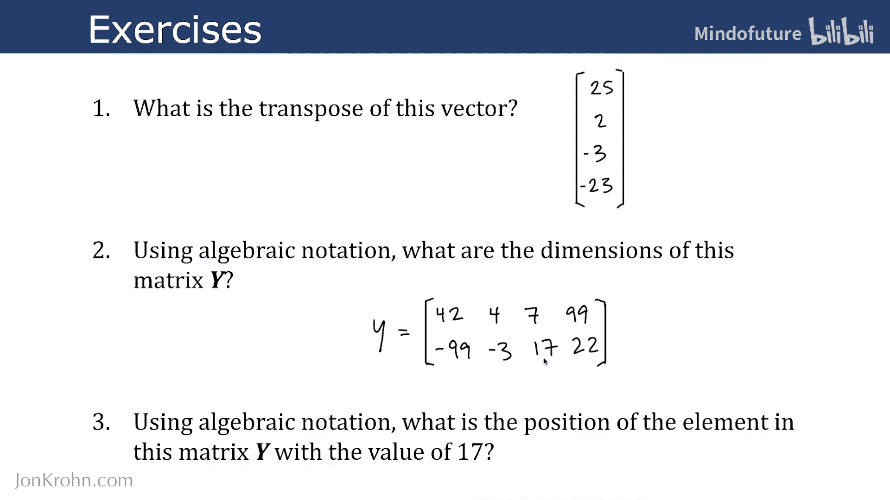
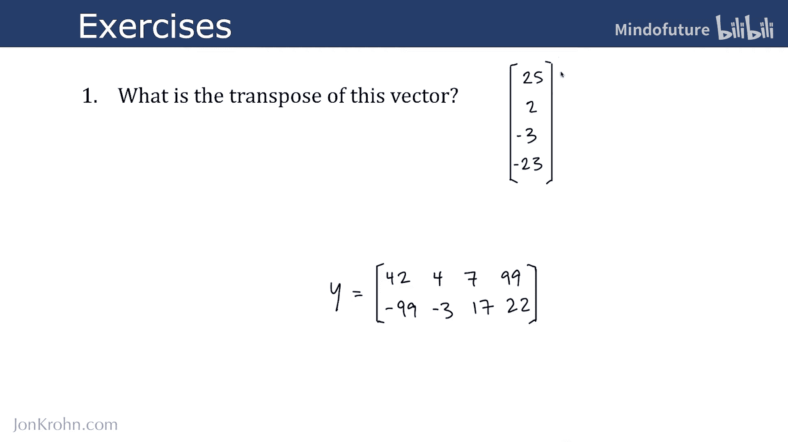
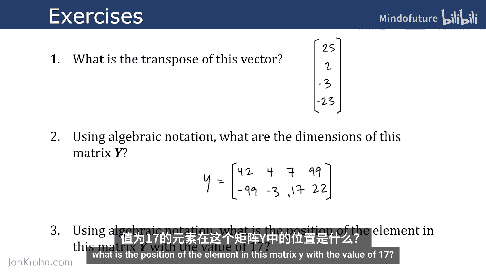

# 012：代数数据结构练习 🧮

在本节课中，我们将通过三个练习来检验你对张量——这一支撑所有机器学习的核心线性代数数据结构——的理解程度。这些练习将帮助你巩固关于向量转置、矩阵维度和元素定位的知识。

上一节我们介绍了张量的基本概念，本节中我们来看看如何应用这些知识解决具体问题。

以下是三个需要你解答的问题：

1.  第一个问题是：这个向量 **v** 的转置是什么？
    

2.  第二个问题是：使用代数符号表示，矩阵 **Y** 的维度是多少？
    

3.  第三个也是最后一个问题是：使用代数符号表示，矩阵 **Y** 中值为 17 的元素位于什么位置？
    
    

---

在解答了上述问题后，让我们来核对一下答案，以加深理解。

以下是每个问题的解答与解析：

*   **问题一解答**：向量 **v** 的转置将其从列向量转换为行向量。因此，转置结果为：
    **v^T = [4, 5, 6]**
    在代码中，这通常通过 `.T` 属性实现，例如 `v.T`。

*   **问题二解答**：矩阵的维度由其行数和列数决定。观察矩阵 **Y**，它共有 3 行和 4 列。使用代数符号，其维度表示为：
    **Y ∈ R^(3×4)**
    这表示 **Y** 是一个 3行4列的实数矩阵。

*   **问题三解答**：在矩阵中，元素的位置由其所在的行索引和列索引共同确定。在矩阵 **Y** 中，数值 17 位于第 3 行、第 2 列（索引通常从1开始计数）。使用代数符号，该元素的位置表示为：
    **y_32 = 17**
    这里，下标中的第一个数字 3 表示行索引，第二个数字 2 表示列索引。

---

本节课中我们一起学习了如何应用线性代数的基本概念来解决具体问题。我们练习了求向量的转置、确定矩阵的维度以及定位矩阵中的特定元素。掌握这些基础操作对于后续理解更复杂的机器学习算法至关重要。