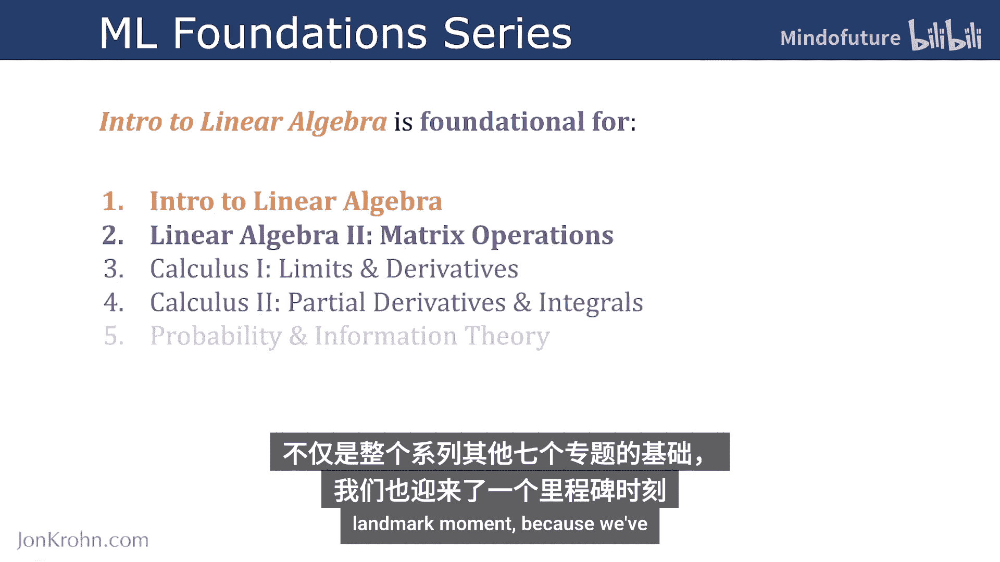
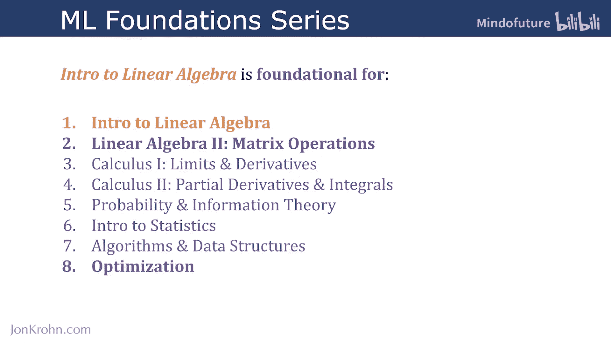
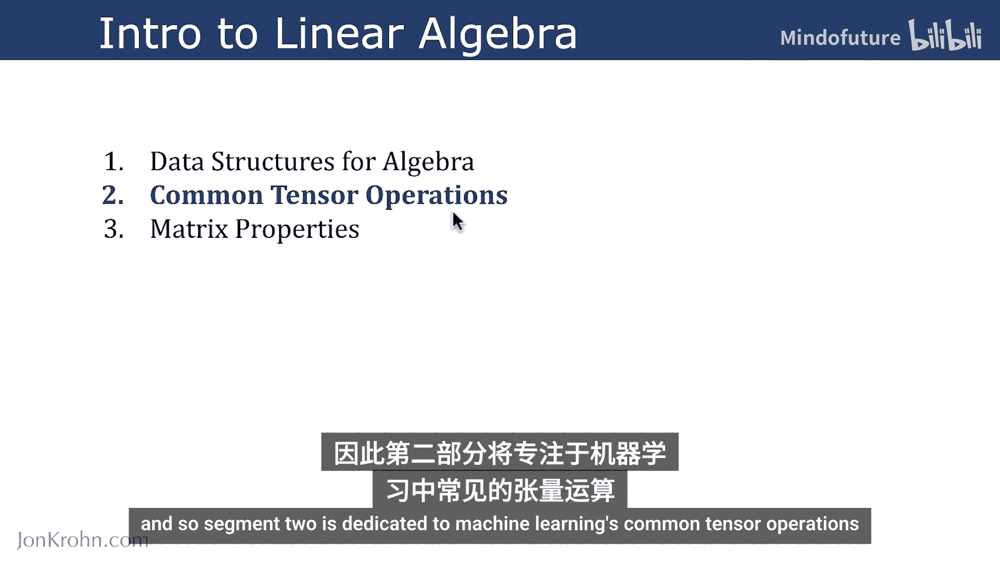
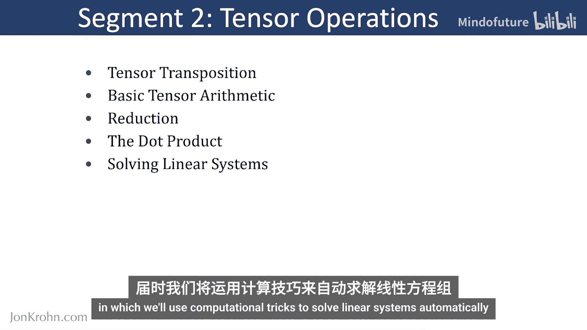

# 013：线性代数导论的第2部分

在本节课中，我们将进入“机器学习基础系列”中第一个主题“线性代数导论”的第二部分。这个系列包含八个主题，而线性代数正是其他七个主题的数学基础。我们已经完成了第一部分的学习，这是一个重要的里程碑。

## 第一部分回顾：代数数据结构 📚

上一节我们介绍了机器学习中无处不在的张量，并详细探讨了它们的特性。我们了解了标量、向量、矩阵和高维张量的区别。

掌握了张量的基本概念后，我们现在已经具备了对其进行数学运算的基础。因此，第二部分将专注于机器学习中常见的张量运算。

## 第二部分概述：核心张量运算 ⚙️

具体来说，在第二部分中，我们将学习以下核心内容：

以下是本部分将要涵盖的主要运算：

1.  **张量转置**：重新排列张量的维度。
2.  **基本算术运算**：对张量进行加、减、乘、除。
3.  **张量归约**：将高维张量缩减为标量。
4.  **向量点积**：计算两个向量之间的点积。

完成这些实践操作后，我们将暂时离开代码演示，在纸上使用代数方法**求解线性方程组**。

所有这些知识将为我们完美地过渡到第三部分做好准备。在第三部分中，我们将学习使用计算技巧自动求解线性方程组。

## 总结

本节课中，我们一起回顾了线性代数导论的第一部分，并概述了第二部分的学习路线。接下来，我们将深入张量的转置、算术运算、归约和点积等核心操作，并最终将这些知识应用于求解线性方程组，为后续的机器学习算法学习打下坚实的数学基础。