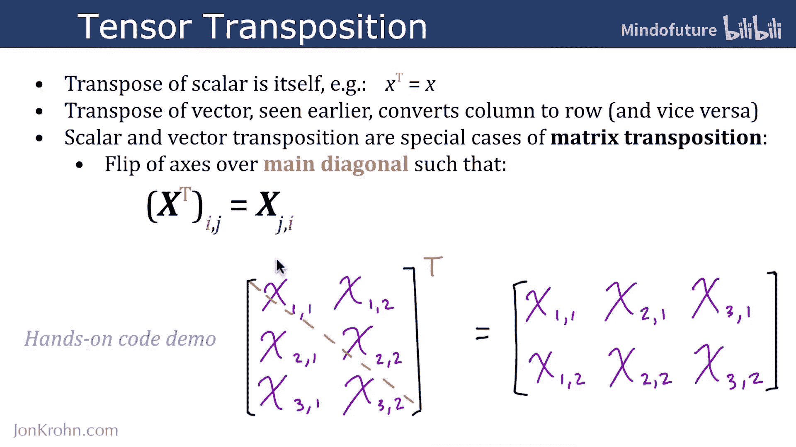
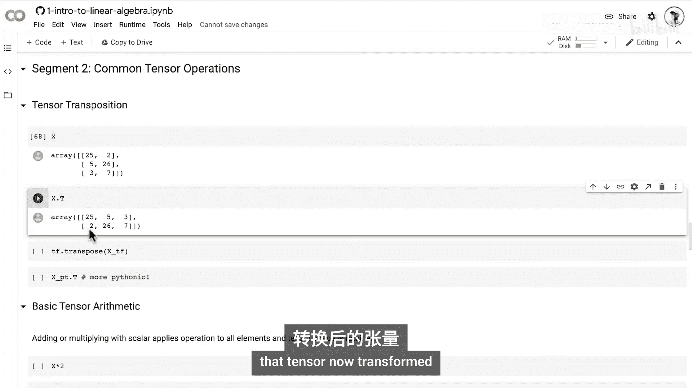
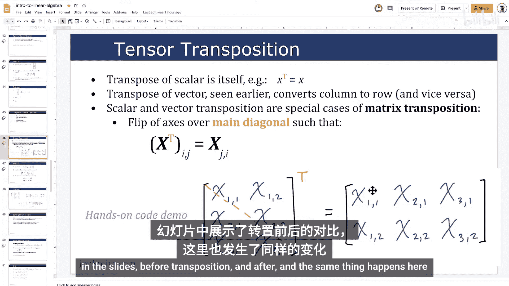
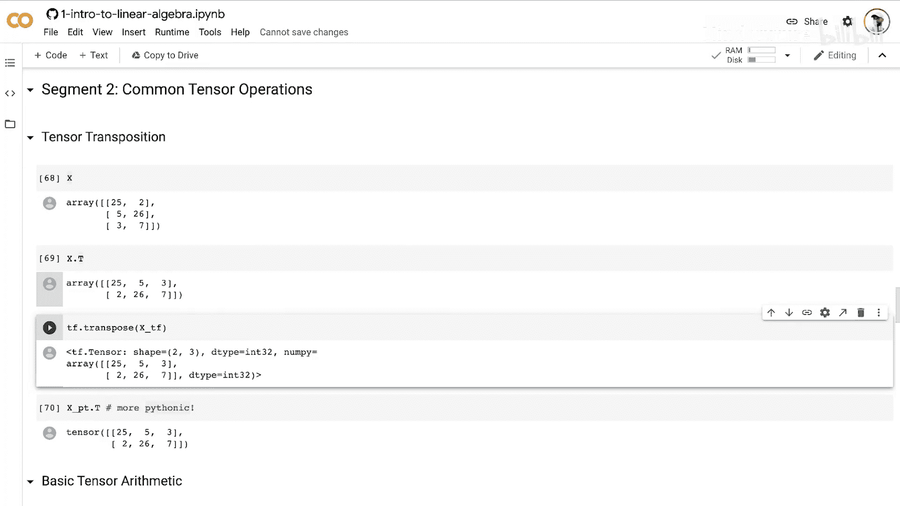

# 014：张量转置

在本节课中，我们将要学习张量转置的理论知识，并了解如何在流行的张量库（如NumPy、TensorFlow或PyTorch）中轻松实现转置操作。

## 概述

张量转置是线性代数中的一项基础操作，它重新排列张量的维度。对于不同维度的张量，转置的含义和效果各不相同。我们将从最简单的标量开始，逐步深入到向量和矩阵的转置。

## 标量与向量的转置

上一节我们介绍了张量的基本概念，本节中我们来看看具体的转置操作。最简单的转置操作是针对零维张量，即标量。

*   **标量的转置**：标量的转置就是其自身。公式表示为：如果 `a` 是一个标量，则 `a^T = a`。

接下来是向量的转置。

*   **向量的转置**：这实际上是将列向量转换为行向量，反之亦然。我们在之前的机器学习基础系列中已经见过。

## 矩阵的转置

现在，事情变得真正有趣起来。矩阵的转置是核心操作，标量和向量的转置都可以看作是矩阵转置的特殊情况。

在矩阵转置中，我们沿着主对角线翻转矩阵的轴。矩阵的主对角线是从左上角延伸到右下角的对角线。通过翻转，原本在第 `i` 行、第 `j` 列的元素，会移动到第 `j` 行、第 `i` 列的位置。

以下是一个图示说明：左上角的元素保持原位，但右上角的元素会移动到左下角。本质上，原本的右列变成了底行，左列变成了顶行，但元素间的相对顺序在各自的行或列内保持不变。

## 代码实现

理论清晰后，让我们通过动手代码演示来看看如何在代码中实现转置。以下是在不同库中的实现方法。

**1. NumPy 实现**

在NumPy中，转置操作非常简单。我们使用 `.T` 属性。

```python
import numpy as np



# 创建一个矩阵
X = np.array([[1, 2, 3],
              [4, 5, 6]])
print("原始矩阵 X:")
print(X)
print("形状:", X.shape)

# 进行转置
X_transposed = X.T
print("\n转置后的矩阵 X.T:")
print(X_transposed)
print("形状:", X_transposed.shape)
```
执行上述代码，可以看到原本在第一列（左侧列）的元素，现在位于第一行。

**2. PyTorch 实现**

PyTorch 与 NumPy 一样简单，同样使用 `.T` 属性。

```python
import torch

# 创建一个PyTorch张量
X_torch = torch.tensor([[1, 2, 3],
                        [4, 5, 6]])
print("原始张量:")
print(X_torch)



# 进行转置
X_torch_transposed = X_torch.T
print("\n转置后的张量:")
print(X_torch_transposed)
```



**3. TensorFlow 实现**

在TensorFlow中，操作稍微不那么直观，需要调用 `tf.transpose` 函数。

```python
import tensorflow as tf

# 创建一个TensorFlow张量
X_tf = tf.constant([[1, 2, 3],
                    [4, 5, 6]])
print("原始张量:")
print(X_tf)

# 进行转置
X_tf_transposed = tf.transpose(X_tf)
print("\n转置后的张量:")
print(X_tf_transposed)
```

## 总结

本节课中我们一起学习了张量转置。我们了解到标量转置是其自身，向量转置是行列互换，而矩阵转置是沿着主对角线翻转轴。我们还掌握了在NumPy、PyTorch和TensorFlow这三个主流库中实现张量转置的具体方法，它们都非常简单直接。



掌握了张量转置后，接下来我们将覆盖基本的张量算术运算。