# 016：张量规约 🔢

在本节课中，我们将通过动手代码演示，学习张量操作中一个常见的概念——规约。规约操作是指沿着张量的一个或多个维度执行聚合计算，例如求和、求平均值等。掌握规约对于理解和实现机器学习算法至关重要。

## 张量规约概述

计算张量所有元素的总和是一种常见的规约操作。对于一个长度为 **N** 的向量 **X**，其规约和的计算公式为：

**sum(X) = Σ_{i=1}^{N} x_i**

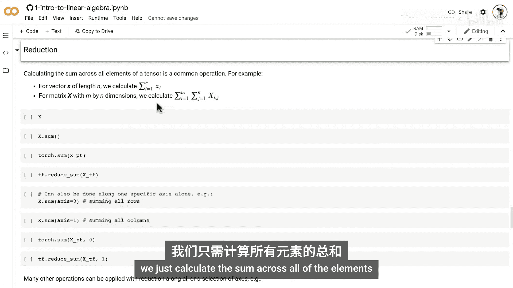

对于一个维度为 **M × N** 的矩阵，其全局规约和的计算方式相同，即对所有元素进行求和。

## 动手代码示例

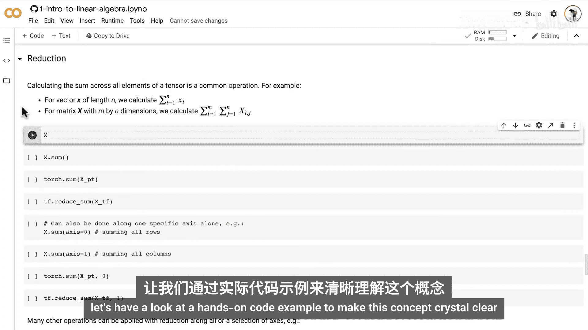

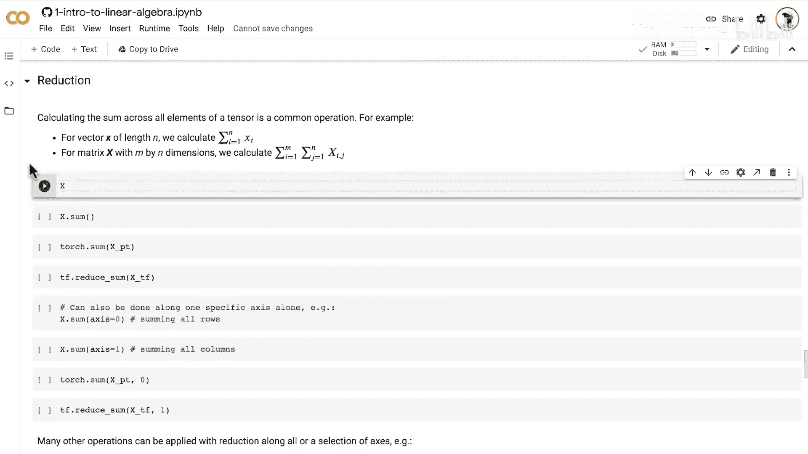

为了清晰地展示这一概念，我们来看一个具体的代码示例。我们将使用一个矩阵 **X** 进行演示，这个矩阵在本系列课程的多个示例中已经出现过。

以下是矩阵 **X** 的定义：

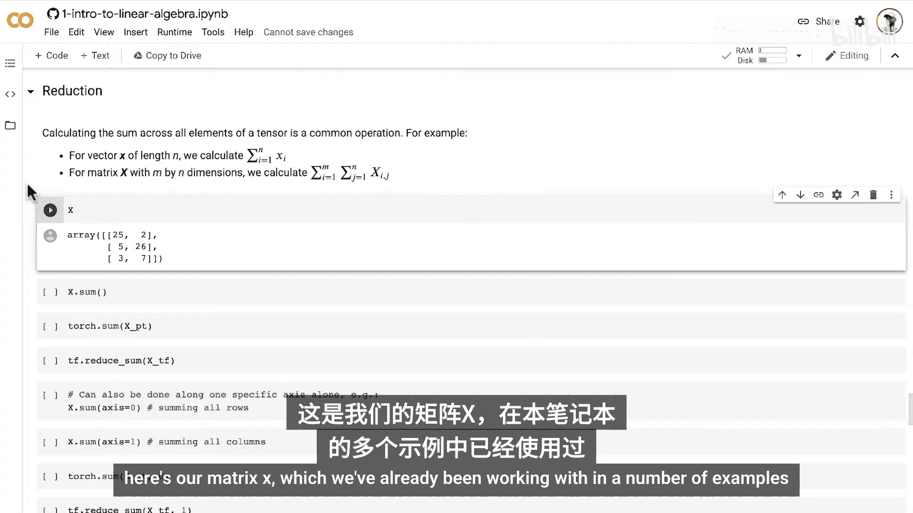

```python
import numpy as np
import torch
import tensorflow as tf

# 定义矩阵 X
X_np = np.array([[10, 20, 3],
                 [4, 5, 6]])
```

### 全局规约求和

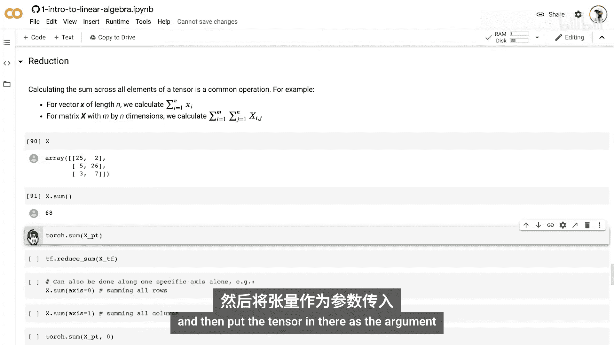

全局规约求和是指计算张量中所有元素的总和。

在NumPy中，我们使用 `.sum()` 方法：

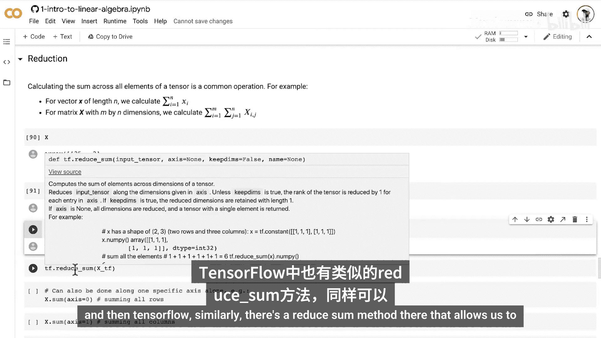

```python
total_sum_np = X_np.sum()
print(f"NumPy全局和: {total_sum_np}")
# 输出: NumPy全局和: 68
```

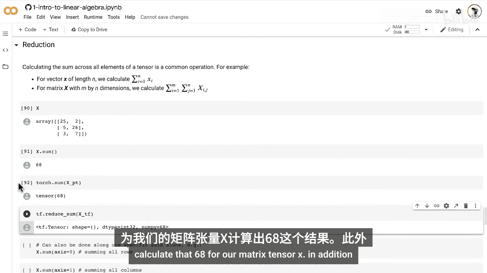

在PyTorch中，我们使用 `torch.sum()` 函数：

```python
X_torch = torch.tensor([[10, 20, 3],
                        [4, 5, 6]])
total_sum_torch = torch.sum(X_torch)
print(f"PyTorch全局和: {total_sum_torch}")
# 输出: PyTorch全局和: 68
```

在TensorFlow中，我们使用 `tf.reduce_sum()` 函数：

```python
X_tf = tf.constant([[10, 20, 3],
                    [4, 5, 6]])
total_sum_tf = tf.reduce_sum(X_tf)
print(f"TensorFlow全局和: {total_sum_tf}")
# 输出: TensorFlow全局和: 68
```

你可以自行验证，68 确实是这六个元素（10+20+3+4+5+6）的总和。

### 沿特定轴规约求和

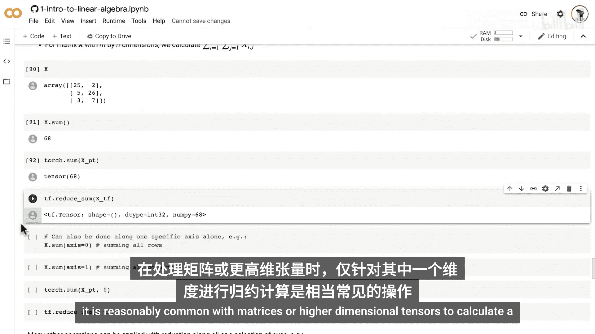

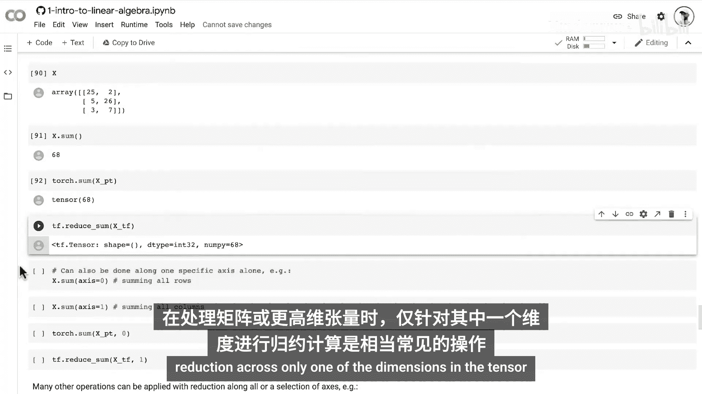

对于矩阵或更高维度的张量，通常我们只需要沿着其中一个维度进行规约计算。例如，我们可以分别计算每行或每列的总和。

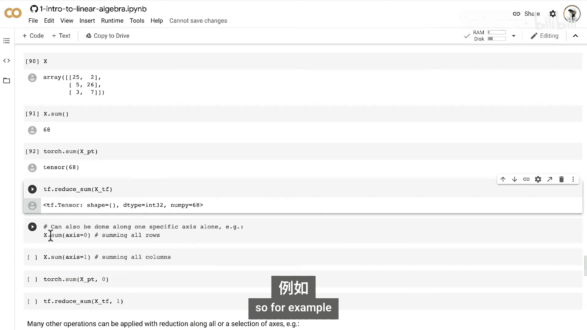

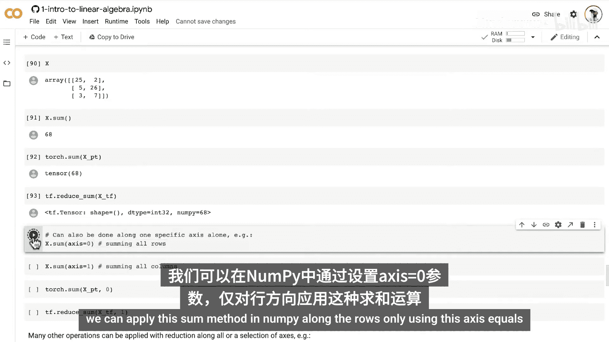

以下是沿不同轴求和的示例：

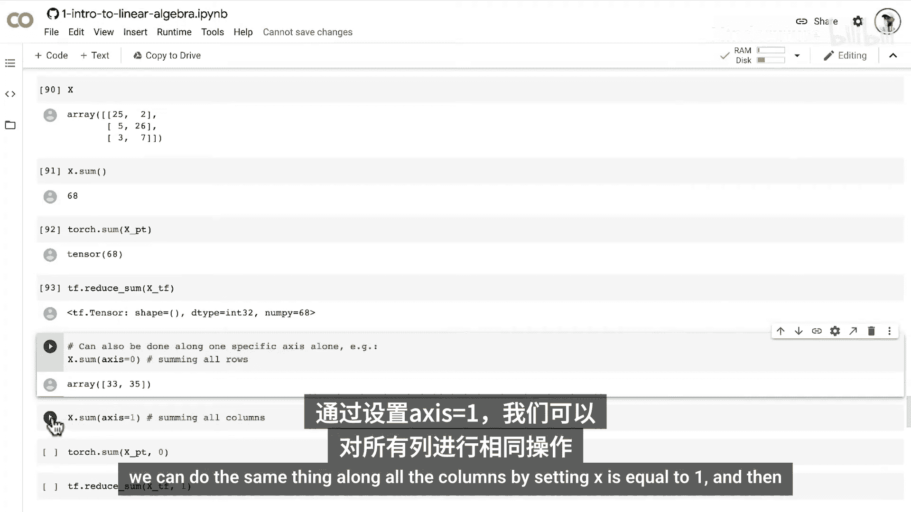

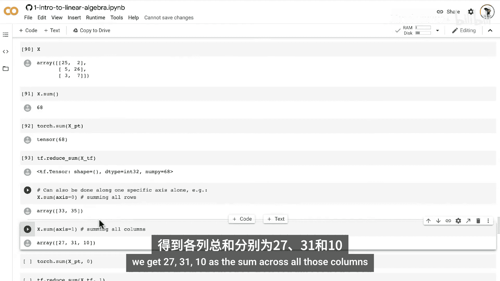

**沿行求和（axis=0）**：计算每一列的总和。
**沿列求和（axis=1）**：计算每一行的总和。

在NumPy中，我们通过 `axis` 参数指定规约的维度：

```python
# 沿行求和 (axis=0) - 列总和
sum_along_rows_np = X_np.sum(axis=0)
print(f"NumPy沿行(列)求和: {sum_along_rows_np}")
# 输出: [14 25  9]  (即 10+4=14, 20+5=25, 3+6=9)

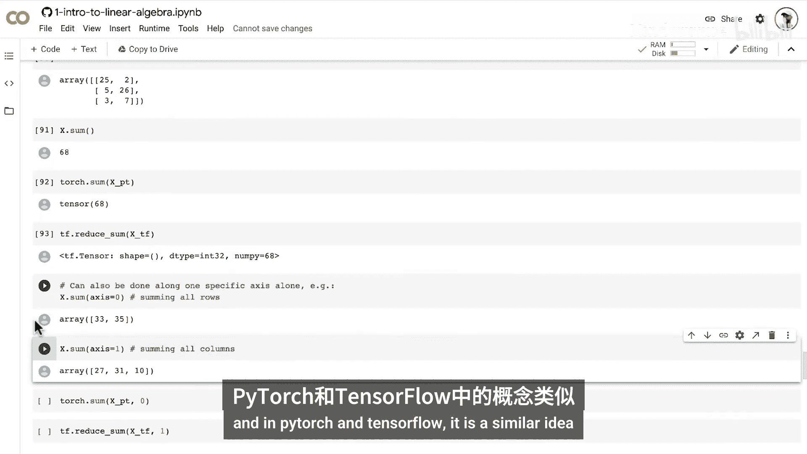

# 沿列求和 (axis=1) - 行总和
sum_along_cols_np = X_np.sum(axis=1)
print(f"NumPy沿列(行)求和: {sum_along_cols_np}")
# 输出: [33 15]  (即 10+20+3=33, 4+5+6=15)
```

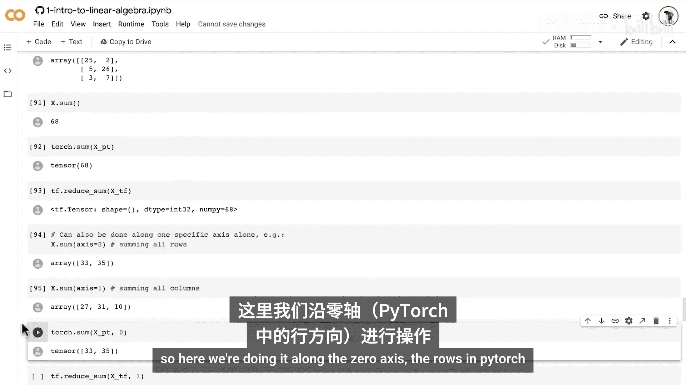

在PyTorch和TensorFlow中，概念是相似的：

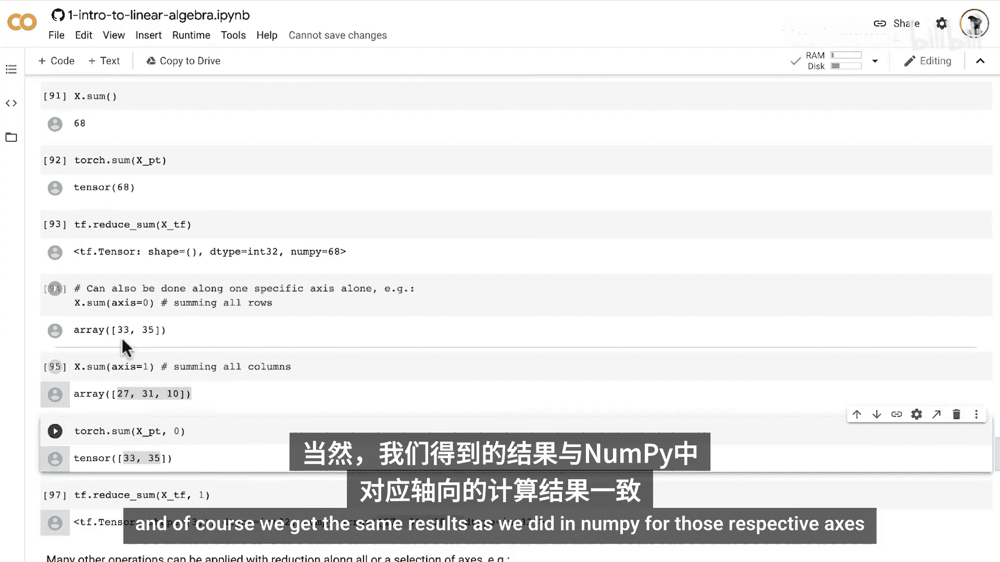

```python
# PyTorch 沿行求和 (dim=0)
sum_along_rows_torch = torch.sum(X_torch, dim=0)
print(f"PyTorch沿行(列)求和: {sum_along_rows_torch}")

# TensorFlow 沿列求和 (axis=1)
sum_along_cols_tf = tf.reduce_sum(X_tf, axis=1)
print(f"TensorFlow沿列(行)求和: {sum_along_cols_tf}")
```

可以看到，它们得到了与NumPy中相应轴计算相同的结果。

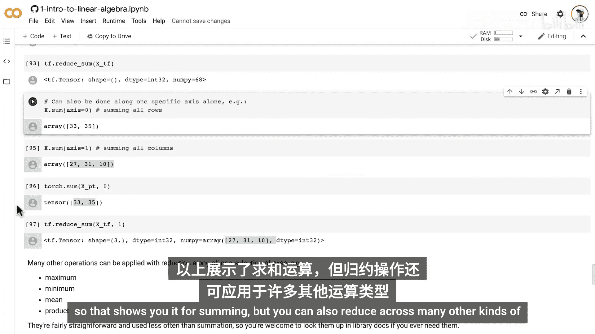

## 其他规约操作

除了求和，你还可以沿所有轴或选定轴应用许多其他类型的规约操作。例如：

*   **最大值**：`np.max()`, `torch.max()`, `tf.reduce_max()`
*   **最小值**：`np.min()`, `torch.min()`, `tf.reduce_min()`
*   **平均值**：`np.mean()`, `torch.mean()`, `tf.reduce_mean()`
*   **乘积**：`np.prod()`, `torch.prod()`, `tf.reduce_prod()`

这些操作都相当直接。在机器学习中，求和无疑是最常见的规约类型。如果你对其他类型的规约操作感兴趣，可以查阅NumPy、PyTorch或TensorFlow等库的官方文档以了解更多细节。

## 课程总结

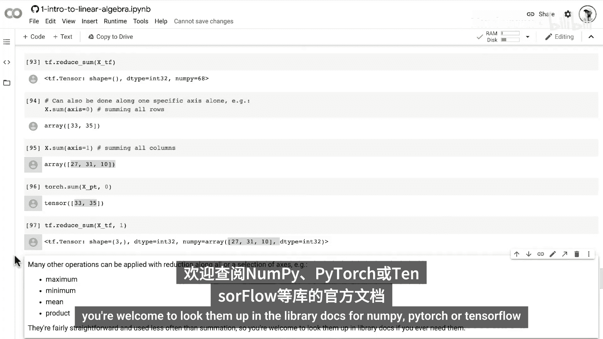

本节课中，我们一起学习了张量的规约操作。我们首先介绍了规约的基本概念，即对张量元素进行聚合计算。然后，我们通过代码示例演示了如何在NumPy、PyTorch和TensorFlow中实现**全局求和**以及**沿特定轴求和**。最后，我们简要提到了其他类型的规约操作，如求最大值、最小值和平均值。

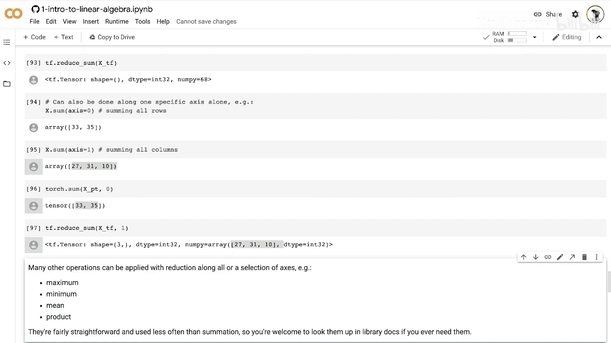

规约是线性代数中的基础操作，广泛用于机器学习的数据处理和模型计算中。下一节课，我们将学习如何计算两个向量的点积。