# 017：点积 🔢

在本节课中，我们将学习机器学习中最常见的张量操作之一：**点积**。点积在深度学习中无处不在，是深度神经网络中每个神经元的核心计算。我们将通过代码演示，直观地理解点积的概念和计算方法。

## 点积的定义与计算

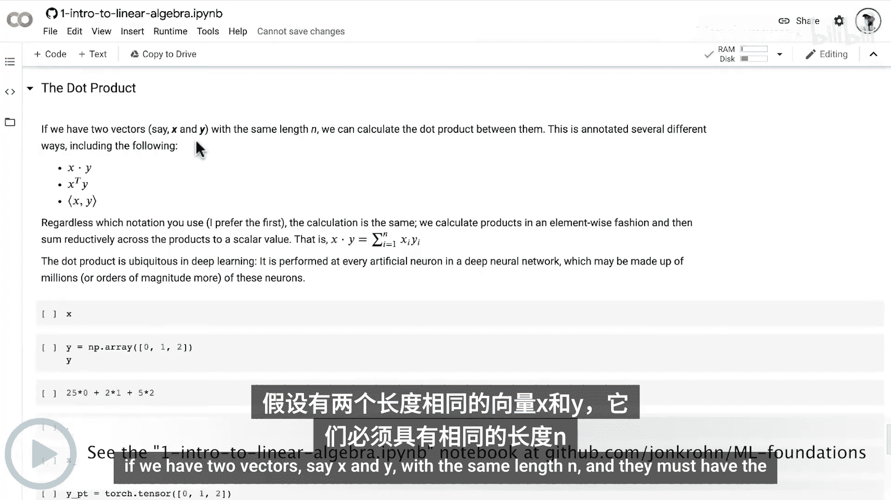

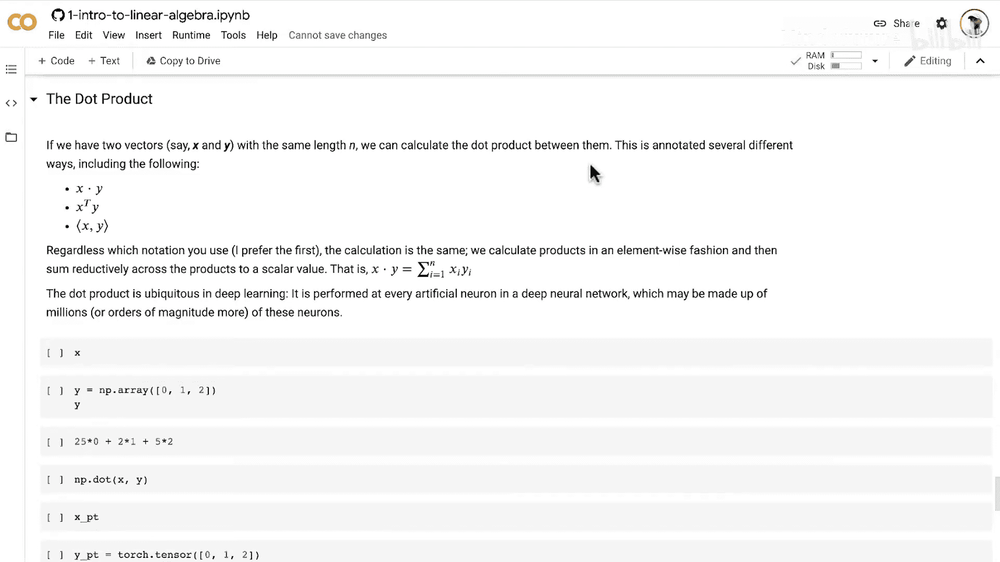

点积是两个长度相同的向量之间的一种运算，其结果是一个标量。假设我们有两个向量 **x** 和 **y**，它们的长度均为 **n**，则它们的点积可以表示为：

**公式：** `x · y = x₁y₁ + x₂y₂ + ... + xₙyₙ`

点积有几种常见的记法，包括 `x · y`、`xᵀy` 或 `<x, y>`。无论使用哪种记法，其计算方式都是相同的。

计算过程分为两步：
1.  **逐元素相乘**：将向量 **x** 和 **y** 中对应位置的元素相乘。
2.  **求和**：将所有乘积结果相加，得到一个最终的标量值。

这本质上是一种**归约求和**操作。

## 点积的Python实现

上一节我们介绍了点积的理论定义，本节中我们来看看如何在不同的Python库中实现它。我们将使用NumPy、PyTorch和TensorFlow分别进行演示。

### 使用NumPy计算点积

以下是使用NumPy库计算点积的步骤：

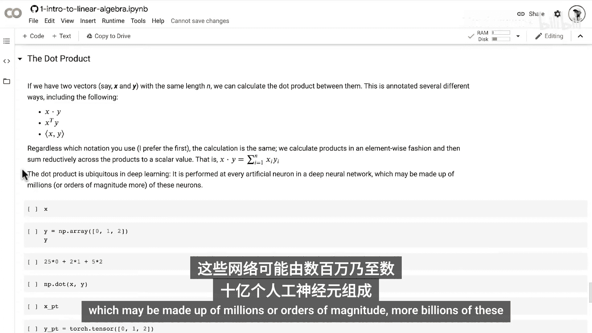

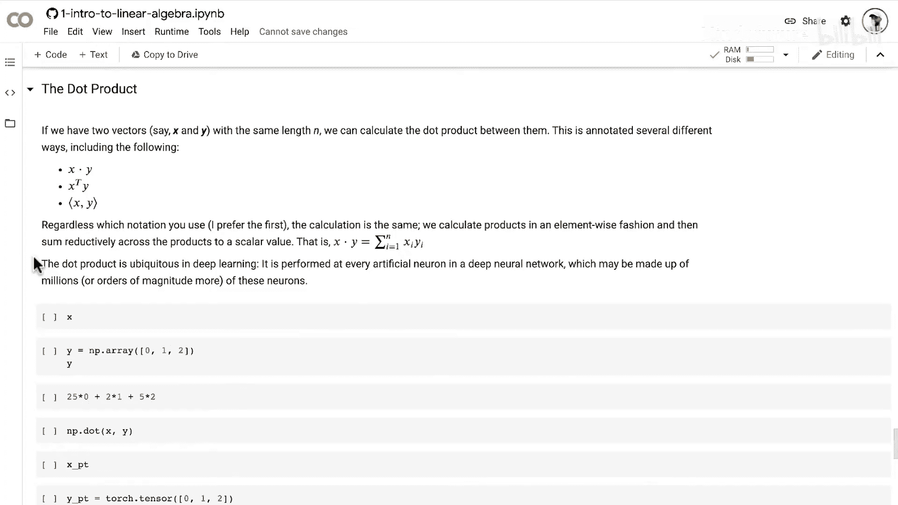

```python
import numpy as np

# 定义两个向量
x = np.array([2, 5, 1])
y = np.array([0, 1, 2])

# 手动计算点积（演示原理）
manual_dot = (2*0) + (5*1) + (1*2)
print(f"手动计算的点积结果: {manual_dot}")

# 使用NumPy的dot方法
numpy_dot = np.dot(x, y)
print(f"NumPy计算的点积结果: {numpy_dot}")
```

### 使用PyTorch计算点积

在PyTorch中计算点积时，需要注意张量的数据类型：

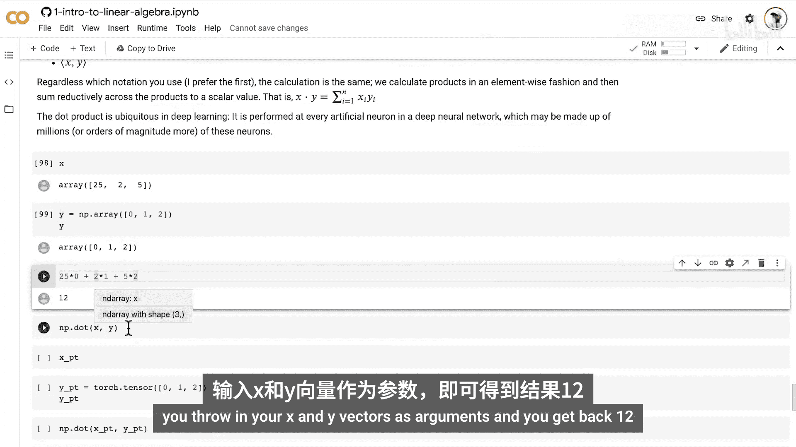

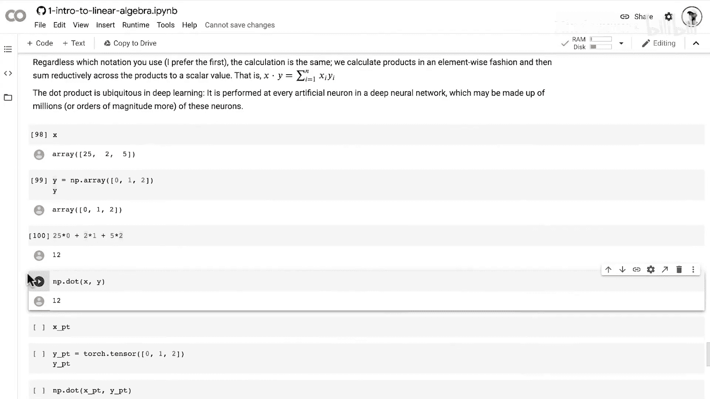

```python
import torch

# 创建两个浮点型张量（PyTorch dot方法要求浮点类型）
x_torch = torch.tensor([2., 5., 1.])
y_torch = torch.tensor([0., 1., 2.])

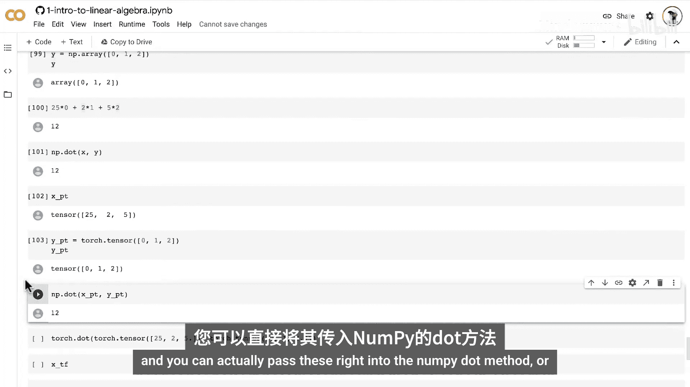

# 使用PyTorch的dot方法
torch_dot = torch.dot(x_torch, y_torch)
print(f"PyTorch计算的点积结果: {torch_dot}")

# 也可以使用NumPy的dot方法处理PyTorch张量
torch_via_numpy = np.dot(x_torch, y_torch)
print(f"PyTorch张量用NumPy计算的结果: {torch_via_numpy}")
```

### 使用TensorFlow计算点积

TensorFlow的计算方式略有不同，通常需要两步操作：

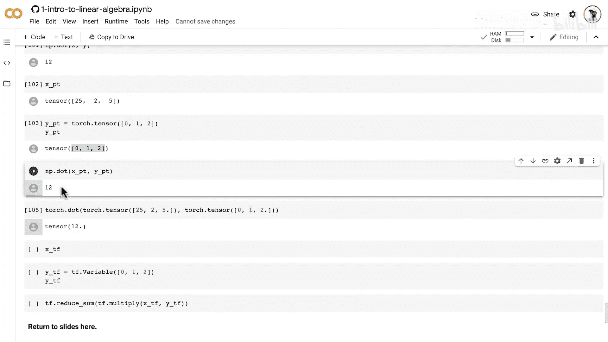

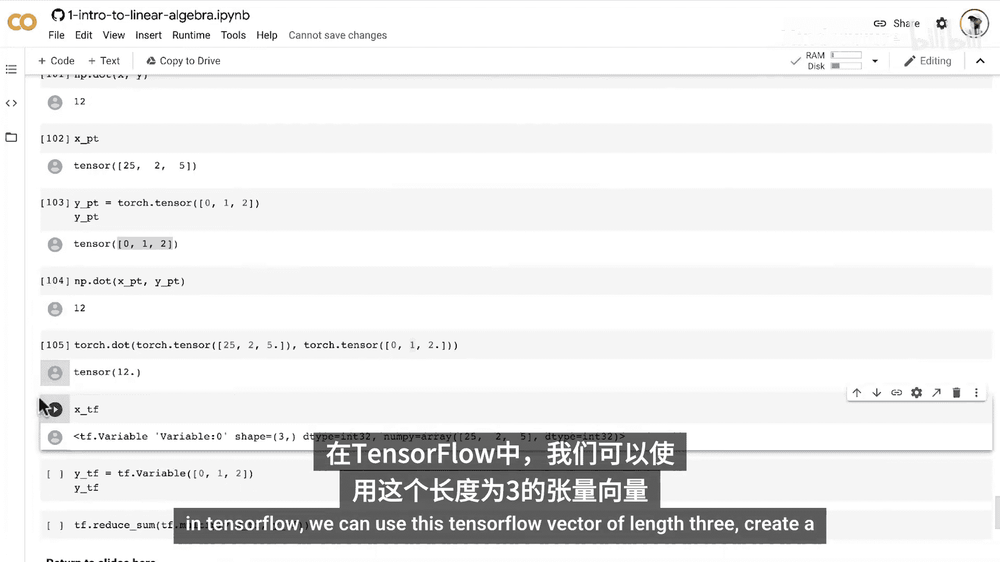

```python
import tensorflow as tf

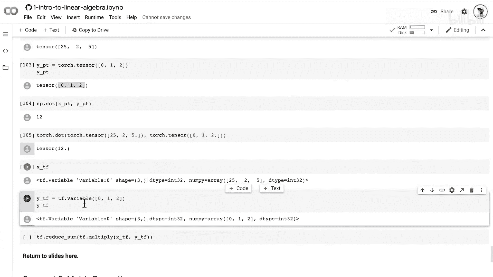

# 定义两个向量
x_tf = tf.constant([2, 5, 1])
y_tf = tf.constant([0, 1, 2])

# 第一步：逐元素相乘
elementwise_product = tf.multiply(x_tf, y_tf)

# 第二步：对乘积结果求和
tf_dot = tf.reduce_sum(elementwise_product)
print(f"TensorFlow计算的点积结果: {tf_dot}")
```

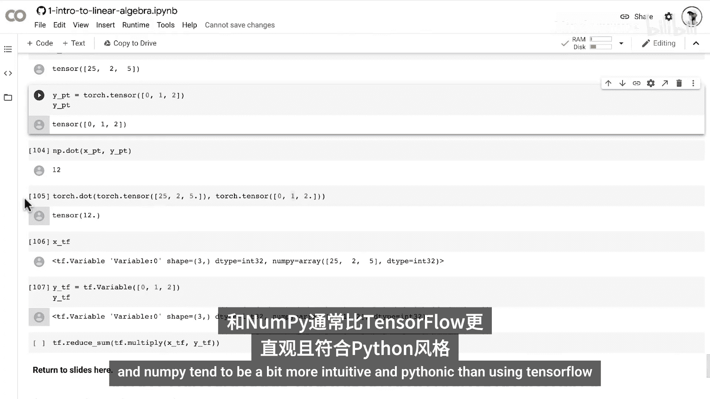

## 总结

本节课中我们一起学习了**点积**这一核心的线性代数操作。我们了解到：

1.  点积是两个**等长向量**的运算，结果是一个**标量**。
2.  其计算过程是**逐元素相乘后求和**。
3.  点积在深度学习中应用极其广泛，是神经网络中每个神经元进行加权求和的基础计算。
4.  我们掌握了在NumPy、PyTorch和TensorFlow这三个主流库中实现点积的方法，其中NumPy和PyTorch的接口更为直接，而TensorFlow通常需要分解为乘法和求和两步。

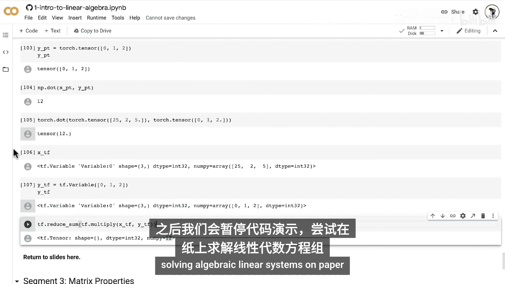

理解并熟练运用点积，是进一步学习机器学习模型，特别是神经网络前向传播过程的重要基石。