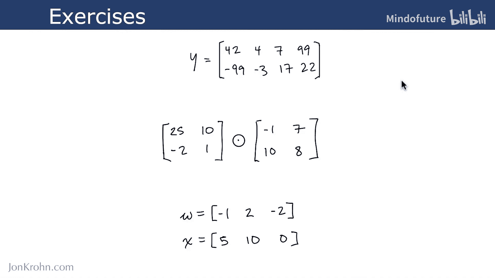
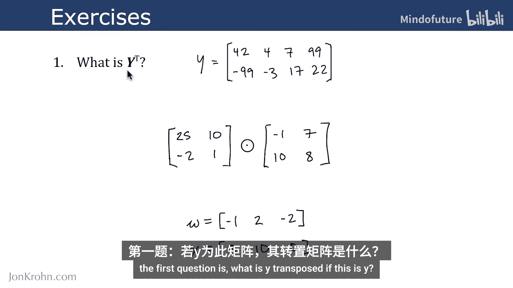
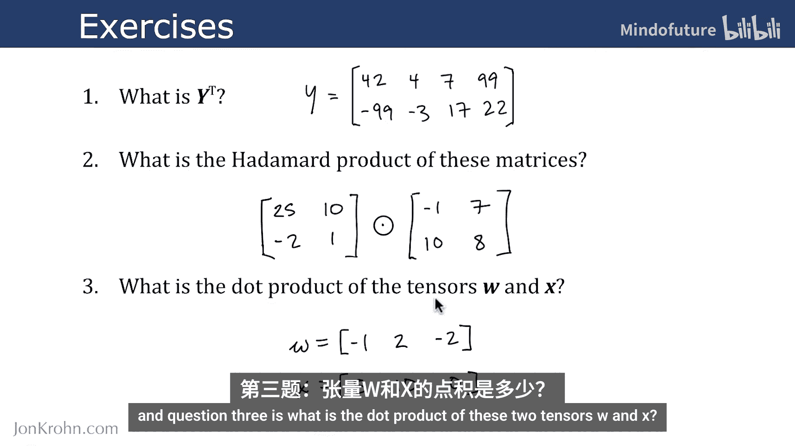
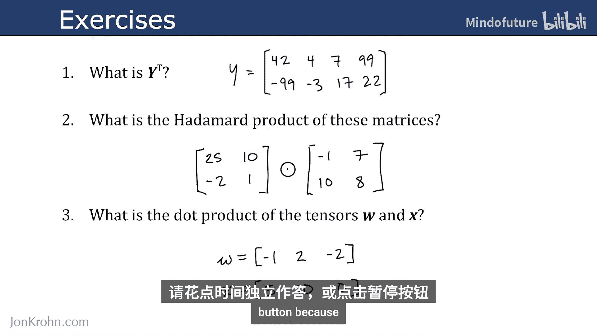
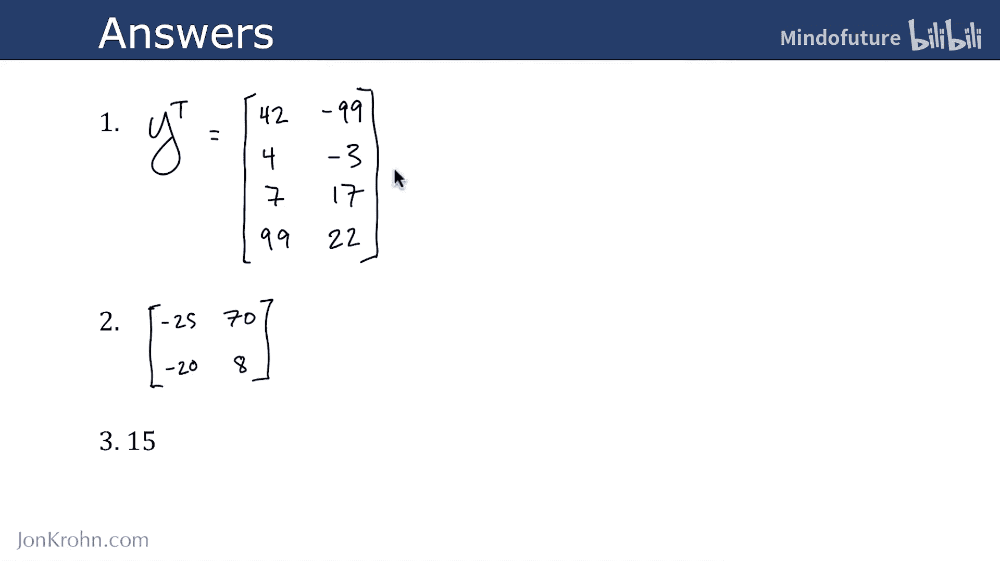

# 018：张量运算练习 🧮

在本节课中，我们将通过三个练习来检验你对机器学习中核心张量运算的理解。这些练习涵盖了转置、哈达玛积和点积运算。

上一节我们介绍了机器学习中常用的几种张量运算，本节中我们来看看如何应用这些知识解决具体问题。

## 练习一：矩阵转置

第一个问题是：如果矩阵 **Y** 如下所示，那么它的转置 **Y^T** 是什么？

**公式**：给定矩阵 **Y**，其转置 **Y^T** 通过交换行和列得到。

以下是矩阵 **Y** 的图示：

## 练习二：矩阵的哈达玛积

第二个问题是：计算以下两个矩阵的哈达玛积。

**公式**：两个同型矩阵 **A** 和 **B** 的哈达玛积 **A ⊙ B** 是它们对应元素的乘积。

以下是待计算的两个矩阵图示：

## 练习三：张量的点积

第三个问题是：计算张量 **W** 和 **X** 的点积。

**公式**：两个张量的点积运算取决于它们的维度。对于矩阵，点积即矩阵乘法。

以下是张量 **W** 和 **X** 的图示：

现在，请花点时间尝试独立解答这些问题，或者暂停视频进行思考，因为接下来我将给出答案。

## 练习答案

以下是这三个问题的答案。

以下是答案图示：

本节课中我们一起学习了如何应用转置、哈达玛积和点积这三种核心张量运算来解决具体问题。通过练习，可以巩固对运算规则的理解，为后续更复杂的机器学习模型打下坚实的数学基础。