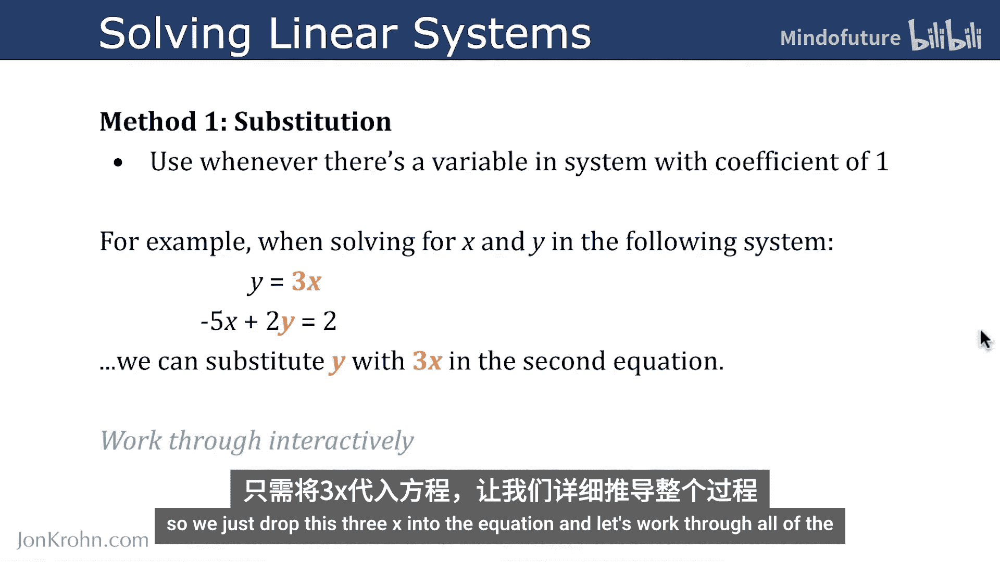
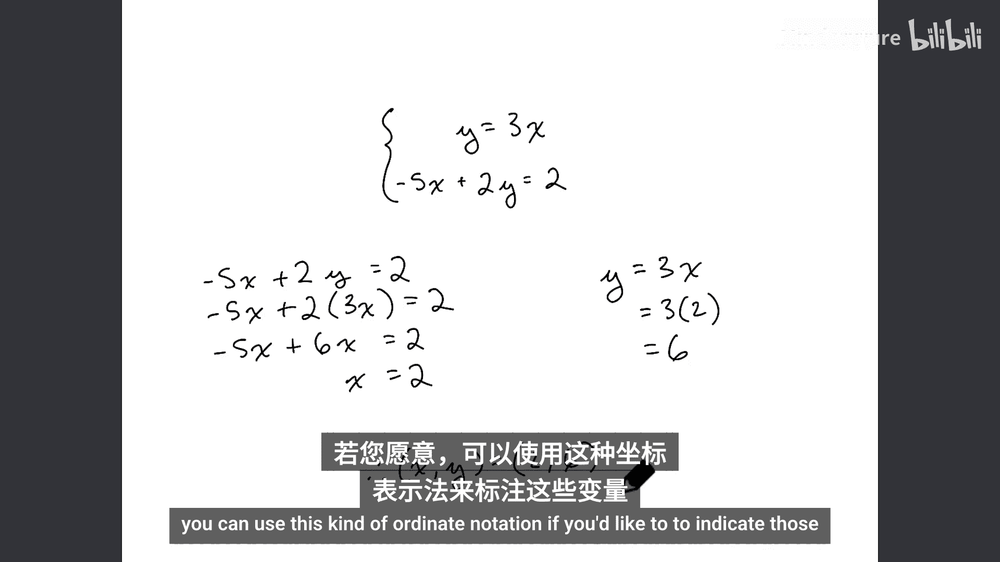
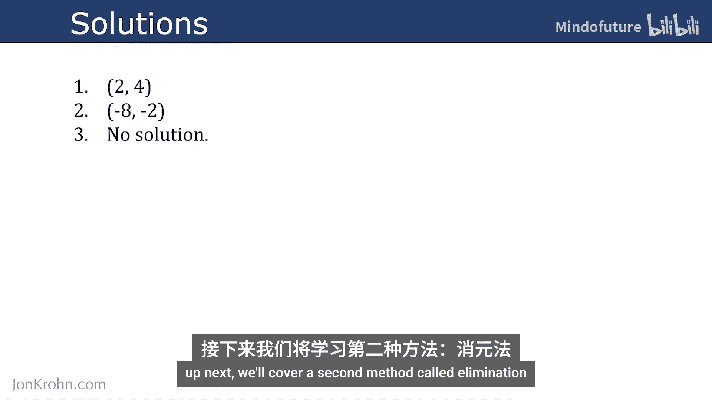

# 019：用代换法求解线性系统

在本节课中，我们将学习如何用代换法求解线性方程组。这是一种基础的代数方法，适用于方程组中某个变量的系数为1的情况。我们将通过具体的例子，一步步演示如何操作，并理解其背后的原理。

在接下来的矩阵性质章节中，我们将学习足够的理论知识，以便用代码（即矩阵运算）来求解简单的线性系统。但在那之前，为了更深入地理解如何求解线性系统，我们先在纸上用代数方法解决一些问题。代换法是我们将介绍的第一个代数求解方法。

## 代换法简介

代换法在方程组中某个变量的系数为1时特别有用。例如，在求解以下方程组中的 `x` 和 `y` 时：
- `y = 3x`
- `-5x + 2y = 2`

在这个由两个方程组成的系统中，第一个方程中的变量 `y` 的系数是1（通常不写出1，直接写作 `y`）。在这种情况下，我们可以直接将 `y` 在第二个方程中替换为它所等于的表达式，即 `3x`。

## 详细求解步骤

让我们详细地走一遍这个过程，以便清晰易懂。

这是我们的方程组，与刚才幻灯片上看到的一样。注意，你可以使用大括号符号来表示方程组中的所有方程。

取系统中的第二个方程，然后将 `y` 替换为 `3x`。这允许我们写出：
`-5x + 2*(3x) = 2`

计算 `2 * 3x` 得到 `6x`，所以方程变为：
`-5x + 6x = 2`

这很容易求解，因为 `-5 + 6 = 1`，所以左边只剩下 `x`。因此，我们现在知道：
`x = 2`

在这个方程组中，我们需要求解两个变量 `x` 和 `y`。一旦有了 `x`，求解 `y` 就非常简单了。我们可以取系统中的第一个方程：
`y = 3x`

将 `x = 2` 代入 `3x`，得到 `3 * 2 = 6`。所以，`y = 6`。

至此，我们求解出了线性方程组中的未知数：`x = 2`，`y = 6`。你也可以使用坐标表示法 `(2, 6)` 来表示这些变量。

## 练习与解答

为了让你练习自己使用代换法求解线性系统，以下是三个问题。请尝试在纸上求解以下每个方程组中的未知数 `x` 和 `y`。

以下是三个独立的系统：
1. `y = 2x + 1` 和 `3x + y = 11`
2. `x = 4 - y` 和 `2x + 3y = 9`
3. `y = x + 2` 和 `y = x - 1`

建议你现在暂停视频，先自己尝试解答。

以下是三个问题的解答：
1. 解为 `x = 2`, `y = 5`。
2. 解为 `x = 3`, `y = 1`。
3. 这个方程组无解。这意味着由这两个方程描述的直线在平面上是平行的，没有交点，因此不可能找到同时满足两个方程的 `x` 和 `y` 值。

## 总结

本节课中，我们一起学习了使用代换法求解线性方程组。我们了解到，当方程组中某个变量的系数为1时，可以方便地将其表达式代入另一个方程，从而简化求解过程。我们通过例子逐步演示，并进行了练习。如果第三个练习让你感到困难，那是因为该方程组无解，这是线性系统中可能遇到的一种情况。

代换法是求解线性系统的第一个代数方法。接下来，我们将介绍第二种方法：消元法。

