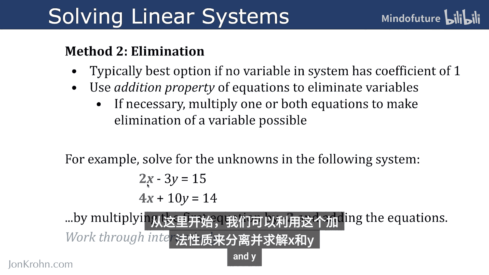
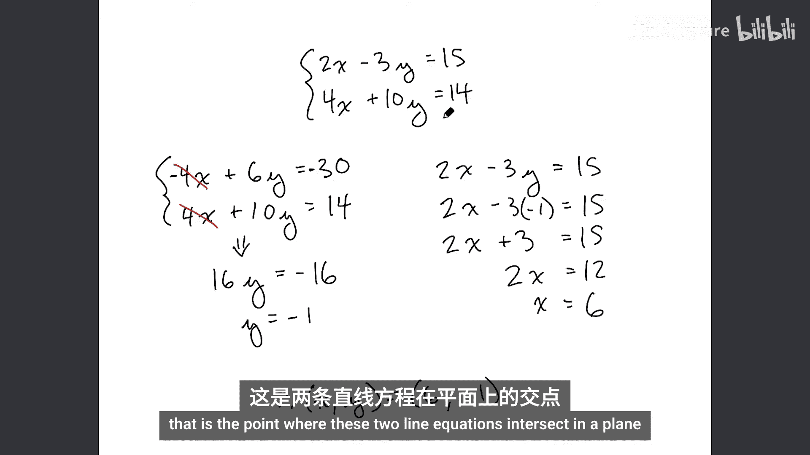
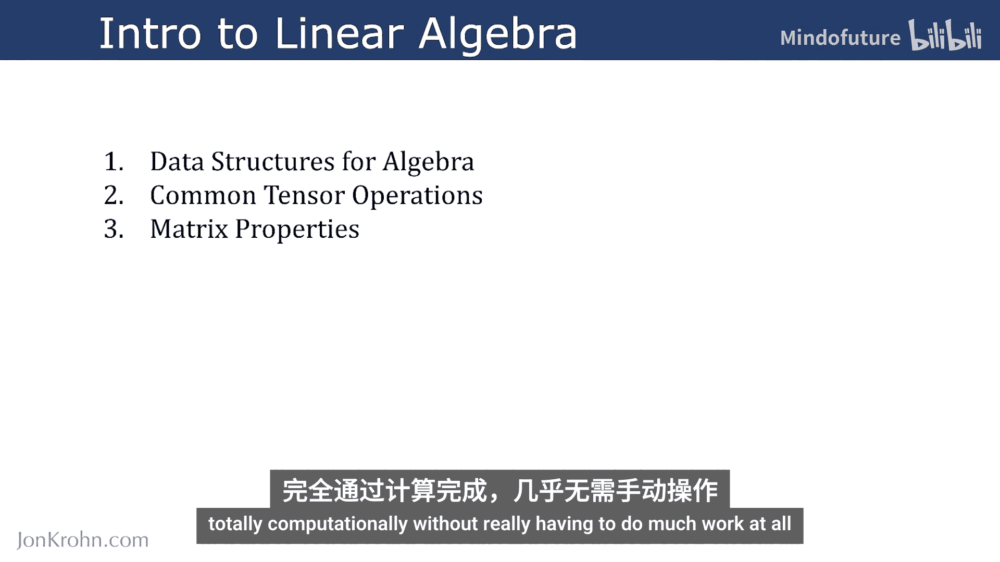

# 020：用消元法求解线性系统

在本节课中，我们将要学习求解线性方程组的第二种代数方法——消元法。上一节我们介绍了代入法，本节中我们来看看当方程组中没有一个变量的系数为1时，如何利用消元法来求解。

消元法的核心是利用方程的可加性来消除变量。如有必要，可以对方程进行乘法运算，使得某个变量能够被消去。这种方法通常比代入法更适用于系数复杂的方程组。

## 消元法详解

让我们通过一个具体的例子来逐步演示消元法的过程。

我们有以下线性方程组：
```
2x - 3y = 15
4x + 10y = 14
```

我们的目标是找到 `x` 和 `y` 的值，使得两个方程同时成立。



以下是详细的求解步骤：

1.  **对齐变量并准备消元**：观察两个方程，我们发现如果将第一个方程乘以 `-2`，那么第一个方程中 `x` 的系数就会变成 `-4`，与第二个方程中 `x` 的系数 `4` 相加即可消去 `x`。

2.  **执行乘法**：将第一个方程 `2x - 3y = 15` 两边同时乘以 `-2`。
    ```
    -2 * (2x - 3y) = -2 * 15
    -4x + 6y = -30
    ```

3.  **相加消元**：将变换后的第一个方程 `-4x + 6y = -30` 与第二个方程 `4x + 10y = 14` 相加。
    ```
    (-4x + 6y) + (4x + 10y) = -30 + 14
    0x + 16y = -16
    16y = -16
    ```

4.  **求解第一个变量**：解出 `y`。
    ```
    y = -16 / 16
    y = -1
    ```

5.  **回代求解第二个变量**：将求得的 `y = -1` 代入原方程组中的任意一个方程（这里选择第一个方程）来求解 `x`。
    ```
    2x - 3*(-1) = 15
    2x + 3 = 15
    2x = 12
    x = 6
    ```

因此，该方程组的解为 `x = 6`, `y = -1`。这个解代表了两条直线在平面上的交点。

## 练习与巩固



为了测试你对消元法的理解，请尝试独立求解以下三个方程组。建议先暂停视频，自行练习。

以下是三个练习方程组：
1.  `3x + 2y = 7` 和 `9x - 4y = 1`
2.  `5x - y = 9` 和 `2x + 3y = 5`
3.  `x + 4y = 10` 和 `2x - y = 3`

（答案将在后续内容中揭晓，请先自行计算。）

## 课程回顾与展望

至此，我们完成了关于“常见张量运算”的第二部分内容。在这一部分中，我们探讨了：
*   张量转置
*   基本张量算术
*   归约运算
*   点积

对于以上每个主题，我们都进行了大量的动手代码演示。最后，我们使用纸笔，通过代入法和消元法这两种不同的方法求解了线性方程组。这些知识将为接下来的学习打下坚实基础。

在本《线性代数导论》的第一个大主题下，我们已经完成了三部分中的前两部分，非常令人兴奋：
*   **第一部分：代数的数据结构**（已完成）
*   **第二部分：常见张量运算**（刚刚完成）
*   **即将到来的第三部分：矩阵特性**

在第三部分中，我们将涵盖机器学习中矩阵所有最重要的特性，包括如何利用它们来求解我们刚刚手动计算过的线性方程组——完全通过计算实现，而无需进行太多手动工作。



敬请期待下一节内容！为了确保不错过本系列的任何教程，请订阅我的频道。


感谢参与本教程，希望你喜欢。如果喜欢，请点赞和评论。

为了确保不错过我的任何内容，请访问 JohnChrome.com 并注册我的电子邮件通讯。也欢迎在 LinkedIn 上添加我，只需注明你是“机器学习基础系列”的学习者。如果你更喜欢 Twitter，也可以在那里关注我。


下次见！