# 021：可视化线性系统 📈

在本节课中，我们将学习如何可视化线性方程组。我们将使用Python代码，将之前通过代入法和消元法求解的方程组绘制成图形，直观地展示方程所代表的直线以及它们的交点（即方程组的解）。

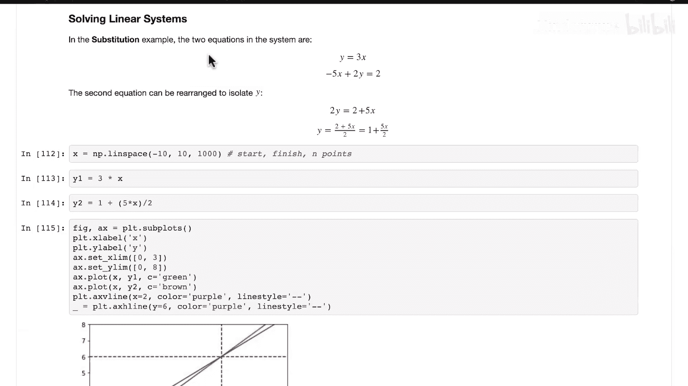

在进入第三部分关于矩阵性质的学习之前，本节将通过动手实践，为线性方程组提供清晰的几何可视化。这些Python代码演示将展示每个系统中的直线，以及我们求解线性方程组未知数时得到的解点。

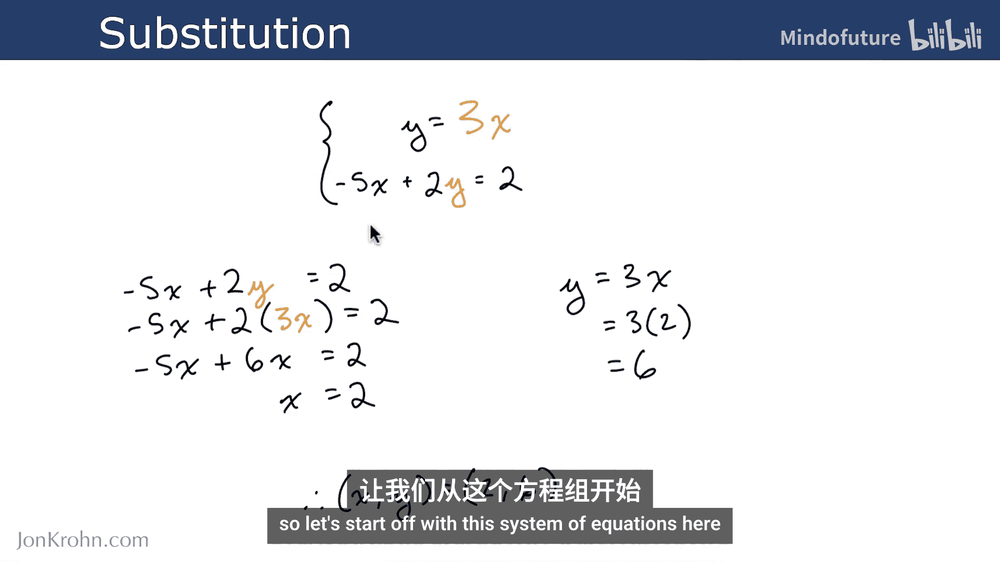

## 准备工作

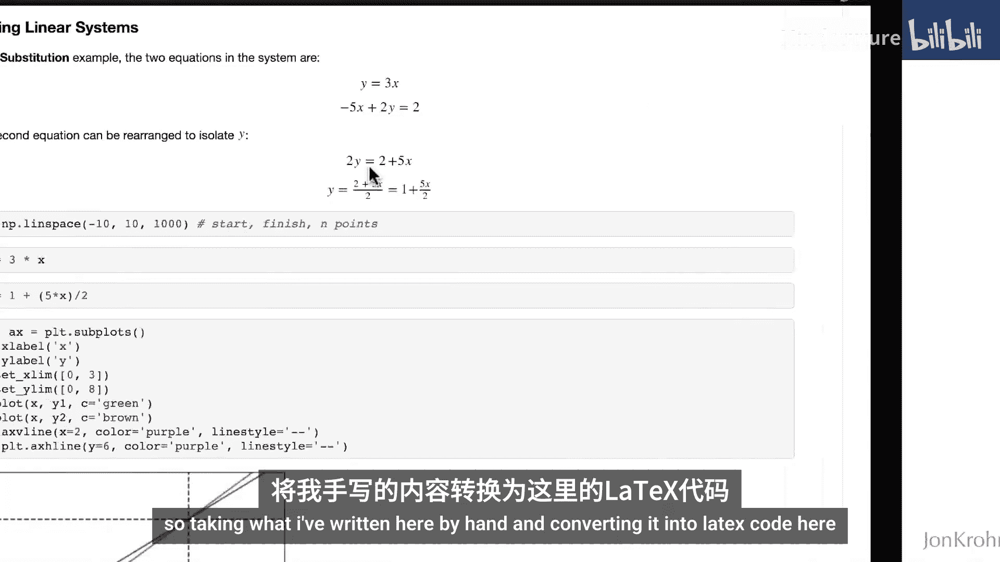

让我们回到Github.com/joChonesm Foundations上的第一个笔记本，即“线性代数入门”笔记本。

我们将编写一些代码，来绘制出之前用纸笔求解的线性方程组中的方程，以及我们求解出的点。

## 示例一：代入法方程组

我们从以下方程组开始：

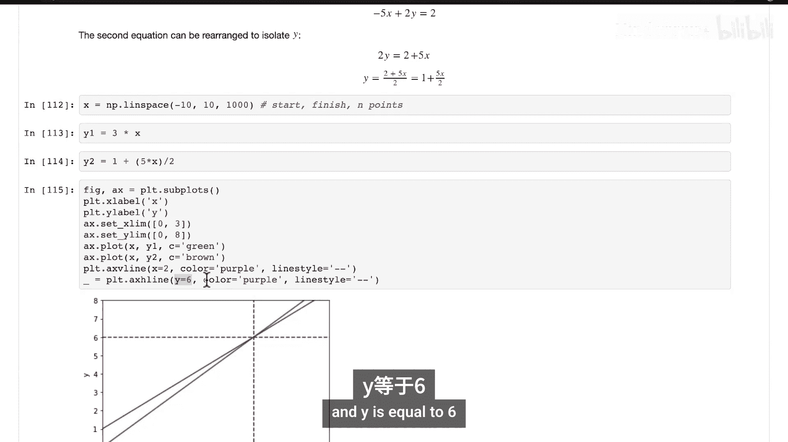

```
y = 3x
2y - 5x = 2
```

为了绘制图形，我们需要将两个方程都转换为 `y` 关于 `x` 的函数形式。

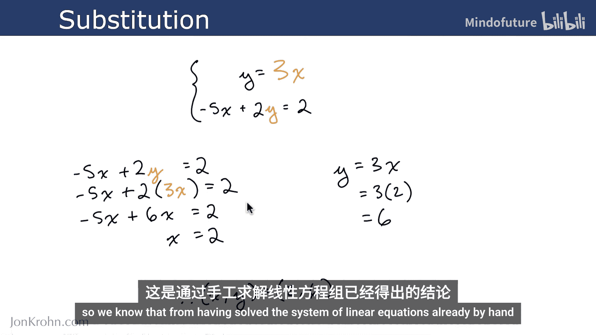

第一个方程 `y = 3x` 已经是 `y` 关于 `x` 的函数。

对于第二个方程 `2y - 5x = 2`，我们需要重新排列以解出 `y`：
1.  将 `-5x` 移到等式右边：`2y = 2 + 5x`
2.  等式两边同时除以2：`y = (2 + 5x) / 2`
3.  简化表达式：`y = 1 + (5x)/2`

现在，我们有了两个可以绘制的方程：
*   **方程一（绿色）**：`y1 = 3 * x`
*   **方程二（棕色）**：`y2 = 1 + (5 * x) / 2`

### 生成数据与绘图

以下是生成数据并绘制图形的步骤：

1.  **生成X值**：在已知解点 `(x=2, y=6)` 附近，我们创建一个从-10到10的均匀分布的X值数组。例如，使用 `np.linspace(-10, 10, 1000)` 生成1000个点。
2.  **计算Y值**：将X值数组分别代入两个方程，计算出对应的 `y1` 和 `y2` 数组。
3.  **绘制图形**：
    *   使用Matplotlib创建图形。
    *   分别用绿色和棕色线条绘制 `y1` 和 `y2` 关于 `x` 的图形。
    *   添加坐标轴标签（X, Y）。
    *   设置合适的X轴和Y轴显示范围，以确保交点 `(2, 6)` 清晰可见。
    *   在交点 `(2, 6)` 处添加标记（例如，使用紫色虚线或点）。

生成的图形将显示两条直线，它们的交点正是我们之前通过代数方法求得的解 `(2, 6)`。棕色线的斜率略低于绿线，虽然其Y轴截距为正1，但绿线最终在 `x=2` 处追上了它。

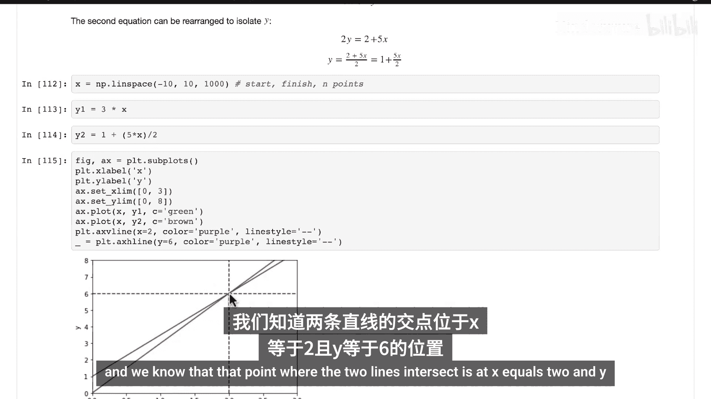

这个可视化帮助我们理解求解线性方程组未知数的几何意义：在二维平面（X和Y）中，解就是代表两个方程的直线的**交点**。

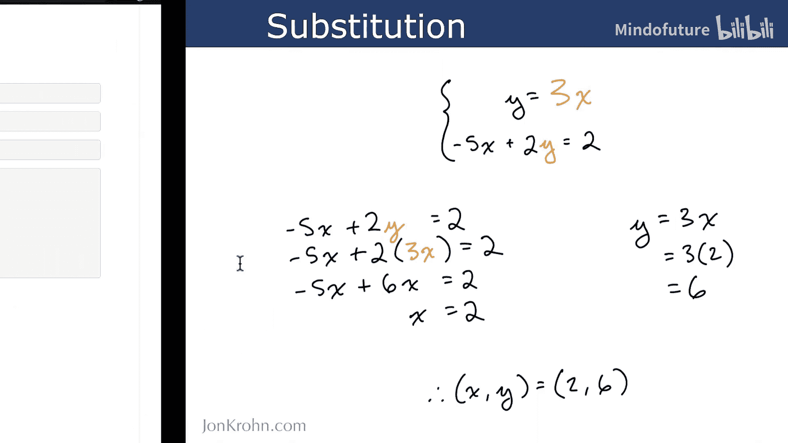

## 示例二：消元法方程组

现在，让我们可视化另一个使用消元法求解的方程组：

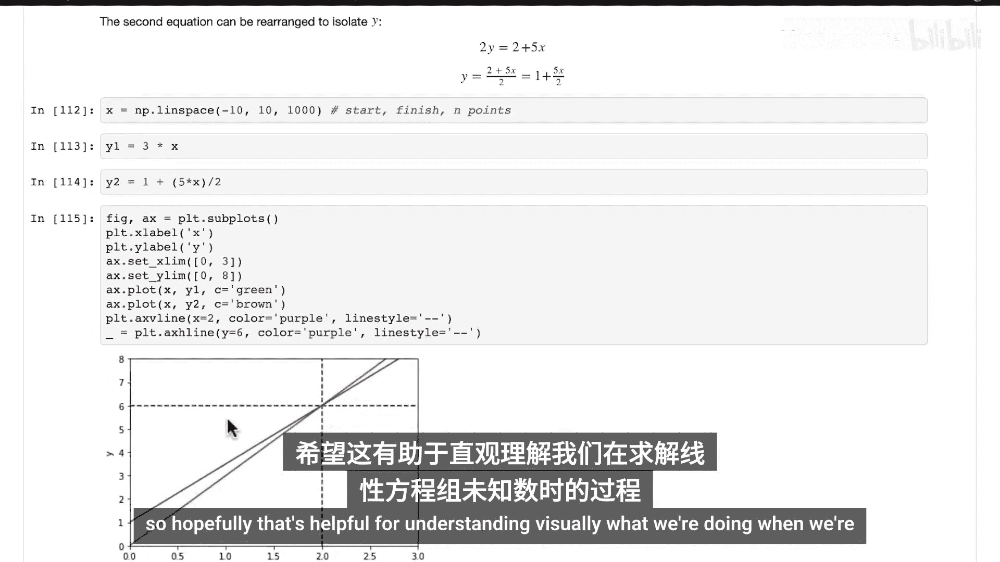

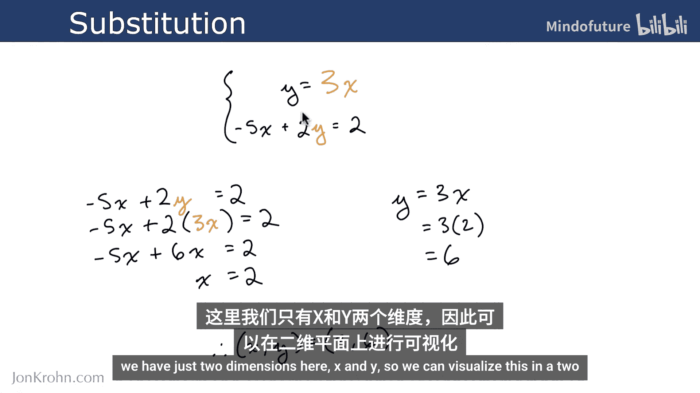

```
2x - 3y = 15
4x + 10y = 14
```

同样，我们需要将两个方程转换为 `y` 关于 `x` 的函数。

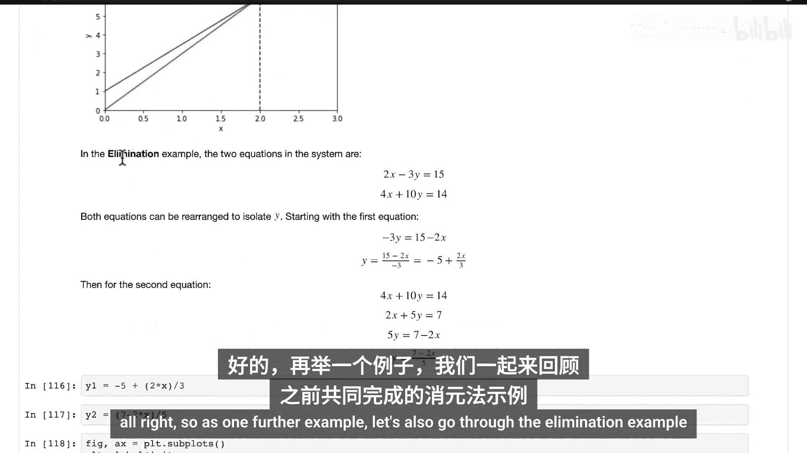

**转换第一个方程 `2x - 3y = 15`：**
1.  将 `2x` 移到右边：`-3y = 15 - 2x`
2.  两边除以 `-3`：`y = (15 - 2x) / -3`
3.  简化：`y = -5 + (2x)/3`

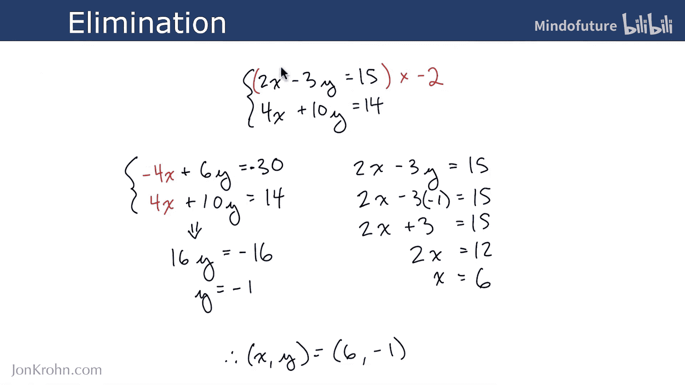

**转换第二个方程 `4x + 10y = 14`：**
1.  为简化，先除以2：`2x + 5y = 7`
2.  将 `2x` 移到右边：`5y = 7 - 2x`
3.  两边除以 `5`：`y = (7 - 2x) / 5`

现在，我们有了两个可以绘制的方程：
*   **方程一**：`y1 = -5 + (2 * x) / 3`
*   **方程二**：`y2 = (7 - 2 * x) / 5`

### 绘图与展示

绘图步骤与第一个示例类似。为了获得更清晰的视图（特别是解点在Y轴负半轴），代码中额外添加了浅灰色的X轴（`x=0`）和Y轴（`y=0`）作为参考线。

设置合适的绘图范围后，图形将显示两条直线。我们之前通过计算得到的解是 `(x=6, y=-1)`。在图中标记这个点，可以确认它正是两条直线的**交点**。

## 核心概念与扩展

通过这两个例子，我们直观地看到，**求解线性方程组就是在寻找所有方程所代表的直线（或平面、超平面）的公共交点**。

*   在二维空间中，解是两条直线的交点。
*   在三维空间中，解是三个平面的交点（虽然更难可视化，但原理相同）。
*   在更高维度的空间中，虽然无法直接可视化，但求解的概念是一致的：寻找满足所有方程的唯一公共点（如果存在且唯一）。

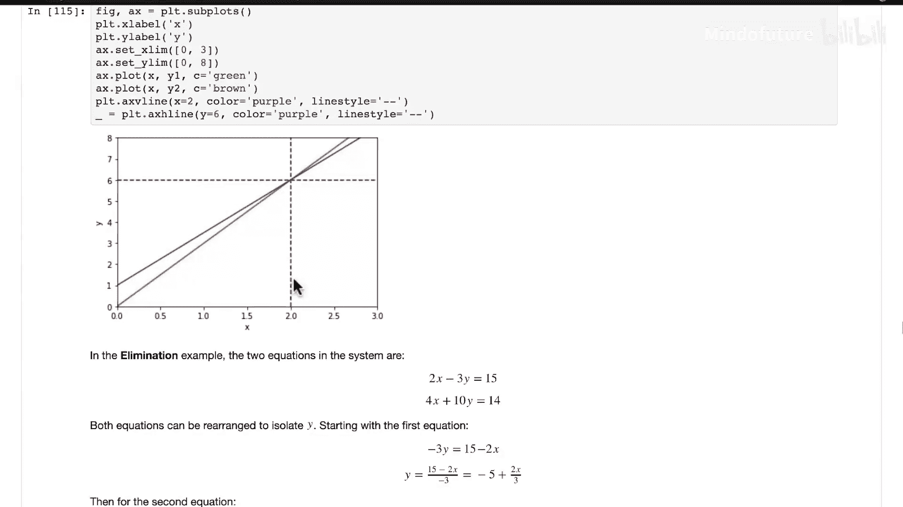

**用公式总结**：对于一个包含 `n` 个未知数 `(x₁, x₂, ..., xₙ)` 的 `n` 个线性方程组，其解（如果存在且唯一）可以表示为 `n` 维空间中的一个点 `P(a₁, a₂, ..., aₙ)`，该点同时位于所有方程所代表的 `(n-1)` 维超平面上。

## 总结

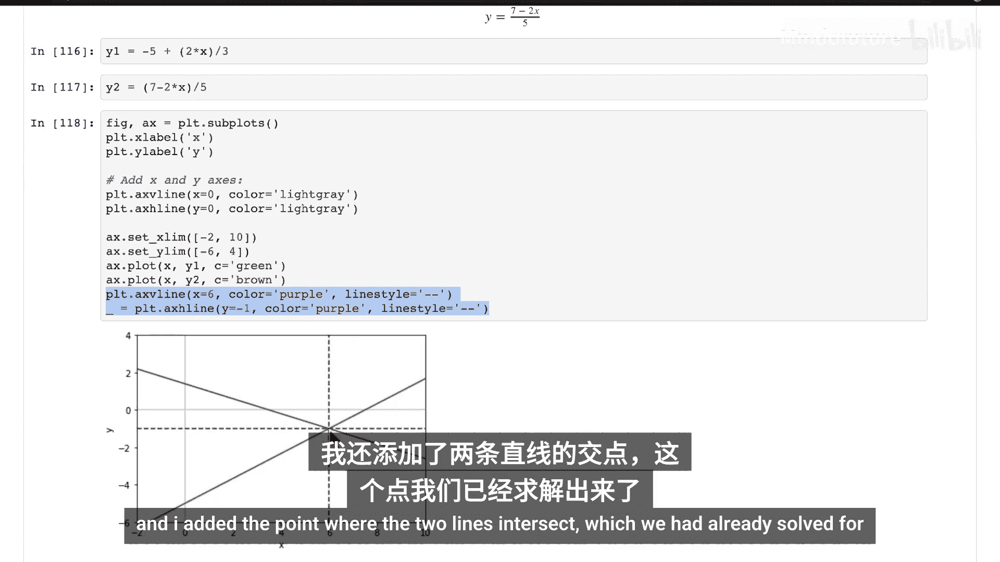

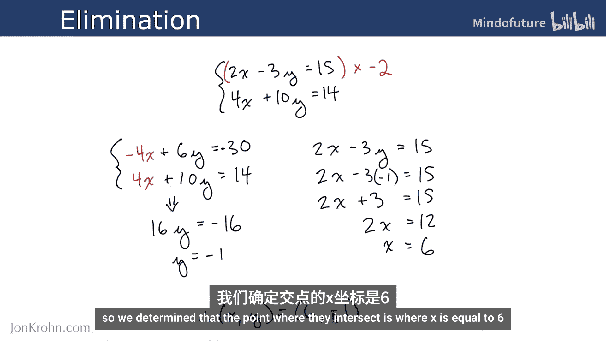

本节课中，我们一起学习了如何利用Python的Matplotlib库将线性方程组可视化。我们实践了两个例子：
1.  将代入法求解的方程组绘制成图，观察其交点。
2.  将消元法求解的方程组绘制成图，并验证解点。

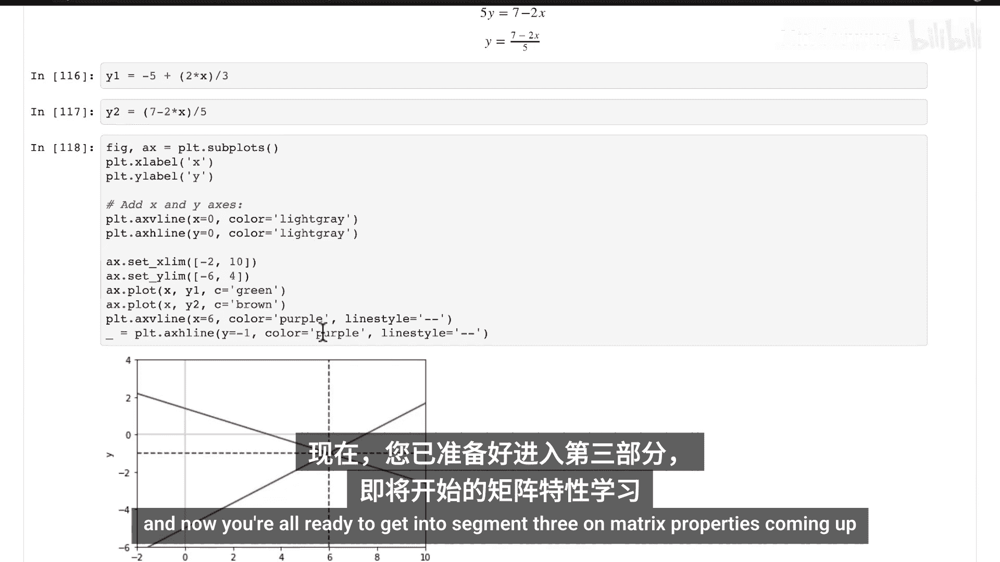

这种几何视角强化了我们对线性代数求解过程的理解：代数运算（如代入、消元）的最终目标，就是找到那些代表方程的直线或平面在空间中的**交汇点**。现在，你已经准备好带着这种直观理解，进入下一部分关于矩阵性质的深入学习。