# 022：线性代数导论的最后部分 📚

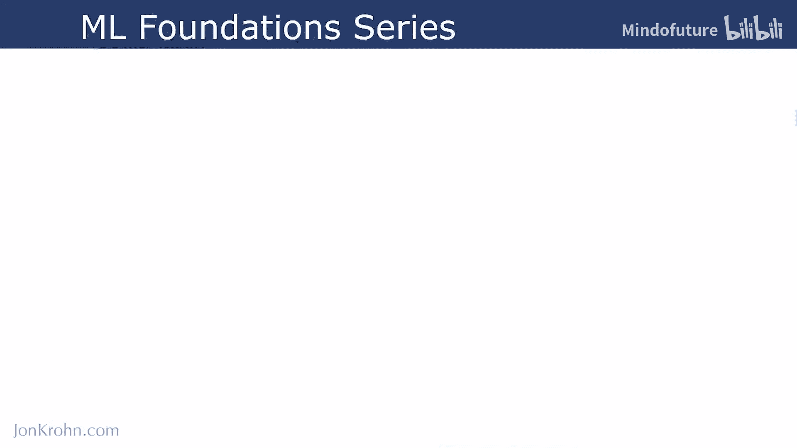

在本节课中，我们将要学习《机器学习基础》系列课程中第一个主题“线性代数导论”的最后一个部分。这部分内容将聚焦于矩阵这一在机器学习中至关重要的数据结构，并介绍其核心性质，为后续学习更高级的矩阵运算打下坚实基础。

---

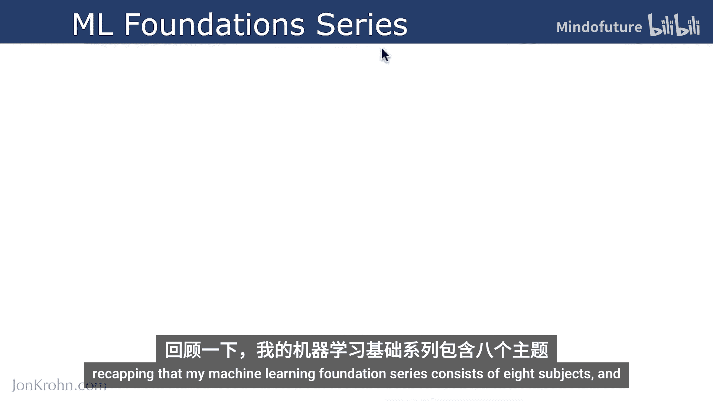

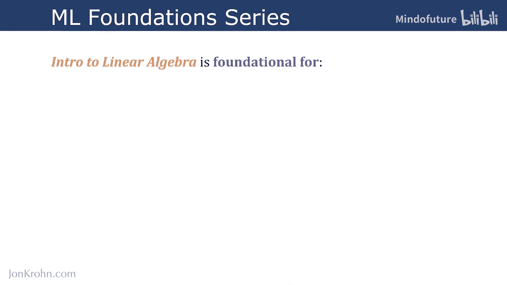

## 课程结构回顾 📋

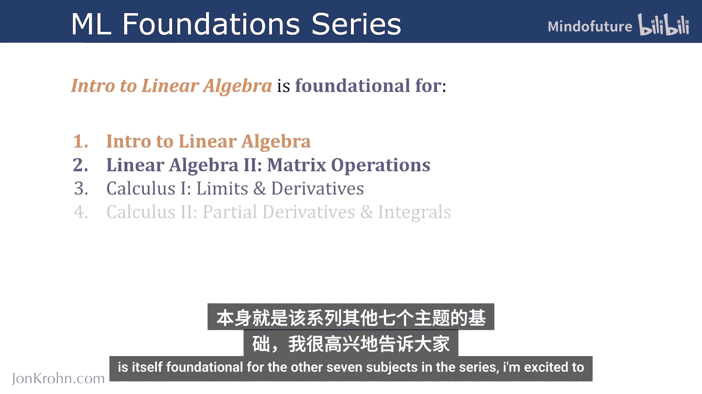

我的《机器学习基础》系列课程共包含八个主题。

我们当前正在学习的第一个主题“线性代数导论”，是整个系列中其他七个主题的基础。

---

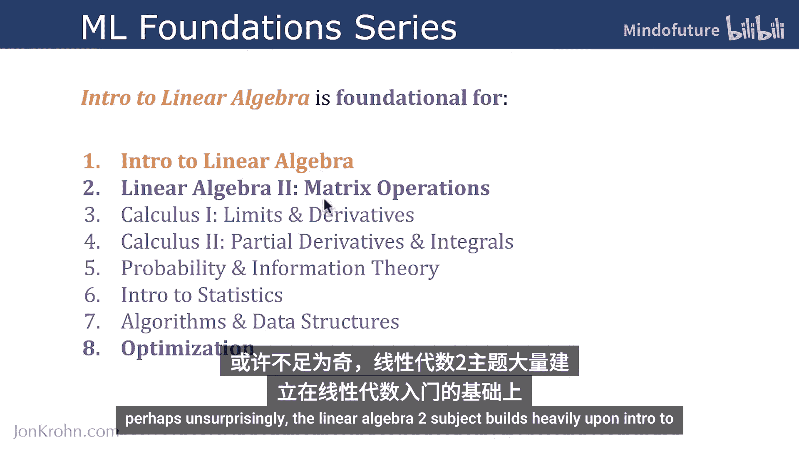

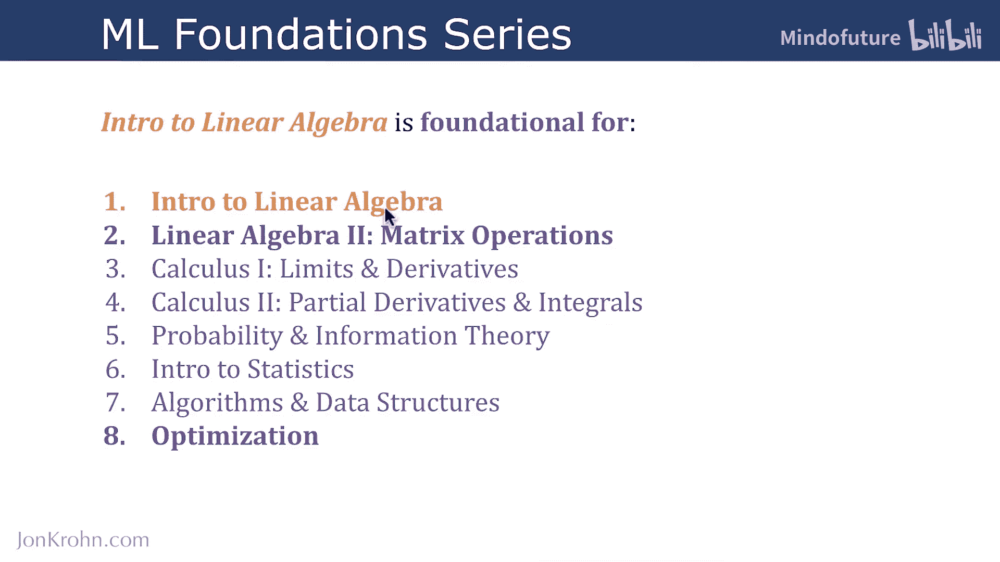

## 即将进入下一主题 🚀

我们即将准备好进入第二个主题“矩阵运算”。

第二个主题“线性代数2”在很大程度上建立在“线性代数导论”的基础之上，因此我将其用**粗体**高亮显示。

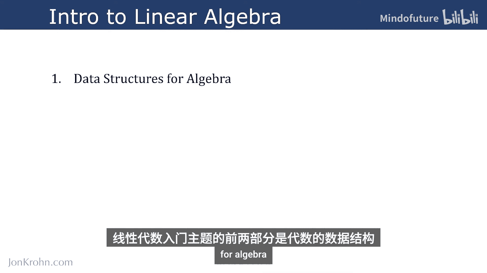

---

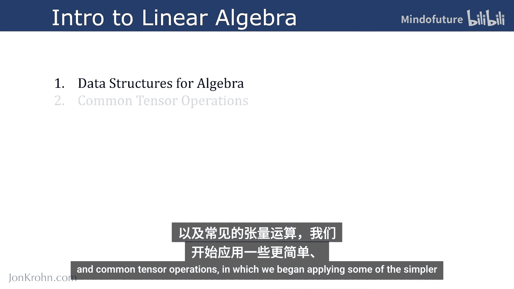

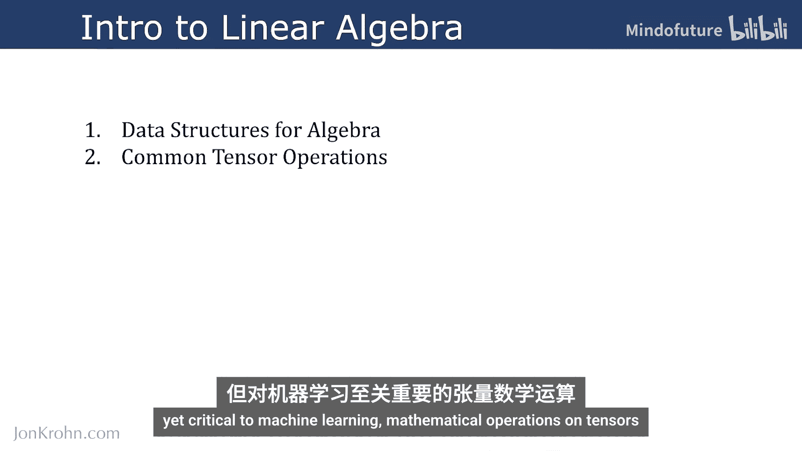

## 本主题内容回顾 🔄

“线性代数导论”主题的前两个部分是：
1.  **代数的数据结构**：我们详细介绍了在机器学习中无处不在的张量的特性。
2.  **常见张量运算**：我们开始对张量应用一些更简单但对机器学习至关重要的数学运算。

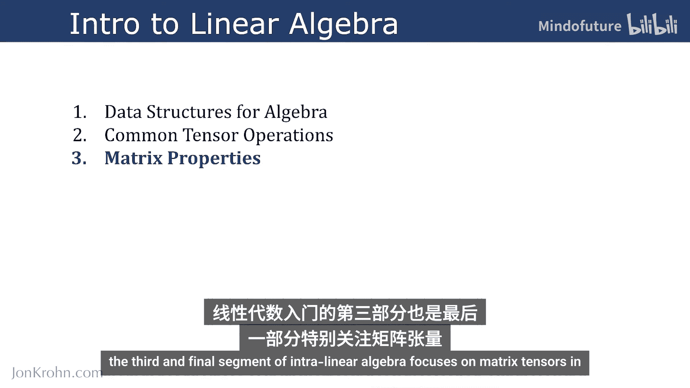

---

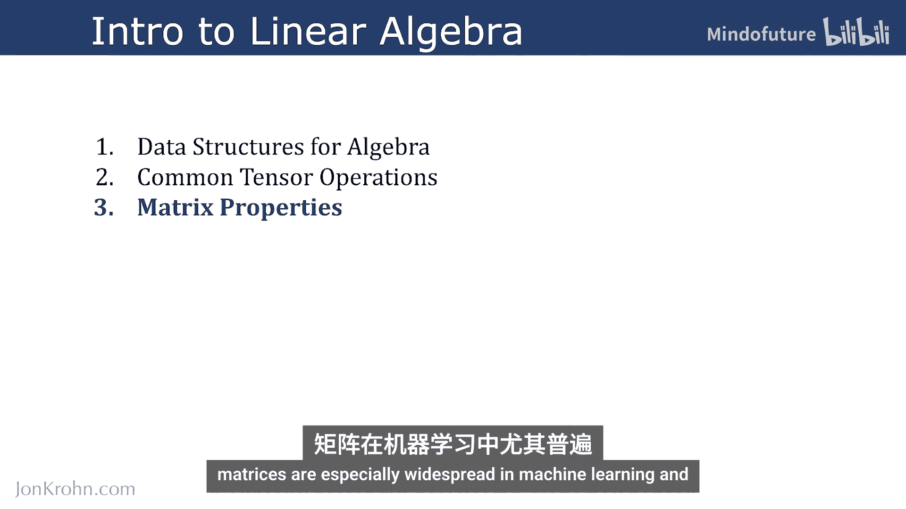

## 第三部分：聚焦矩阵 🧮

“线性代数导论”的第三个也是最后一个部分，将特别关注矩阵张量。

矩阵在机器学习中尤其普遍，其某些性质值得特别关注。

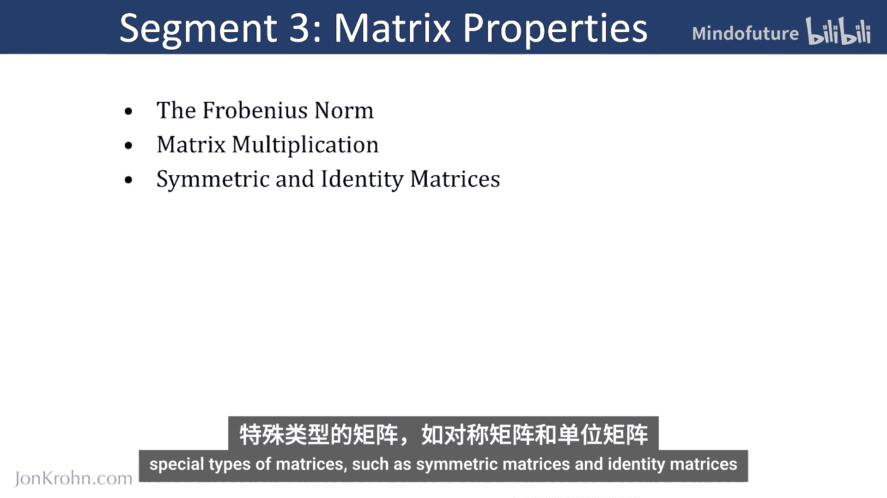

具体来说，在第三部分中，我们将涵盖以下内容：

以下是本部分将要学习的核心矩阵性质列表：

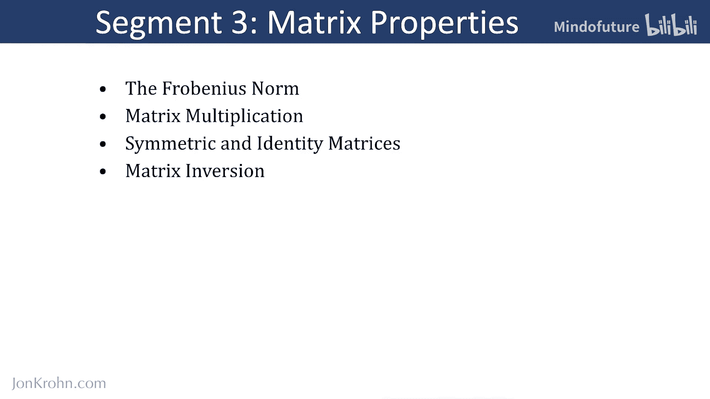

*   **弗罗贝尼乌斯范数**：用于量化矩阵大小的指标。
*   **矩阵乘法的方方面面**：包括**矩阵与向量**的乘法，以及**矩阵与矩阵**的乘法。
*   **特殊类型的矩阵**：例如对称矩阵和单位矩阵。
*   **功能强大的矩阵求逆**：我们将在《机器学习基础》系列中反复看到它，并且很可能在某些场合让你感到震撼。
*   **更多特殊矩阵**：我们将以另外两类特殊矩阵——对角矩阵和正交矩阵——来结束本部分。

---

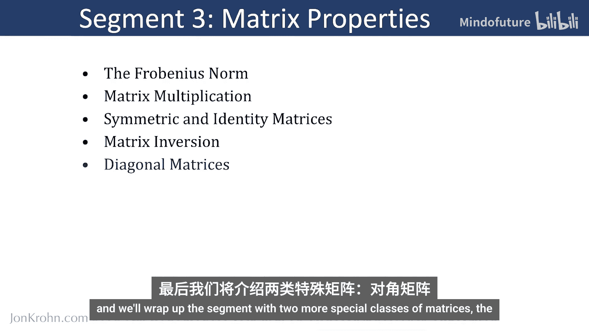

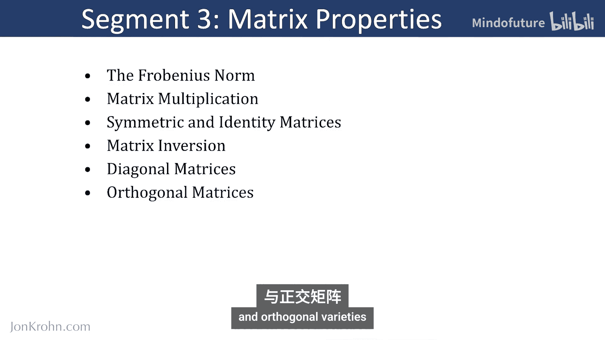

## 本部分的重要性与总结 🎯

这些主题不仅将结束第三部分，也将结束整个第一个主题。

它们为我们提供了所需的基础，以应对第二个主题“线性代数2”。该主题包含了相对高级的矩阵运算，这些运算正是建立在本文所涵盖的矩阵性质之上的。

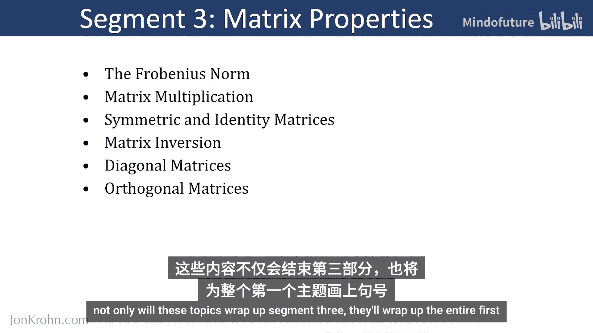

---

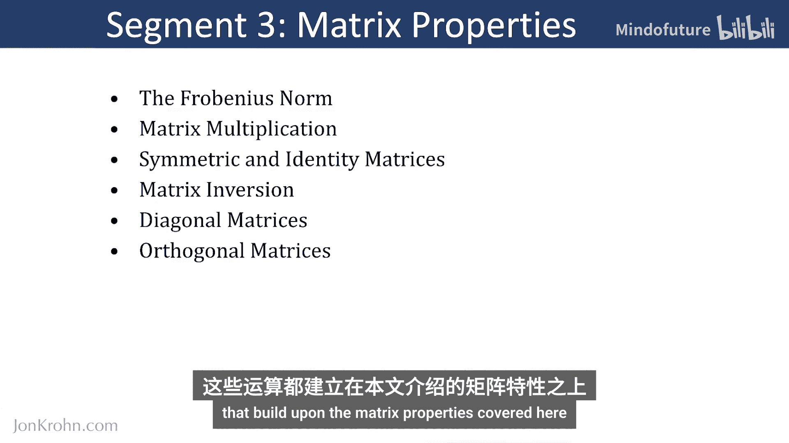

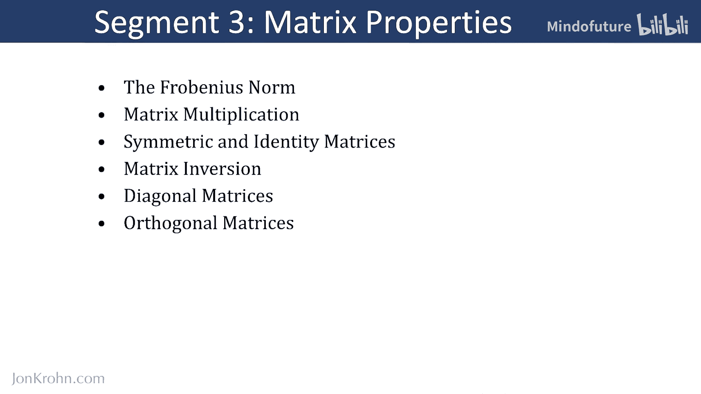

本节课中，我们一起学习了“线性代数导论”主题第三部分的概览。我们明确了矩阵在机器学习中的核心地位，并预览了即将深入学习的弗罗贝尼乌斯范数、矩阵乘法、特殊矩阵（对称矩阵、单位矩阵、对角矩阵、正交矩阵）以及矩阵求逆等关键概念。掌握这些性质是理解后续高级矩阵运算的基石。