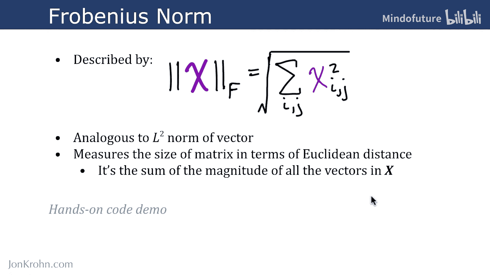
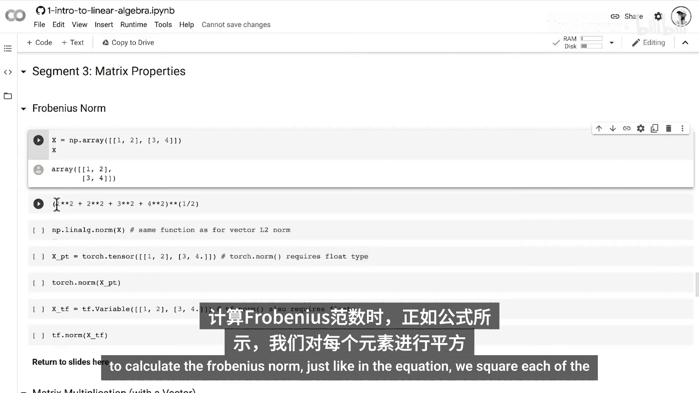
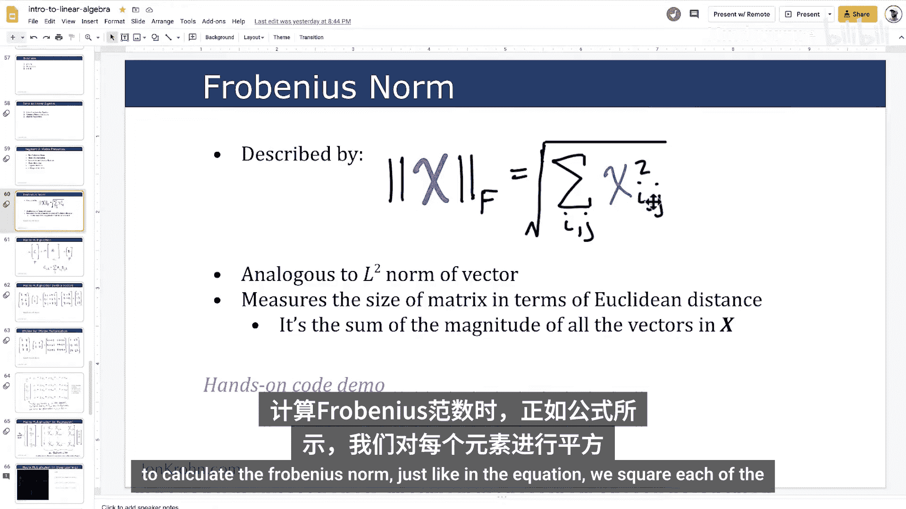
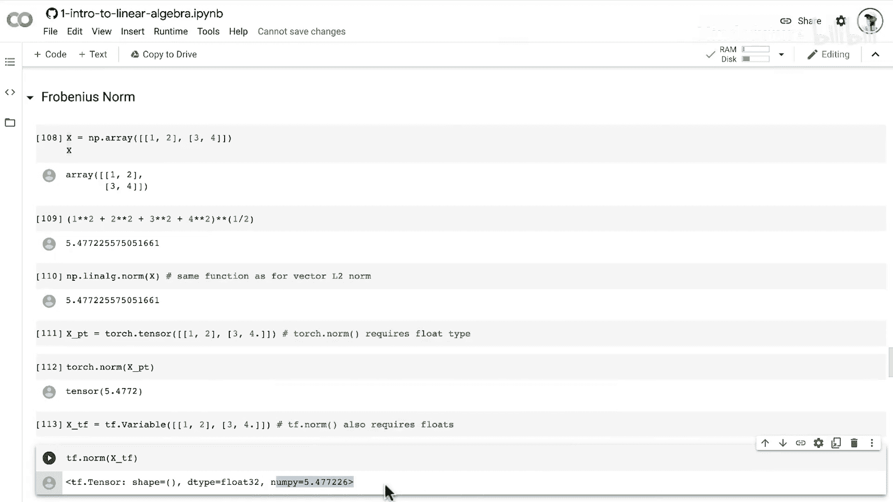

# 023：弗罗贝尼乌斯范数 📏

在本节课中，我们将学习弗罗贝尼乌斯范数。这是一种用于量化矩阵大小的函数。我们将通过NumPy的动手代码演示来巩固对这个主题的理解。

## 弗罗贝尼乌斯范数定义

弗罗贝尼乌斯范数由以下公式描述：

**公式：** `||X||_F = sqrt( sum_i sum_j (X_{ij})^2 )`

这个公式初看可能有点复杂，但它实际上非常简单。当我们进入接下来的动手代码演示时，你会更清楚地看到这一点。

我们使用与之前视频中讨论向量范数时相同的范数符号来标注弗罗贝尼乌斯范数。如果你还没有看过本课程早期关于“范数与单位向量”的主题，可以去回顾一下。

在那里我们处理的是小写粗体的向量，而这里我们处理的是大写粗体的矩阵。因此，它是一个矩阵 **X**，我们用同样的双绝对值样式的竖线包围这个张量（在这里是矩阵），并通过下标大写字母 **F** 来指定它是弗罗贝尼乌斯范数。

## 如何计算

要实际计算弗罗贝尼乌斯范数，我们需要考虑矩阵 **X** 中的每一个元素。这里的 `X_{ij}` 不是粗体，因为它代表粗体矩阵张量 **X** 中的一个单独元素。

我们考虑矩阵 **X** 中每一个 `i` 行 `j` 列的元素。我们简单地将所有这些元素（每个 `i` 和 `j`）的平方求和，然后对这个求和结果取平方根。具体步骤如下：

以下是计算步骤：
1.  对矩阵中的每个元素进行平方。
2.  将所有平方后的值相加。
3.  对总和取平方根。

## 与L2范数的关系

弗罗贝尼乌斯范数类似于向量的L2范数。与L2范数一样，弗罗贝尼乌斯范数通过欧几里得距离来衡量矩阵的大小。这种距离就像我们用来测量房间尺寸或投球距离的普通距离。

另一种理解弗罗贝尼乌斯范数的方式是，将其视为矩阵 **X** 中所有向量的大小之和。例如，你可以将矩阵的所有列视为单独的向量，那么这个范数就是所有这些向量大小的总和。

## 动手代码演示

现在，让我们通过一个动手代码演示来将这一切具体化。



我们将使用NumPy创建一个包含简单数值的新矩阵。

```python
import numpy as np



# 创建一个2x2矩阵
X = np.array([[1, 2],
              [3, 4]])
print("矩阵 X:")
print(X)
```



为了计算弗罗贝尼乌斯范数，我们按照公式操作：对每个元素平方，求和，然后取平方根。

```python
# 手动计算弗罗贝尼乌斯范数
squared_sum = 1**2 + 2**2 + 3**2 + 4**2  # 计算每个元素的平方和
frobenius_norm_manual = np.sqrt(squared_sum)
print(f"手动计算的弗罗贝尼乌斯范数: {frobenius_norm_manual}")
```

当然，我们不需要像这样手动进行所有数学计算来得到弗罗贝尼乌斯范数。实际上，我们可以使用之前用于向量L2范数的相同函数，即NumPy线性代数库中的 `norm` 方法。

```python
# 使用NumPy的norm函数计算
frobenius_norm_numpy = np.linalg.norm(X)
print(f"NumPy计算的弗罗贝尼乌斯范数: {frobenius_norm_numpy}")
```

## 在PyTorch和TensorFlow中的实现

同样地，我们也可以在PyTorch和TensorFlow中计算弗罗贝尼乌斯范数。需要注意的是，如果你使用PyTorch或TensorFlow的 `norm` 方法，你的矩阵（更广义地说是张量）类型需要是浮点型。而NumPy可以处理整数类型的张量。

以下是具体实现：

```python
# 在PyTorch中计算
import torch
X_torch = torch.tensor([[1., 2.],  # 注意添加小数点以指定为浮点型
                        [3., 4.]])
frobenius_norm_torch = torch.norm(X_torch)
print(f"PyTorch计算的弗罗贝尼乌斯范数: {frobenius_norm_torch}")

# 在TensorFlow中计算
import tensorflow as tf
X_tf = tf.constant([[1., 2.],
                    [3., 4.]])
frobenius_norm_tf = tf.norm(X_tf)
print(f"TensorFlow计算的弗罗贝尼乌斯范数: {frobenius_norm_tf}")
```

## 总结



在本节课中，我们一起学习了弗罗贝尼乌斯范数。我们首先了解了它的定义公式 `||X||_F = sqrt( sum_i sum_j (X_{ij})^2 )`，它用于衡量矩阵的大小。我们探讨了其计算步骤，并理解了它与向量L2范数的相似性，即都基于欧几里得距离。最后，我们通过NumPy、PyTorch和TensorFlow的代码演示，实践了如何计算一个矩阵的弗罗贝尼乌斯范数。掌握这个范数对于理解后续机器学习中更复杂的矩阵运算至关重要。