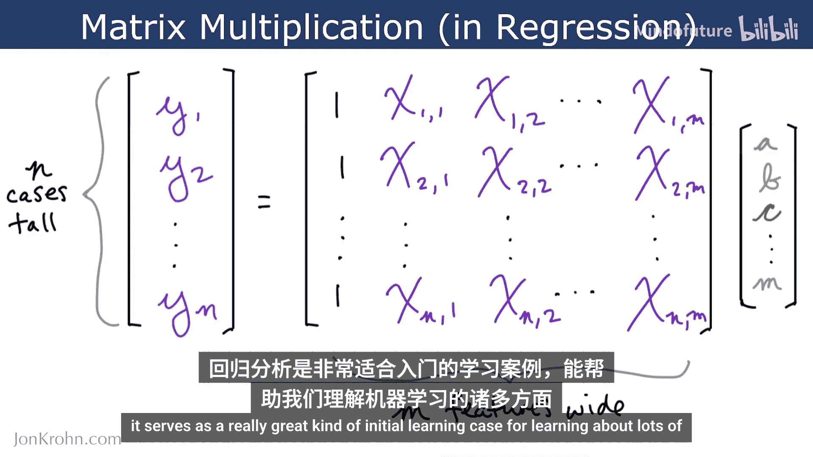
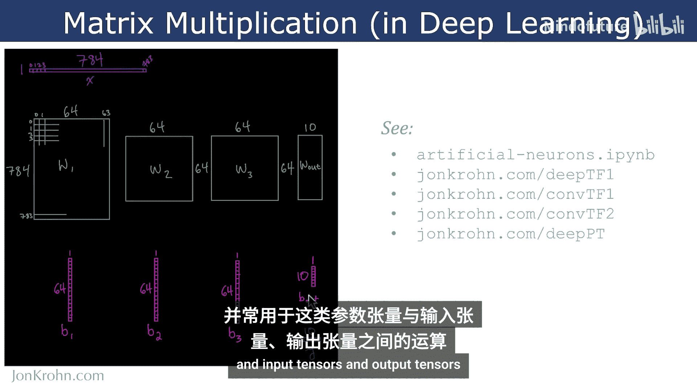
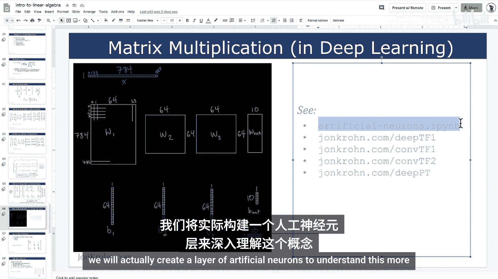
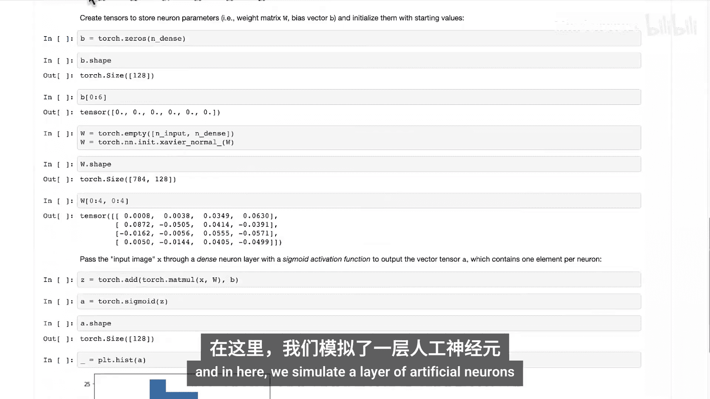
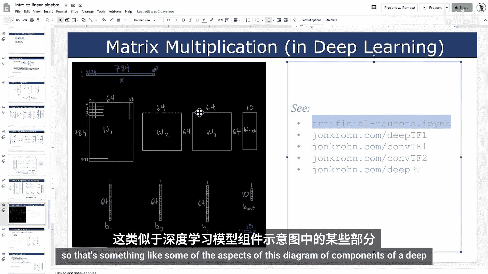
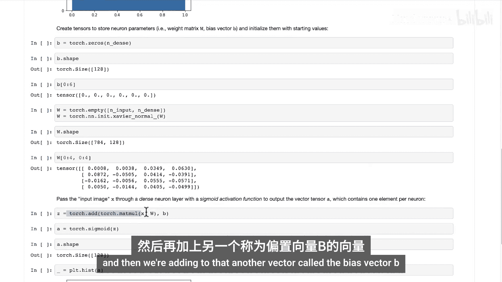
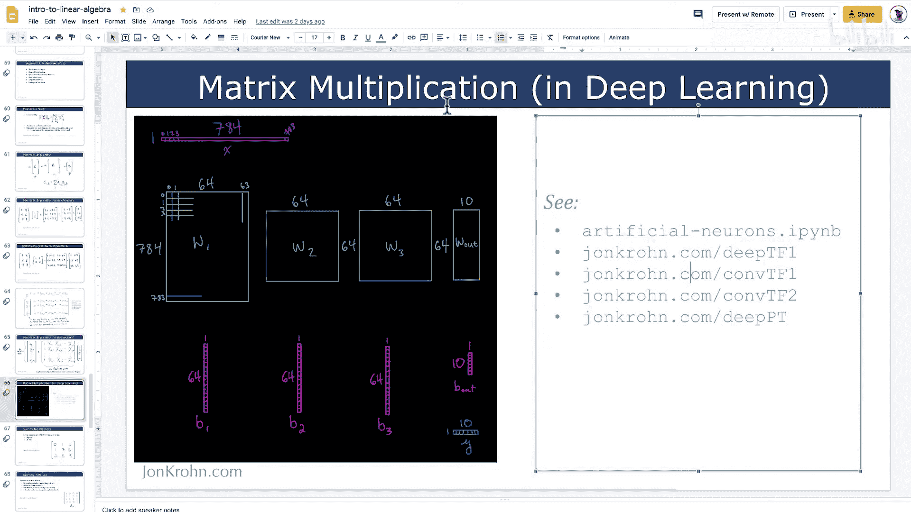

# 024：矩阵乘法 🧮

在本节课中，我们将要学习矩阵乘法。矩阵乘法可以说是机器学习中**最重要、应用最广泛**的数学运算。它不像哈达玛积（逐元素相乘）那样直观，因此我们将通过彩色图表、手算、交互式代码演示和一个机器学习应用实例，帮助你牢固掌握矩阵乘法的概念。

## 矩阵乘法的规则

上一节我们介绍了矩阵的基本操作，本节中我们来看看矩阵乘法的核心规则。

如果要对两个矩阵进行乘法运算，最关键的一点是：**第一个矩阵（设为矩阵A）的列数必须等于第二个矩阵（设为矩阵B）的行数**。

假设矩阵A有 `n` 列，矩阵B有 `n` 行。那么，矩阵A的行数可以是任意值（这里设为 `m`），矩阵B的列数也可以是任意值（这里设为 `p`）。

当我们将这两个矩阵相乘时，会得到一个结果矩阵（设为矩阵C）。矩阵C的行数与第一个矩阵相同（即 `m` 行），列数与第二个矩阵相同（即 `p` 列）。

## 结果矩阵元素的计算公式

为了确定矩阵乘法结果矩阵C中每个元素的值，我们使用以下公式。这个公式初看可能有些复杂，但接下来我们会通过一个手算例子来清晰地解释它。

对于矩阵C中的任意元素，例如位于第 `i` 行（绿色）和第 `k` 列（蓝色）的元素，其值由以下求和公式得出：

**C[i, k] = Σ_j (A[i, j] * B[j, k])**

其中，求和变量 `j`（黄色）遍历矩阵A的列（也等同于遍历矩阵B的行）。具体来说，就是将矩阵A第 `i` 行、第 `j` 列的元素与矩阵B第 `j` 行、第 `k` 列的元素相乘，然后对所有 `j` 的乘积结果求和。

## 矩阵与向量相乘示例

理解矩阵乘法最容易的方式是，先看其中一个矩阵是向量的情况。向量可以看作只有一列或一行的矩阵。这里我们使用一个列向量。

首先，检查这两个矩阵是否满足矩阵乘法的条件：第一个矩阵的列数（2列）必须等于第二个矩阵的行数（2行）。条件满足，可以相乘。

以下是计算过程：
1.  取矩阵A第一行的元素 `[3, 4]` 与向量B的元素 `[1, 2]` 对应相乘并求和：`3*1 + 4*2 = 11`。
2.  对矩阵A的第二行 `[5, 6]` 进行相同操作：`5*1 + 6*2 = 17`。
3.  对矩阵A的第三行 `[7, 8]` 进行相同操作：`7*1 + 8*2 = 23`。

最终结果是一个包含三个元素 `[11, 17, 23]` 的列向量。

## 代码实现：NumPy

在代码中，我们通常不会手算。让我们用NumPy库来实现上面的例子。

```python
import numpy as np

# 定义矩阵A和向量B
A = np.array([[3, 4],
              [5, 6],
              [7, 8]])
B = np.array([[1],
              [2]])

# 使用NumPy的dot方法进行矩阵乘法
C = np.dot(A, B)
print(C)
# 输出: [[11]
#        [17]
#        [23]]
```

代码输出结果与我们手算的结果一致。

值得注意的是，在NumPy中我们使用 `.dot()` 方法来执行矩阵乘法。从技术上讲，点积（dot product）是向量间的一种类似运算，而矩阵乘法是一个更通用的操作。

## 代码实现：PyTorch 与 TensorFlow

接下来，我们在PyTorch和TensorFlow中执行相同的矩阵乘法操作。

**PyTorch实现：**
```python
import torch

# 创建PyTorch张量
A_torch = torch.tensor([[3, 4],
                        [5, 6],
                        [7, 8]])
B_torch = torch.tensor([[1],
                        [2]])

# 使用PyTorch的matmul方法进行矩阵乘法
C_torch = torch.matmul(A_torch, B_torch)
print(C_torch)
```

在PyTorch中，我们使用 `torch.matmul()` 方法，这个命名对于矩阵乘法来说非常直观。

**TensorFlow实现：**
```python
import tensorflow as tf

# 创建TensorFlow张量
A_tf = tf.constant([[3, 4],
                    [5, 6],
                    [7, 8]])
B_tf = tf.constant([[1],
                    [2]])

# 在TensorFlow中，对于矩阵与向量乘法，我们使用matvec
C_tf = tf.linalg.matvec(A_tf, B_tf) # 注意：这里A_tf需要是2D，B_tf需要是1D
# 或者更通用的方式，使用matmul并确保维度正确
C_tf = tf.linalg.matmul(A_tf, B_tf)
print(C_tf)
```

在TensorFlow中，我们需要更明确地指定运算类型（例如 `matvec` 用于矩阵乘向量，`matmul` 用于通用矩阵乘法），而NumPy和PyTorch会自动推断。

## 矩阵与矩阵相乘示例

现在，让我们回到幻灯片，看一个矩阵与矩阵相乘的手算例子，然后再用代码实现。

我们使用与之前相同的矩阵A。对于第二个矩阵B，我们将其第一列设为与之前向量相同的 `[1, 2]`，并添加第二列 `[9, 0]`。

计算过程如下：
*   **结果矩阵第一列**：计算方式与之前的矩阵乘向量例子完全一样。即用矩阵A的每一行与矩阵B的第一列 `[1, 2]` 相乘求和，得到 `[11, 17, 23]`。
*   **结果矩阵第二列**：用矩阵A的每一行与矩阵B的第二列 `[9, 0]` 相乘求和。
    *   第一行：`3*9 + 4*0 = 27`
    *   第二行：`5*9 + 6*0 = 45`
    *   第三行：`7*9 + 8*0 = 63`

因此，最终的结果矩阵C是：
```
[[11, 27],
 [17, 45],
 [23, 63]]
```

你可以将矩阵与矩阵的乘法理解为**多个独立的矩阵与向量乘法的组合**，每个向量是第二个矩阵的一列，结果再水平拼接起来。

## 代码实现矩阵乘矩阵

以下是NumPy、PyTorch和TensorFlow中的实现。

**NumPy实现：**
```python
import numpy as np

A = np.array([[3, 4],
              [5, 6],
              [7, 8]])
B = np.array([[1, 9],
              [2, 0]]) # 现在B有两列

C = np.dot(A, B)
print(C)
# 输出: [[11 27]
#        [17 45]
#        [23 63]]
```

**一个重要特性：非交换性**
矩阵乘法通常**不满足交换律**。即 `A * B` 通常不等于 `B * A`。在上面的例子中，`B * A` 甚至无法计算，因为维度不匹配（B的列数2不等于A的行数3）。即使对于两个方阵，结果也通常不同。

**PyTorch实现：**
```python
import torch

A_torch = torch.tensor([[3, 4],
                        [5, 6],
                        [7, 8]])
B_torch = torch.tensor([[1, 9],
                        [2, 0]])

C_torch = torch.matmul(A_torch, B_torch)
print(C_torch)
```

**TensorFlow实现：**
```python
import tensorflow as tf

A_tf = tf.constant([[3, 4],
                    [5, 6],
                    [7, 8]])
B_tf = tf.constant([[1, 9],
                    [2, 0]])

C_tf = tf.linalg.matmul(A_tf, B_tf)
print(C_tf)
```

## 机器学习中的应用实例

学习了矩阵乘法的原理和计算后，我们来看看它在机器学习中的一个实际应用，以理解其重要性。



在机器学习基础系列的第一个主题中，我们介绍过线性回归的例子：用房屋特征（卧室数量 `x1`，到学校的距离 `x2` 等）预测房价 `y`。模型需要学习参数 `a, b, c, ... m`。

假设我们有 `n` 个房屋样本。对于每个样本 `i`，预测公式为：
`y_i = a + b*x1_i + c*x2_i + ... + m*xM_i`

如果为每个样本都写这样一个方程会非常冗长。我们可以用矩阵乘法来优雅地表示整个方程组：



**Y = Xβ**



其中：
*   **Y** 是一个 `n x 1` 的列向量，包含所有样本的真实房价。
*   **X** 是一个 `n x (M+1)` 的矩阵（设计矩阵）。第一列全是1（用于与截距参数 `a` 相乘），后续各列分别是特征 `x1, x2, ..., xM` 在所有样本上的值。
*   **β** 是一个 `(M+1) x 1` 的列向量，包含所有待学习参数 `[a, b, c, ..., m]`。

这样，通过一次矩阵乘法 `Xβ`，我们就同时计算出了所有 `n` 个样本的预测值。这比写 `n` 个独立的方程简洁高效得多，也是后续许多机器学习算法的基础。

## 在深度学习中的核心地位





矩阵乘法在深度学习中也扮演着核心角色。一个神经网络层的前向传播本质上就是一次矩阵乘法（加上偏置和激活函数）。



例如，在一个全连接层中：
*   **输入** `x` 是一个向量或矩阵。
*   **权重** `W` 是一个矩阵。
*   **偏置** `b` 是一个向量。
*   该层的**线性输出** `z` 可以通过以下公式计算：
    **z = xW + b**
    （注意：根据约定，有时写作 `z = Wx + b`，关键在于权重矩阵维度的定义）

无论网络结构多复杂（如卷积神经网络、循环神经网络），在底层，大量的计算都可以归结为高效的矩阵乘法运算。现代深度学习框架（如PyTorch、TensorFlow）都高度优化了矩阵乘法，以利用GPU的并行计算能力。

## 总结

本节课中我们一起学习了矩阵乘法。我们首先明确了矩阵乘法的核心规则：第一个矩阵的列数必须等于第二个矩阵的行数。然后，我们深入探讨了结果矩阵中每个元素的计算公式 **C[i, k] = Σ_j (A[i, j] * B[j, k])**。



我们通过手算和代码演示（使用NumPy、PyTorch和TensorFlow）练习了矩阵与向量、矩阵与矩阵的乘法，并指出了矩阵乘法的**非交换性**这一重要特性。

最后，我们将矩阵乘法置于机器学习和深度学习的实际背景中，看到它在**线性回归模型**的向量化表示以及**神经网络前向传播**中的关键作用。掌握矩阵乘法是理解现代机器学习算法底层机制的重要一步。


接下来，我们将学习一些特殊类型的矩阵，包括在矩阵乘法中表现出独特性质的**单位矩阵**。