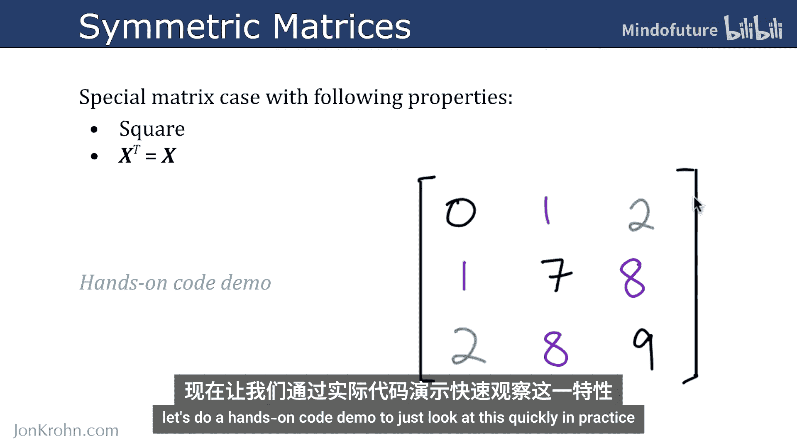
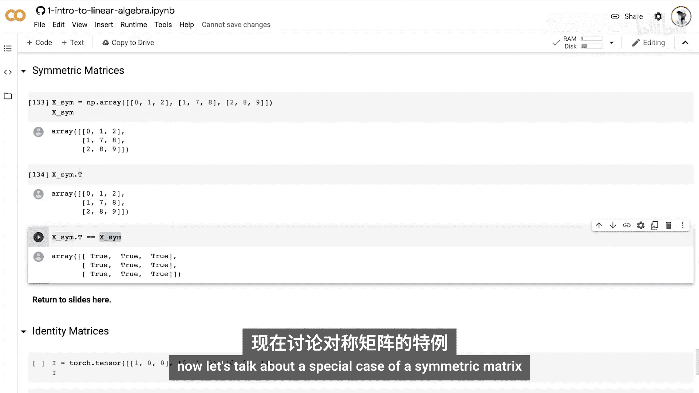
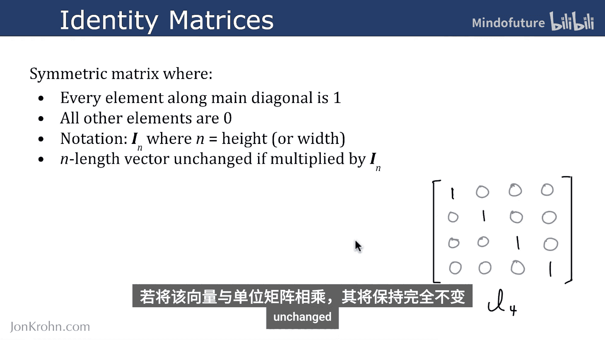
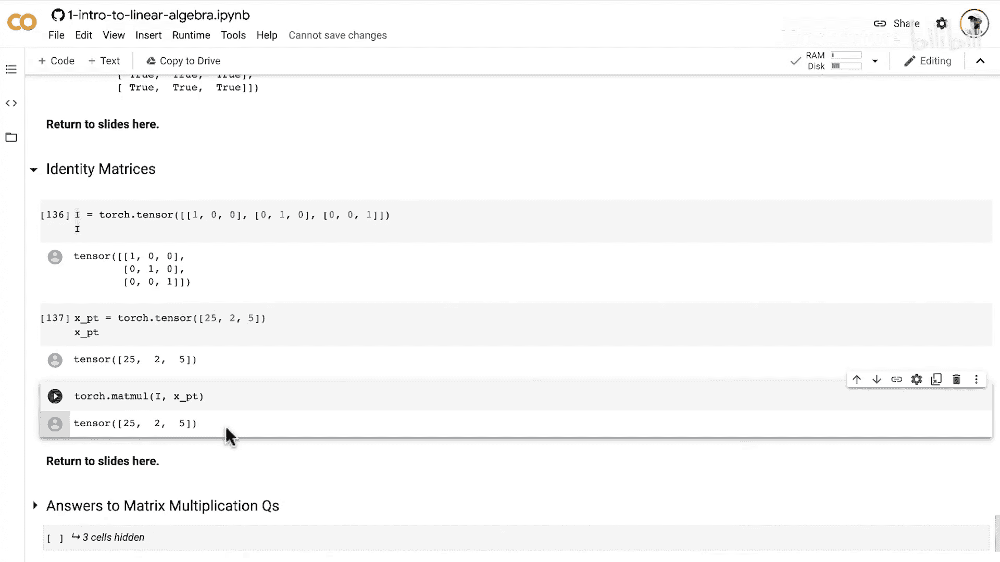

# 025：对称矩阵与单位矩阵

在本节课中，我们将学习两种特殊的矩阵：对称矩阵和单位矩阵。我们将了解它们的定义、特性，并通过Python代码演示它们的性质。

## 对称矩阵

上一节我们介绍了矩阵的基本运算，本节中我们来看看一种特殊的矩阵——对称矩阵。

对称矩阵是一种特殊的方阵，它满足以下两个关键性质：
1.  它必须是方阵，即行数与列数相等。
2.  矩阵的转置等于矩阵本身。这意味着，除了主对角线上的元素可以是任意值，主对角线两侧的元素必须呈镜像对称。

例如，一个3x3的对称矩阵如下所示：

```
A = [[a, b, c],
     [b, d, e],
     [c, e, f]]
```



其中，`A.T == A`。

以下是使用NumPy创建和验证对称矩阵的代码示例：

```python
import numpy as np

# 创建一个对称矩阵
symmetric_matrix = np.array([[1, 7, 3],
                              [7, 4, -5],
                              [3, -5, 6]])

print("对称矩阵 A:")
print(symmetric_matrix)



# 计算其转置
transpose_of_A = symmetric_matrix.T
print("\nA 的转置 A^T:")
print(transpose_of_A)

# 验证 A 是否等于 A^T
print("\nA 是否等于 A^T?", np.array_equal(symmetric_matrix, transpose_of_A))
```

运行上述代码，你会发现矩阵与其转置完全相同。

## 单位矩阵

理解了对称矩阵后，我们来看一个最重要的对称矩阵特例——单位矩阵。

单位矩阵是一种特殊的对称矩阵，其主对角线上的所有元素均为1，其余所有元素均为0。一个n阶单位矩阵记作 **I_n**。



例如，一个4阶单位矩阵 **I_4** 如下：

```
I_4 = [[1, 0, 0, 0],
       [0, 1, 0, 0],
       [0, 0, 1, 0],
       [0, 0, 0, 1]]
```

单位矩阵有一个核心特性：任何向量或矩阵与同阶单位矩阵相乘，其结果保持不变。即，对于任意向量 **v** 和矩阵 **A**，有：
*   **I * v = v**
*   **A * I = I * A = A**

以下是使用PyTorch演示单位矩阵这一性质的代码：

```python
import torch

# 创建一个3阶单位矩阵 I_3
identity_matrix = torch.eye(3)
print("3阶单位矩阵 I:")
print(identity_matrix)

# 创建一个任意向量 v
vector_v = torch.tensor([[25], [2], [5]])
print("\n向量 v:")
print(vector_v)

# 计算 I * v
result = torch.mm(identity_matrix, vector_v) # 矩阵乘法
print("\nI * v 的结果:")
print(result)
print("v 是否保持不变?", torch.equal(result, vector_v))
```

运行代码，你会发现结果向量与原始输入向量完全一致。

## 总结

本节课中我们一起学习了两种在机器学习中非常重要的矩阵：
1.  **对称矩阵**：一种其转置等于自身的方阵（`A.T == A`）。
2.  **单位矩阵**：一种主对角线为1、其余为0的特殊对称矩阵，记为 **I_n**。它在矩阵乘法中扮演着“1”的角色，任何矩阵或向量与之相乘均保持不变。



理解单位矩阵是学习下一关键操作——矩阵求逆的基础，我们将在后续课程中详细介绍。