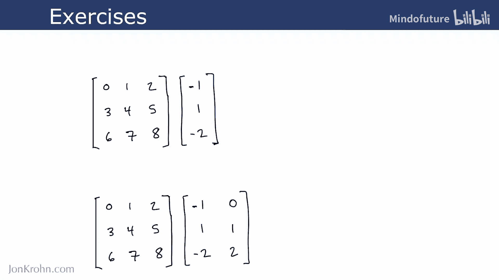
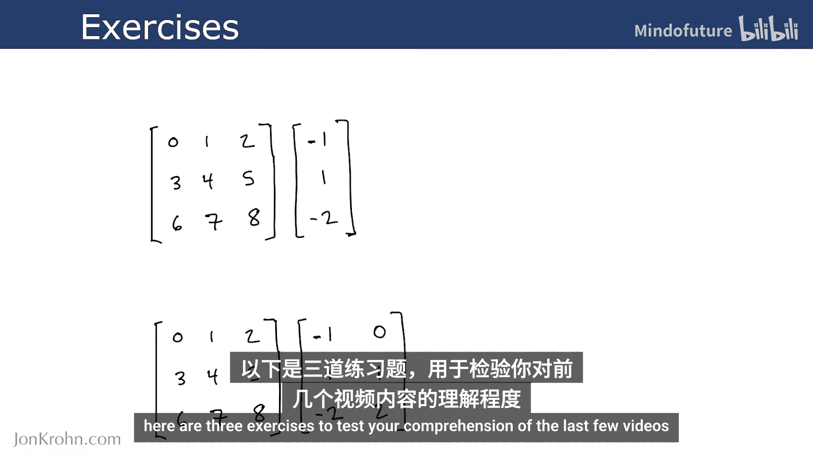
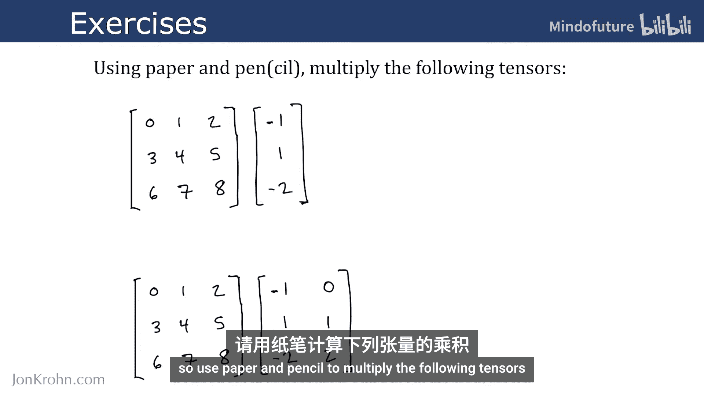
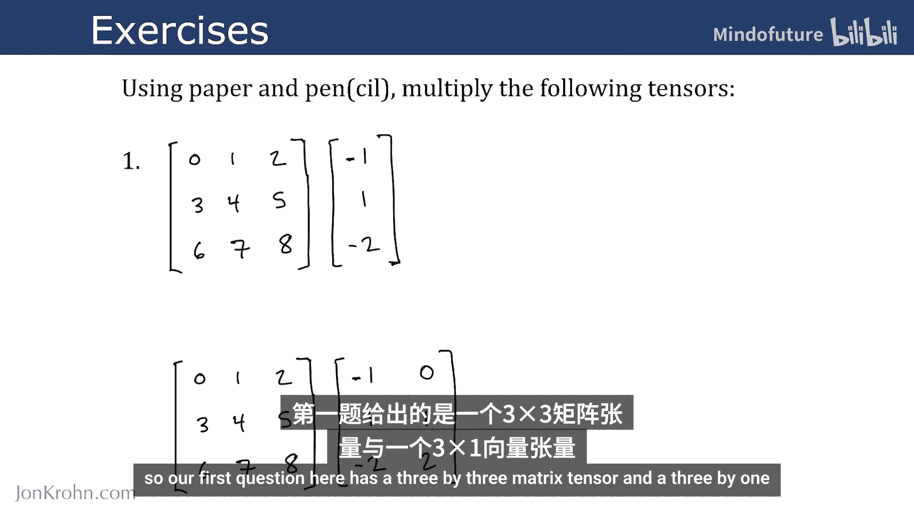
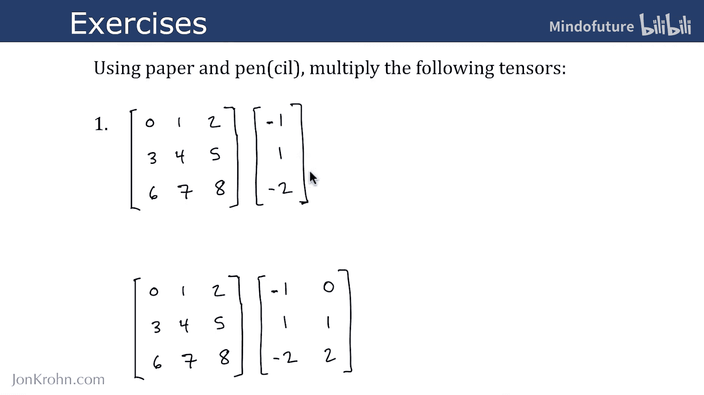
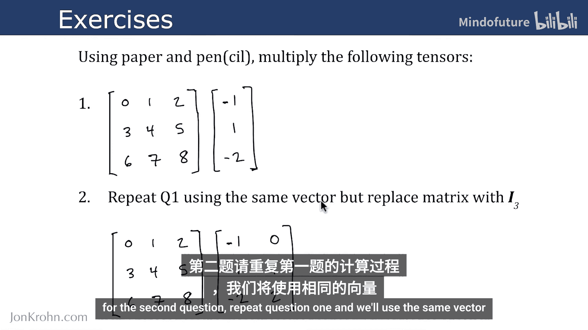
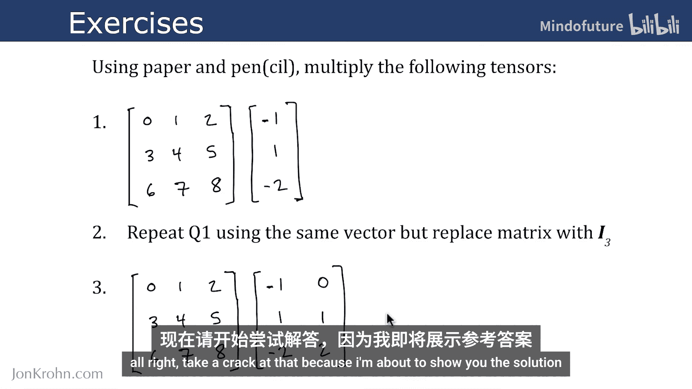
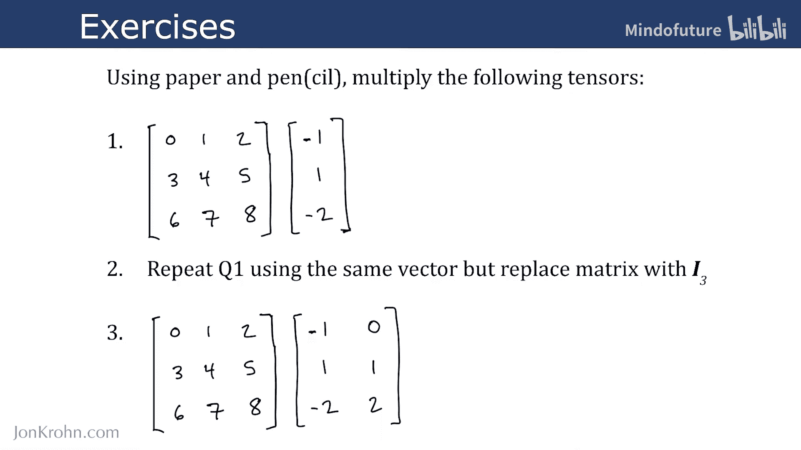
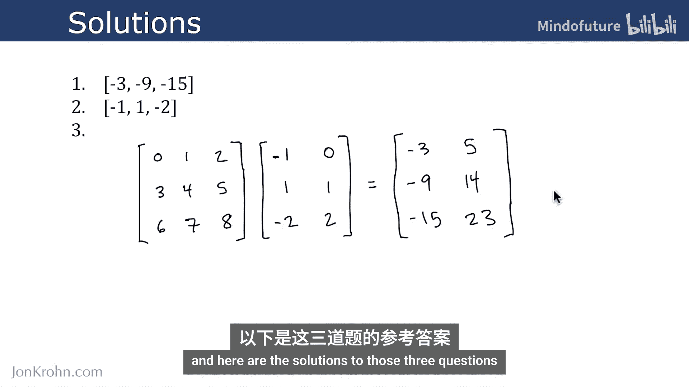

# 026：矩阵乘法练习 🧮

在本节课中，我们将通过三个练习来测试你对前几节视频中矩阵乘法知识的掌握程度。我们将使用纸笔进行计算，并最终展示正确的解法。



以下是三个需要完成的矩阵乘法练习。

## 练习一：矩阵与向量相乘

第一个练习是计算一个3x3矩阵与一个3x1向量的乘积。



**矩阵 A**：
```
[ [1, 2, 3],
  [4, 5, 6],
  [7, 8, 9] ]
```

**向量 v**：
```
[ [10],
  [11],
  [12] ]
```



计算 **A * v**。

## 练习二：单位矩阵与向量相乘

第二个练习重复第一个练习的向量，但将矩阵替换为3阶单位矩阵 **I₃**。



**单位矩阵 I₃**：
```
[ [1, 0, 0],
  [0, 1, 0],
  [0, 0, 1] ]
```

**向量 v**（与练习一相同）：
```
[ [10],
  [11],
  [12] ]
```



计算 **I₃ * v**。

## 练习三：矩阵与矩阵相乘

第三个练习是计算两个矩阵彼此相乘。

**矩阵 C**：
```
[ [1, 2],
  [3, 4] ]
```

**矩阵 D**：
```
[ [5, 6],
  [7, 8] ]
```



计算 **C * D**。

---

在开始核对答案前，请确保你已经独立完成了以上计算。如果需要，可以暂停视频进行演算。

---

## 练习答案

以下是上述三个练习的正确答案。



**练习一答案**：
`A * v = [ [68], [167], [266] ]`
计算过程是矩阵每一行与向量点乘的结果。



**练习二答案**：
`I₃ * v = [ [10], [11], [12] ]`
任何向量与同维度的单位矩阵相乘，结果等于该向量本身。

**练习三答案**：
`C * D = [ [19, 22], [43, 50] ]`
计算过程遵循矩阵乘法规则，即结果矩阵中第i行第j列的元素是C的第i行与D的第j列的点积。



---

本节课中我们一起学习了三个具体的矩阵乘法练习，分别涉及了矩阵与向量、单位矩阵的特性以及矩阵与矩阵的乘法运算。通过动手计算，可以加深对线性代数中这一核心操作的理解。