# 027：矩阵求逆 🔢

在本节课中，我们将要学习矩阵求逆这一核心操作。矩阵求逆是解决线性方程组的一种非常巧妙且方便的计算方法，在未来的机器学习基础课程中，我们会反复看到它的身影。我们将通过生动的公式和动手代码演示，来理解如何利用矩阵求逆解决一个简单的回归问题，并最终探讨其局限性。

## 什么是矩阵求逆？

矩阵求逆是一种我们可以对矩阵执行的操作。矩阵 **X** 的逆矩阵记作 **X⁻¹**，这与将变量移到等式另一侧的表示方法类似。逆矩阵满足一个特定性质：当我们将逆矩阵与原矩阵相乘时，结果是单位矩阵。

用公式表示即：
**X⁻¹ * X = I**
其中 **I** 是单位矩阵。如果矩阵 **X** 有4行4列，那么结果就是 **I₄**。

## 矩阵求逆如何用于求解未知数？

为了理解矩阵求逆的意义及其在求解未知数方面的用途，让我们来看一个小规模的回归问题示例。

在之前的矩阵乘法视频中，我们了解了如何构建回归问题：我们有一个结果向量 **y**（例如房价），以及一个特征矩阵 **X**（例如卧室数量、到学校的距离等）。此外，我们还有一个未知的权重向量 **W**，包含了我们希望求解的模型参数。

用简洁的张量符号表示，整个公式为：
**y = XW**

在这个等式中：
*   **y** 是已知的结果向量。
*   **X** 是已知的特征矩阵。
*   **W** 是包含未知权重（A到M）的向量。

假设矩阵 **X** 的逆存在（视频结尾会讨论其不存在的场景），那么我们可以通过矩阵求逆来求解未知的 **W**。

让我们快速推导一下：
1.  从 **y = XW** 开始，我们可以将其重写为 **XW = y**。
2.  在等式两边同时乘以 **X** 的逆矩阵 **X⁻¹**：
    **X⁻¹ * X * W = X⁻¹ * y**
3.  根据逆矩阵的性质，**X⁻¹ * X = I**（单位矩阵）。而任何向量乘以单位矩阵都等于其本身，因此：
    **I * W = X⁻¹ * y**
    **W = X⁻¹ * y**

这样，我们就得到了一个简洁的公式，可以通过计算 **X** 的逆矩阵与向量 **y** 的乘积来直接求解未知权重向量 **W**。

## 动手示例：用代码求解

现在，让我们通过一个具体的例子和代码来实践。我们构造一个简单的线性方程组，可以将其想象成一个包含两个数据点（例如两套房子）的数据集。

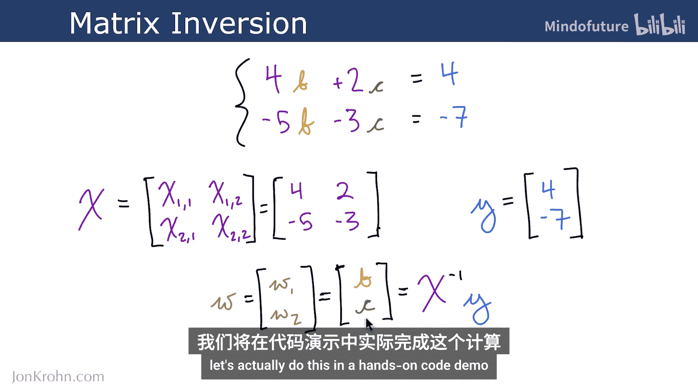

方程组如下：
*   方程1: `4B + 2C = 4`
*   方程2: `-5B - 3C = -7`

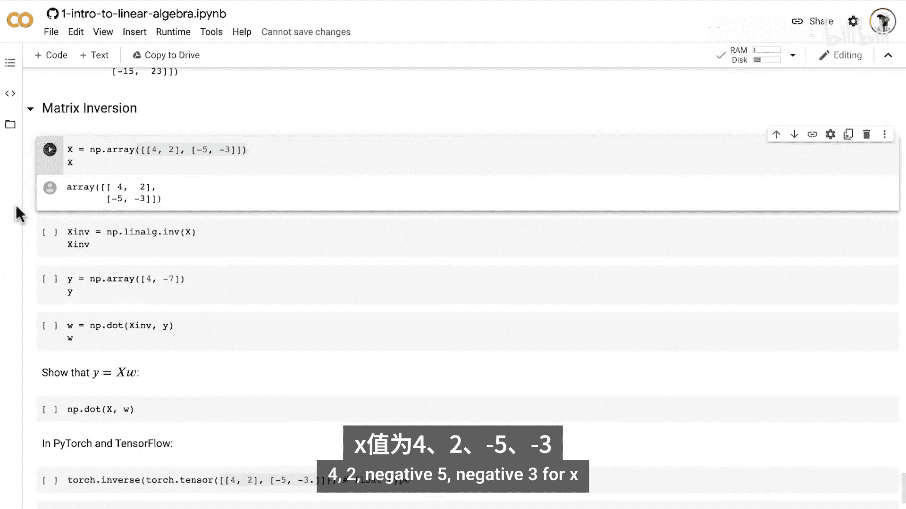

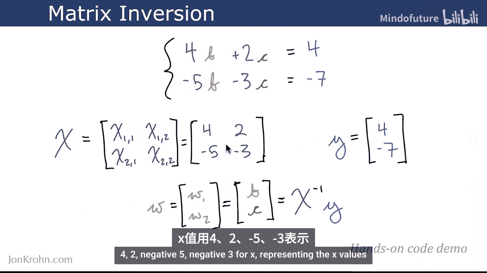

这里，`B` 和 `C` 是我们需要求解的未知权重。`y = [4, -7]` 可以看作是两套房子的价格（单位：十万美元）。特征矩阵 **X** 为：
```
X = [[4, 2],
     [-5, -3]]
```

我们的目标是求解权重向量 **W = [B, C]**。

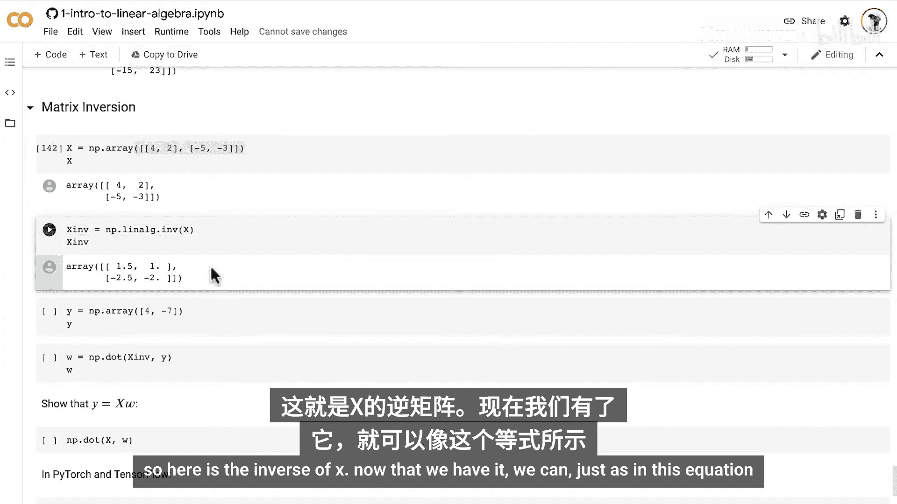

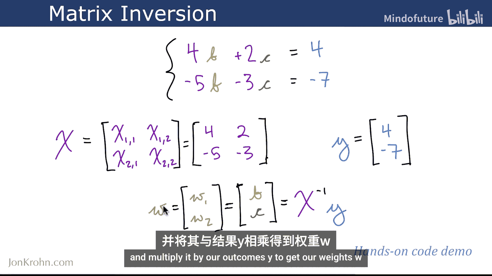

根据推导的公式 **W = X⁻¹ * y**，以下是使用NumPy实现的代码：

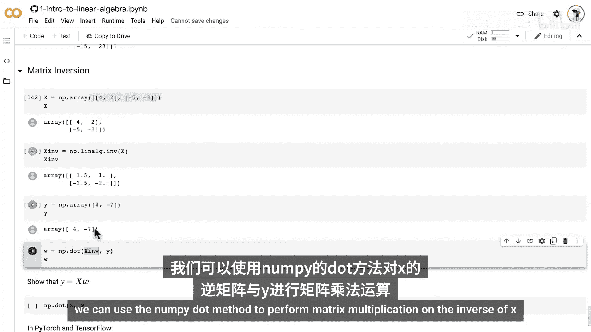

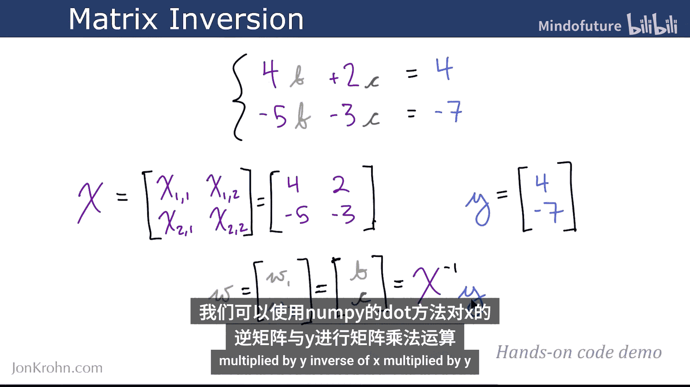

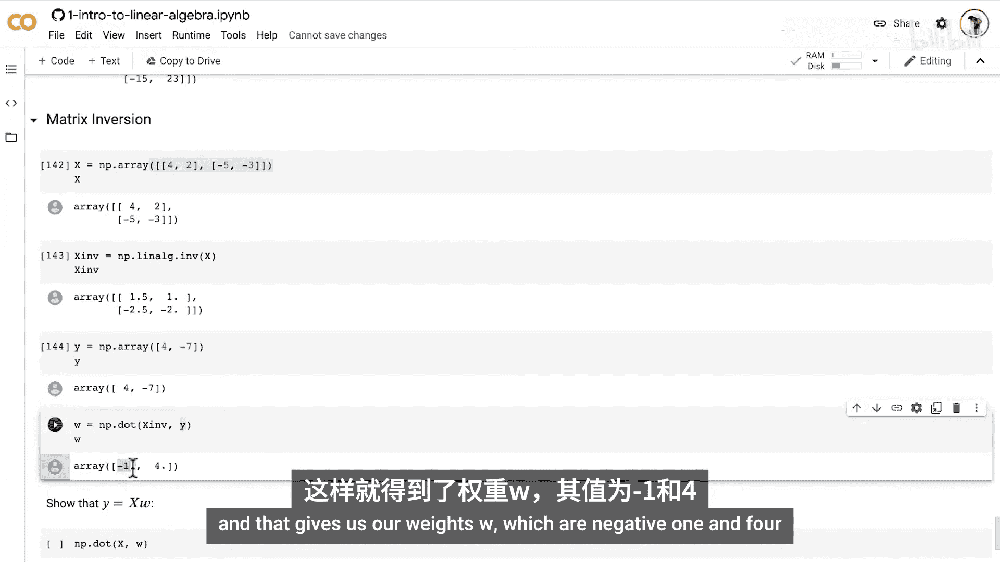

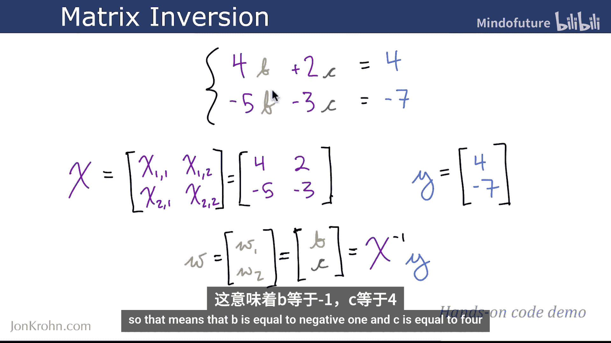

```python
import numpy as np

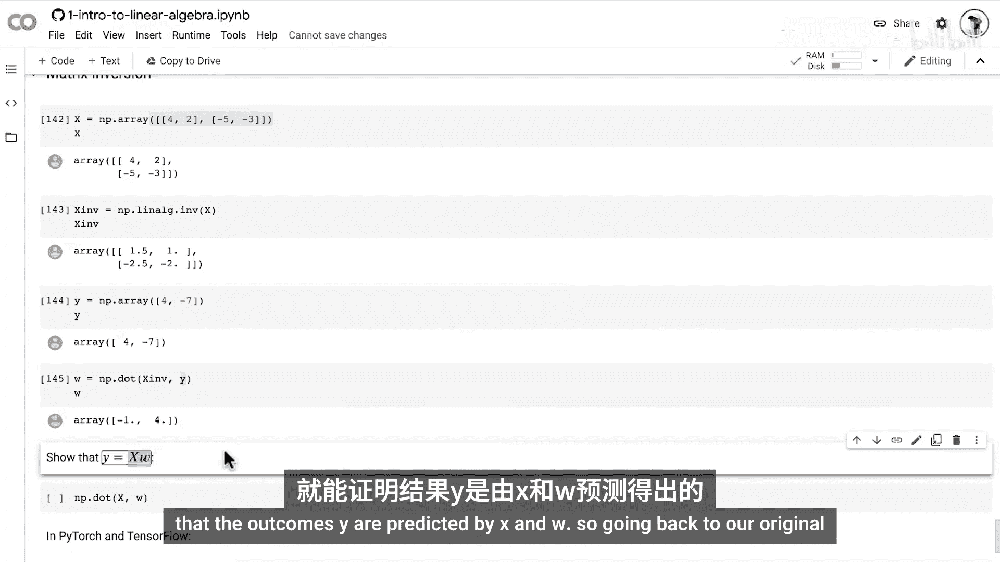

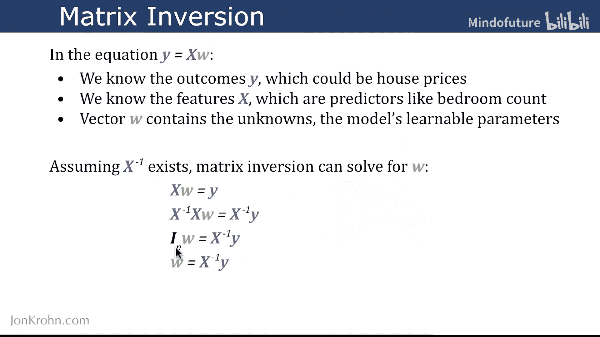

# 定义特征矩阵 X 和结果向量 y
X = np.array([[4, 2], [-5, -3]])
y = np.array([4, -7])

# 计算 X 的逆矩阵
X_inv = np.linalg.inv(X)
print("X的逆矩阵:\n", X_inv)

# 计算权重向量 W = X⁻¹ * y
W = np.dot(X_inv, y)  # 或者使用 W = X_inv @ y
print("求解的权重向量 W:", W)

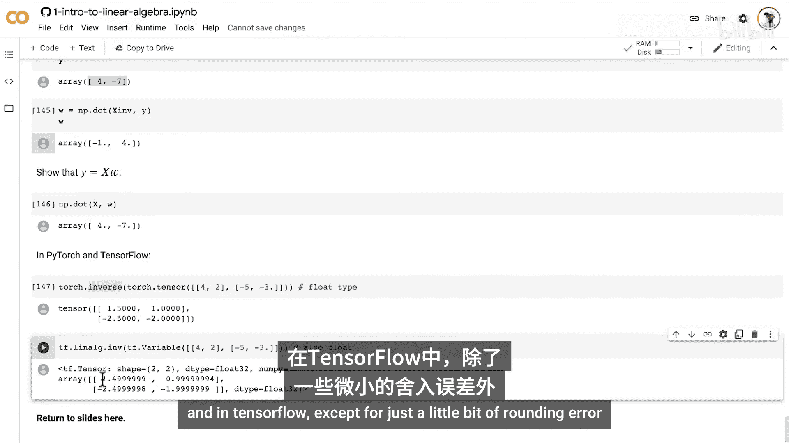

# 验证：计算 X * W，结果应等于 y
y_pred = np.dot(X, W)
print("验证 X * W 是否等于 y:", y_pred)
```

运行上述代码，我们将得到权重 `B = -1`, `C = 4`。验证 `X * W` 的结果确实等于原始的 `y` 向量，证明求解正确。

你也可以在PyTorch或TensorFlow中执行相同的操作，只需确保使用正确的数据类型和方法即可。

## 矩阵求逆的局限性 🚫

虽然矩阵求逆是一个巧妙的方法，但它并非万能。矩阵求逆只能在特定条件下计算。

主要的局限性包括：
1.  **矩阵必须是可逆的（非奇异矩阵）**：这意味着矩阵的所有列必须是线性独立的。如果存在两列线性相关（例如一列是另一列的倍数），或者两列完全相同，则该矩阵是奇异的，其逆矩阵不存在。在几何上，这对应于两条直线平行或重合，无法找到唯一的交点（解）。
2.  **矩阵必须是方阵**：即矩阵的行数必须等于列数。这避免了“超定”和“欠定”系统：
    *   **超定系统**：方程数量（行数）多于未知数数量（列数）。例如，在二维空间中有三条线，它们可能没有共同的唯一交点。
    *   **欠定系统**：方程数量少于未知数数量。例如，在二维空间中只有一条线，有无数个点满足条件。

在超定或欠定情况下，虽然无法直接使用标准的矩阵求逆，但仍可能通过其他方法（如最小二乘法）来求解未知数，这将在后续的线性代数课程中介绍。

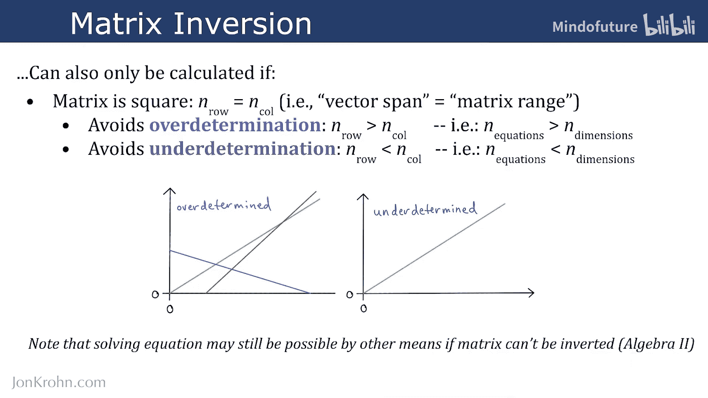

让我们看一个代码示例，尝试对一个奇异矩阵求逆：

```python
import numpy as np

# 创建一个奇异矩阵：第二行是第一行的倍数
X_singular = np.array([[1, 2], [2, 4]])
print("尝试对奇异矩阵求逆:")
# 以下代码会报错：numpy.linalg.LinAlgError: Singular matrix
# X_inv_singular = np.linalg.inv(X_singular)
```

## 总结

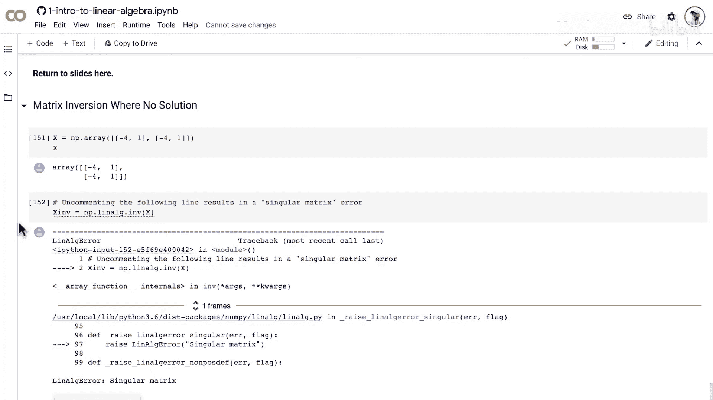

本节课中，我们一起学习了矩阵求逆。我们了解到矩阵 **X** 的逆矩阵 **X⁻¹** 满足 **X⁻¹ * X = I** 的性质。通过推导公式 **W = X⁻¹ * y**，我们掌握了如何利用矩阵求逆来高效地求解线性回归问题中的未知权重。同时，我们也认识到矩阵求逆的局限性：它要求矩阵必须是可逆的（非奇异）且为方阵。对于不满足这些条件的情况，我们需要借助其他数学工具。