# 028：对角矩阵 📐

在本节课中，我们将要学习一种在机器学习中非常重要的特殊矩阵类别——对角矩阵。我们将了解它的定义、性质、计算效率以及如何在Python中表示它。

## 概述

对角矩阵是一种主对角线以外的元素全为零的矩阵。单位矩阵就是对角矩阵的一个特例。理解对角矩阵有助于我们简化许多线性代数运算，这在机器学习算法中能显著提升计算效率。

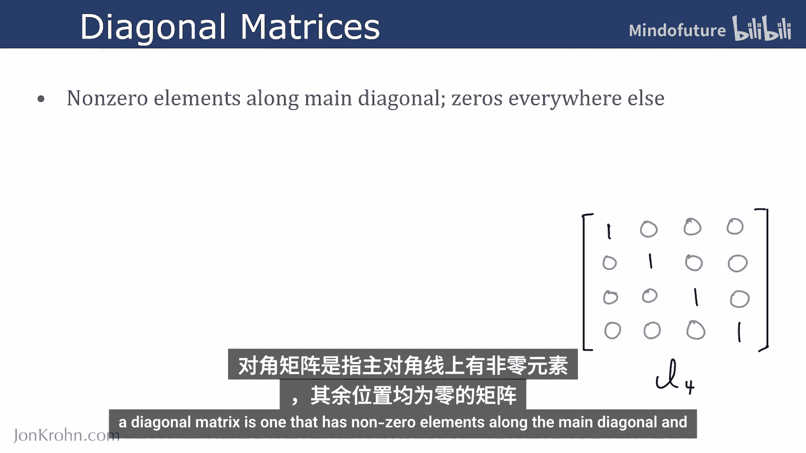

## 对角矩阵的定义

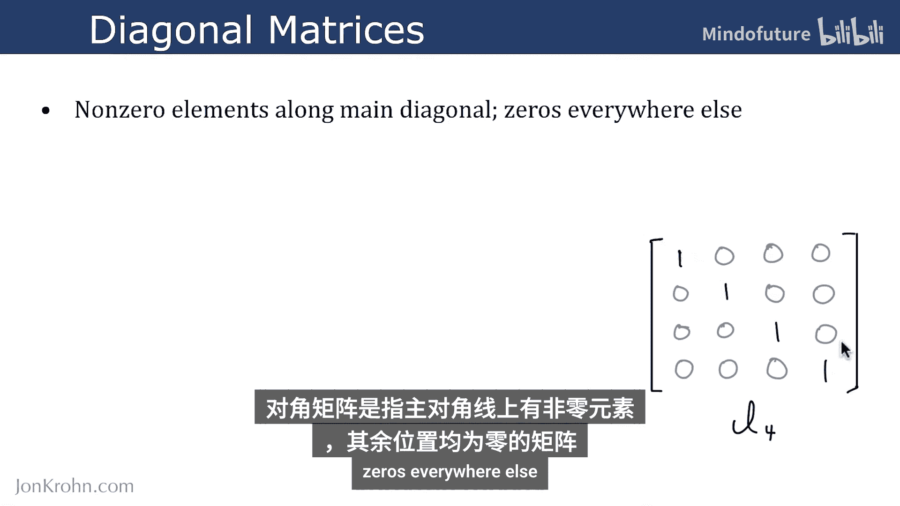

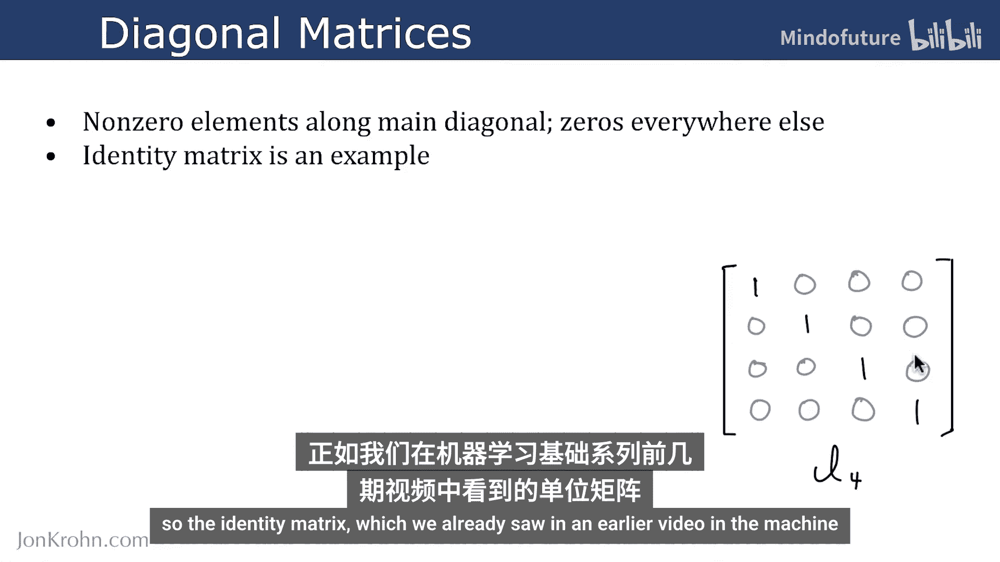

一个对角矩阵是指，其非零元素仅出现在主对角线上，而其他所有位置的元素均为零。

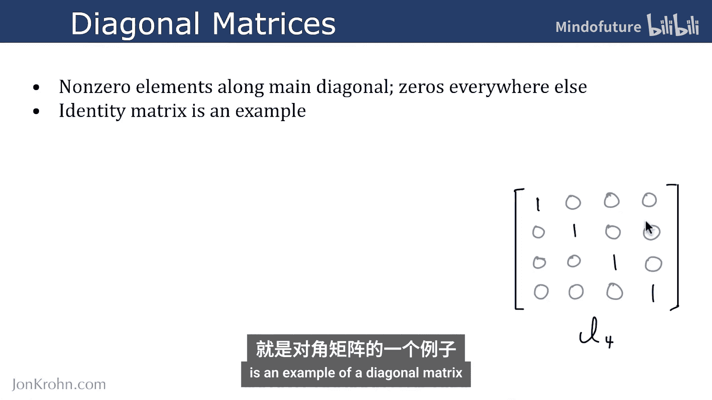

以下是一个4x4的单位矩阵 `I4`，它是对角矩阵的一个例子：

```
[[1, 0, 0, 0],
 [0, 1, 0, 0],
 [0, 0, 1, 0],
 [0, 0, 0, 1]]
```

单位矩阵是一种特殊的对角矩阵，其主对角线上的元素全为1。但并非所有对角矩阵都是单位矩阵。

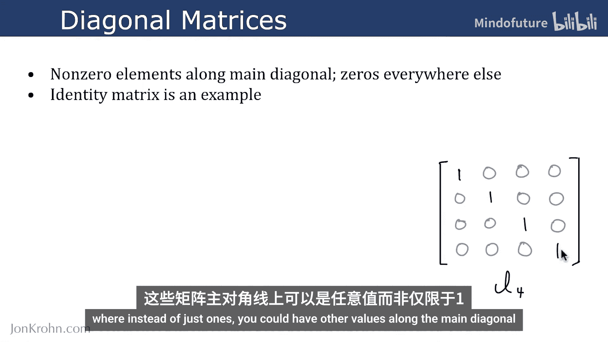

## 对角矩阵与一般对角矩阵的区别

单位矩阵是对角矩阵的一种特殊类型。然而，你可以有其他对角矩阵，其主对角线上的元素可以是任意值，而不仅仅是1。

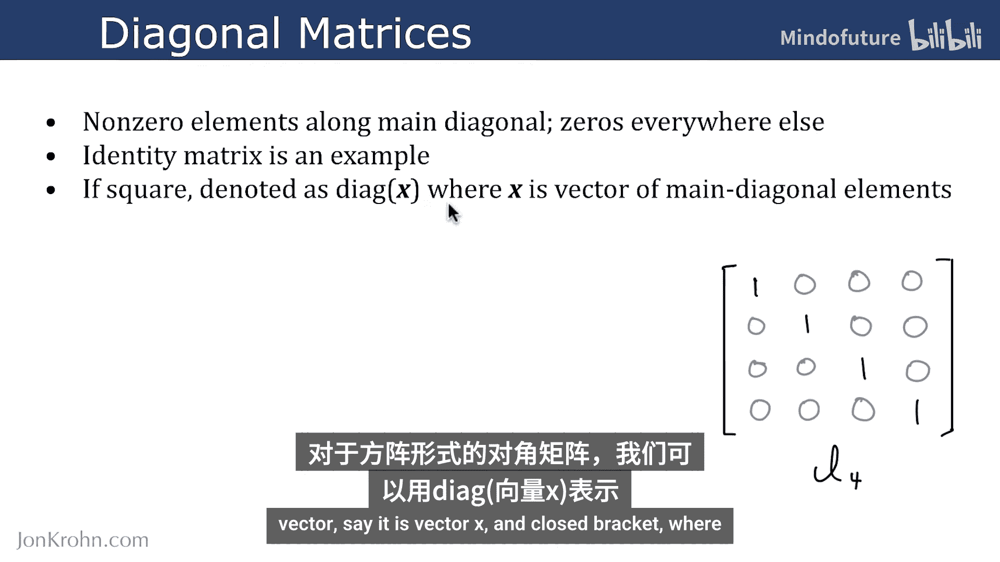

例如，一个主对角线元素为 `[2, 4, 6]` 的3x3对角矩阵 `D` 可以表示为：


```
D = [[2, 0, 0],
     [0, 4, 0],
     [0, 0, 6]]
```

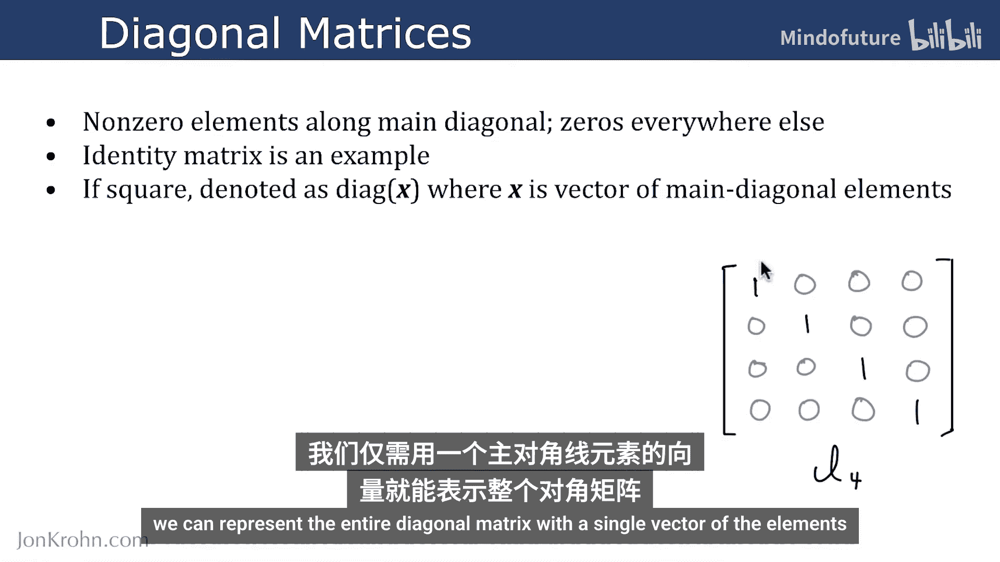

## 对角矩阵的表示法

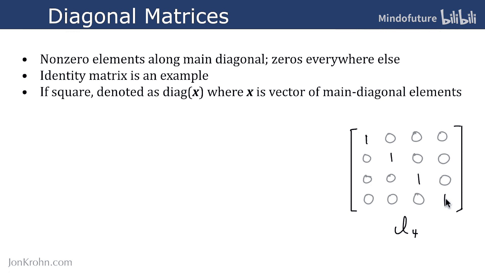

对于一个方阵对角矩阵，我们可以用一个向量来简洁地表示它。记法为 **`Dg(x)`**，其中 `x` 是一个向量，包含了主对角线上的所有元素。由于我们知道其他所有元素都是零，因此这个向量就完全定义了整个矩阵。

**公式表示：**
如果 `x = [x1, x2, ..., xn]`，那么 `Dg(x)` 就是一个 `n x n` 的矩阵，其中 `D[i,i] = xi`，且对于所有 `i ≠ j`，`D[i,j] = 0`。

这意味着，我们可以仅用一个向量来代表整个对角矩阵，从而节省存储空间。

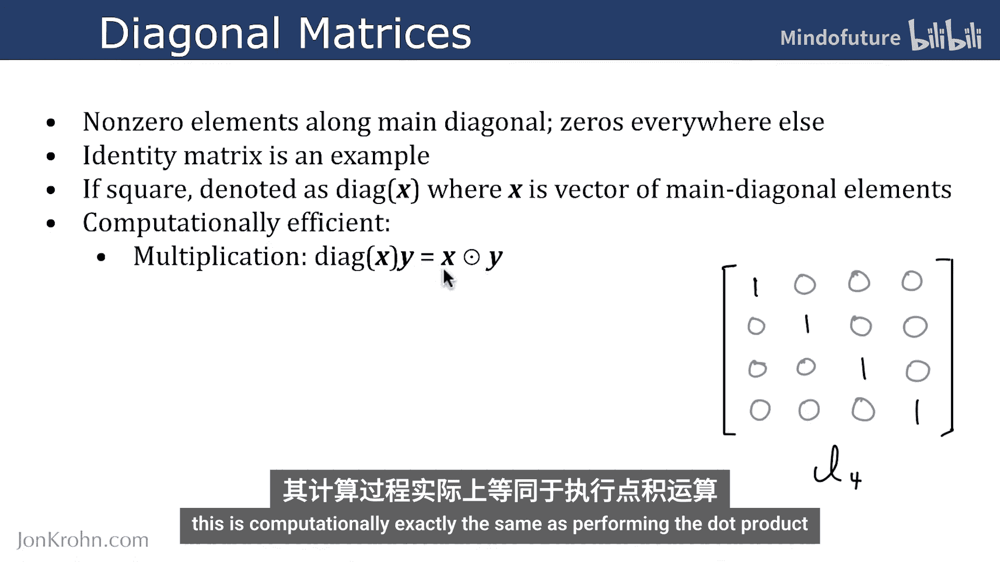

## 对角矩阵的运算效率

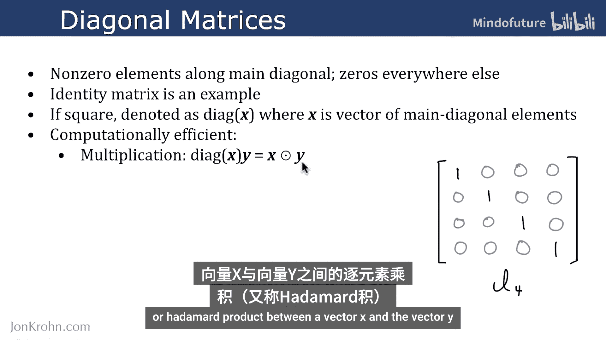

使用对角矩阵进行计算非常高效，尤其是在乘法和求逆运算中。

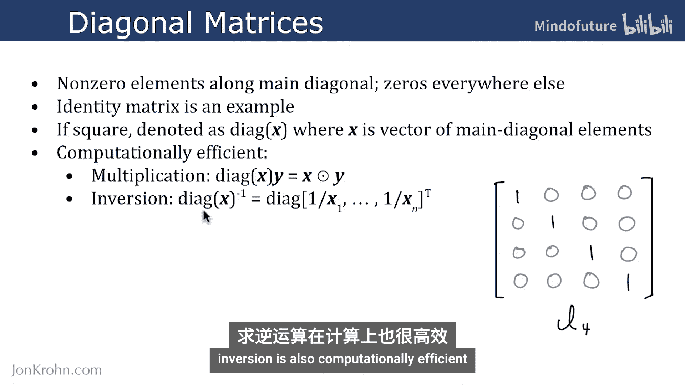

### 乘法运算

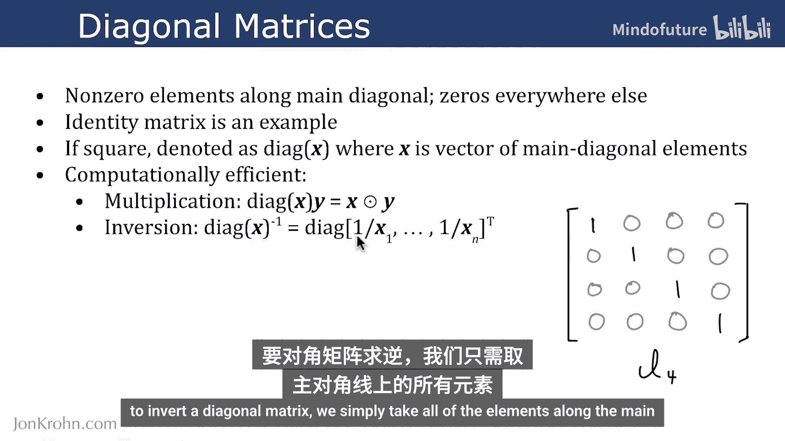

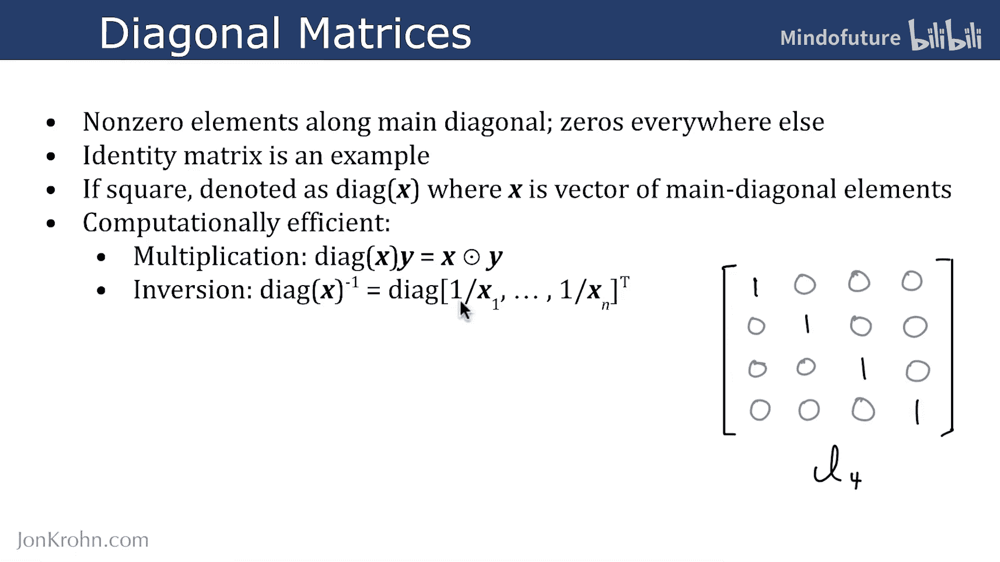

如果你想用一个对角矩阵 `D` 乘以一个向量 `y`，其计算过程在数学上完全等同于向量 `x`（即 `D` 的主对角线元素构成的向量）与向量 `y` 的逐元素乘积（Hadamard积）。

**公式表示：**
`D * y = x ⊙ y`
其中 `⊙` 表示逐元素乘法。

在Python中，这可以高效地使用NumPy实现：
```python
import numpy as np
x = np.array([2, 4, 6])  # 对角元素
y = np.array([1, 2, 3])
result = x * y  # 逐元素相乘，等价于 Dg(x) @ y
print(result)  # 输出: [2, 8, 18]
```

### 求逆运算

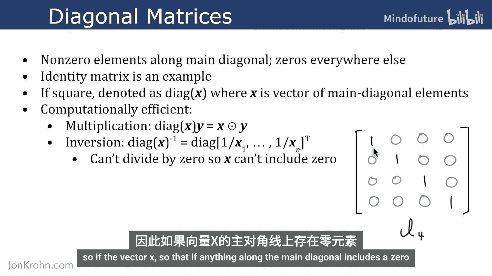

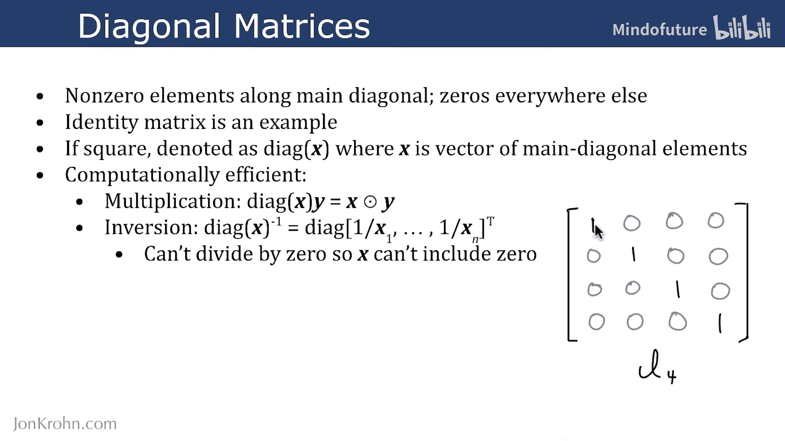

对角矩阵的求逆运算同样高效。要计算一个对角矩阵的逆，我们只需要对主对角线上的每个元素分别取倒数。

**公式表示：**
如果 `D = Dg([x1, x2, ..., xn])` 且所有 `xi ≠ 0`，那么其逆矩阵为：
`D⁻¹ = Dg([1/x1, 1/x2, ..., 1/xn])`

**关键注意事项：** 不能除以零。如果向量 `x` 中的任何元素（即主对角线上的元素）包含0，那么这个对角矩阵就是奇异的，不可逆。

在Python中求逆：
```python
D = np.diag([2, 4, 6])  # 创建对角矩阵
D_inv = np.linalg.inv(D) # 求逆
print(D_inv)
# 输出:
# [[0.5  0.   0.  ]
#  [0.   0.25 0.  ]
#  [0.   0.   0.16666667]]
# 等价于 np.diag(1/np.array([2,4,6]))
```

## 非方阵对角矩阵

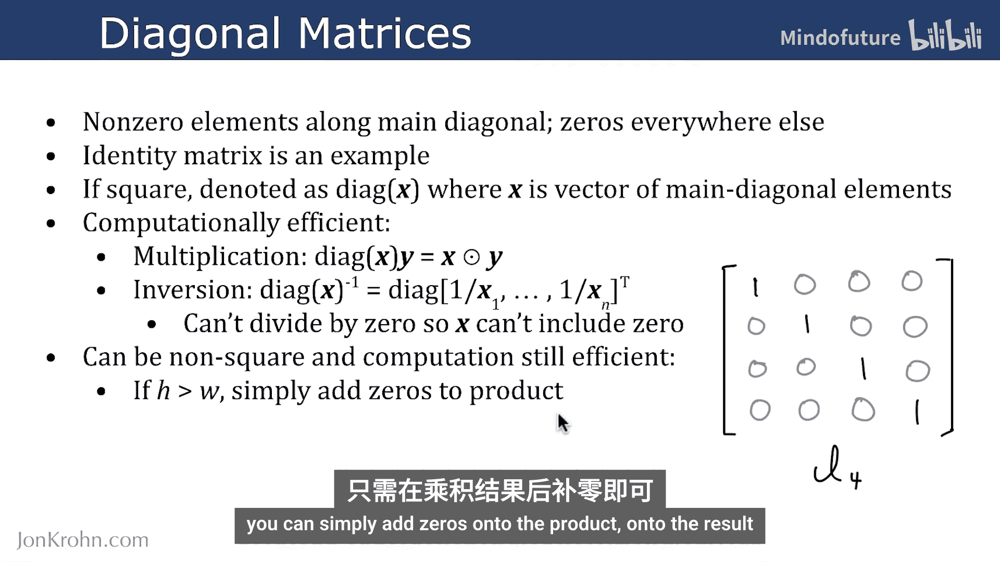

在机器学习中，你通常会见到方阵对角矩阵，但并非总是如此。即使对角矩阵不是方阵，计算仍然可以是高效的。

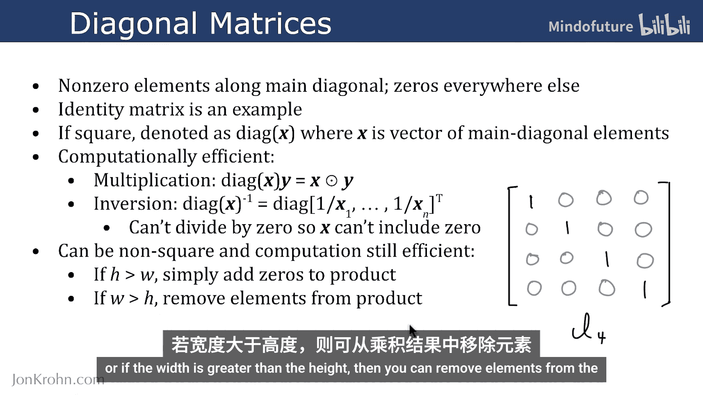

处理非方阵对角矩阵与向量相乘时，规则与之前类似，但需要根据矩阵形状调整结果：
*   如果矩阵的高度大于宽度（行数 > 列数），那么结果向量末尾会自动补零。
*   如果矩阵的宽度大于高度（列数 > 行数），那么结果向量末尾多余的元素会被舍弃。

## 总结

本节课我们一起学习了**对角矩阵**。我们首先明确了它的定义：只有主对角线上有非零元素的矩阵。接着，我们区分了单位矩阵与一般对角矩阵。我们学习了用向量 `Dg(x)` 来表示对角矩阵的简洁方法。最重要的是，我们探讨了对角矩阵在**乘法**和**求逆**运算上的高效性，这源于其稀疏的结构。最后，我们简要提及了非方阵对角矩阵的处理方式。理解对角矩阵是掌握更复杂线性代数概念和优化机器学习计算的基础。

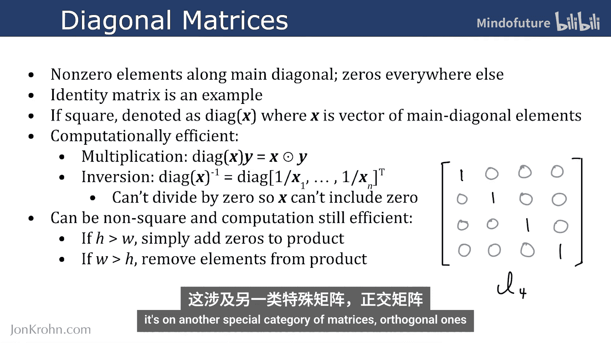

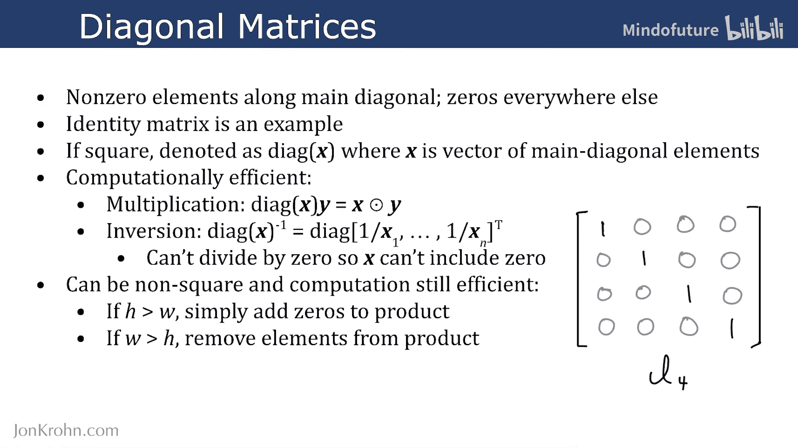

接下来，我们将进入线性代数入门的最后一个主题：另一种特殊的矩阵类别——正交矩阵。