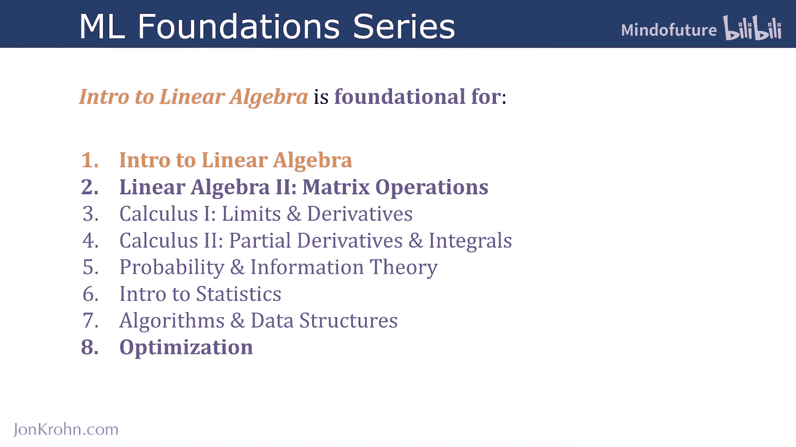
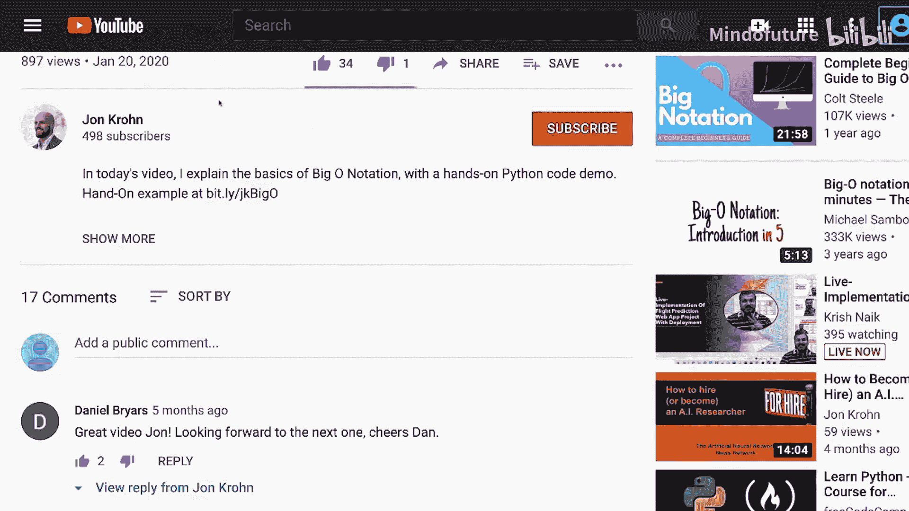

**机器学习基础：线性代数入门：1.3：正交矩阵** 🧮

在本节课中，我们将学习一种特殊的矩阵——正交矩阵。它在机器学习中因其独特的性质而具有极高的价值。

上一节我们介绍了对称矩阵和单位矩阵等概念，本节中我们来看看正交矩阵。

---

### **正交矩阵的定义**

首先，回忆一下我们之前在“基向量、正交向量与标准正交向量”视频中讨论过的**标准正交向量**。标准正交向量组中的向量不仅彼此**正交**（点积为零），而且每个向量都具有**单位范数**（长度为1）。

最常见的标准正交向量组是基向量（例如笛卡尔坐标系中的X轴和Y轴单位向量），但标准正交向量组不一定是基向量，例如，它们可以不在坐标轴上。

**正交矩阵**就是由这样的标准正交向量构成的。具体来说：
*   一个矩阵的所有**行向量**构成一组标准正交向量。
*   同时，它的所有**列向量**也构成一组标准正交向量。

### **正交矩阵的核心性质**

由于上述结构，正交矩阵 `A` 具有一个关键性质：其**转置矩阵** `A^T` 等于其**逆矩阵** `A^{-1}`。

以下是这个性质的推导过程：

1.  对于正交矩阵 `A`，其转置与自身的乘积等于单位矩阵：
    *   `A^T * A = I`
    *   `A * A^T = I`
    （`I` 代表单位矩阵）

2.  我们可以从 `A^T * A = I` 出发，在等式两边同时左乘 `A` 的逆矩阵 `A^{-1}`：
    *   `A^{-1} * (A^T * A) = A^{-1} * I`

3.  根据矩阵乘法结合律和逆矩阵定义 `A^{-1} * A = I`，上式可简化为：
    *   `(A^{-1} * A^T) * A = A^{-1}`
    *   `I * A^T = A^{-1}`
    *   `A^T = A^{-1}`

**公式表示：**
`A^T = A^{-1}`

这个性质在计算上带来了巨大优势。因为计算一个矩阵的转置（`A^T`）在计算上非常廉价，而对于正交矩阵，求逆（`A^{-1}`）就等价于求转置。这意味着我们可以用极低的计算成本获得正交矩阵的逆。

---

### **本章节与系列课程总结**

至此，我们已经完成了“线性代数入门”这个主题中第三个也是最后一个章节——“矩阵属性”。

在本章节中，我们涵盖了以下核心内容：
*   弗罗贝尼乌斯范数
*   矩阵乘法
*   对称矩阵与单位矩阵
*   矩阵求逆
*   对角矩阵
*   正交矩阵（本节内容）

恭喜你完成了“机器学习基础”系列八个主题中的第一个——**线性代数入门**！

本主题共包含三个章节：
1.  **基础数据结构（张量）**：重点剖析了向量张量对于机器学习最重要的属性。
2.  **通用张量运算**：聚焦于跨所有维度张量的常见机器学习操作。
3.  **矩阵属性**（刚完成）：重点学习了矩阵张量对于机器学习的基本属性。

对张量（尤其是矩阵）属性的深入理解，为我们完美地过渡到系列课程的第二个主题——**矩阵的线性代数运算**——做好了准备。在下一个主题中，我们将学习如何对矩阵进行操作，包括：
*   将矩阵分解为特征向量和特征值
*   计算矩阵行列式
*   奇异值分解
*   摩尔-彭罗斯广义逆（伪逆）。伪逆使我们能够求解不适合普通矩阵求逆的线性系统中的未知数，例如机器学习中典型的**超定方程组**。

我们下一个主题再见。😊

---

为确保不错过本系列的任何教程，请订阅我的频道。

感谢参与本教程，希望你喜欢。如果喜欢，请点赞和评论。

为确保不错过我的任何内容，请访问 JohnChroone.com 并注册我的电子邮件通讯。

也欢迎在 LinkedIn 上添加我，只需注明你是“机器学习基础系列”的学习者。

如果你选择 Twitter 作为社交媒介，也可以在那里关注我。

下次见。