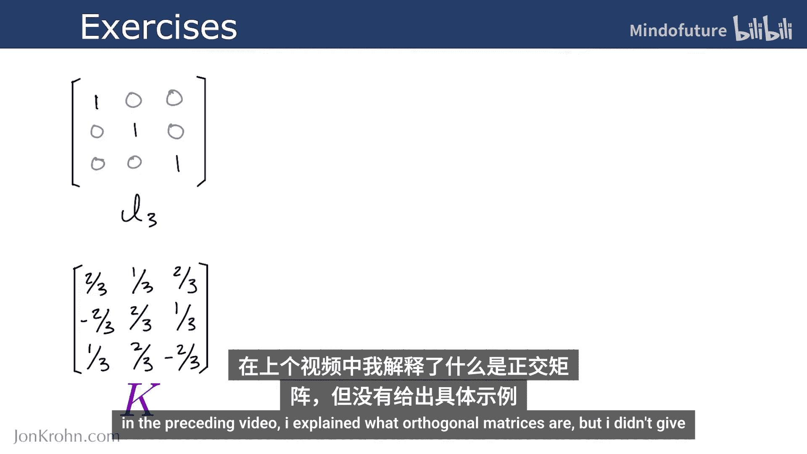
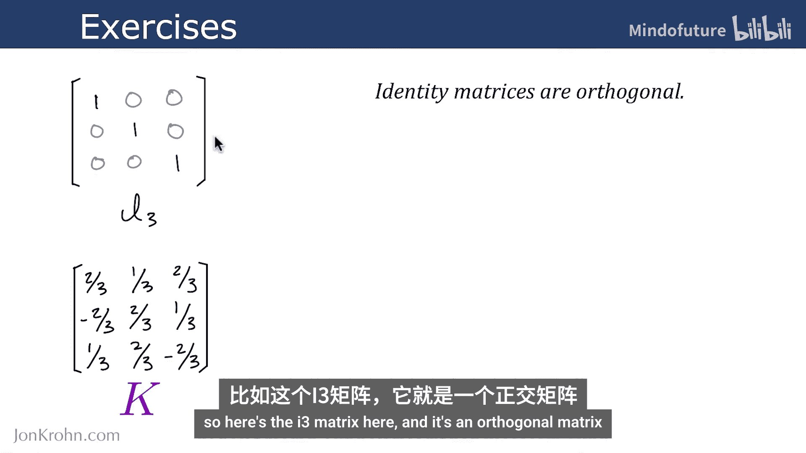
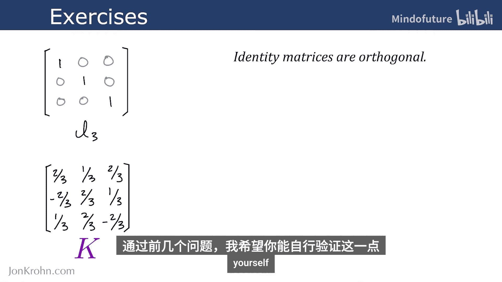
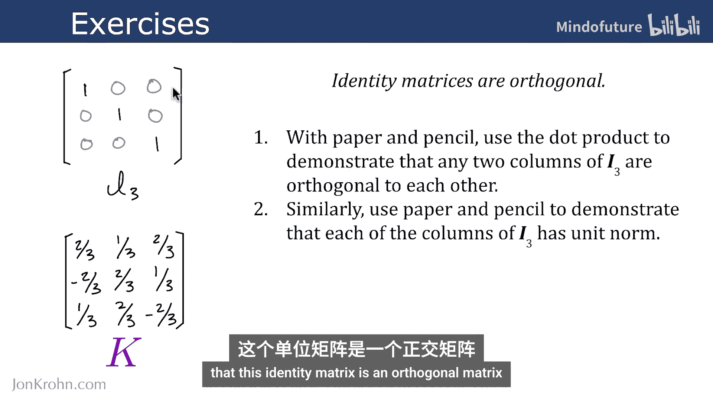
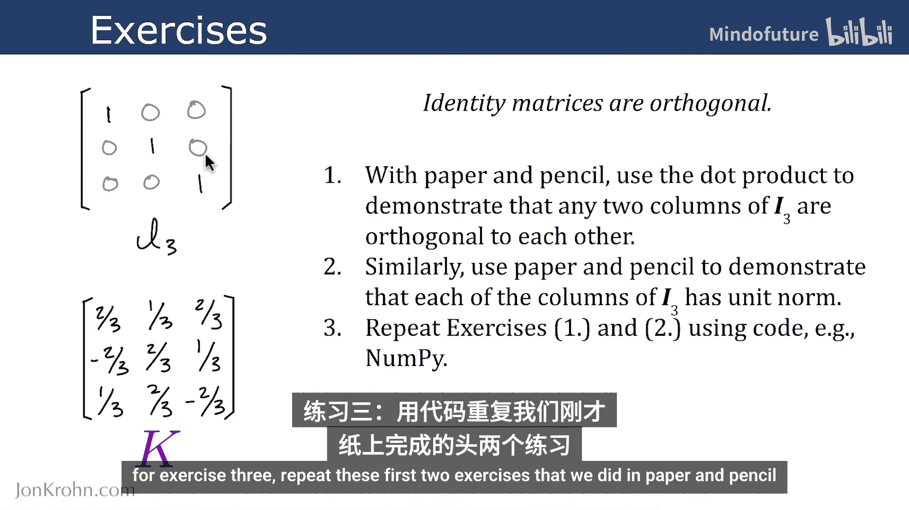
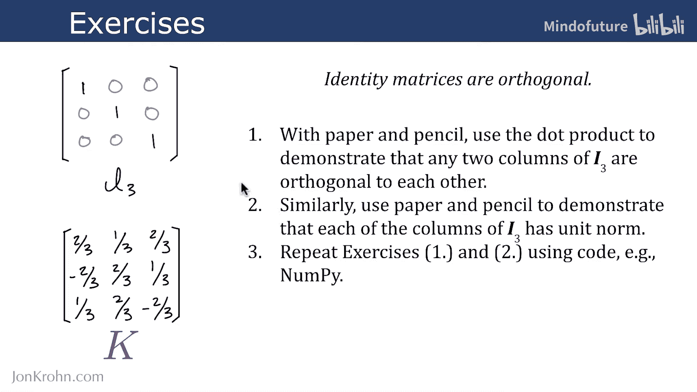
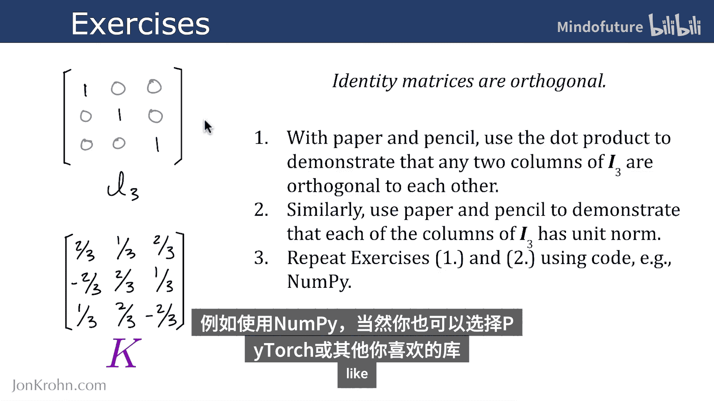
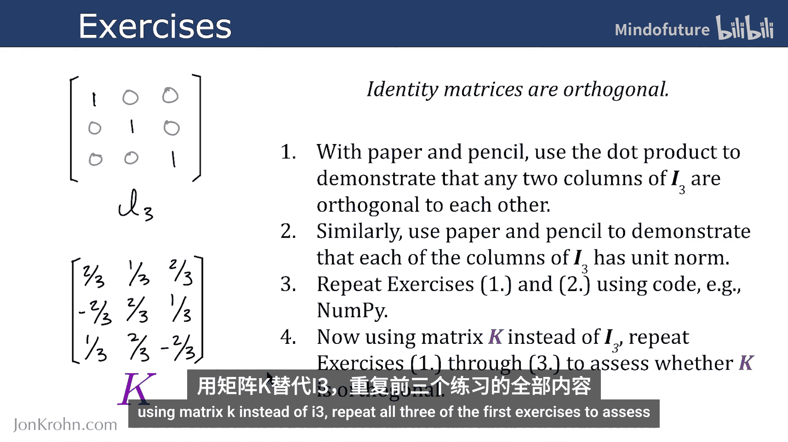
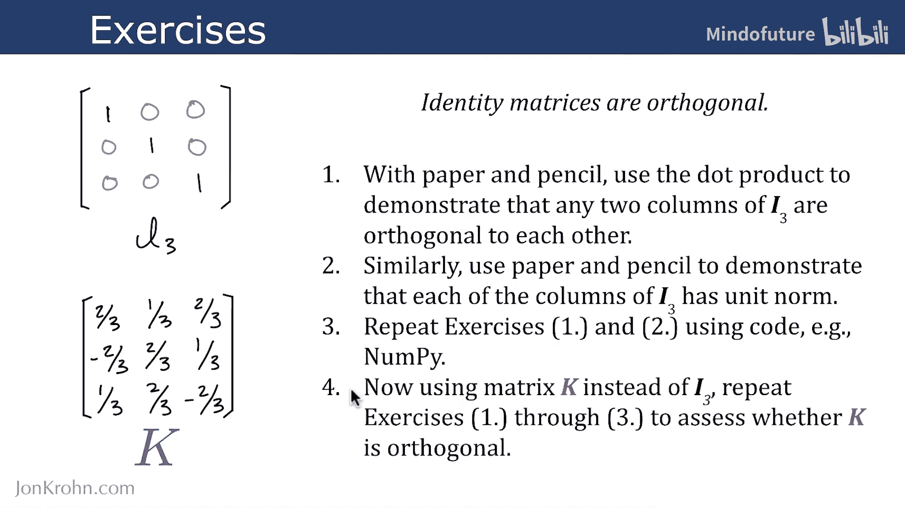
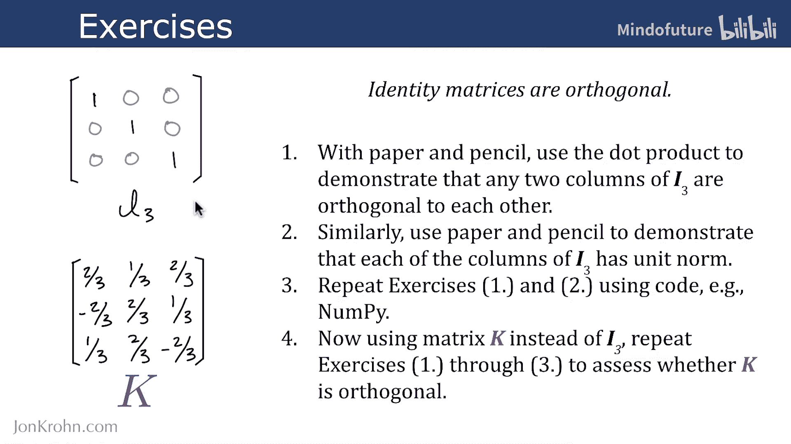

# 030：正交矩阵练习 🔢

在本节课中，我们将通过一系列练习来巩固对正交矩阵的理解。这些练习不仅会测试你对正交矩阵概念的掌握，还会复习点积、L2范数、单位矩阵和正交向量等关键知识点，为后续学习矩阵运算打下坚实基础。

在上一节视频中，我们介绍了正交矩阵的定义，但没有给出具体例子。单位矩阵就是正交矩阵的一个典型例子。例如，下面的 **I3** 矩阵就是一个正交矩阵。



接下来的几个问题，将引导你亲自验证这一点。

## 练习1：验证列向量的正交性 ✏️

首先，请使用纸笔，通过计算点积来证明 **I3** 矩阵的任意两列都是相互正交的。

**核心概念**：两个向量 **a** 和 **b** 正交的条件是它们的点积为零，即 **a · b = 0**。

## 练习2：验证列向量的单位范数 📏

接下来，同样使用纸笔，证明 **I3** 矩阵的每一列都具有单位范数（即长度为1）。


**核心概念**：向量 **v** 的L2范数（长度）计算公式为 **||v||₂ = √(v₁² + v₂² + ... + vₙ²)**。单位范数意味着 **||v||₂ = 1**。





通过完成练习1和练习2，即证明所有列向量相互正交且均为单位向量，就证明了单位矩阵 **I3** 是一个正交矩阵。

## 练习3：使用代码进行验证 💻

现在，我们将前两个练习用代码（例如使用NumPy库）重新实现一遍。当然，你也可以使用任何你喜欢的其他库。

以下是使用Python和NumPy进行验证的示例代码框架：
```python
import numpy as np

# 定义单位矩阵 I3
I3 = np.eye(3)

# 练习1：验证列向量的正交性
for i in range(3):
    for j in range(i+1, 3):
        dot_product = np.dot(I3[:, i], I3[:, j])
        print(f"列 {i} 与列 {j} 的点积为：{dot_product}")





# 练习2：验证列向量的单位范数
for i in range(3):
    norm = np.linalg.norm(I3[:, i])
    print(f"列 {i} 的L2范数为：{norm}")
```

## 练习4：评估另一个矩阵 🔄

最后，我们来看一个新的矩阵 **K**。









请使用矩阵 **K** 代替 **I3**，重复前面三个练习的所有步骤，以评估矩阵 **K** 是否像 **I3** 一样也是正交矩阵。

你可以将练习3中的代码稍作修改，将 `I3` 替换为 `K` 矩阵的定义，然后运行代码查看结果。


---



本节课中，我们一起通过纸笔计算和编程实践，深入练习了如何验证一个矩阵是否为正交矩阵。我们复习了点积、向量范数等核心概念，并掌握了验证正交性的两个关键条件：列向量两两正交，且每个列向量都是单位向量。这些技能是理解后续更复杂矩阵运算的重要基础。