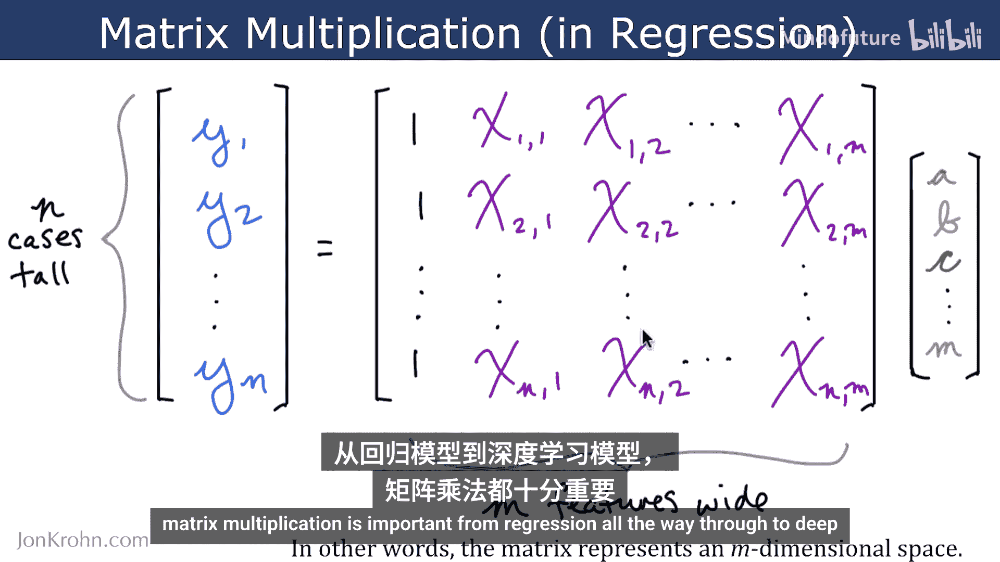
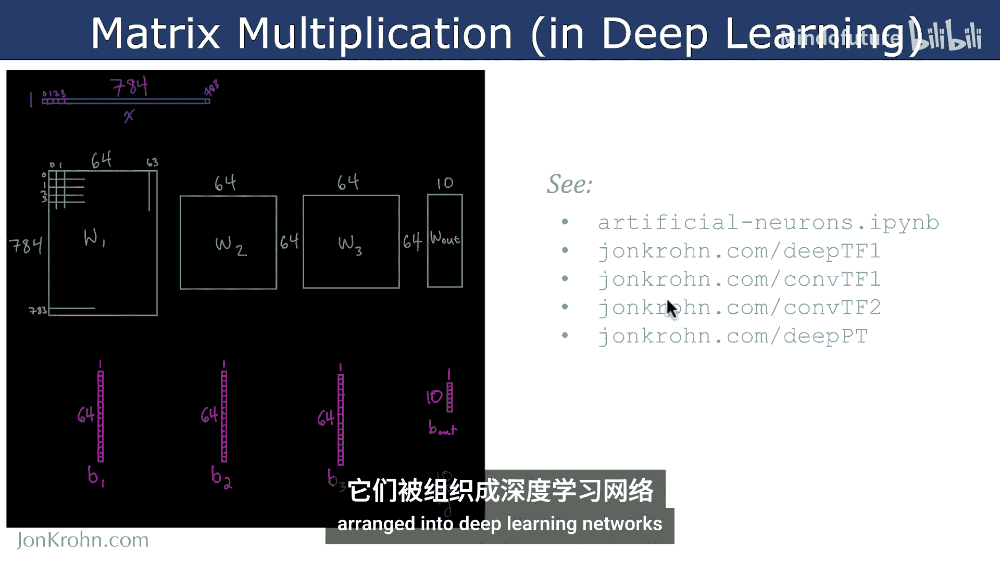
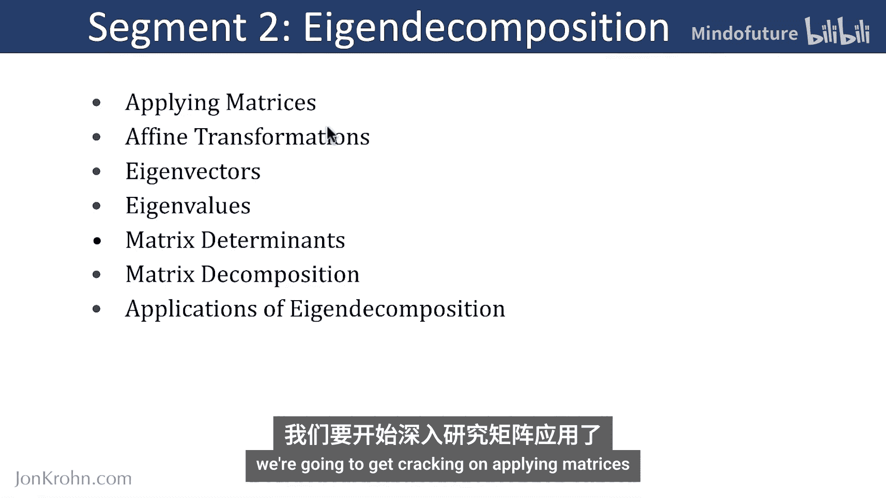

# 031：矩阵运算

在本节课中，我们将学习矩阵运算的核心概念，包括特征分解、矩阵行列式以及机器学习中的关键应用，如奇异值分解和伪逆。这些工具对于解决线性方程组和从数据中提取模式至关重要。

## 回顾基础线性代数

上一节我们介绍了张量等基础概念。本节中，我们先快速回顾一些关键知识点，以确保为后续学习做好准备。

以下是您需要掌握的核心主题：

*   **张量**：标量、向量、矩阵和高维张量。
*   **向量操作**：转置、范数（特别是L2范数）、单位向量、基向量、正交向量和标准正交向量。
*   **矩阵操作**：转置、对称矩阵、矩阵乘法。
*   **特殊矩阵**：单位矩阵、对角矩阵、正交矩阵。
*   **矩阵求逆**：理解其应用和限制（仅适用于方阵且非奇异矩阵）。

线性代数用于解决线性方程组中的未知数，在机器学习中应用广泛，例如回归模型、降维（如主成分分析）、结果排序（如PageRank算法）、推荐系统和自然语言处理。

## 特征分解

在回顾了基础知识后，本节我们将深入探讨特征分解。我们将从理解矩阵如何作用于向量和其他矩阵开始。

### 矩阵的应用与线性变换

矩阵可以应用于向量，这相当于对向量进行**线性变换**，例如旋转、缩放或剪切。

### 特征向量与特征值

每个矩阵都有其特有的**特征向量**和**特征值**。特征向量是在矩阵作用下方向保持不变的向量，特征值则是该向量被拉伸或压缩的尺度因子。
若矩阵 **A**、特征向量 **v** 和特征值 λ 满足关系：
**A** **v** = λ **v**

### 矩阵行列式

**行列式**是一个标量值，它提供了关于矩阵变换的关键信息。例如，行列式可以表示变换后面积或体积的缩放因子，也能指示矩阵是否可逆（行列式为0则不可逆）。行列式与特征值也存在联系：一个方阵的行列式等于其所有特征值的乘积。

### 特征分解

**特征分解**是将一个方阵分解为由其特征向量和特征值组成的表示。这种分解在无数实际应用中都非常有用，因为它揭示了矩阵的内在结构。

## 机器学习中的矩阵运算

掌握了特征分解后，我们现在可以探讨线性代数在机器学习中的具体应用。

### 奇异值分解

**奇异值分解** 是一种强大的矩阵分解技术，适用于任意矩阵（不限于方阵）。它可以将一个矩阵分解为三个特定矩阵的乘积，广泛用于数据压缩和降维，例如在推荐系统中。
对于矩阵 **A**，SVD将其分解为：
**A** = **U** **Σ** **V**^T
其中 **U** 和 **V** 是正交矩阵，**Σ** 是对角矩阵（其对角线元素称为奇异值）。

### 摩尔-彭罗斯伪逆

对于无法求逆的矩阵（例如过定或欠定方程组中的矩阵），**摩尔-彭罗斯伪逆** 提供了一个最佳近似解。这在机器学习中尤其重要，因为我们的数据模型常常不符合标准矩阵求逆的条件。
伪逆 **A**^+ 可以通过SVD计算，并用于求解线性系统 **A** **x** = **b** 的最小二乘解：
**x** = **A**^+ **b**

本节课中，我们一起学习了矩阵运算的核心内容：从特征向量、特征值和行列式的基础，到特征分解的理论，最后探讨了奇异值分解和伪逆这两个在机器学习中至关重要的应用。这些工具为理解和构建机器学习模型奠定了坚实的数学基础。