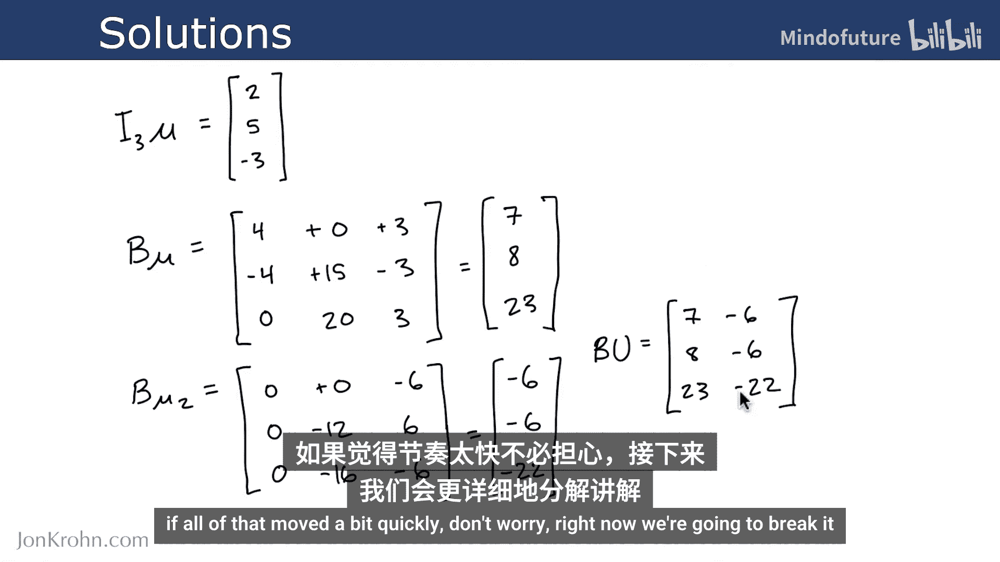
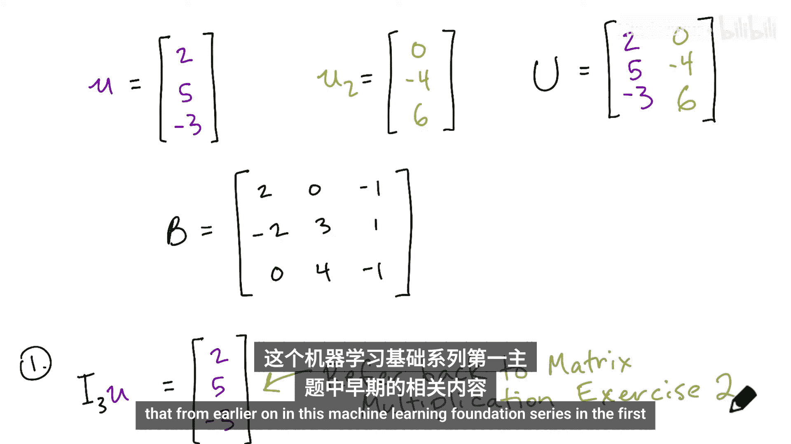
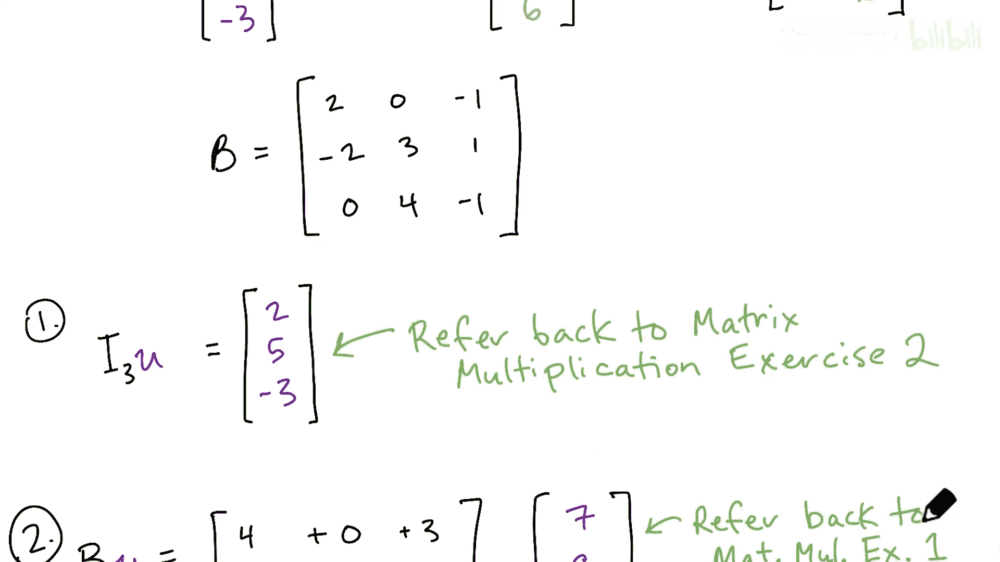
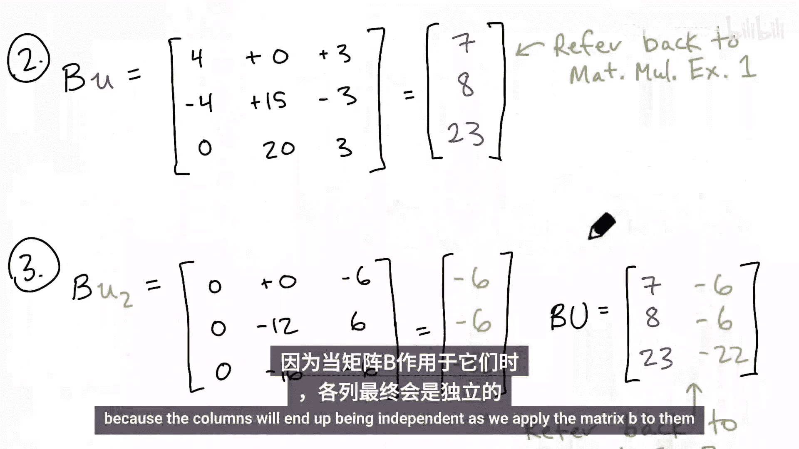
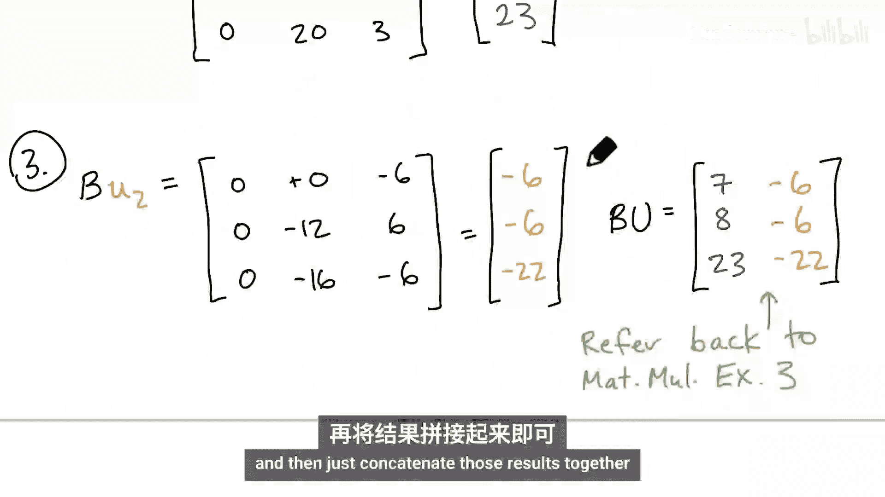
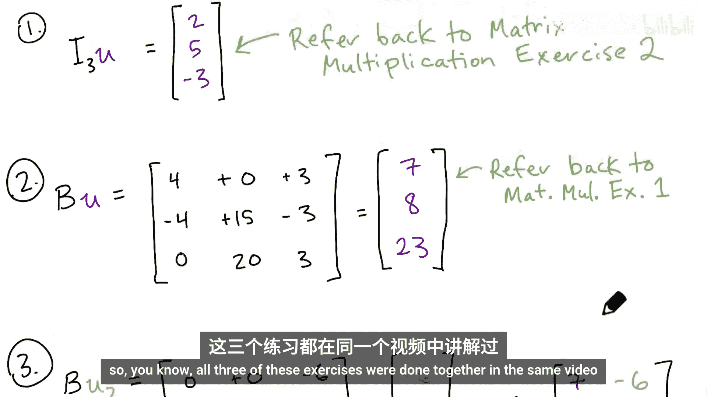
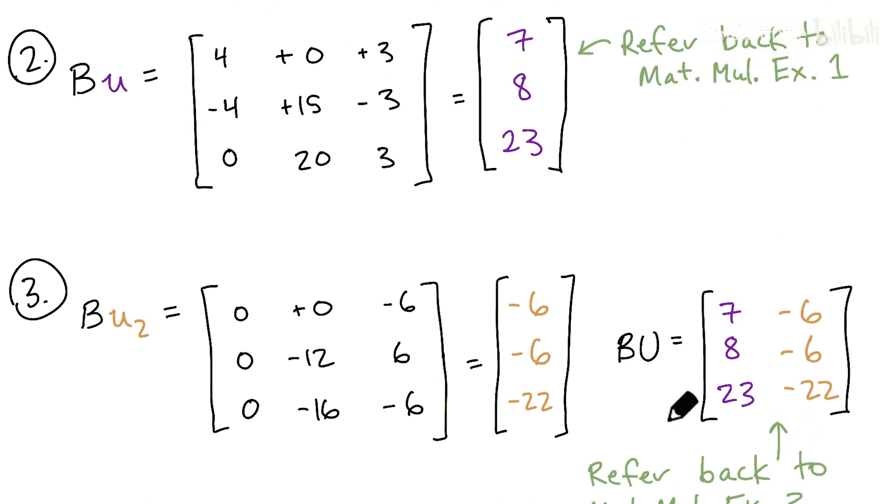
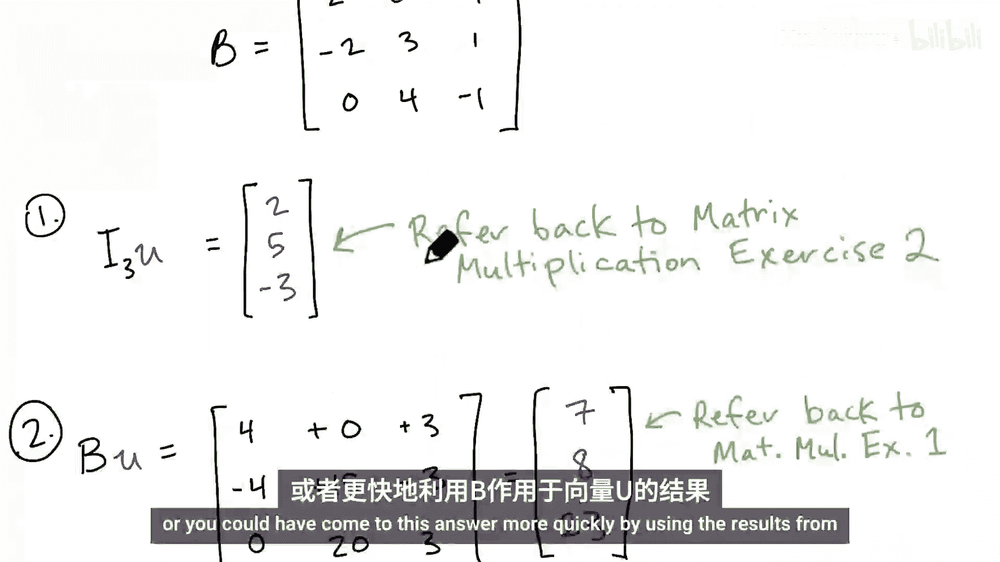
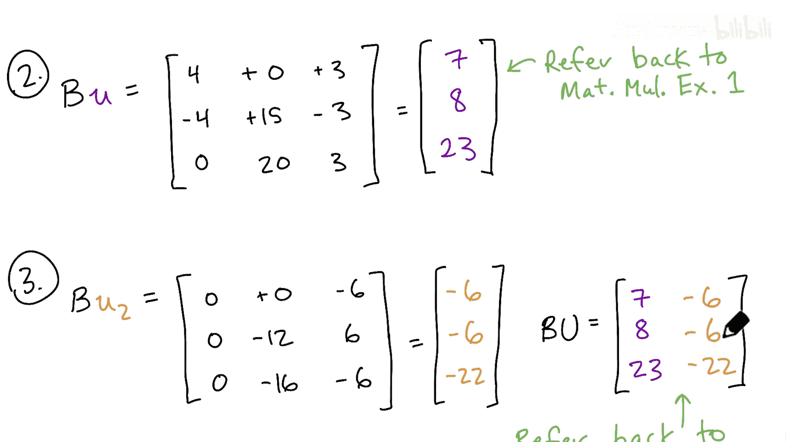

# 032：应用矩阵

在本节课中，我们将学习如何应用矩阵。理解矩阵如何作用于向量或张量，是后续学习特征分解、特征向量和特征值等核心概念的基础。为了确保大家掌握这一基础操作，我们将一起完成三个矩阵应用的练习。

## 概述

本节内容将分为三个练习，从简单的单位矩阵应用开始，逐步过渡到一般矩阵对向量和矩阵的乘法操作。我们将通过手算和逻辑推导来理解每一步，为后续的Python代码实现打下坚实基础。

---

### 练习1：应用单位矩阵

首先，我们来看第一个练习：将3阶单位矩阵 **I₃** 应用到向量 **u** 上。

以下是具体步骤：
*   应用操作即执行矩阵乘法：**I₃** × **u**。
*   根据单位矩阵的性质，任何向量与单位矩阵相乘，结果都是该向量本身。
*   因此，**I₃u = u**。

这个练习帮助我们巩固单位矩阵是线性变换中的“恒等变换”这一概念。

---

### 练习2：应用一般矩阵

上一节我们应用了单位矩阵，本节中我们来看看如何将一个一般的矩阵 **B** 应用到向量 **u** 上。

以下是具体步骤：
*   应用操作即执行矩阵乘法：**B** × **u**。
*   这需要计算一系列点积并求和。
*   根据矩阵乘法规则，我们得到结果向量为 **[7, 8, 23]ᵀ**。

这个计算过程是理解矩阵如何对向量进行线性变换的关键。

---

### 练习3：应用矩阵到矩阵

在理解了矩阵对向量的应用后，我们现在将难度提升一步：将矩阵 **B** 应用到一个由两个列向量拼接而成的矩阵 **U** 上。

以下是具体步骤：
1.  首先，将列向量 **u** (紫色) 和 **u₂** (橙色) 水平拼接，构成矩阵 **U = [u | u₂]**。
2.  应用操作即执行矩阵乘法：**B** × **U**。
3.  矩阵乘法的一个重要性质是：**B** 与 **U** 的乘积，其每一列等于 **B** 分别与 **U** 的每一列相乘的结果。
4.  因此，**BU = [Bu | Bu₂]**。我们已经从练习2中得到了 **Bu**，只需再计算 **Bu₂** 并将其作为新的一列拼接到结果中即可。

通过这个练习，我们认识到对矩阵的乘法可以分解为对其各列向量的独立操作，这大大简化了计算和理解。

---

## 总结

本节课中我们一起学习了矩阵应用的基础操作。我们通过三个练习，从单位矩阵的恒等变换，到一般矩阵与向量的乘法，最后扩展到矩阵与矩阵的乘法。我们掌握了核心的矩阵乘法规则，并理解了一个重要性质：矩阵 **A** 乘以矩阵 **B**，结果矩阵的每一列就是 **A** 乘以 **B** 的对应列向量。这些手算练习为我们接下来使用Python进行大规模的矩阵运算做好了充分准备。