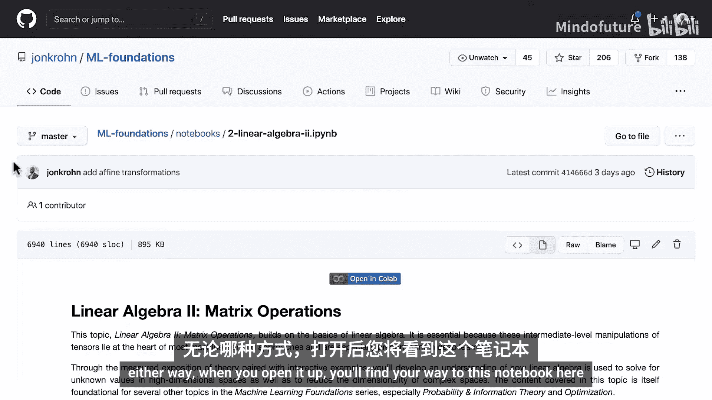
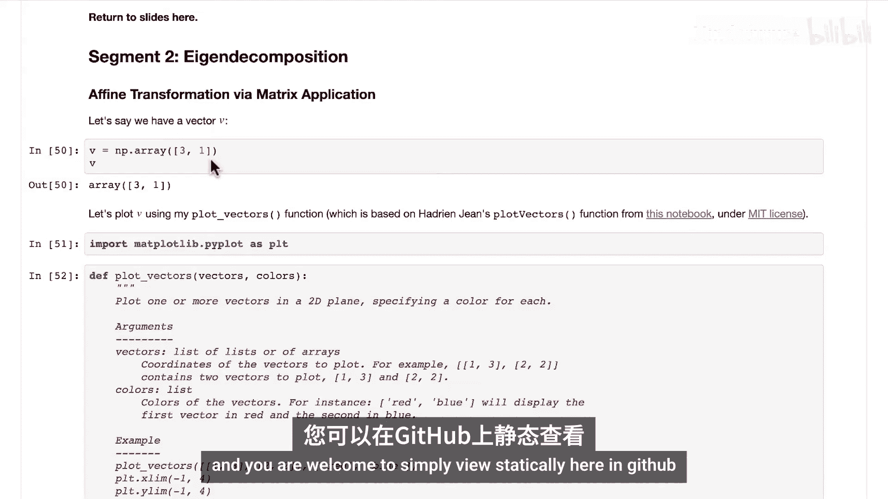
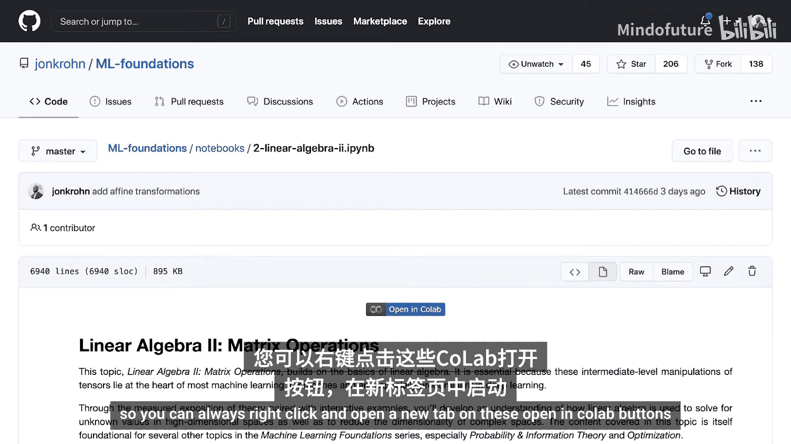
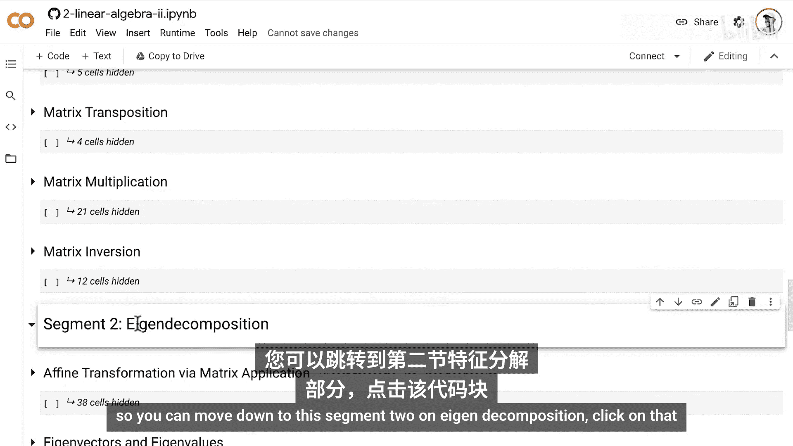
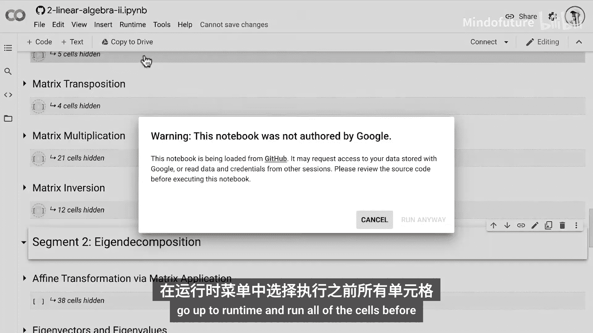
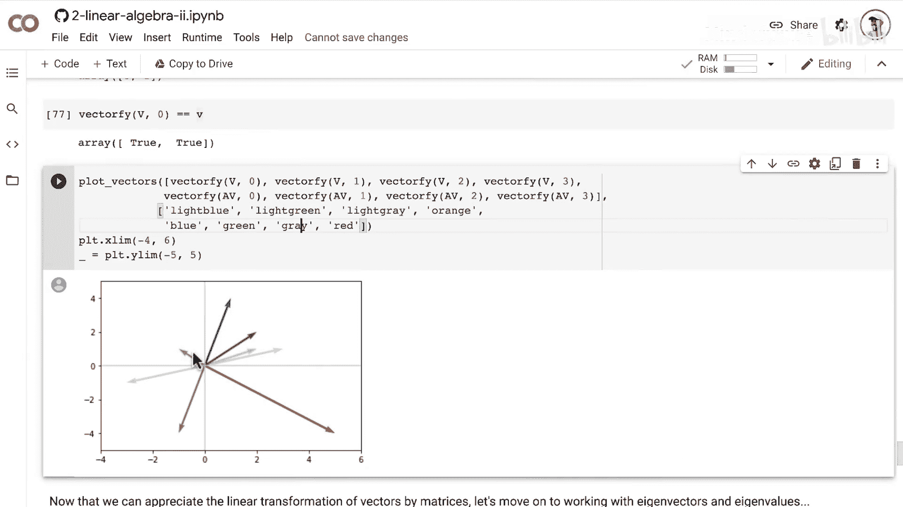
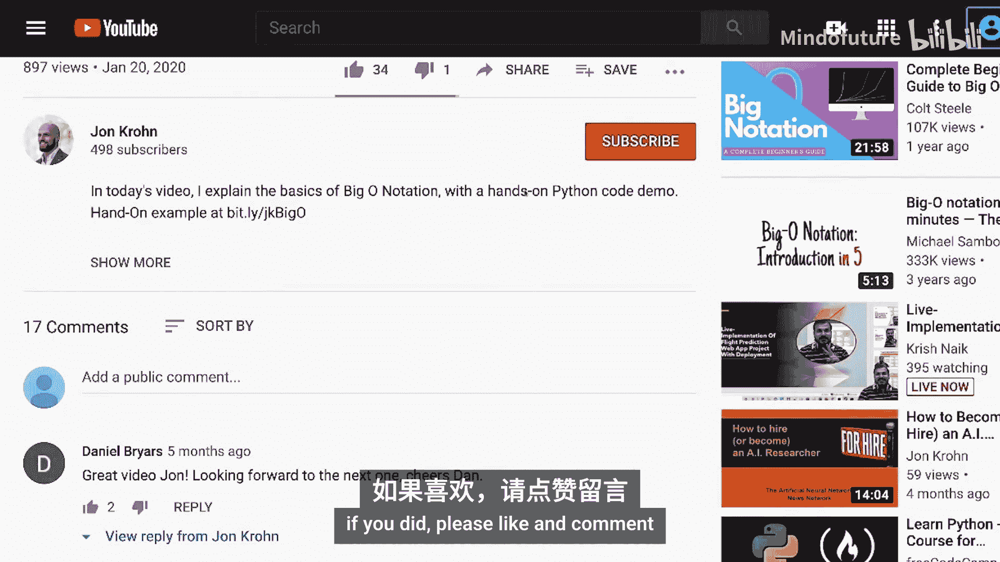

# 033：仿射变换 🧮

在本节中，我们将通过NumPy的动手代码演示，来积累仿射变换的实际操作经验。仿射变换是一类特别有用的变换，例如翻转和旋转，我们通过应用矩阵来实现它们。


## 概述

我们将学习如何使用矩阵对向量进行仿射变换，包括翻转、缩放、剪切和旋转等操作。通过具体的Python代码示例，你将直观地理解矩阵如何改变向量的几何属性。


## 准备工作



为了进行本次动手代码演示，请访问我的机器学习基础GitHub仓库：`https://github.com/jochone/mlfoundations`。


然后找到第二个名为 `linear_algebra_2_matrix_operations` 的笔记本。你可以直接点击此处的链接，也可以在 `notebooks` 目录下找到它。






无论哪种方式，当你打开它时，都会看到这个笔记本。


和往常一样，你可以选择直接查看已执行的代码。我们现在从这个笔记本的第二部分“特征分解”开始。

## 在Google Colab中运行



你可以直接在GitHub上静态查看，但我建议在Google Colab中交互式地跟随操作，以获得最佳体验。




你可以在“Open in Colab”按钮上右键单击，在新标签页中打开。


只要你有一个免费的Google账户（例如Gmail），就可以进入一个可执行的笔记本。

首先，让我们清除所有输出。我已经在静态版本中包含了所有输出，但交互式执行时，我们希望在运行代码前没有预先存在的输出。

我们已经回顾了所有基础的线性代数内容，因此不需要再次执行那些复习代码。请直接滚动到“特征分解”的第二部分。


点击该代码块，然后转到“运行时”菜单，选择“运行前面的所有单元格”。你可以信任并忽略任何警告，继续运行。


这可能需要一些时间来运行所有单元格。

你可以看到，Google Colab会折叠部分章节。默认情况下，你可以看到前几个部分。如果你想查看其他部分，可以点击这里的三角形图标展开。然而，我们不需要查看那些复习内容，我们感兴趣的是“特征分解”部分的新内容，特别是“通过矩阵应用进行仿射变换”这一节。

## 绘制向量

假设我们有一个向量 **v**。

```python
v = np.array([3, 1])
```

这个向量 **v** 是一个长度为2的向量，包含元素3和1。

我们可以使用我的 `plot_vectors` 函数来绘制这个向量。该函数基于Hadrien Jean的 `plot_vectors` 函数（在本笔记本中，我根据MIT许可证进行了改编）。`plot_vectors` 函数接收一个向量列表（或NumPy数组列表）以及我们希望向量显示的颜色。

例如，我们可以传入一个只包含一个元素（即NumPy数组 **v**）的列表，并指定我们希望该向量显示为浅蓝色。

运行代码后，我们看到了浅蓝色的向量 **v**，它延伸到x轴值为3，y轴值为1的位置，对应向量 **v** 本身指定的坐标。

需要注意的一点是，我设置了坐标轴范围，使图形美观地显示。我通常将x轴和y轴的范围都设置为从-1到5。随着我们绘制不同的图形，我会经常更改这些范围，因为从不同的视角看，向量会呈现不同的效果。

## 矩阵应用与线性变换

正如我们在上一个视频中用纸笔练习矩阵应用时所看到的，对一个向量应用矩阵（即执行矩阵向量乘法）可以线性变换该向量。例如，它可以旋转或缩放向量。

之前介绍的**单位矩阵**是一个例外，它证明了规则：应用单位矩阵不会改变向量。

让我们创建一个2x2的单位矩阵 **I2**，它可以应用于长度为2的向量。然后，我们使用NumPy的 `dot` 方法执行矩阵与向量的乘法。

```python
I2 = np.eye(2)
v_transformed = np.dot(I2, v)
```

当然，正如我们现在所知，将单位矩阵应用于向量，结果就是向量本身。因此，应用单位矩阵后，向量 **v** 与变换前的 **v** 完全相同。

在接下来的演示中，我将展示向量在应用矩阵之前和之后的样子。我会用浅色表示“之前”，用深色表示“之后”。例如，用浅蓝色表示应用矩阵前的向量 **v**，用深蓝色表示应用矩阵后的向量。

## 翻转（反射）变换

现在，考虑一个非单位矩阵。我们称这个矩阵为 **E**。我选择的这个特定矩阵 **E** 会将向量沿x轴翻转。

```python
E = np.array([[1, 0],
              [0, -1]])
```

如果你想让一个向量沿x轴翻转，而不进行其他变换，那么就应该应用这个矩阵 **E**。你不需要记住它，我们只是以此为例。在机器学习中，沿x轴翻转向量可能并不常用。

当我们对向量 **v** 应用矩阵 **E** 时，会得到一个新向量。

```python
v_flipped_x = np.dot(E, v)
```

这个新向量的y值从正1翻转为负1，从而有效地将向量沿x轴翻转。在图中，你可以看到变换前的向量 **v**（浅蓝色）和应用矩阵 **E** 后的向量（深蓝色）。

`plot_vectors` 方法的工作原理是：我们传入两个向量的列表（变换前的 **v** 和应用 **E** 后的 **v**），然后指定我们想要的颜色（**v** 用浅蓝色，**E v** 用深蓝色），以区分“之前”和“之后”。

类似地，让我们看第二个例子：矩阵 **F**，它使向量沿y轴翻转。

```python
F = np.array([[-1, 0],
              [0, 1]])
```

这里，我们在第一行第一列的位置有一个-1，而对于沿x轴翻转，负号在第二行第二列。如果你想沿y轴翻转向量，这就是你要使用的矩阵。

对向量 **v** 应用 **F**，现在第一位置的正3变成了负3。当我们绘制出来时，可以看到变换前的向量 **v** 通过应用矩阵 **F** 被沿y轴翻转了。

## 什么是仿射变换？

应用翻转矩阵（如我们做的沿x轴或y轴翻转）是**仿射变换**的一个例子。

仿射变换是一种几何变化，它可能会调整向量之间的距离或角度，但会**保持向量之间的平行关系**。如果我们有多个向量，当应用仿射变换时，如果其中两个向量原本是平行的，那么变换后它们将保持平行，尽管其他几何属性（如向量间的距离或角度）可能发生了变化。

我们稍后会看一些这方面的例子。

## 其他常见的仿射变换

除了沿轴翻转（也称为反射）之外，其他常见的仿射变换包括：

*   **缩放**：改变向量的长度。
*   **剪切**：有点难以用语言描述，但我很快会以蒙娜丽莎画像为例进行展示。
*   **旋转**：仿射变换的另一个例子。

你可以点击[此博客文章](链接)查看关于Python中仿射变换的出色解读，包括比我这里列出的更多的内容。该博客文章还讨论了如何将仿射变换不仅应用于向量（就像我们正在做的），还应用于图像。虽然这超出了机器学习基础的范围，但可能是你感兴趣的内容。进行机器学习并不需要知道如何做这个，但它可能很有趣。

## 组合变换

一个矩阵不仅可以执行单一的仿射变换（如缩放、剪切、旋转或反射），还可以**同时应用多个仿射变换**。

例如，你可以有一个矩阵，它既将向量沿特定轴翻转，又将其旋转45度。

让我们看看当我们将矩阵 **A** 应用于向量 **v** 时会发生什么。

```python
A = np.array([[0.8, -0.3],
              [0.3, 0.8]])
```

这个矩阵 **A** 将同时执行多个仿射变换，事实上多到我无法具体说出它只做了某一种。它同时进行了好几种不同的仿射变换，并且会根据向量的位置产生非常不同的影响。

首先，让我们看看将矩阵 **A** 应用于我们一直使用的向量 **v** 的效果。

绘制应用矩阵 **A** 的影响：我们得到可靠的向量 **v**（浅蓝色），应用矩阵 **A** 后，它被变换了：它被旋转了，长度可能略有不同，但大致相同，主要是旋转了这个向量。

再举一个应用 **A** 的例子，让我们使用一个不同的起始向量。如果我们有这个浅绿色的向量 **v2**，那么对其应用矩阵 **A** 会得到这个深绿色的向量。我们可以看到它像第一个浅蓝色向量一样被旋转了，但旋转幅度不同。这是因为它的长度不同。

根据向量的特定属性，矩阵对向量的影响也会不同。

## 同时变换多个向量

为了同时将矩阵应用于多个向量，我们可以将几个向量连接成一个矩阵。让我们创建矩阵 **V**，其中该矩阵的每一列都是一个单独的向量。

```python
# 将向量转为列向量并拼接
v_col = v.reshape(-1, 1)
v2_col = v2.reshape(-1, 1)
v3_col = v3.reshape(-1, 1)
v4_col = v4.reshape(-1, 1)

V = np.concatenate((v_col, v2_col, v3_col, v4_col), axis=1)
```

然后，我们对 **V** 应用的任何线性变换都将独立地应用于每个列向量。

如果我们对矩阵 **V** 应用单位矩阵，正如根据我们目前所学的理论和做过的纸笔练习所预期的那样，矩阵 **V** 会原样返回。

相反，当我们应用一个非单位矩阵，比如我们的矩阵 **A** 时，我们最终会变换所有四个列向量。

我创建了一个小函数 `vectorify`，将矩阵的列转换回我们可以用 `plot_vectors` 函数轻松绘制的1维向量。

我们可以使用 `vectorify` 函数从矩阵 **V** 或应用矩阵 **A** 后的矩阵 **A V** 中获取特定的列。

具体来说，我们将绘制矩阵 **V** 的第一、第二、第三、第四列，以及矩阵 **A V** 的第一、第二、第三、第四列。

我们将使用这些浅色（浅蓝、浅绿、浅灰、橙色）表示“之前”，使用深色（深蓝、深绿、深灰、红色）表示“之后”。

绘制出来后，你可以看到我们的初始向量：有些我们之前见过，比如浅蓝色的向量 **v**，浅绿色的向量 **v2**，以及我们新的起始向量：浅灰色的 **v3** 和橙色的 **v4**。

正如我们单独绘制它们时一样：
*   浅蓝色向量 **v** 被变换到了这个深蓝色的位置和方向。
*   浅绿色向量 **v2** 被变换到了这里，与我们单独查看该向量变换时完全一样。
*   此外，我们的浅灰色向量被变换到了这里的深灰色位置。
*   最后，我们有这个橙色的向量 **v4**，它被反射并显著拉伸了。

我们可以看到，根据向量所在的位置，特定的仿射变换对其产生的影响可能会有显著不同。



## 总结

本节课中，我们一起学习了仿射变换的核心概念及其在NumPy中的实现。我们了解到：

1.  **仿射变换** 是一种保持平行关系的几何变换，包括翻转、缩放、剪切和旋转。
2.  通过**矩阵乘法**可以实现对向量的仿射变换。
3.  一个矩阵可以同时执行**多个变换**。
4.  通过将向量拼接成矩阵，可以**高效地同时变换多个向量**。
5.  变换的效果可能因向量的**初始位置和方向**而异。


现在我们已经能够理解矩阵对向量的线性变换，这为我们接下来学习**特征向量和特征值**做好了准备。

为了确保不错过本系列的下一个教程，请订阅我的频道。感谢参与本教程，希望你喜欢。如果喜欢，请点赞和评论。




为确保不错过我的任何内容，请访问 `Johnchroone.com` 并注册我的电子邮件通讯。也欢迎在LinkedIn上加我，只需注明你是机器学习基础系列的观众。如果你喜欢，也可以在Twitter上关注我。


下次见。