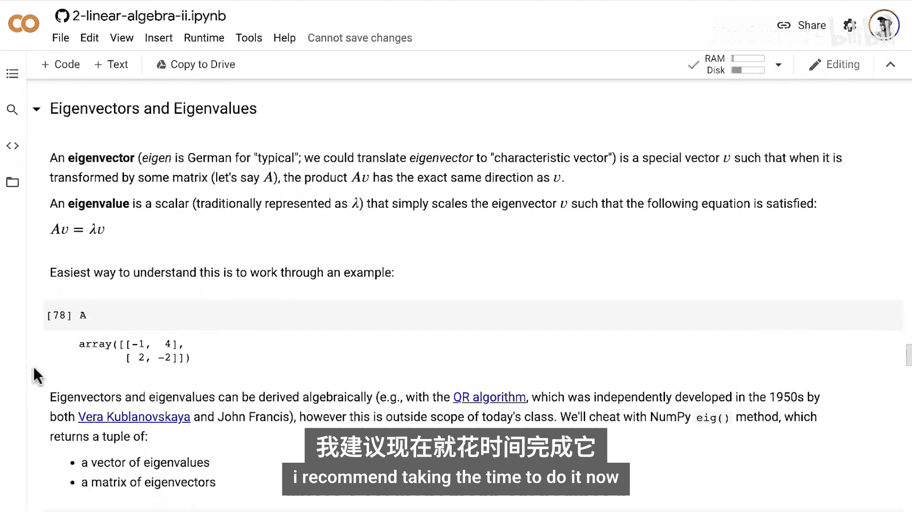
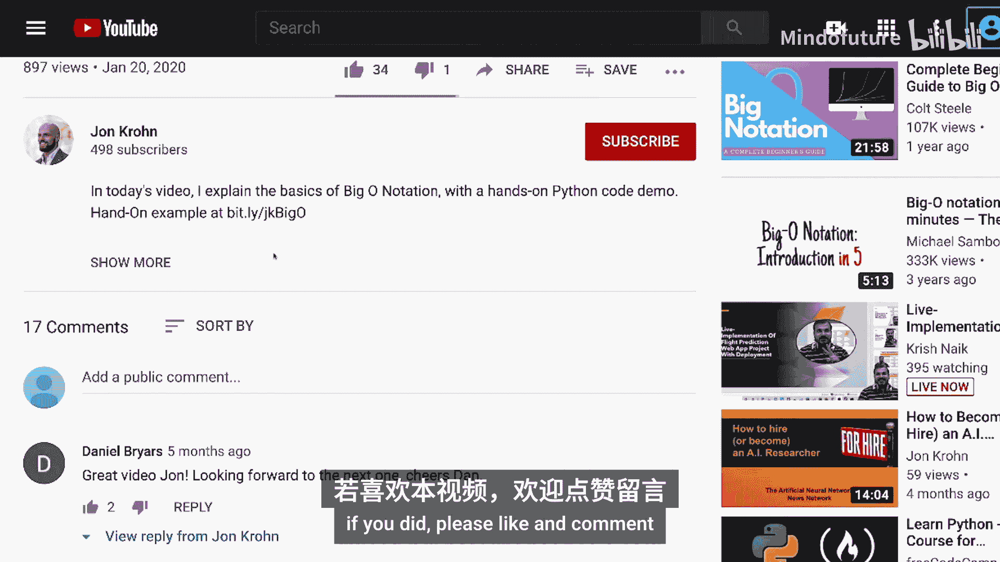

# 034：特征向量与特征值

在本节课中，我们将学习线性代数中两个核心概念：特征向量和特征值。我们将首先从高层次理解它们是什么，然后通过Python代码演示如何计算它们，并建立清晰直观的理解。

## 特征向量简介

上一节我们介绍了矩阵变换对向量的影响。本节中，我们来看看一类特殊的向量——特征向量。

特征向量是一个向量，当它被某个矩阵变换时，其方向保持不变（或恰好相反）。换句话说，变换后的向量与原向量位于同一条直线上。

以下是理解特征向量的一个直观例子：

*   假设我们有一幅蒙娜丽莎画像，上面覆盖了一个由正交基向量（红色垂直向量和蓝色水平向量）组成的网格。
*   如果我们应用一个**翻转矩阵**（使图像沿Y轴翻转），红色向量和蓝色向量都是该翻转矩阵的特征向量，因为它们的方向（或反向）得以保留。
*   如果我们应用一个**剪切矩阵**（使图像顶部像素右移，底部像素左移），蓝色水平向量仍然是特征向量（方向不变），但红色垂直向量不再是特征向量，因为它被“撞离”了原来的方向线。

所以，特征向量就是在特定矩阵变换下，方向保持不变的向量。

## 特征值简介

理解了特征向量后，本节我们来看看与之紧密相关的特征值。

特征值是一个标量，它告诉我们，当应用特定矩阵变换后，对应的特征向量的长度发生了多大的缩放。

以下是特征值的几个例子：

*   对于上述的**剪切矩阵**，蓝色特征向量的长度在变换前后没有变化（例如，长度保持5个单位）。因此，该特征向量对于此剪切矩阵的**特征值是1**。
*   如果另一个剪切矩阵使蓝色特征向量长度变为原来的两倍（例如，从5个单位变为10个单位），那么**特征值就是2**。
*   如果还有一个剪切矩阵使蓝色特征向量长度减半（例如，从5个单位变为2.5个单位），那么**特征值就是0.5**。
*   特征值也可以是**负数**。如果一个矩阵同时进行剪切和翻转，蓝色特征向量方向完全相反，但长度不变，那么**特征值就是-1**。如果长度也变为两倍，则特征值为-2。

## 数学定义与代码实现

上一节我们直观地理解了概念，本节中我们来看看其数学定义并用Python进行计算。

特征向量 **v** 和特征值 **λ** 满足以下核心方程：
**A v = λ v**
其中 **A** 是我们研究的矩阵，**v** 是特征向量，**λ** 是特征值。

虽然可以通过QR算法等代数方法求解，但为专注于机器学习应用，我们将直接使用NumPy和PyTorch库中的函数来计算。

以下是使用NumPy计算特征向量和特征值的步骤：

```python
import numpy as np

# 定义一个矩阵A
A = np.array([[2, 1],
              [1, 2]])

# 使用numpy.linalg.eig计算特征值和特征向量
# 返回值是一个元组：第一个元素是特征值数组，第二个元素是特征向量矩阵（每列是一个特征向量）
lambdas, V = np.linalg.eig(A)

print("特征值 (lambdas):", lambdas)
print("特征向量矩阵 (V):")
print(V)
```

运行后，我们可以验证第一个特征向量 `v1 = V[:, 0]` 和第一个特征值 `lambda1 = lambdas[0]` 是否满足方程 `A @ v1 == lambda1 * v1`。

以下是使用PyTorch实现相同计算的代码：

```python
import torch

# 创建与NumPy示例相同的矩阵，注意确保为浮点类型
A_torch = torch.tensor([[2., 1.],
                        [1., 2.]])

# 使用torch.linalg.eig计算，需要设置eigenvectors=True来获取特征向量
eigenvalues, eigenvectors = torch.linalg.eig(A_torch)

# 注意：torch.linalg.eig返回复数张量，对于实对称矩阵，特征值为实数
# 我们取其实部进行验证
lambdas_torch = eigenvalues.real
V_torch = eigenvectors.real

print("PyTorch 特征值:", lambdas_torch)
print("PyTorch 特征向量矩阵:")
print(V_torch)
```

同样，我们可以验证 `A_torch @ V_torch[:, 0] == lambdas_torch[0] * V_torch[:, 0]`。

## 高维空间中的特征向量

到目前为止，我们都在二维平面中讨论，便于可视化。本节我们来看看更高维度的情况。

特征向量的概念可以推广到任意维度的矩阵。对于一个 *n x n* 的方阵，我们通常可以找到 *n* 个特征值和对应的 *n* 个特征向量（可能存在重复或复数）。

以下是一个三维矩阵的例子：

```python
# 定义一个3x3矩阵
X = np.array([[4, 1, -1],
              [1, 4, 1],
              [-1, 1, 4]])

# 计算特征值和特征向量
lambdas_3d, V_3d = np.linalg.eig(X)

print("3D矩阵的特征值:", lambdas_3d)
print("3D矩阵的特征向量矩阵（每列为一个特征向量）:")
print(V_3d)
```

我们可以选取第一个特征向量 `v1_3d = V_3d[:, 0]` 和第一个特征值 `lambda1_3d = lambdas_3d[0]`，并验证 `X @ v1_3d` 是否等于 `lambda1_3d * v1_3d`。对于其他特征向量，验证方法相同。

## 练习与总结

本节课中我们一起学习了特征向量和特征值的核心概念、数学定义及Python实现方法。

为了巩固理解，建议你完成以下练习：



*   使用PyTorch复现对三维矩阵 **X** 的特征值分解。
*   验证 **X** 的第二个和第三个特征向量是否满足方程 **X v = λ v**。

通过动手完成这些练习，你将能更扎实地掌握特征向量与特征值如何共同描述矩阵变换的核心特性。




在接下来的课程中，我们将学习矩阵的行列式，它是一个与特征值有特殊关系的标量值。