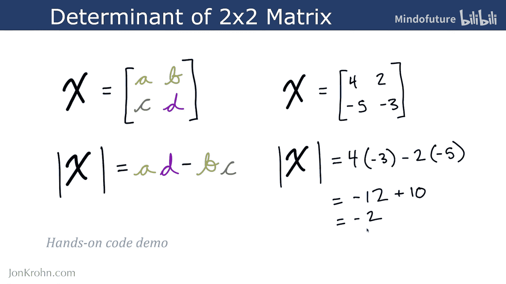
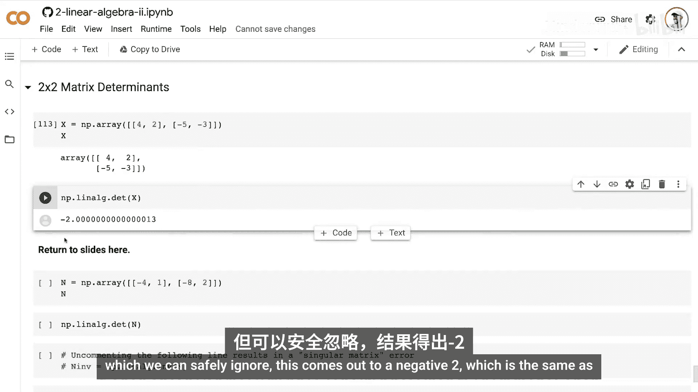
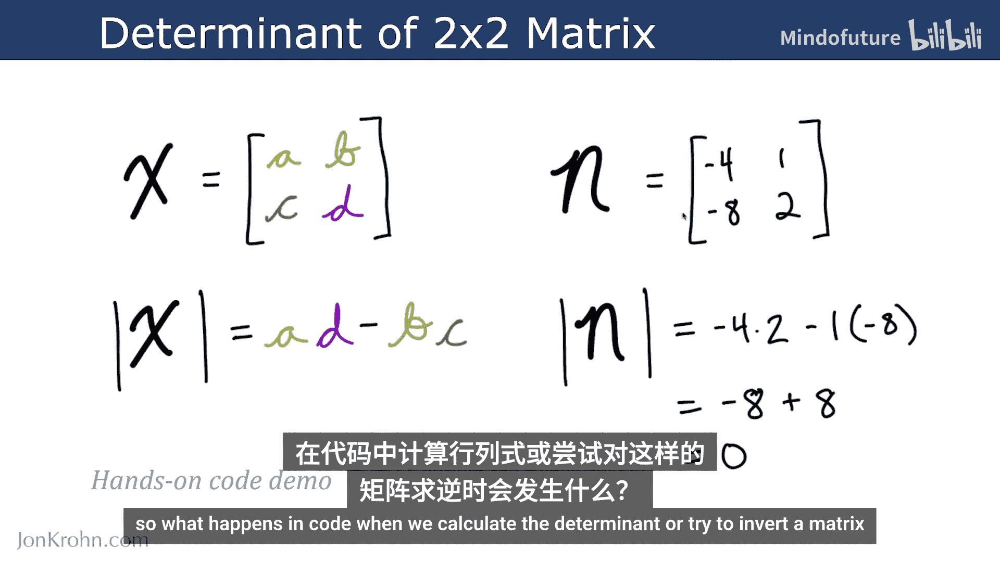
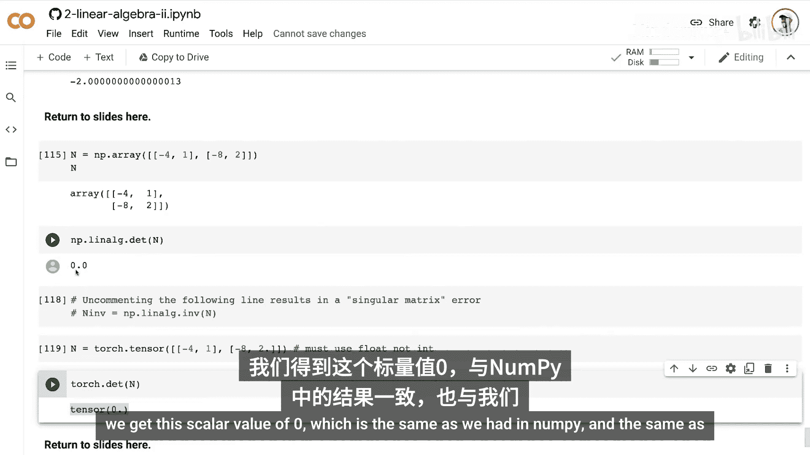

# 035：矩阵行列式

在本节课中，我们将要学习一个线性代数中的核心概念——矩阵的行列式。我们将了解它的定义、重要性、计算方法，并通过Python代码进行实践。

## 概述

行列式是一个特殊的标量值，我们可以为任何给定的矩阵计算它。它有许多非常有用的性质，并且与特征值有着密切的关系，我们将在后续课程中探讨这一点。

## 什么是行列式？ 🧮

矩阵行列式将一个**方阵**映射为一个特殊的标量值。这里的关键在于，我们**必须**拥有方阵才能计算其行列式。

然而，行列式的作用不止于此。它使我们能够判断一个矩阵是否可逆。你可能还记得，在我的机器学习基础系列“线性代数入门”的第一个主题末尾提到，为了能够求逆矩阵，首先需要它是一个方阵。这也是为什么行列式将方阵映射为一个标量值的原因之一。

## 行列式与矩阵可逆性

接下来，我们来看看行列式如何进一步发挥作用。首先，了解其表示法：对于任何矩阵 **X**，我们将其行列式表示为 **det(X)**。

行列式开始展现其特殊价值的地方在于：如果 **det(X) = 0**，那么即使 **X** 是一个方阵，我们也无法求其逆矩阵。

我们无法求逆的原因在于，这对应着方程组无解或有无限多解的情况，例如两条直线不相交或完全重合。在这两种情况下，我们得到的是一个**奇异矩阵**。正如之前矩阵求逆部分所回顾的，奇异矩阵是不可逆的，我们无法在这两种情况下求解未知数。

这里涉及一些技术细节，但其核心要点是：如果我们计算矩阵 **X** 的行列式，结果为 0，那么该矩阵的逆矩阵就对应于行列式的倒数。而当行列式等于 0 时，其倒数无法计算，因为分母为零。

因此，如前所述，**det(X) = 0** 表明矩阵 **X** 虽然是方阵（暗示它可能可逆），但实际上是**奇异**的。它包含线性相关的列，对应着上述无解或无限多解的情况，意味着我们的方阵不可逆。

## 如何计算行列式？

计算行列式最容易从 2x2 矩阵开始，所以我们从这里入手。

假设我们有这样一个矩阵 **X**，其中所有数字都用带颜色的字母表示：

```
X = | a  b |
    | c  d |
```

计算该矩阵行列式的公式如下：

**det(X) = a * d - b * c**

我们可以使用两条竖线作为行列式的记号，它们看起来像绝对值符号，但应用于矩阵。因此，**det(X)** 等于 **a** 乘以 **d** 减去 **b** 乘以 **c**。每个元素都是标量值，所以这只是简单的算术运算。

让我们看一些实际数字来理解它。假设这是我们的矩阵 **X**：

```
X = |  4  -2 |
    | -5  -3 |
```

那么行列式是：
**4 * (-3) - (-2) * (-5)**
简化一下：4 * (-3) = -12，(-2) * (-5) = 10，所以 **-12 - 10 = -22**。因此，这个矩阵的行列式是 **-22**。

## Python代码演示：2x2矩阵

现在，让我们通过一个动手的代码演示来巩固理解。

以下是使用NumPy计算2x2矩阵行列式的示例：

```python
import numpy as np



# 创建与幻灯片中相同的矩阵
X = np.array([[4, -2],
              [-5, -3]])

# 使用NumPy线性代数模块中的det方法计算行列式
det_X = np.linalg.det(X)
print(f"矩阵X的行列式是: {det_X}")
# 输出结果（忽略舍入误差）应为 -22.0，与我们手动计算的结果一致。
```

## 另一个例子：奇异矩阵

让我们再看一个矩阵 **N** 的例子：



```
N = | -4   1 |
    |  8  -2 |
```

当我们计算 **a*d - b*c** 时：
**(-4) * (-2) - (1) * (8) = 8 - 8 = 0**

所以，这意味着矩阵 **N** 是不可逆的。实际上，你可以观察到这两列不是独立的，它们是相关的列。第一列是第二列的倍数（将第二列乘以 -4 就得到第一列）。这意味着我们的矩阵代表了两条平行的直线，因此它们永远不会相交，也就不可能求逆，无法求解两条直线相交点的未知数。

让我们看看在代码中计算这种矩阵的行列式或尝试求逆时会发生什么：

```python
import numpy as np

# 创建矩阵N
N = np.array([[-4, 1],
              [8, -2]])

# 计算行列式
det_N = np.linalg.det(N)
print(f"矩阵N的行列式是: {det_N}")
# 输出结果应为 0.0

# 尝试求逆矩阵N（取消注释以下代码行会报错）
# inv_N = np.linalg.inv(N)  # 这将抛出“奇异矩阵”错误
```

正如预期，计算行列式得到零。如果你尝试求逆矩阵 **N**，它将无法工作，并抛出一个“奇异矩阵”错误，这正是我们所预期的，因为该矩阵中没有独立的列。



## 在PyTorch中计算行列式

另外，也让你了解一下如何在PyTorch中计算行列式（PyTorch正逐渐成为我最喜欢的库之一）：

```python
import torch

# 创建相同的张量
N_torch = torch.tensor([[-4.0, 1.0],
                        [8.0, -2.0]])

# 使用PyTorch的det方法计算行列式
det_N_torch = torch.linalg.det(N_torch)
print(f"PyTorch计算的矩阵N行列式是: {det_N_torch}")
# 输出结果同样应为 0.0
```

## 总结

在本节课中，我们一起学习了矩阵行列式。我们了解到：



1.  行列式是一个将**方阵**映射为标量值的函数。
2.  如果行列式的值为 **0**，则矩阵是**奇异**的，**不可逆**。
3.  对于 2x2 矩阵 **|a b; c d|**，其行列式的计算公式为 **det = a*d - b*c**。
4.  我们使用NumPy和PyTorch库在Python中实践了行列式的计算，并验证了奇异矩阵的性质。

现在我们已经知道如何计算 2x2 矩阵的行列式，这并不太复杂。在接下来的课程中，我将展示如何使用递归来计算更大矩阵的行列式。