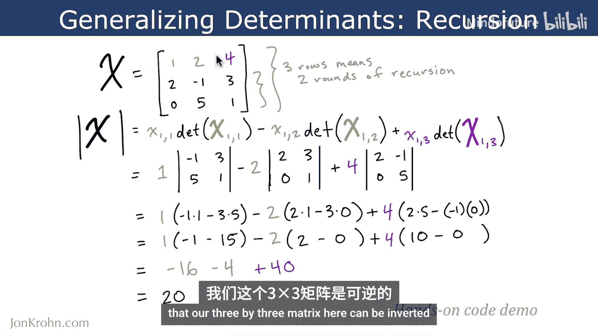
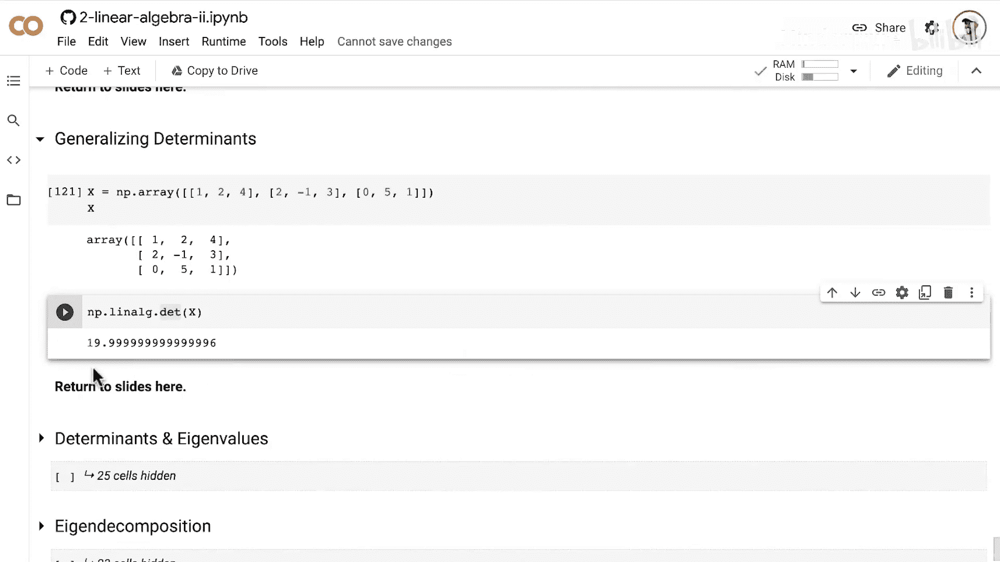

# 036：大型矩阵的行列式

在本节课中，我们将要学习如何计算大于2x2矩阵的行列式。我们将使用递归的方法，将计算大型矩阵行列式的问题，分解为一系列更小的、我们已经知道如何解决的子问题。

## 概述

上一节我们介绍了如何计算2x2矩阵的行列式。本节中，我们来看看当矩阵规模更大时，例如3x3、4x4甚至5x5矩阵，如何计算其行列式。核心思想是**递归**：通过计算一系列更小矩阵的行列式，最终得到原大矩阵的行列式。

## 递归计算原理

为了计算一个n x n矩阵的行列式，我们需要进行多轮递归。以5x5矩阵为例，计算过程如下：

以下是计算步骤的分解：
1.  首先，计算矩阵底部两行中所有2x2子矩阵的行列式。
2.  然后，利用这些结果，计算底部三行中所有3x3子矩阵的行列式。
3.  接着，再利用这些结果，计算所有4x4子矩阵的行列式。
4.  最后，利用4x4行列式的结果，计算出最终的5x5矩阵行列式。

通用的递归计算公式如下。对于一个矩阵 **X**，其行列式 `det(X)` 的计算公式为：

`det(X) = x11 * det(X11) - x12 * det(X12) + x13 * det(X13) - x14 * det(X14) + ...`

其中：
*   `x11`, `x12`, `x13`... 是矩阵 **X** 第一行的元素。
*   `X11` 是一个 (n-1) x (n-1) 的子矩阵，它由原矩阵 **X** 中**去掉**第1行和第1列的所有元素组成。
*   `X12` 同样是一个 (n-1) x (n-1) 的子矩阵，它由原矩阵 **X** 中**去掉**第1行和第2列的所有元素组成。
*   以此类推。

**注意**：公式中的符号是交替的，以 `+` 号开始，然后是 `-`，接着又是 `+`，如此循环。

## 实例演算：3x3矩阵

现在，让我们通过一个具体的3x3矩阵例子来实践这个递归过程。我们将计算以下矩阵的行列式：

```
X = [[1, 2, 4],
     [3, -1, 5],
     [0, 1, 2]]
```

根据公式，计算步骤如下：

以下是详细计算过程：
1.  **第一项**：`x11 * det(X11)` = `1 * det([[ -1, 5 ], [ 1, 2 ]])` = `1 * ((-1)*2 - 5*1)` = `1 * (-2 - 5)` = `-7`
2.  **第二项**：`- x12 * det(X12)` = `- 2 * det([[ 3, 5 ], [ 0, 2 ]])` = `-2 * (3*2 - 5*0)` = `-2 * (6 - 0)` = `-12`
3.  **第三项**：`+ x13 * det(X13)` = `+ 4 * det([[ 3, -1 ], [ 0, 1 ]])` = `4 * (3*1 - (-1)*0)` = `4 * (3 - 0)` = `12`

最后，将三项结果相加：`-7 + (-12) + 12 = -7`。

因此，该3x3矩阵的行列式为 **-7**。由于结果不为0，我们可以知道这个矩阵是可逆的。

## Python代码实现

理解了手动计算过程后，我们可以使用Python的NumPy库来高效地计算行列式。这验证了我们的手动计算，并展示了在实际编程中的应用。

```python
import numpy as np

# 定义我们刚才计算的3x3矩阵
X = np.array([[1, 2, 4],
              [3, -1, 5],
              [0, 1, 2]])

# 使用NumPy的linalg.det函数计算行列式
det_X = np.linalg.det(X)
print(f"矩阵X的行列式是: {det_X}")
# 输出: 矩阵X的行列式是: -7.000000000000001
```



运行代码，我们会得到结果约为-7（存在极小的浮点数舍入误差），这与我们手动计算的结果一致。

## 总结



本节课中我们一起学习了计算大型矩阵行列式的递归方法。我们首先回顾了2x2矩阵的行列式公式，然后将其推广到更一般的n x n矩阵。关键点在于，通过沿矩阵第一行展开，将大矩阵的行列式计算转化为多个小矩阵行列式的加权和。最后，我们通过一个3x3矩阵的详细演算和Python代码实现，巩固了这一概念。掌握这个方法，你就能计算任意大小方阵的行列式，并据此判断矩阵是否可逆。