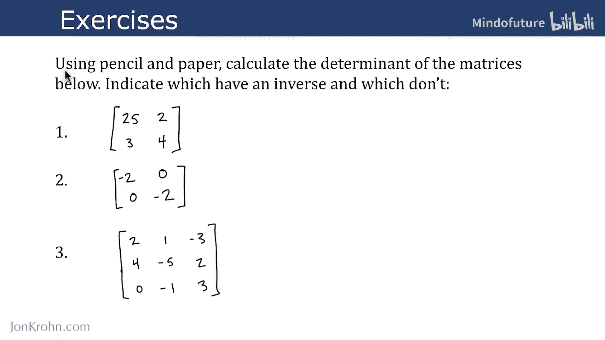
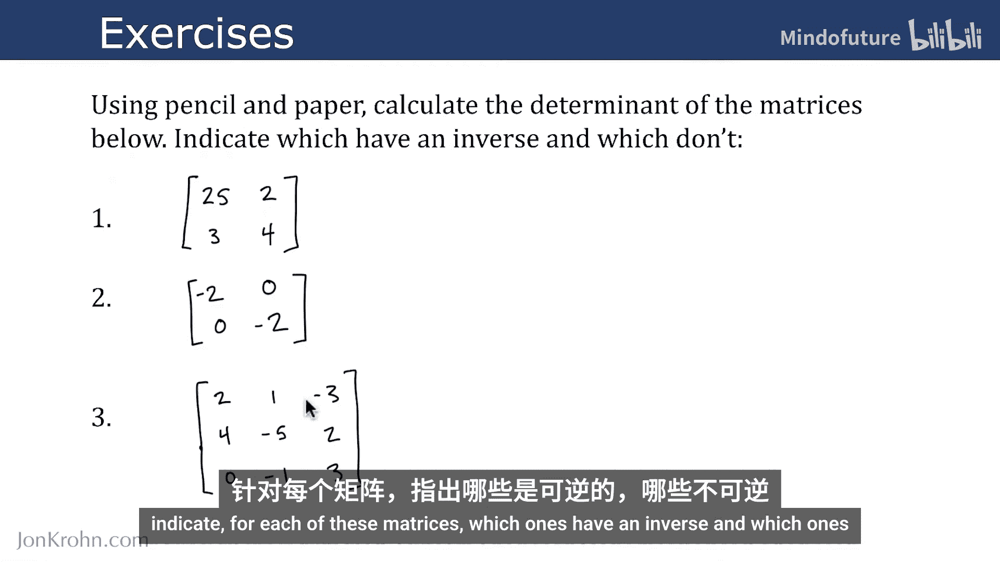
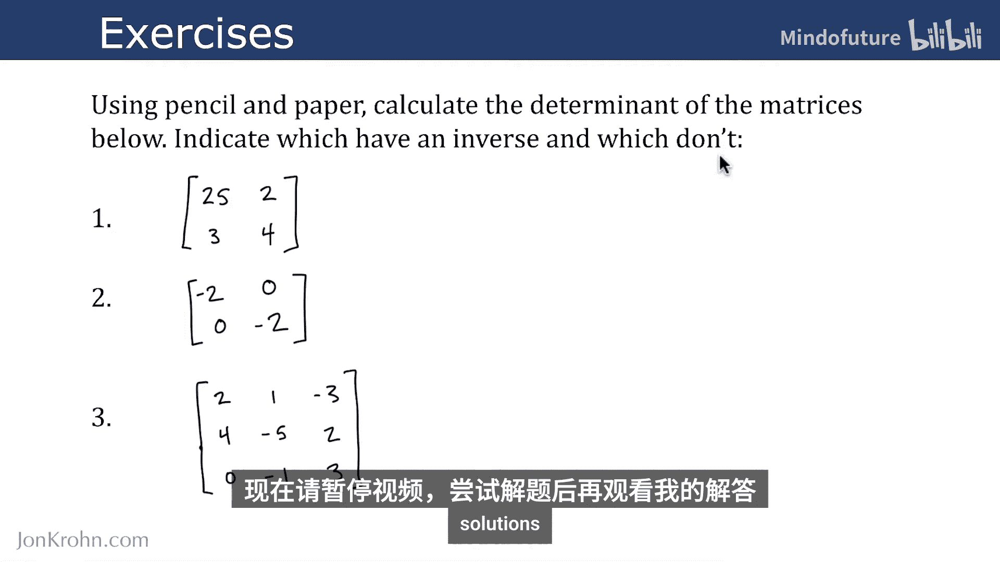
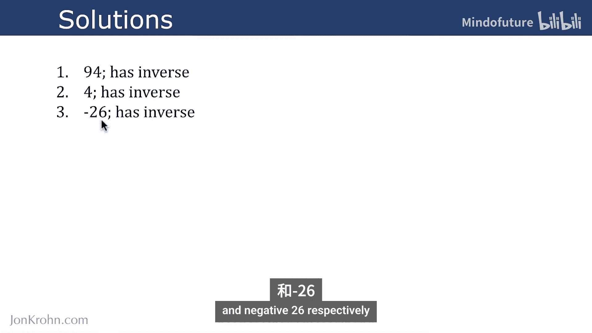
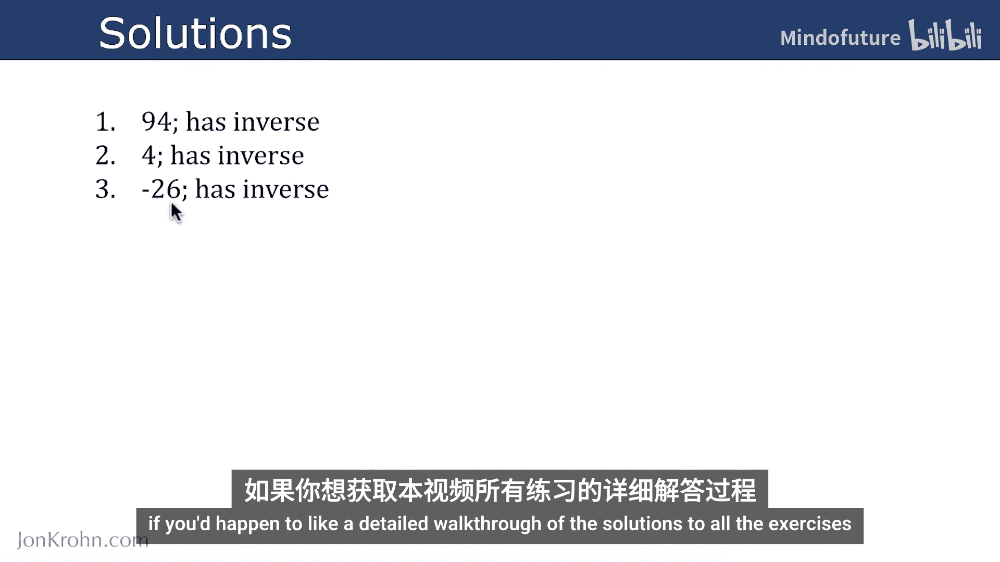
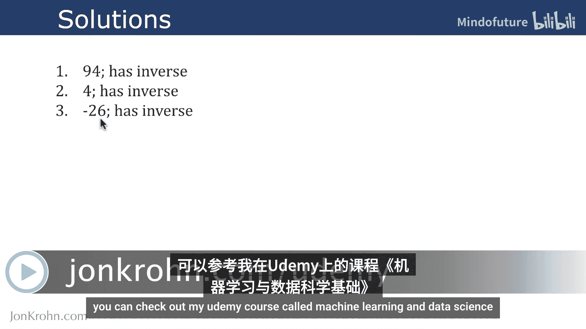

# 037：行列式练习

在本节课中，我们将通过三个具体的练习来测试你对行列式计算理论的理解。我们将手动计算几个矩阵的行列式，并判断它们是否可逆。

上一节我们介绍了计算任意大小矩阵行列式的理论方法。本节中我们来看看如何应用这些知识解决实际问题。

以下是三个需要计算的矩阵：

请使用纸笔计算以下矩阵的行列式。对于每个矩阵，指出哪些是可逆的，哪些是不可逆的。

建议在此处暂停视频，尝试自己解答，然后再查看下面的解决方案。

答案可能有些出乎意料：这三个矩阵**全部**都是可逆的。没有一个矩阵不可逆。计算这三个矩阵的行列式，得到的结果应分别为 **94**、**4** 和 **-26**。

需要说明的是，如果你想获得本视频中所有练习的详细分步解答，可以参考我的Udemy课程《机器学习与数据科学基础》。

做得很好。在下一个视频中，我们将探讨刚刚学习的矩阵行列式与之前学过的特征值之间巧妙的关系。

本节课中我们一起学习了如何手动计算矩阵的行列式并判断其可逆性。记住，一个方阵 **A** 可逆的充要条件是它的行列式不为零，即 **det(A) ≠ 0**。