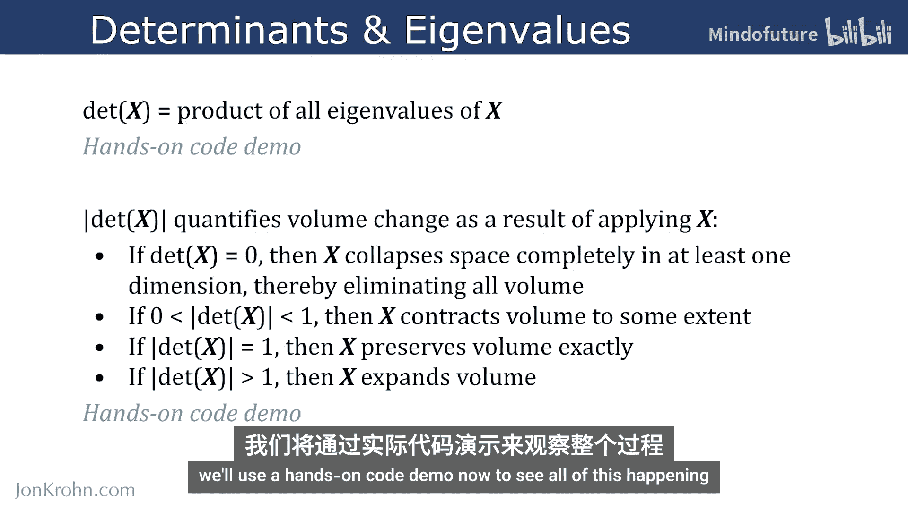
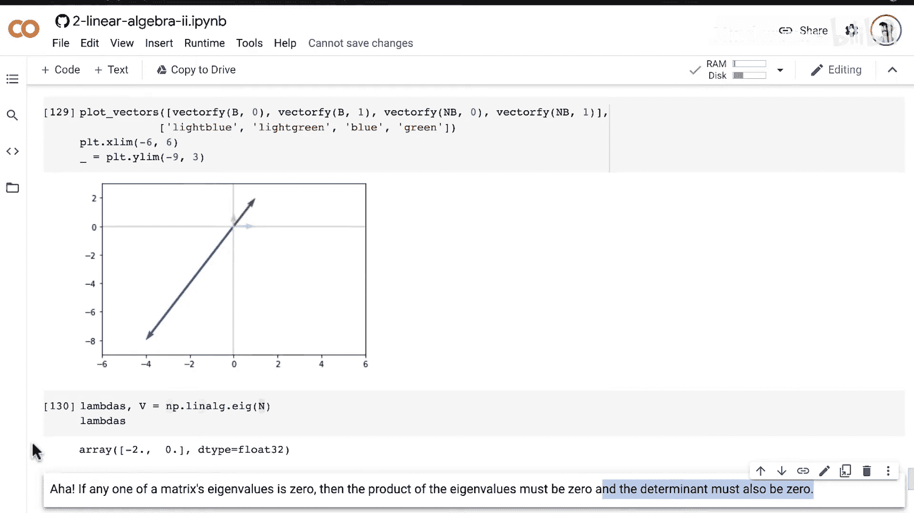
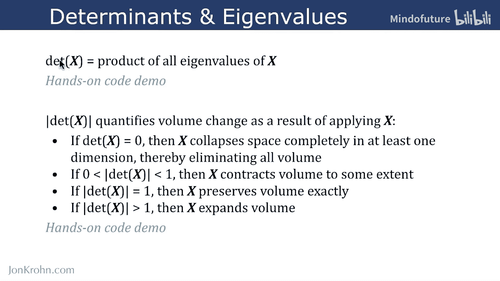
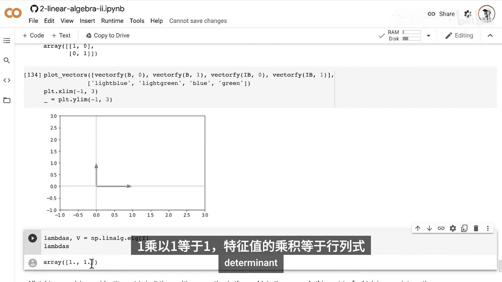
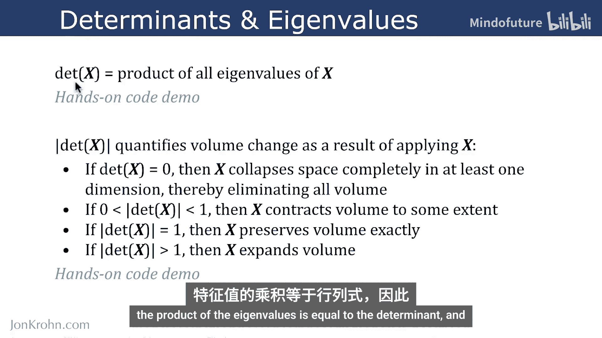
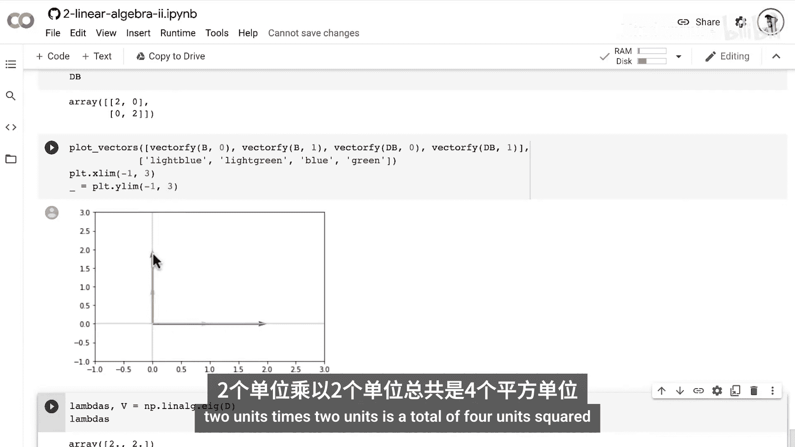

# 038：行列式与特征值

在本节课中，我们将学习行列式与特征值之间的一个重要关系。我们将通过Python代码演示来直观理解这一关系，并探讨其背后的几何意义。

## 概述

行列式与特征值之间存在一个简洁而重要的关系：**矩阵的行列式等于其所有特征值的乘积**。即，对于一个矩阵 **X**，有：

**公式：** `det(X) = λ₁ * λ₂ * ... * λₙ`

其中，λ₁, λ₂, ..., λₙ 是矩阵 **X** 的特征值。

我们将通过代码验证这个关系，并理解行列式的绝对值如何量化矩阵对向量空间体积的缩放效应。

## 理论回顾与代码验证

上一节我们提到了行列式与特征值乘积相等的关系。本节中，我们来看看如何用代码验证它。

我们首先使用一个已知行列式为20的3x3矩阵 **X**。

```python
import numpy as np



# 定义矩阵X
X = np.array([[1, 2, 3],
              [0, 4, 5],
              [1, 0, 6]])

# 计算行列式
det_X = np.linalg.det(X)
print(f"矩阵X的行列式 det(X) = {det_X}")
```

接下来，我们计算矩阵 **X** 的特征值，并验证它们的乘积是否等于行列式。

以下是计算步骤：
```python
# 计算特征值
eigenvalues = np.linalg.eigvals(X)
print(f"矩阵X的特征值: {eigenvalues}")

# 计算特征值的乘积
product_of_eigenvalues = np.prod(eigenvalues)
print(f"特征值的乘积: {product_of_eigenvalues}")

# 验证两者是否相等（考虑浮点数精度）
print(f"行列式与特征值乘积是否近似相等? {np.isclose(det_X, product_of_eigenvalues)}")
```
运行代码后，你会发现 `det(X)` 确实约等于所有特征值的乘积，从而验证了我们的核心公式。

## 行列式的几何意义

理解了数值关系后，我们进一步探讨其几何意义。矩阵 **X** 的行列式的绝对值 `|det(X)|`，量化了 **X** 作用于某个张量（例如一组向量）时引起的**体积变化**。

以下是不同行列式值对应的几何解释：

*   **`|det(X)| = 0`**：矩阵 **X** 是奇异的，不可逆。几何上，它至少在一个维度上完全坍缩了空间，使得应用后的张量体积为零。
*   **`0 < |det(X)| < 1`**：矩阵 **X** 会**收缩**张量的体积。例如，若 `|det(X)| = 0.5`，则体积变为原来的一半。
*   **`|det(X)| = 1`**：矩阵 **X** 会**保持**张量的体积不变。这是一种等距变换，如旋转或反射。
*   **`|det(X)| > 1`**：矩阵 **X** 会**扩张**张量的体积。例如，若 `|det(X)| = 4`，则体积变为原来的四倍。

## 通过基向量可视化体积变化

为了直观地看到这些变化，我们使用一组标准正交基向量 **B** 来进行实验。基向量矩阵 **B** 实际上就是一个单位矩阵 **I**，它描述了一个面积为1的单位正方形。

```python
import matplotlib.pyplot as plt

# 定义基向量矩阵B (即2x2单位矩阵)
B = np.eye(2)
# 基向量就是B的列向量
v1 = B[:, 0] # [1, 0]
v2 = B[:, 1] # [0, 1]

def plot_vectors(vectors, colors, title):
    """绘制向量"""
    plt.figure()
    ax = plt.gca()
    for i, v in enumerate(vectors):
        ax.quiver(0, 0, v[0], v[1], angles='xy', scale_units='xy', scale=1, color=colors[i])
    plt.xlim(-2, 2)
    plt.ylim(-2, 2)
    plt.grid()
    plt.title(title)
    plt.show()
```
现在，我们将应用几个具有不同行列式的矩阵到基向量 **B** 上，并观察其变化。

### 案例1：行列式为0的奇异矩阵

首先，我们应用一个奇异矩阵 **N**，其列向量线性相关。
```python
# 奇异矩阵N，第二列是第一列的-4倍
N = np.array([[2, -8],
              [1, -4]])
det_N = np.linalg.det(N)
print(f"矩阵N的行列式 det(N) = {det_N}") # 应为0





# 将N应用于基向量B
B_transformed = N @ B
print(f"变换后的向量：\n{B_transformed}")

# 绘制变换前后的向量
plot_vectors([v1, v2], ['blue', 'green'], '原始基向量')
plot_vectors([B_transformed[:, 0], B_transformed[:, 1]], ['lightblue', 'lightgreen'], '应用矩阵N后的向量')
```
你会发现，两个基向量被映射到了同一条直线上，它们所张成的面积（体积）变成了0。同时，计算其特征值，会发现至少有一个特征值为0，这使得所有特征值的乘积为0，与行列式一致。

### 案例2：行列式为1的矩阵（单位矩阵）



接着，我们应用单位矩阵 **I**，这是一个最简单的例子。
```python
# 单位矩阵I
I = np.eye(2)
det_I = np.linalg.det(I)
print(f"单位矩阵I的行列式 det(I) = {det_I}")



# 应用单位矩阵
B_transformed_I = I @ B # 结果仍是B

plot_vectors([B_transformed_I[:, 0], B_transformed_I[:, 1]], ['blue', 'green'], '应用单位矩阵I后的向量')
```
正如预期，向量没有任何变化，面积保持为1。单位矩阵的特征值全是1，乘积也为1。

### 案例3：行列式绝对值为1的变换矩阵

现在，看一个更一般的行列式绝对值为1的矩阵 **J**，它可能包含反射和缩放。
```python
# 矩阵J，其行列式为-1，绝对值为1
J = np.array([[-0.5, 0],
              [0,    2]])
det_J = np.linalg.det(J)
abs_det_J = np.abs(det_J)
print(f"矩阵J的行列式 det(J) = {det_J}, 绝对值 |det(J)| = {abs_det_J}")

# 应用矩阵J
B_transformed_J = J @ B

plot_vectors([B_transformed_J[:, 0], B_transformed_J[:, 1]], ['lightblue', 'lightgreen'], '应用矩阵J后的向量')

# 计算特征值
eigvals_J = np.linalg.eigvals(J)
print(f"矩阵J的特征值: {eigvals_J}")
print(f"特征值乘积: {np.prod(eigvals_J)}")
```
虽然矩阵 **J** 改变了向量的形状（一个反射并缩放到0.5倍，另一个伸长到2倍），但它们所围成的面积绝对值仍然是1（0.5 * 2 = 1）。特征值分别为-0.5和2，其乘积为-1，绝对值为1。

### 案例4：行列式大于1的缩放矩阵

最后，应用一个在所有轴上均匀缩放2倍的矩阵 **D**。
```python
# 缩放矩阵D
D = 2 * np.eye(2)
det_D = np.linalg.det(D)
print(f"缩放矩阵D的行列式 det(D) = {det_D}")

# 应用矩阵D
B_transformed_D = D @ B

plot_vectors([B_transformed_D[:, 0], B_transformed_D[:, 1]], ['blue', 'green'], '应用矩阵D后的向量')

# 计算特征值
eigvals_D = np.linalg.eigvals(D)
print(f"矩阵D的特征值: {eigvals_D}")
print(f"特征值乘积: {np.prod(eigvals_D)}")
```
两个基向量长度都变为2，围成的正方形面积变为4。矩阵 **D** 的特征值都是2，乘积为4，等于其行列式。



## 总结

本节课中，我们一起学习了行列式与特征值之间的核心关系：


1.  **核心公式**：矩阵的行列式等于其所有特征值的乘积，即 `det(X) = Π λᵢ`。
2.  **几何解释**：行列式的绝对值 `|det(X)|` 描述了矩阵 **X** 对向量空间产生的**体积缩放因子**。
    *   `|det(X)| = 0`：空间坍缩，体积为零。
    *   `|det(X)| = 1`：体积保持不变。
    *   `|det(X)| > 1`：体积扩张。
    *   `0 < |det(X)| < 1`：体积收缩。
3.  **直观验证**：我们通过Python代码，对基向量应用不同行列式的矩阵，直观地观察了体积的缩放变化，并验证了特征值乘积与行列式的相等关系。


理解这个关系将为我们下一课学习**矩阵的特征分解**打下坚实的基础。特征分解是将一个矩阵完全分解为它的特征向量和特征值表示的过程。