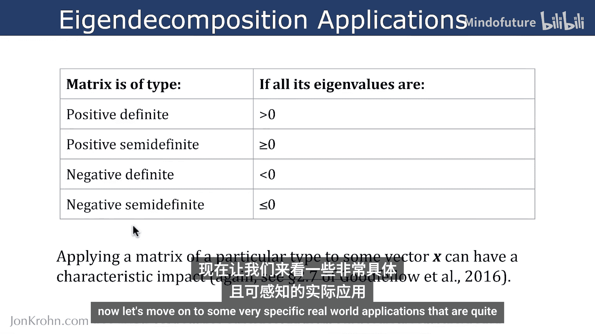
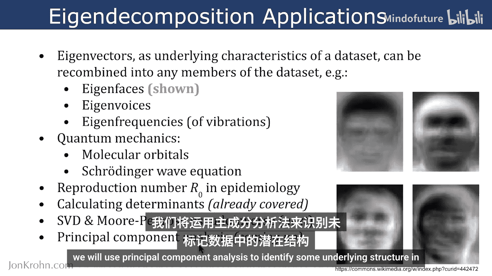
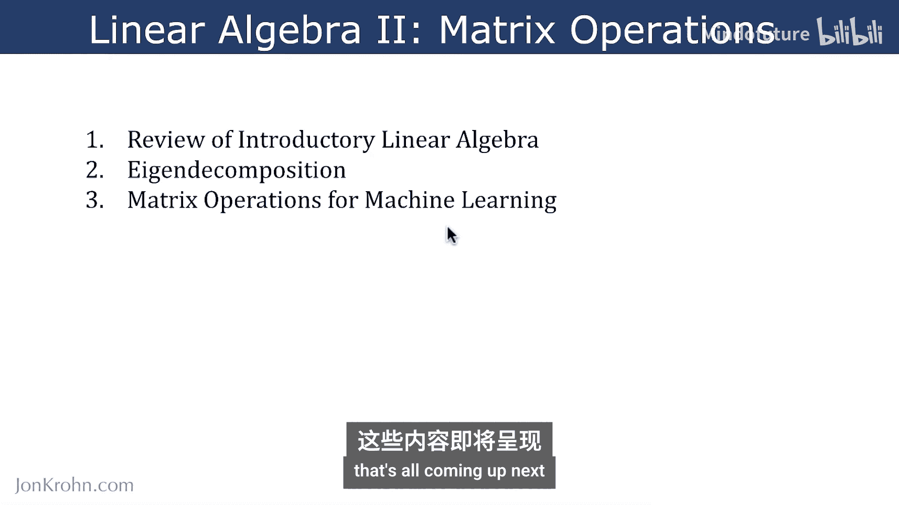
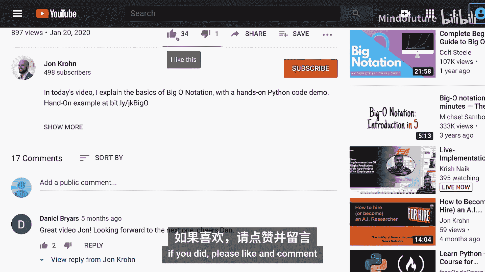

# 040：特征向量和特征值应用

在本节课中，我们将探讨特征向量和特征值在现实世界，特别是在机器学习领域中的具体应用。我们将从简单的几何变换开始，逐步深入到更复杂的矩阵类型和实际应用场景。

## 仿射变换回顾

上一节我们介绍了特征分解的核心概念，本节中我们来看看它在几何变换中的具体体现。我们回到本系列开始时讨论过的仿射变换，即二维几何变换。

以下是几种基本仿射变换的矩阵形式及其特征值/向量：

**等比例缩放**
当物体在X轴和Y轴方向进行相同比例的缩放时，变换矩阵如下：
```python
[[k, 0],
 [0, k]]
```
其特征值均为 `k`，特征向量为非零向量。

**不等比例缩放**
当物体在不同坐标轴方向进行不同比例的缩放时，例如在垂直方向（Y轴）比水平方向（X轴）缩放更多：
```python
[[k1, 0],
 [0, k2]]
```
其特征值分别为 `k1` 和 `k2`，对应不同的特征向量。

**剪切变换**
剪切变换会使物体形状发生倾斜。水平剪切和垂直剪切的矩阵如下：
```python
# 水平剪切
[[1, s],
 [0, 1]]

# 垂直剪切
[[1, 0],
 [s, 1]]
```
对于水平剪切，特征值均为1；对于垂直剪切，特征值均为2。特征向量则分别对应变换中方向不变的向量。

## 矩阵类型与特征值

了解矩阵的类型有助于理解其性质，这些类型主要由其特征值决定：



*   **正定矩阵**：所有特征值均大于0。
*   **半正定矩阵**：所有特征值均大于或等于0。
*   **负定矩阵**：所有特征值均小于0。
*   **半负定矩阵**：所有特征值均小于或等于0。

当矩阵至少有一个特征值为0（即半定情况）时，其行列式为0，矩阵不可逆。这意味着应用该矩阵变换后，张量（或数据）的体积至少在一个维度上会被“压扁”。

## 特征分解的实际应用

特征向量可以看作是数据集的底层特征，能够重新组合以生成数据集中的任何样本。以下是几个具体应用：



*   **特征脸**：在面部识别中，可以从数据集中提取出代表面部共同特征的“特征脸”，通过组合这些特征脸可以重建数据集中的任何一张人脸。
*   **特征声**：类似地，可以从声音数据集中提取特征声音，用以合成或分析特定声音。
*   **特征频率**：在振动分析中，特征频率对应系统固有的振动模式。
*   **量子力学**：特征分解对于理解分子轨道至关重要，它与描述粒子行为的薛定谔波动方程直接相关，用于计算电子在分子周围特定位置出现的概率。
*   **流行病学**：病毒的基本再生数 `R0`（衡量病毒在人际间传染性的指标）的计算也依赖于特征分解。

## 与机器学习的直接关联

特征分解是多个重要机器学习概念和算法的基础：

1.  **奇异值分解**：用于数据压缩（如压缩媒体文件或数据文件），我们将在后续课程中学习。
2.  **摩尔-彭罗斯伪逆**：用于拟合回归线，是线性回归等算法的基础。
3.  **主成分分析**：一种无监督学习算法，用于识别未标记数据中的底层结构，实现降维。

## 本节总结



本节课中我们一起学习了特征向量和特征值的多种应用。我们从基础的仿射变换（缩放、剪切）出发，理解了特征值如何决定变换的性质。接着，我们介绍了由特征值定义的矩阵类型（正定、半正定等）及其意义。最后，我们探讨了特征分解在图像处理（特征脸）、信号处理、量子力学、流行病学等领域的广泛应用，并特别指出了它与机器学习核心算法（SVD、伪逆、PCA）的直接联系。




至此，我们完成了关于特征分解的第二个知识模块。接下来，我们将进入本线性代数主题的最后一个模块，深入学习用于机器学习的矩阵操作，包括即将展开的奇异值分解、摩尔-彭罗斯伪逆和主成分分析等激动人心的内容。