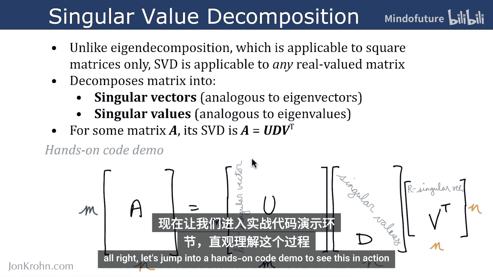
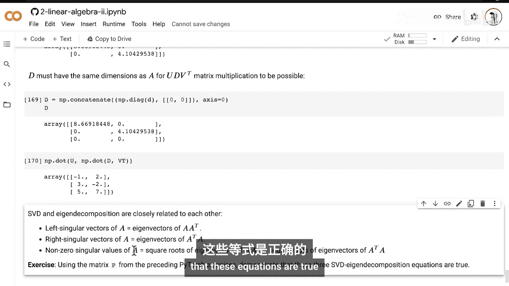

# 042：奇异值分解

在本节课中，我们将要学习奇异值分解的理论与实践。这是一种在机器学习领域中常见的线性代数操作。

与上一节我们介绍的、仅适用于方阵的特征值分解不同，奇异值分解适用于任何由实数构成的矩阵。SVD将一个矩阵分解为奇异向量和奇异值，它们分别类似于特征向量和特征值。

## 核心概念

对于矩阵 **A**，其奇异值分解由以下公式给出：

`A = U * D * V^T`



如果矩阵 **A** 有 **m** 行和 **n** 列，那么它的SVD将由以下三个矩阵组成：
*   **U**：一个 **m × m** 的正交矩阵，其列被称为 **左奇异向量**。
*   **V^T**：一个 **n × n** 的正交矩阵，其行被称为 **右奇异向量**。
*   **D**：一个 **m × n** 的对角矩阵，其主对角线上的元素是 **奇异值**，其余元素为零。

接下来，让我们通过一个代码演示来具体看看这个过程。

## Python代码实现

在Python中，我们可以使用NumPy库轻松计算矩阵的奇异值分解。

```python
import numpy as np

# 创建一个非方阵 A (3行，2列)
A = np.array([[1, 2],
              [3, 4],
              [5, 6]])

# 使用NumPy的linalg.svd方法进行奇异值分解
U, s, Vt = np.linalg.svd(A, full_matrices=True)

print("矩阵 A:")
print(A)
print("\n左奇异向量矩阵 U:")
print(U)
print("\n奇异值向量 s:")
print(s)
print("\n右奇异向量矩阵 V^T:")
print(Vt)
```

运行上述代码，你会得到分解后的三个部分。注意，`np.linalg.svd` 返回的 `s` 是一个包含奇异值的一维向量，而不是对角矩阵 **D**。

为了重构原始矩阵 **A**，我们需要将向量 `s` 转换为对角矩阵 **D**，并确保其维度正确以进行矩阵乘法。

```python
# 将奇异值向量 s 转换为对角矩阵 D
# 首先创建一个与A同维度的零矩阵 (m x n)
D = np.zeros((A.shape[0], A.shape[1]))
# 将奇异值填入主对角线
D[:len(s), :len(s)] = np.diag(s)

print("构造的对角矩阵 D:")
print(D)

# 通过 U * D * V^T 重构矩阵 A
A_reconstructed = U @ D @ Vt
print("\n重构后的矩阵 A_reconstructed:")
print(A_reconstructed)
print("\nA 与 A_reconstructed 是否相等 (考虑浮点误差)?", np.allclose(A, A_reconstructed))
```

## SVD与特征值分解的关系

奇异值分解与特征值分解密切相关。回顾特征值分解的公式 `A = Q * Λ * Q^-1`，可以发现它们形式相似。但SVD因为能处理非方阵，所以需要两组向量（左、右奇异向量）。

它们更深层次的联系体现在以下三个等式中：
1.  **A** 的左奇异向量等于 **AA^T** 的特征向量。
2.  **A** 的右奇异向量等于 **A^T A** 的特征向量。
3.  **A** 的非零奇异值等于 **AA^T**（或 **A^T A**）特征值的平方根。

为了帮助你更好地理解SVD及其与特征值分解的关系，这里有一个练习。

以下是练习内容：
请使用前面练习中的矩阵 **P**，通过代码验证上述三个等式是否成立。你可以在本笔记本中找到所有需要的理论和代码。当你成功证明这些等式时，就说明你已经掌握了这部分内容。

## 总结



本节课中我们一起学习了奇异值分解。我们了解了SVD可以将任意实数矩阵分解为左奇异向量、奇异值和右奇异向量，并通过Python代码实现了分解与重构。我们还探讨了SVD与特征值分解之间的紧密联系。在下一课中，我们将利用SVD来 dramatically 压缩数据。