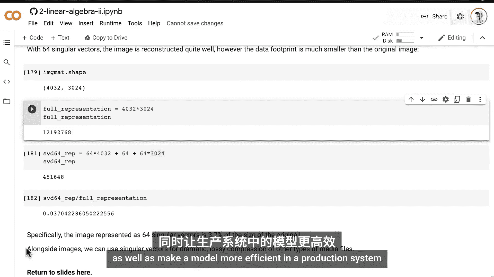
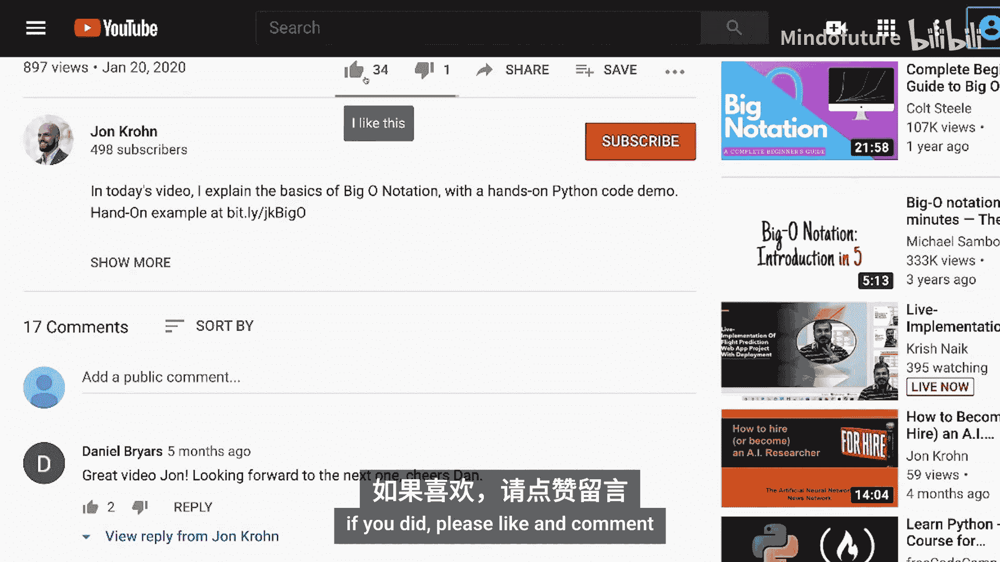
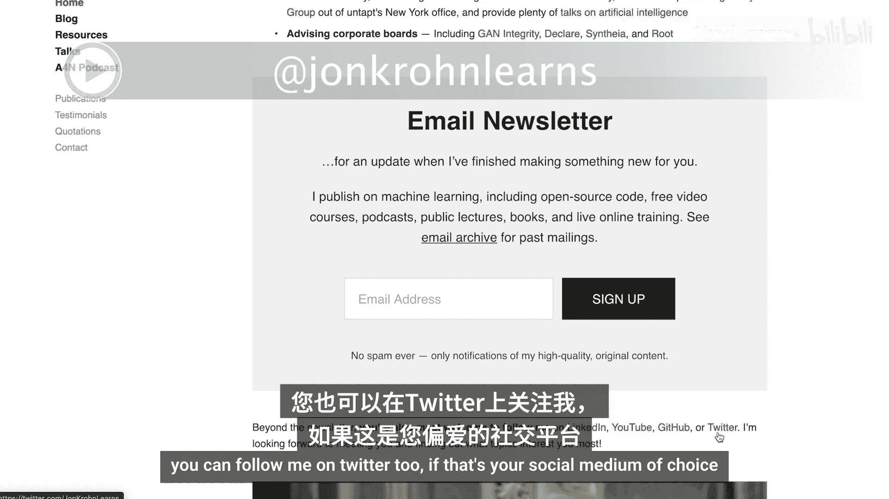

# 043：使用SVD进行数据压缩

在本节课中，我们将利用已掌握的奇异值分解理论，通过一个动手的Python演示，来显著地压缩数据。

上一节我们介绍了奇异值分解的基本理论，本节中我们来看看如何将其应用于图像压缩。

## 概述

我们将使用Python Imaging Library加载一张图片，将其转换为灰度图，然后利用奇异值分解技术对其进行压缩。通过逐步增加用于重建的奇异向量数量，我们可以直观地看到图像质量的恢复过程，并计算压缩后的数据量。

## 教程步骤

### 1. 导入与加载图像

首先，我们需要导入必要的库并加载图像。

以下是导入图像处理库并加载网络图片的代码：

```python
from PIL import Image
import urllib.request

# 从网络获取图片
url = '图片URL地址'
urllib.request.urlretrieve(url, 'local_image.jpg')
img = Image.open('local_image.jpg')
img.show()
```

我们使用Oboe（机器学习基金会系列丛书的吉祥物）的图片作为示例。为了简化处理，我们将其转换为灰度图，这样就不需要处理复杂的多颜色通道。

```python
img_gray = img.convert('L')  # 转换为灰度图
img_gray.show()
```

灰度图将图像表示为一个二维矩阵，矩阵中的每个元素（像素）的数值代表该点的明暗程度。

### 2. 转换为NumPy矩阵并计算SVD

接下来，我们将图像数据转换为NumPy矩阵格式，以便进行计算。

以下是转换数据并计算奇异值分解的代码：

```python
import numpy as np

# 将图像数据转换为NumPy矩阵
img_matrix = np.array(img_gray)

# 计算奇异值分解
U, sigma, Vt = np.linalg.svd(img_matrix, full_matrices=False)
```

对于之前小节中使用的3x2小矩阵，SVD计算是瞬时的。但对于这张4000多行、3000多列的图像矩阵，计算需要一些时间。在强大的云计算服务器上，这个过程也能较快完成。

### 3. 理解SVD与图像重建

在特征分解中，特征值按降序排列。同样，在奇异值分解公式 **A = U Σ V^T** 中，矩阵 **Σ**（或向量 **sigma**）中的奇异值也按降序排列。

这意味着矩阵 **U** 的第一个左奇异向量和矩阵 **V^T** 的第一个右奇异向量，与最大的奇异值相结合，代表了图像中最显著的特征。

因此，我们可以仅使用第一组奇异向量和奇异值来尝试重建图像。

以下是使用第一组奇异分量重建图像的代码：

```python
# 获取第一个左奇异向量、奇异值和右奇异向量
k = 1
U_k = U[:, :k]
sigma_k = sigma[:k]
Vt_k = Vt[:k, :]

# 重建图像矩阵
reconstructed_matrix = np.dot(U_k * sigma_k, Vt_k)

# 将矩阵转换回图像并显示
reconstructed_img = Image.fromarray(reconstructed_matrix.astype('uint8'))
reconstructed_img.show()
```

仅使用一组奇异向量重建的图像非常模糊，几乎无法辨认。

### 4. 逐步增加奇异向量以改善质量

为了改善图像质量，我们需要纳入更多重要的奇异向量。

以下是使用不同数量的奇异向量（k）进行重建的循环代码：

```python
import matplotlib.pyplot as plt

k_values = [1, 2, 4, 8, 16, 32, 64]
fig, axes = plt.subplots(2, 4, figsize=(16, 8))
axes = axes.ravel()

for idx, k in enumerate(k_values):
    # 使用前k个奇异分量进行重建
    U_k = U[:, :k]
    sigma_k = sigma[:k]
    Vt_k = Vt[:k, :]
    reconstructed_matrix = np.dot(U_k * sigma_k, Vt_k)

    # 显示图像
    ax = axes[idx]
    ax.imshow(reconstructed_matrix, cmap='gray')
    ax.set_title(f'k = {k}')
    ax.axis('off')

# 隐藏多余的子图
for idx in range(len(k_values), len(axes)):
    axes[idx].axis('off')

plt.tight_layout()
plt.show()
```

随着k值的增加：
*   **k=1**：无法辨认。
*   **k=2**：隐约可见轮廓。
*   **k=4**：能看出大致形状。
*   **k=8**：狗的形象开始清晰。
*   **k=16**：图像变得清晰，但有些模糊。
*   **k=32**：质量已经相当不错。
*   **k=64**：成功重建了高质量的图像，细节丰富。

### 5. 计算数据压缩率

现在，我们来量化压缩效果。原始图像矩阵有4032行和3024列。

原始数据点总数计算公式为：
`原始数据量 = 行数 × 列数 = 4032 × 3024 ≈ 12.2 百万`

使用k=64个奇异分量进行压缩时，我们需要存储：
*   **U** 的前64列：`64 × 4032` 个元素
*   **sigma** 的前64个值：`64` 个元素
*   **V^T** 的前64行：`64 × 3024` 个元素

压缩后数据点总数计算公式为：
`压缩数据量 = (64 × 4032) + 64 + (64 × 3024) ≈ 452,000`

因此，压缩率计算如下：
`压缩率 = 压缩数据量 / 原始数据量 ≈ 452,000 / 12,200,000 ≈ 3.7%`

这意味着我们仅用不到原数据4%的存储空间，就重建了视觉上可接受的图像。

### 6. SVD压缩的应用与意义

除了图像，SVD也可用于压缩其他类型的矩阵数据，如音频、视频文件等。在机器学习中，这种方法非常有用：
*   **减少模型输入维度**：可以压缩输入特征，加速模型训练。
*   **提升生产环境效率**：更小的模型或输入数据意味着更快的推理速度和更低的计算资源消耗。

## 总结

本节课中我们一起学习了如何利用奇异值分解进行数据压缩。我们通过一个具体的图像压缩例子，演示了如何从SVD中提取主要成分来重建数据，并计算了显著的数据压缩率。这种方法的核心在于利用数据中最重要的特征（对应大的奇异值），而忽略次要的、可能包含噪声的特征，从而实现高效的有损压缩。



SVD非常强大，它展示了线性代数在解决实际问题中的巨大潜力。在接下来的视频中，我们将基于已学的SVD理论，探索更为神奇的“伪逆”概念，它能够近乎魔法般地求解线性方程组中的未知数。😊

为确保您不会错过本系列的下一个教程，请订阅我的频道。

感谢参与本教程，希望您有所收获。如果您喜欢，请点赞和评论。

为确保不错过我的任何内容，请访问 [Johnchrome.com](http://Johnchrome.com) 并注册我的电子邮件通讯。



也欢迎您在LinkedIn上添加我，只需提及您是机器学习基金会系列的观众即可。

如果您更喜欢Twitter，也可以在那里关注我。



下次见。