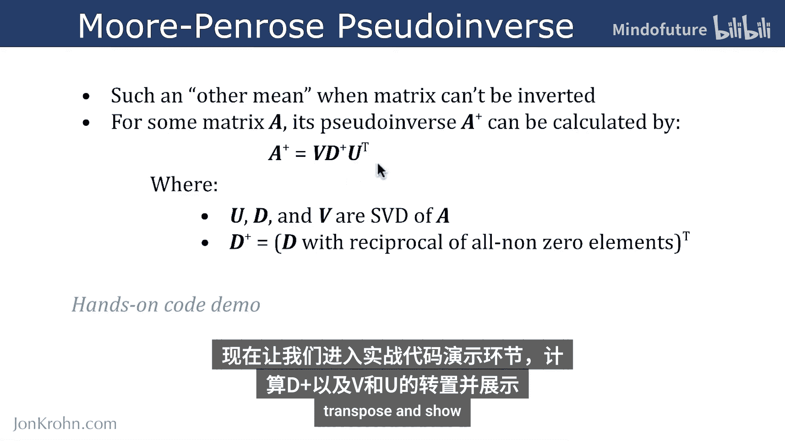
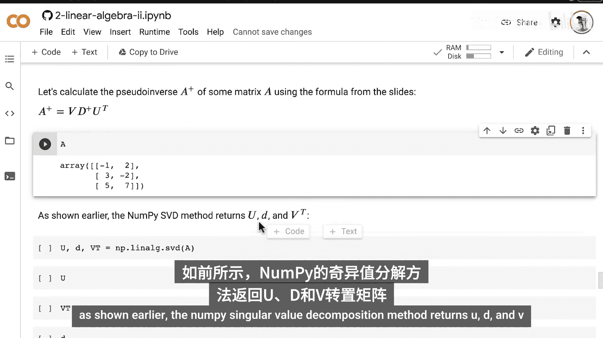
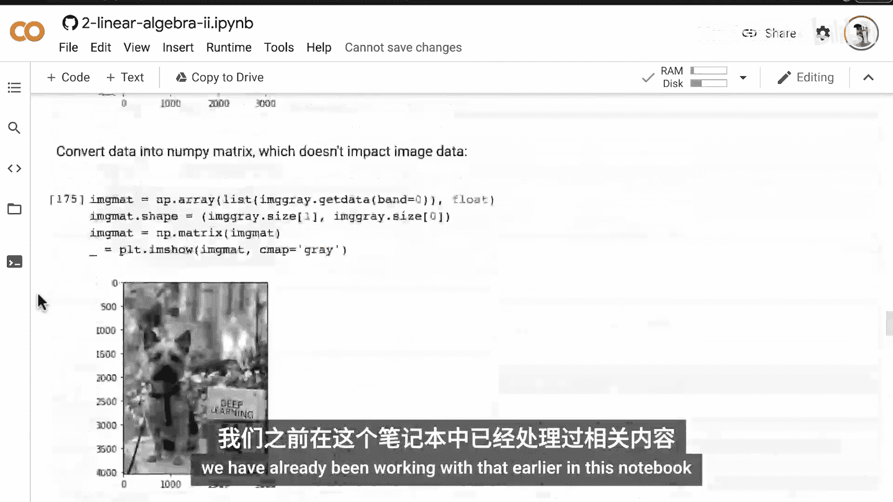
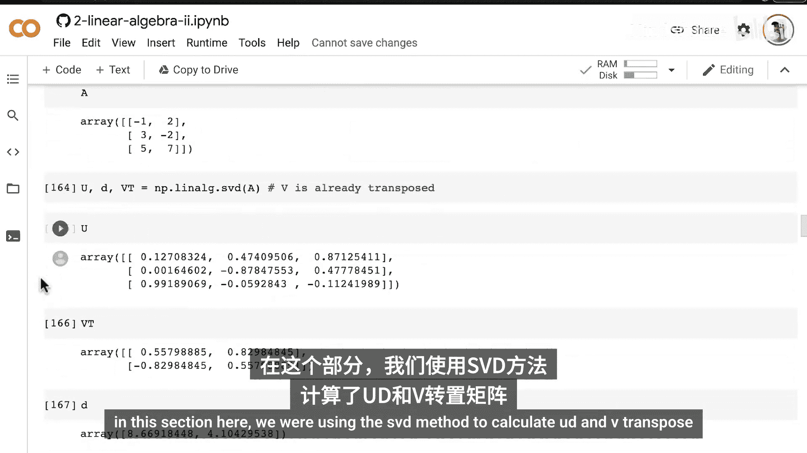
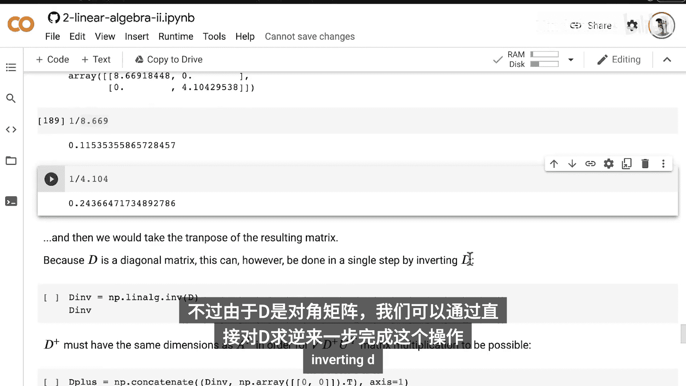
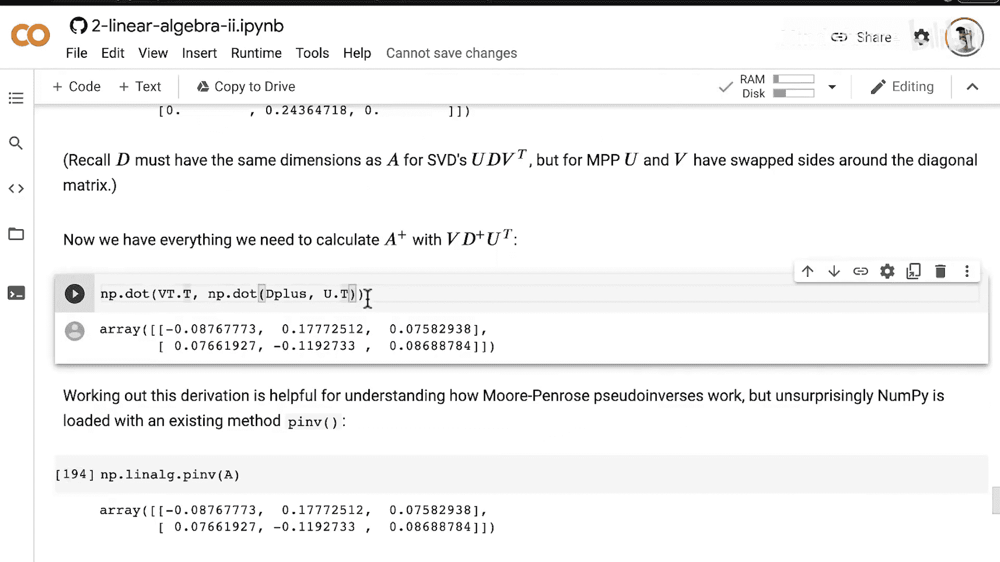
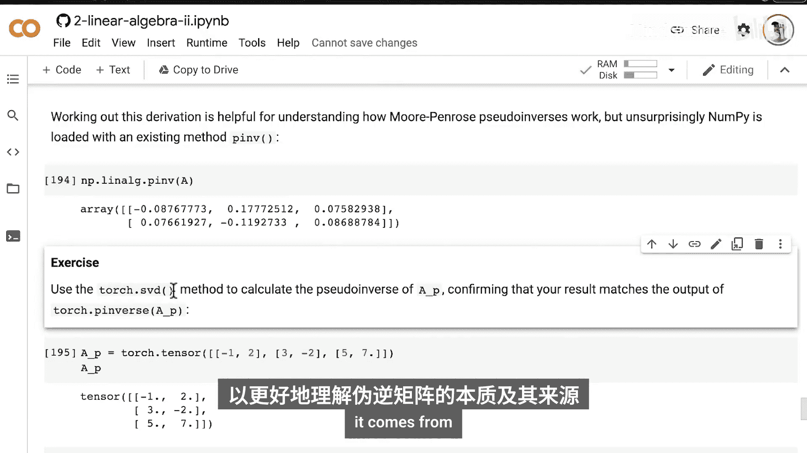
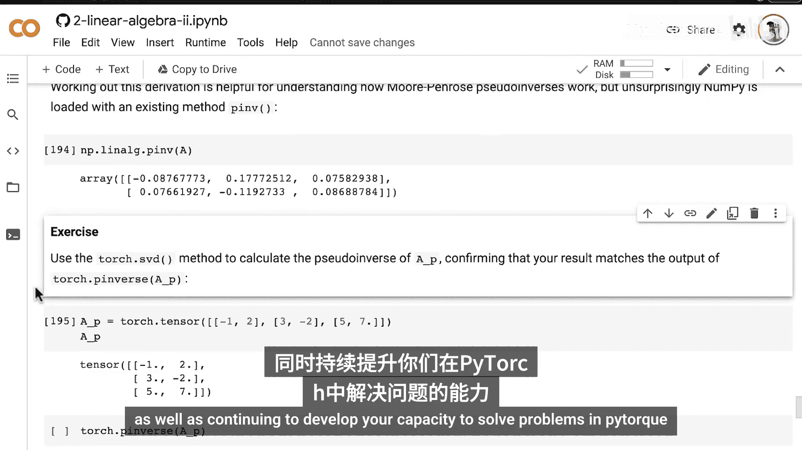

# 044：莫尔-彭罗斯广义逆

在本节课中，我们将要学习莫尔-彭罗斯广义逆（伪逆）。这是一个线性代数概念，它使我们能够对非方阵进行“求逆”。伪逆是机器学习中的一个关键概念，因为它能解决机器学习中常见的方程组中的未知变量问题。为了展示其工作原理，我们将使用一个动手代码演示。

## 矩阵求逆的限制

上一节我们介绍了矩阵求逆，本节中我们来看看它的限制条件。矩阵求逆是一个巧妙的方法，但它只能在矩阵是方阵时计算，即矩阵的行数等于列数。

这避免了**超定**情况，即我们拥有的行数远多于列数，或至少比列数多一行。以下是一个超定情况的例子，我们有三条直线的方程，但只有两个维度（即矩阵有三行两列）。我们无法求解直线相交的唯一点，因为存在多个交点。

相反，**欠定**系统是指方程数少于维数的情况。例如，一个矩阵有一行（代表一个直线方程）和两列（代表X和Y维度）。同样，我们无法求解直线相交的未知点，因为没有已知的相交直线。

除了必须是方阵，矩阵求逆还要求矩阵不是**奇异矩阵**。矩阵中的所有列必须是线性无关的。例如，不能出现一列是 `[1, 2]`，而另一列是 `[2, 4]` 的情况，这表示直线平行，没有交点。同样，也不能有两个不同的列代表相同的直线方程，因为那样会有无限解，无法求得单一答案。

由于以上四种原因中的任何一种，矩阵都无法求逆。

## 伪逆：另一种求解方法

然而，我们之前更详细地讨论过，即使矩阵无法求逆，通过其他方法**求解方程组**可能仍然是可行的。当矩阵无法求逆时，另一种方法就是**莫尔-彭罗斯广义逆**，这也是本视频的重点。

对于某个矩阵 **A**，其伪逆记为 **A⁺**。它可以通过以下公式计算：

**A⁺ = V * D⁺ * Uᵀ**



其中 **U**、**D** 和 **V** 是矩阵 **A** 的奇异值分解（SVD），我们在之前的视频中讨论过。而 **D⁺** 是奇异值分解中矩阵 **D** 的一个特殊版本，它取所有非零元素的倒数，然后进行转置。

现在，让我们通过一个动手代码演示来计算 **D⁺** 以及 **V** 和 **U** 的转置，并验证这个公式。

## 代码演示：计算伪逆







以下是使用NumPy计算矩阵 **A** 的伪逆 **A⁺** 的步骤。

首先，我们定义矩阵 **A**，它显然不是方阵，因此不可逆，但可以进行伪逆运算。

```python
import numpy as np

# 定义矩阵 A
A = np.array([[1, 2, 3],
              [4, 5, 6]])
```

接下来，我们使用NumPy的奇异值分解方法得到 **U**、**D** 和 **Vᵀ**。

```python
# 计算奇异值分解
U, D, Vt = np.linalg.svd(A, full_matrices=False)
# 注意：full_matrices=False 确保返回的 U 和 Vt 尺寸与 A 匹配
```



现在，我们需要计算 **D⁺**。矩阵 **D** 是一个对角矩阵，其主对角线上的元素是奇异值。要得到 **D⁺**，我们需要对 **D** 中的非零元素取倒数，然后转置。由于 **D** 是对角矩阵，我们可以直接使用 `np.linalg.inv` 来求逆，它会自动处理非零对角线元素的倒数。

```python
# 计算 D 的逆（即 D⁺ 的雏形）
D_inv = np.linalg.inv(np.diag(D))
```

但是，为了确保后续矩阵乘法的维度匹配，我们需要调整 **D⁺** 的维度，使其与 **Aᵀ** 的维度一致。一种方法是在 **D_inv** 的右侧拼接一个零列。

```python
# 创建一个零列向量，用于调整维度
zeros_column = np.zeros((D_inv.shape[0], A.shape[0] - D_inv.shape[1]))
# 将零列拼接到 D_inv 的右侧，形成 D_plus
D_plus = np.concatenate((D_inv, zeros_column), axis=1)
```

现在，我们有了计算伪逆所需的所有组件：**V**（即 **Vᵀ** 的转置）、**D⁺** 和 **Uᵀ**（即 **U** 的转置）。

```python
# 计算伪逆 A⁺ = V * D⁺ * Uᵀ
A_plus_manual = Vt.T @ D_plus @ U.T
```

为了验证我们的手动计算是否正确，我们可以直接使用NumPy内置的伪逆函数 `np.linalg.pinv`。

```python
# 使用NumPy内置方法计算伪逆
A_plus_numpy = np.linalg.pinv(A)
```

比较 `A_plus_manual` 和 `A_plus_numpy`，它们应该相等（在浮点数精度允许的范围内）。

```python
print("手动计算的伪逆：\n", A_plus_manual)
print("\nNumPy计算的伪逆：\n", A_plus_numpy)
print("\n两者是否接近？", np.allclose(A_plus_manual, A_plus_numpy))
```

## 练习：在PyTorch中实现



为了加深理解，请将我们在NumPy中进行的整个过程（从计算奇异值分解到计算伪逆）移植到PyTorch中。

以下是步骤提示：
1.  使用 `torch.svd` 方法计算矩阵的奇异值分解。
2.  按照上述逻辑计算 **D⁺**。
3.  使用公式 **A⁺ = V * D⁺ * Uᵀ** 计算伪逆。
4.  使用 `torch.pinverse` 方法验证你的结果。

## 总结





本节课中我们一起学习了莫尔-彭罗斯广义逆（伪逆）。我们回顾了矩阵无法求逆的几种情况（非方阵、超定、欠定、奇异矩阵），并介绍了伪逆作为求解方程组的一种替代方法。我们通过公式 **A⁺ = V * D⁺ * Uᵀ** 理解了其与奇异值分解的关系，并通过代码演示手动计算了伪逆，同时验证了NumPy内置函数的结果。在下一节视频中，我们将应用伪逆来求解线性方程组中的未知数，并为数据点拟合一条直线。