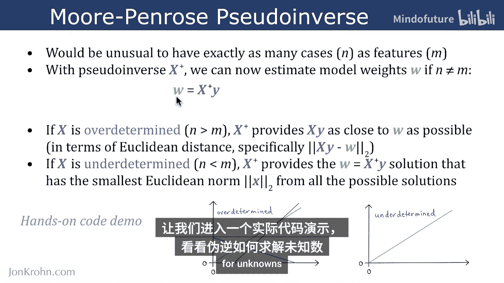
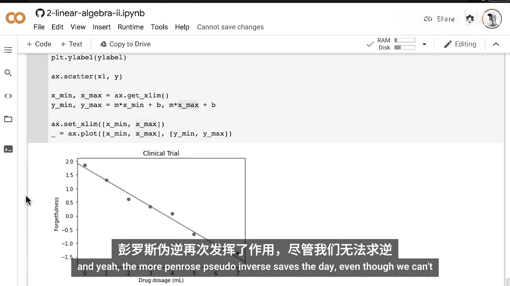
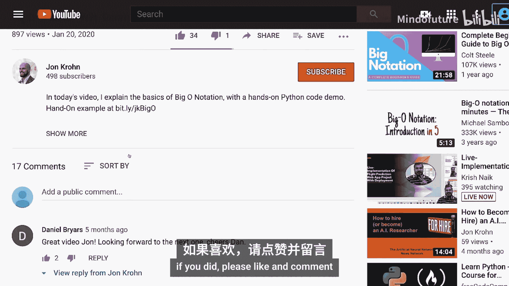

# 045：使用广义逆进行回归

## 📚 概述
在本节课中，我们将学习如何使用穆尔-彭罗斯广义逆（Moore-Penrose pseudoinverse）来求解未知参数，从而仅用线性代数方法为数据点拟合一条直线。这种方法在处理机器学习中常见的非方阵问题时非常有用。

## 🧠 广义逆的应用场景
在机器学习中，非方阵非常常见。考虑一个我们已经讨论过的例子：使用房屋的各种属性来预测其价值。我们预测的房价是 `y`，模型的输入包括卧室数量、到学校的距离等，总共有 `M` 个输入特征。

在这种场景下，我们通常会有很多数据样本（例如成千上万的房屋），但特征数量（例如12个）相对较少。因此，我们的数据矩阵 `X` 的行数（样本数 `N`）远大于列数（特征数 `M`），形成一个非方阵，无法使用常规的矩阵求逆方法。

## 🔧 线性回归的矩阵表示
我们可以用线性代数更简洁地表示回归方程。使用矩阵乘法，将模型输入（包括一个代表截距的常数列）与一个包含未知权重 `W` 的向量相乘，得到预测输出 `y`。

公式表示为：
**Y = XW**

其中：
*   `Y` 是已知的输出向量（例如房价）。
*   `X` 是已知的输入特征矩阵。
*   `W` 是包含未知模型参数（权重 `B, C, ..., M` 和截距 `A`）的向量。

## 🚫 常规求逆的局限性
如果矩阵 `X` 的逆存在，我们可以通过 `W = X⁻¹Y` 来求解 `W`。然而，在现实世界的回归场景中，`X` 通常是非方阵（`N > M`），因此其逆矩阵不存在，无法使用这种方法。

## 💡 广义逆的解决方案
这正是穆尔-彭罗斯广义逆发挥作用的地方。我们用广义逆 `X⁺` 来近似求解，即使 `N` 不等于 `M`。

求解未知权重的公式变为：
**W = X⁺Y**

以下是广义逆的工作原理简介，理解其核心思想即可，无需死记硬背：
*   当 `X` 是一个**超定系统**（行数远大于列数，常见于回归）时，广义逆提供的解 `W`，能使 `XW` 与真实 `Y` 之间的欧几里得距离（L2范数）最小。
*   当 `X` 是一个**欠定系统**（行数小于列数，可能出现在深度学习）时，广义逆提供的解 `W`，是所有可能解中欧几里得范数最小的那个。

对于应用机器学习而言，只需知道我们可以计算广义逆来近似求解非方阵的“逆”，并以此估算模型参数，这就足够了。

## 💻 动手实践：用广义逆拟合直线
现在，让我们通过代码实例来看看广义逆如何实际求解未知参数并拟合直线。

我们将解决一个超定系统的小例子。假设有8个数据点，`X1` 代表治疗阿尔茨海默症的药物剂量，`Y` 代表患者的遗忘程度评分。

```python
import numpy as np
import matplotlib.pyplot as plt

# 模拟数据
x1 = np.array([0, 1, 2, 3, 4, 5, 6, 7])  # 药物剂量
y = np.array([1.8, 1.6, 1.4, 1.2, 1.0, 0.8, 0.6, 0.4])  # 遗忘程度



# 绘制数据点
plt.figure(figsize=(8, 5))
plt.scatter(x1, y)
plt.title('临床药物试验')
plt.xlabel('药物剂量 (毫升)')
plt.ylabel('遗忘程度')
plt.grid(True)
plt.show()
```

虽然看起来只有一个预测变量 `X1`，但为了拟合一条有截距的直线，我们需要第二个特征 `X0`（全为1的列，代表截距项）。这样，我们的特征矩阵 `X` 就有 `M=2` 列，`N=8` 行。

```python
# 创建截距项列 X0
x0 = np.ones(len(x1))

# 构建特征矩阵 X，将 X0 和 X1 作为列拼接
X = np.column_stack((x0, x1))
print("特征矩阵 X:\n", X)
```

现在，我们拥有矩阵 `X` 和输出向量 `y`，可以开始求解权重 `W` 了。

```python
# 使用广义逆求解权重 W = X⁺ y
X_pseudoinv = np.linalg.pinv(X)  # 计算广义逆
W = X_pseudoinv @ y  # 矩阵乘法求解权重
print("求解的权重 W (截距和斜率):", W)
```

权重已经求解出来了！第一个权重是直线的截距 `b ≈ 1.76`，第二个权重是斜率 `m ≈ -0.2`。

让我们提取这些值并绘制拟合的直线。

```python
# 提取截距和斜率
b = W[0]  # 截距
m = W[1]  # 斜率

# 生成用于绘制直线的X值范围
x_min, x_max = x1.min(), x1.max()
x_line = np.array([x_min, x_max])

# 根据直线方程 y = m*x + b 计算对应的Y值
y_line = m * x_line + b

# 绘制数据点和拟合直线
plt.figure(figsize=(8, 5))
plt.scatter(x1, y, label='数据点')
plt.plot(x_line, y_line, color='red', label=f'拟合直线: y = {m:.2f}x + {b:.2f}')
plt.title('使用广义逆进行线性回归拟合')
plt.xlabel('药物剂量 (毫升)')
plt.ylabel('遗忘程度')
plt.legend()
plt.grid(True)
plt.show()
```

可以看到，通过线性代数和广义逆求解出的直线完美地拟合了数据点。我们不需要任何复杂的机器学习算法，仅用几行代码就解决了问题。



## 📝 总结
本节课我们一起学习了穆尔-彭罗斯广义逆在机器学习回归问题中的应用。核心要点包括：
1.  现实中的回归数据常构成非方阵（`N > M`），无法直接求逆。
2.  广义逆 `X⁺` 为求解方程 **Y = XW** 中的权重 `W` 提供了有效工具，公式为 **W = X⁺Y**。
3.  通过一个简单的药物试验数据示例，我们使用 `numpy.linalg.pinv()` 函数计算了广义逆，并成功拟合了一条回归直线，直观展示了线性代数在机器学习基础中的强大力量。




广义逆是处理线性模型和超定系统的利器，理解其原理将为你后续学习更复杂的机器学习算法打下坚实的基础。