# 046：迹算子 🔢

在本节课中，我们将要学习一个名为“迹算子”的线性代数概念。迹算子是一个相对简单但非常有用的工具，它经常用于重新排列线性代数方程，这些方程在机器学习中很常见。

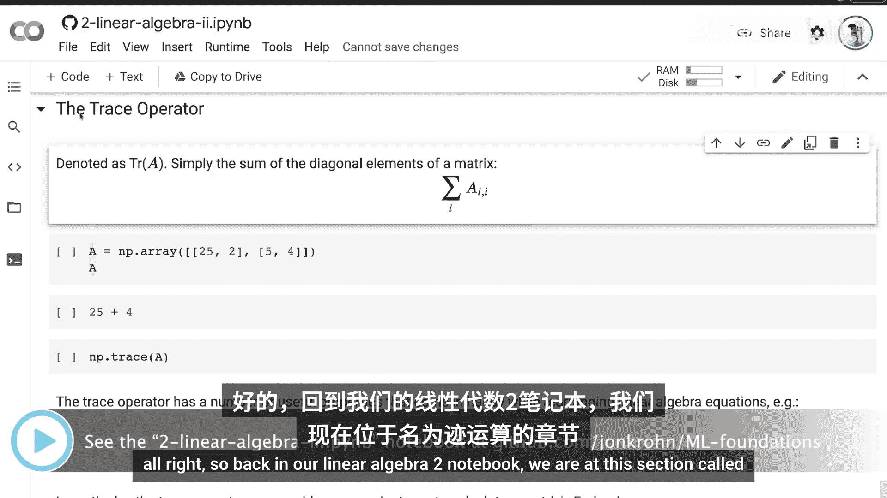

## 迹算子的定义与计算

迹算子通常表示为 **Tr(A)**，其中 **A** 是一个矩阵。它的定义非常简单：**迹是矩阵主对角线上所有元素的和**。

其数学公式可以表示为：
**Tr(A) = Σᵢ Aᵢᵢ**

其中 **i** 遍历矩阵的行和列索引，**Aᵢᵢ** 表示矩阵 **A** 中第 **i** 行第 **i** 列的元素。

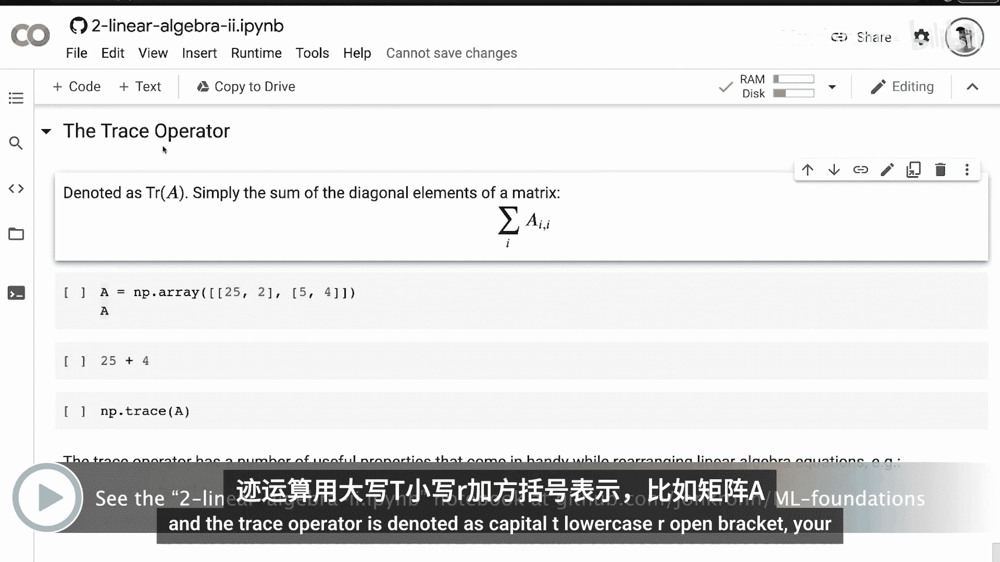

为了更直观地理解，让我们通过一个Python示例来计算矩阵的迹。

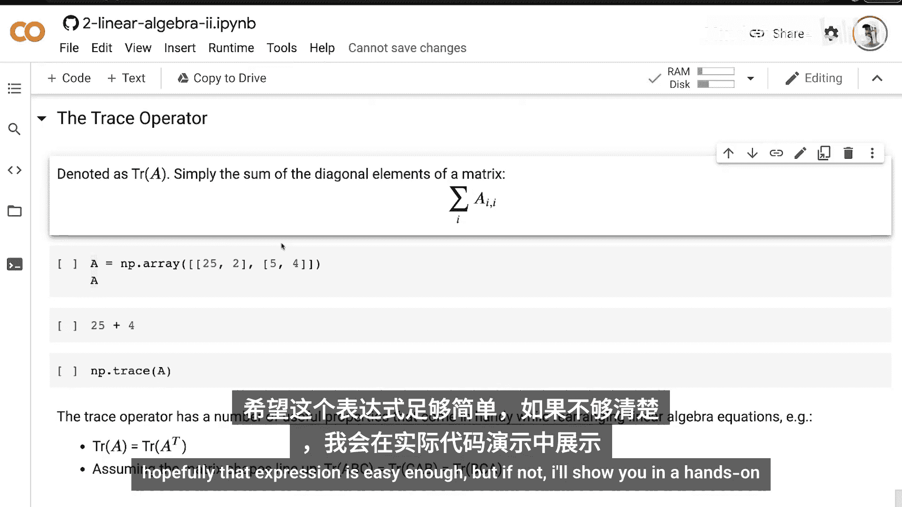

```python
import numpy as np

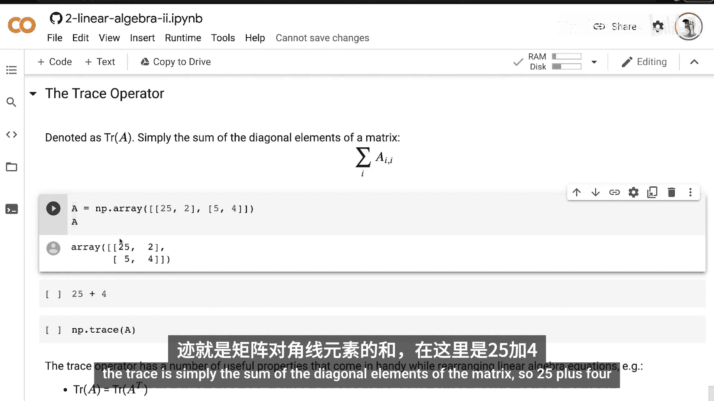

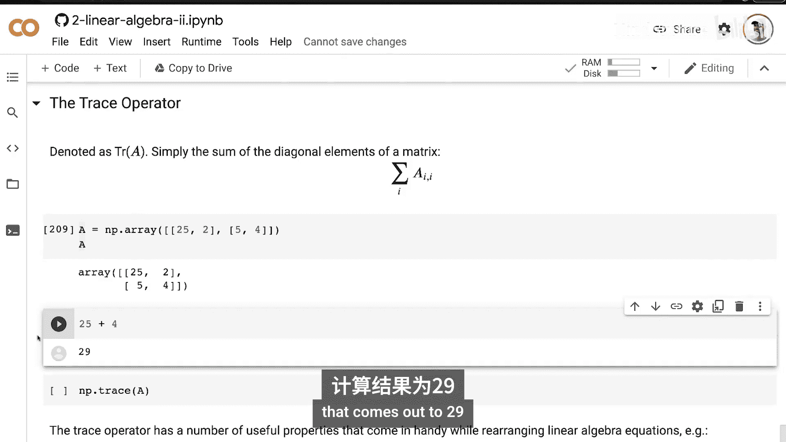

# 定义一个矩阵 A
A = np.array([[25, 2, 3],
              [4, 4, 6],
              [7, 8, 9]])

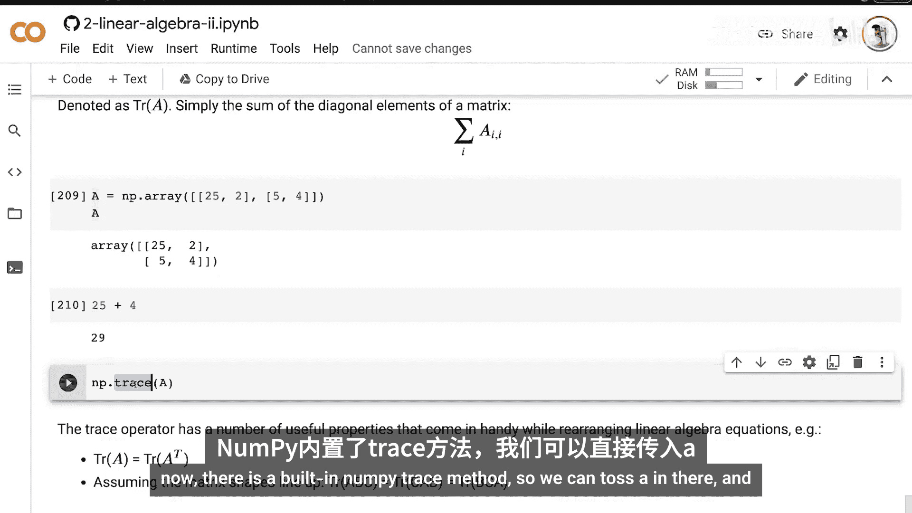

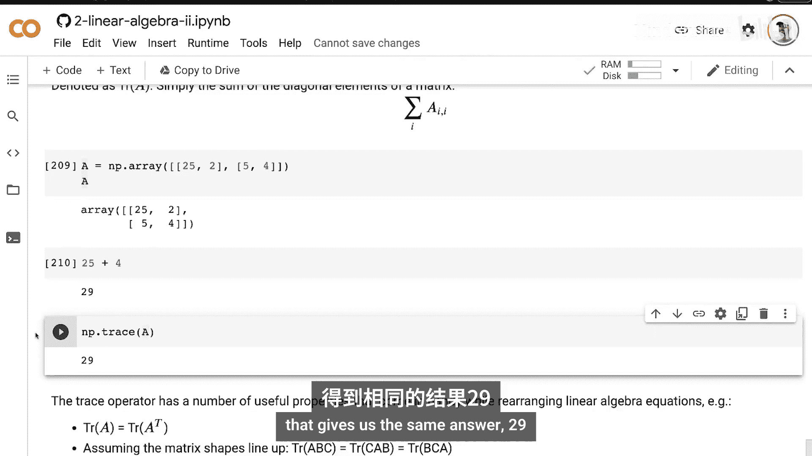

# 手动计算迹：主对角线元素之和
trace_manual = A[0, 0] + A[1, 1] + A[2, 2]  # 25 + 4 + 9 = 38

# 使用NumPy内置方法计算迹
trace_numpy = np.trace(A)

print(f"手动计算的迹: {trace_manual}")
print(f"NumPy计算的迹: {trace_numpy}")
```

运行上述代码，两种方法都会得到结果 **38**。NumPy库提供了便捷的 `np.trace()` 函数来计算矩阵的迹。

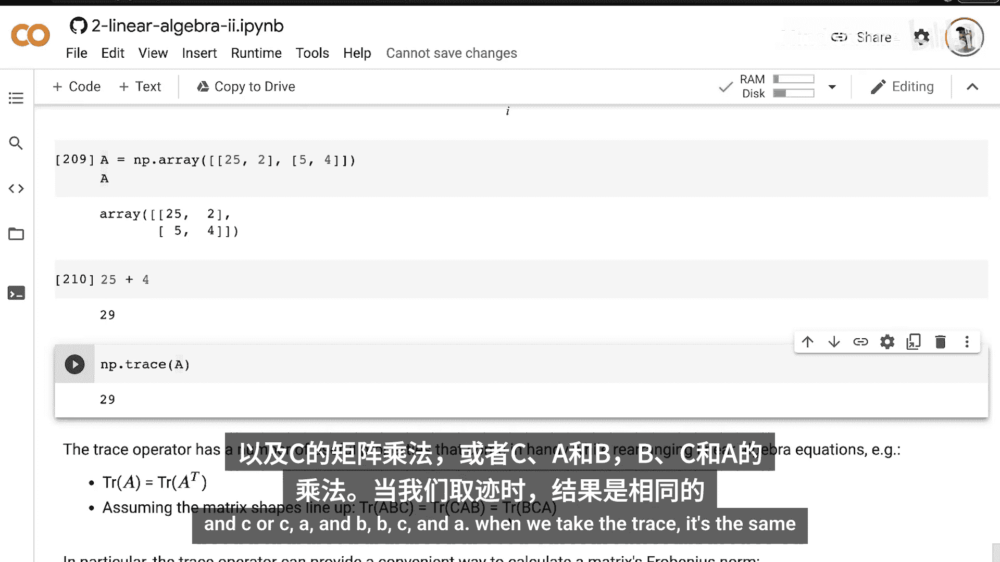

## 迹算子的重要性质

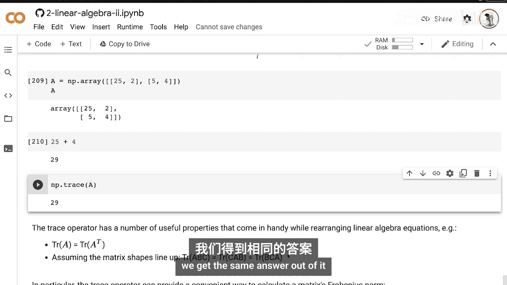

了解了迹的基本计算后，我们来看看迹算子的一些关键性质，这些性质在公式推导中非常有用。

以下是迹算子的三个主要性质：

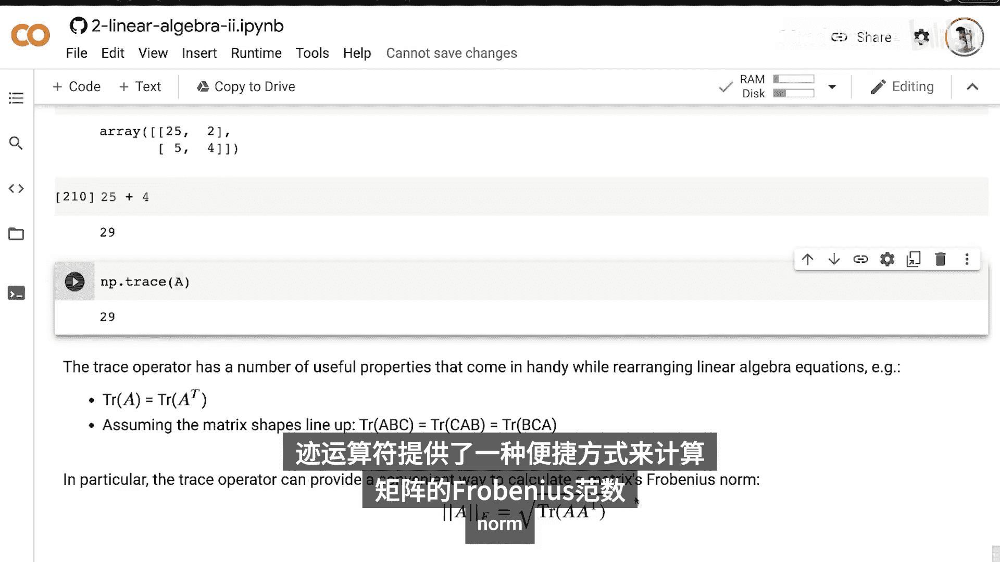

1.  **迹与转置**：矩阵 **A** 的迹等于其转置矩阵 **Aᵀ** 的迹。即 **Tr(A) = Tr(Aᵀ)**。这是因为转置操作不会改变主对角线上的元素。
2.  **循环置换性**：对于多个矩阵的乘积，只要矩阵的维度允许相乘，迹在循环置换下保持不变。例如，对于三个矩阵 **A**, **B**, **C**，有 **Tr(ABC) = Tr(CAB) = Tr(BCA)**。
3.  **计算弗罗贝尼乌斯范数**：矩阵 **A** 的弗罗贝尼乌斯范数（Frobenius norm）可以通过迹来计算。弗罗贝尼乌斯范数是向量L2范数在矩阵上的推广，其计算公式为：
    **||A||_F = √Tr(AAᵀ)**

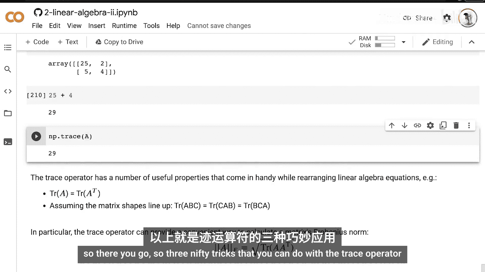

## 动手练习

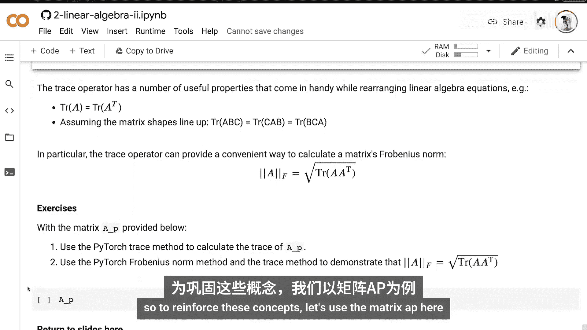

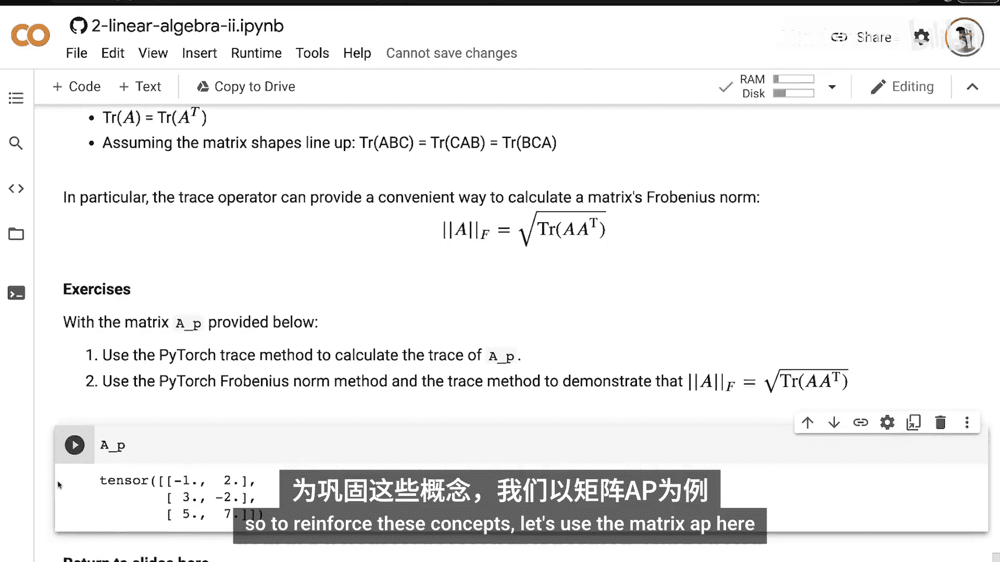

为了巩固对迹算子的理解，请完成以下两个练习。

**练习一：使用PyTorch计算迹**
请使用你喜欢的搜索引擎查找PyTorch框架中计算矩阵迹的方法，并使用该方法计算下面矩阵 **B** 的迹。

```python
import torch
B = torch.tensor([[5., 1.],
                  [2., 3.]])
# 请在此处编写你的代码
```

**练习二：验证弗罗贝尼乌斯范数公式**
请查找PyTorch中计算弗罗贝尼乌斯范数的方法。然后，使用迹算子和该范数计算方法，验证对于同一个矩阵 **B**，公式 **||B||_F = √Tr(BBᵀ)** 是否成立。

你只需要查找我们之前未覆盖的PyTorch `trace` 和 `frobenius norm` 方法即可完成这两个练习。

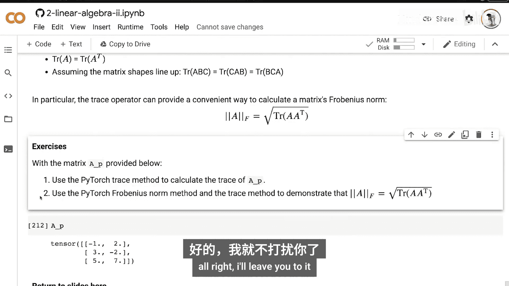

## 总结

本节课中我们一起学习了迹算子。我们首先定义了迹是矩阵主对角线元素之和，并演示了如何用NumPy进行计算。接着，我们探讨了迹算子的三个重要性质：与转置等价、循环置换不变性，以及与弗罗贝尼乌斯范数的关系。最后，通过两个PyTorch练习来巩固这些概念。

迹算子是线性代数理论中最后一块拼图。在接下来的课程中，我们将应用一个强大的机器学习技术——主成分分析（PCA），它将综合运用迹算子以及我们在本系列中学到的其他线性代数概念。