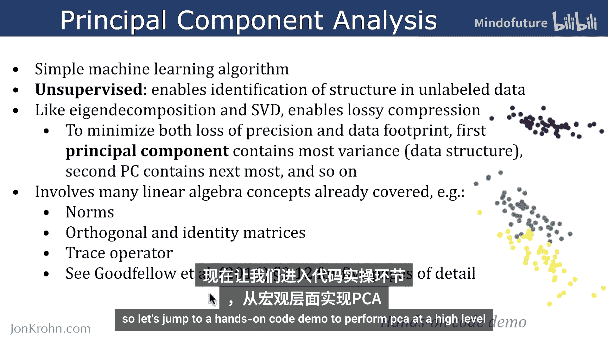
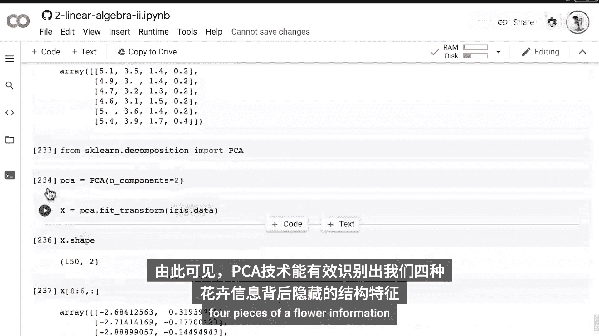

# 047：主成分分析（PCA） 🧠

在本节课中，我们将要学习主成分分析（PCA）。这是一种在无标签数据中识别结构的强大机器学习技术。我们将通过Python代码演示，直观地理解PCA的工作原理。

## 概述

主成分分析是一种简单的无监督机器学习算法。它能够识别无标签数据中的潜在结构。例如，如果你有一组花的测量数据，但没有花的种类标签，你仍然可以使用PCA这样的无监督学习算法来发现数据中的模式。与特征分解和奇异值分解类似，PCA能够实现有损数据压缩，以在精度损失和数据体积之间取得平衡。

## PCA的核心概念

第一主成分包含数据中最大的方差，即最多的数据结构。第二主成分包含次大的方差，依此类推。因此，在将PCA应用于无标签数据后，它会输出一系列主成分，其中第一个成分最重要，包含了数据集中最多的方差和数据结构。

PCA涉及许多本系列课程已涵盖的线性代数概念，例如**范数**、**正交矩阵**、**单位矩阵**和**迹运算符**。如果你想了解支撑PCA工作的所有方程和线性代数概念，推荐查阅Ian Goodfellow等人于2016年出版的《深度学习》教科书，该书可免费在线阅读。特别是第2.12节，其中详细阐述了从本系列涵盖的基础概念到这个机器学习算法的完整线性代数推导。

上一节我们介绍了PCA的理论基础，本节中我们来看看如何用Python代码实现它。

## 动手实践：Python代码实现



以下是使用Python进行PCA分析的关键步骤。我们将使用著名的鸢尾花数据集。

首先，我们需要导入必要的库和数据集。

```python
from sklearn.datasets import load_iris
from sklearn.decomposition import PCA
import matplotlib.pyplot as plt
import numpy as np
```

接下来，我们加载并查看数据。

```python
# 加载鸢尾花数据集
iris = load_iris()
X = iris.data  # 特征数据
y = iris.target # 标签数据（仅用于后续可视化）

print(f"数据形状: {X.shape}")  # 输出: (150, 4)
print("前6行数据:")
print(X[:6])
```
数据包含150行（样本）和4列（特征），分别是：花萼长度、花萼宽度、花瓣长度和花瓣宽度。

现在，我们导入PCA方法并指定要提取的主成分数量。为了便于在二维平面上绘图，我们选择提取两个主成分。

```python
# 创建PCA模型，指定主成分数量为2
pca = PCA(n_components=2)
# 拟合模型并转换数据
X_pca = pca.fit_transform(X)

print(f"降维后的数据形状: {X_pca.shape}")  # 输出: (150, 2)
print("前几个主成分值:")
print(X_pca[:5])
```
`fit_transform`方法将我们的四维特征数据压缩成了两个主成分。

现在，我们可以将这两个主成分绘制成散点图，以观察数据结构。

```python
# 绘制主成分散点图
plt.figure(figsize=(8,6))
plt.scatter(X_pca[:, 0], X_pca[:, 1], alpha=0.8)
plt.xlabel('第一主成分')
plt.ylabel('第二主成分')
plt.title('鸢尾花数据PCA结果（无标签）')
plt.grid(True)
plt.show()
```
从图中，我们可以观察到数据点形成了明显的分组，这表明数据中存在潜在结构。

实际上，鸢尾花数据集是带有标签的（三种不同的鸢尾花品种）。虽然PCA是无监督的，不依赖标签，但我们可以利用标签为散点图添加颜色，以验证PCA发现的结构是否与真实类别吻合。

以下是添加类别颜色后的可视化代码：

```python
# 获取品种名称
target_names = iris.target_names
# 为每个品种分配颜色
colors = ['navy', 'turquoise', 'darkorange']

plt.figure(figsize=(8,6))
for color, i, target_name in zip(colors, [0, 1, 2], target_names):
    plt.scatter(X_pca[y == i, 0], X_pca[y == i, 1], color=color, alpha=.8, lw=2, label=target_name)
plt.legend(loc='best', shadow=False, scatterpoints=1)
plt.xlabel('第一主成分')
plt.ylabel('第二主成分')
plt.title('鸢尾花数据PCA结果（按品种着色）')
plt.show()
```
通过着色，可以清晰地看到三个不同的鸢尾花品种对应于图中三个特征明显的区域。这证明了PCA技术能够有效地从花的四个测量特征中识别出隐藏的数据结构。

## 总结



本节课中我们一起学习了主成分分析（PCA）。我们了解到PCA是一种无监督学习算法，用于发现高维数据中的主要变化方向（主成分）并实现降维。通过Python实践，我们使用`scikit-learn`库将四维的鸢尾花数据压缩到两个主成分，并通过可视化观察到PCA成功地将不同品种的鸢尾花区分开来。这展示了PCA在探索数据结构和为后续分析进行预处理方面的强大能力。