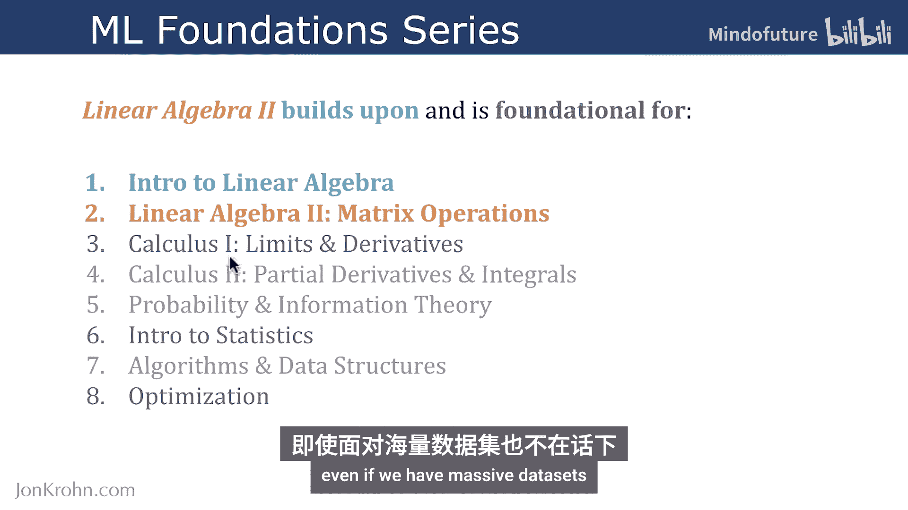
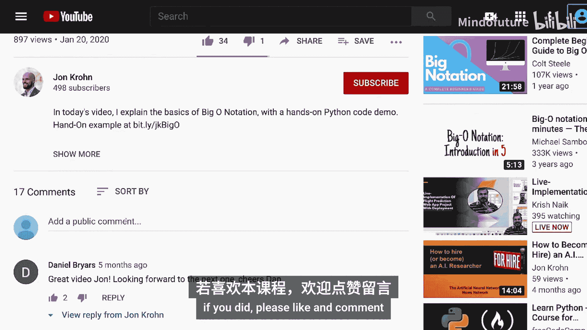
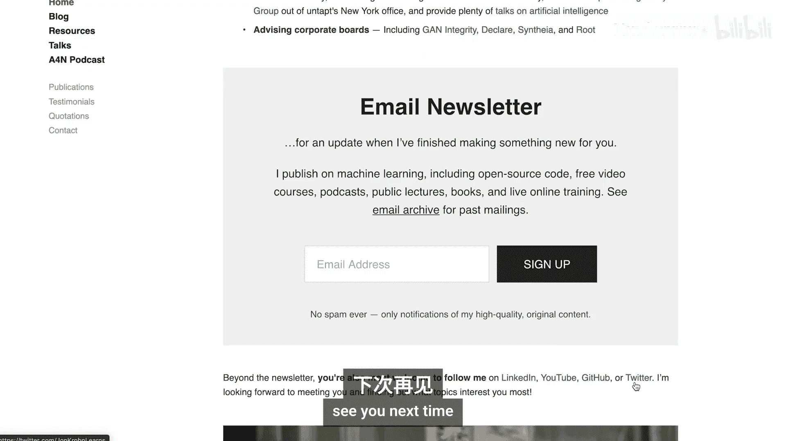

# 048：矩阵运算与外部资源 📚

在本节课中，我们将总结机器学习中矩阵运算的核心内容，并为您提供一系列优质的线性代数外部学习资源，以帮助您巩固和深化理解。

## 概述

欢迎来到机器学习基础系列线性代数部分的最后一课。本节内容简短，旨在为您提供我最推荐的外部线性代数学习资源。如果您觉得需要复习基础代数知识，例如我们在本系列中多次使用的方程重组技巧，那么接下来的资源列表将对您大有裨益。

## 外部学习资源推荐

以下是针对不同学习需求推荐的优质资源。

### 基础代数复习

如果您需要巩固基础代数知识，我推荐以下资源：
*   **可汗学院**：该网站提供了关于各类代数概念的清晰讲解。
*   **可汗学院YouTube频道**：您也可以在YouTube上观看可汗学院的视频。
*   **3Blue1Brown**：这是另一个优秀的YouTube频道，提供出色的基础代数教学视频。

### 线性代数深化学习

针对本系列重点关注的线性代数概念，我推荐以下资源：
*   **3Blue1Brown的线性代数系列视频**：再次强烈推荐。
*   **《深度学习》书籍第二章**：作者为Ian Goodfellow、Yoshua Bengio和Aaron Courville。您可以在`deeplearningbook.org`免费获取。本系列课程的内容深受该章节影响。
*   **《机器学习数学》书籍第二章**：作者为Marc Peter Deisenroth等人。
*   **《线性代数应该这样学》**：作者为Sheldon Axler。这是一本广受好评的通用线性代数教材，虽不专门聚焦机器学习应用，但理论扎实。

## 后续学习路径

上一节我们介绍了外部资源，本节中我们来看看本系列课程的后续安排。我最推荐您接下来学习机器学习基础系列的后续步骤。

在掌握了基础线性代数后，我们已经为学习以下内容做好了充分准备：
1.  **微积分1**：关于极限与导数。
2.  **微积分2**：紧随其后，关于偏导数与积分。
3.  **概率与信息论**：这是本系列八个主题中的第五个，其内容建立在已学的线性代数知识之上。
4.  **优化**：这是本系列的第八个也是最后一个主题，它将串联起之前所有的主题，包括我们已涵盖的线性代数内容。

## 本章节总结

至此，我们完成了“机器学习中的矩阵运算”第三部分的学习。在本章节中，我们共同探讨了多个核心主题：
*   我们讨论了**奇异值分解**，它使我们能够压缩图像文件。
*   我们探讨了**摩尔-彭罗斯伪逆**，它使我们能够对非方阵执行类似矩阵求逆的操作，从而求解机器学习中常见的方程组未知数。
*   我们快速学习了**迹运算符**。
*   我们学习了**主成分分析**，它结合了迹运算符以及本系列早期学习的许多其他概念，构成了PCA算法的基础。PCA是一种用于处理无标签数据并发现其结构的简单机器学习算法。
*   最后，我们刚刚讨论了我推荐的**线性代数进阶学习资源**。

“机器学习中的矩阵运算”是八个主题的机器学习基础系列中第二个主题的最后一个部分。这个我们刚刚结束的“线性代数2：矩阵运算”主题由三个部分组成：
1.  我们从对基础线性代数的快速回顾开始。
2.  接着深入学习了将方阵分解为特征向量和特征值。
3.  就在刚才，我们完成了机器学习矩阵运算部分的学习。

这意味着我们已经完成了机器学习基础系列的前两个主题，也标志着本系列所有线性代数内容的完结。

## 学习成果与展望

到目前为止，我们所涵盖的许多内容，特别是对张量的理解以及在Python中执行张量运算的能力，将在本系列剩余的六个主题中持续发挥作用。本次线性代数2主题中的内容将对**微积分1**、**统计学入门**和**优化**主题尤为有益。

接下来，我们将进入**微积分**的学习，它是研究变化率的学科。微积分在机器学习中至关重要，因为它使我们能够高效地求解未知数，即使面对海量数据集。

微积分，特别是其在机器学习中的应用，是如此优雅和令人赞叹。我迫不及待地想在那里与您相见。

---

**本节课中我们一起学习了**机器学习矩阵运算的总结与一系列外部学习资源，并预览了整个系列后续的学习路径。掌握这些线性代数基础是理解更高级机器学习概念的关键。

为确保您不会错过本系列的下一教程，请订阅我的频道。感谢您参与本教程，希望您有所收获。如果您喜欢，请点赞并评论。

为确保不错过我的任何内容，请访问`johnkrohn.com`并注册我的电子邮件通讯。也欢迎您在LinkedIn上添加我，只需注明您是机器学习基础系列的学习者。如果您更喜欢Twitter，也可以在那里关注我。下次见！