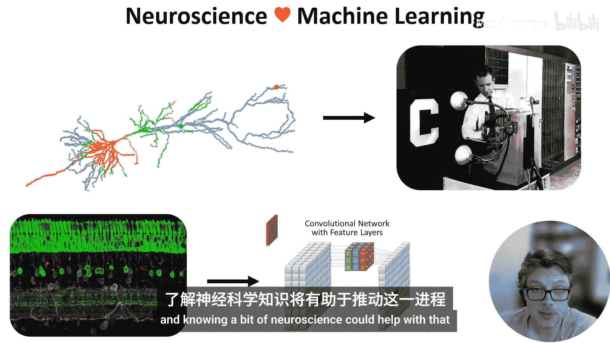

# 001：为何学习神经科学 🧠

在本节课中，我们将探讨为何具备机器学习背景的人应该对神经科学产生兴趣。我们将回顾两个领域相互影响的丰富历史，并展望未来可能的交叉点。

欢迎来到《机器学习人员的神经科学》。顾名思义，这门课程面向具备机器学习背景、并希望了解一些神经科学知识的人士。本课程在伦敦帝国理工学院线下授课，同时也在线免费开放。

让我们从这个视频开始，谈谈为何你应该对神经科学感兴趣。

一个原因是，机器学习和神经科学在历史上有着相互影响的丰富渊源，例如从神经元到感知机，或从视网膜到卷积神经网络。

近年来，这两个领域开始逐渐分离，但这种状况可能改变。了解一些神经科学知识可能有助于推动这种改变。

毕竟，人脑仍然能够轻松解决一些目前机器学习尚无法轻易攻克的任务。那么，人脑是如何做到的呢？

说实话，我们目前还不知道全部答案。但我们确实了解一些关于大脑工作机制的、相当惊人且迷人的知识。

例如，脑细胞之间以一种既非完全数字也非完全模拟的、令人难以置信的高能效方式进行信号传递。

大脑所做的一些事情可能与机器学习无关，但其中一部分很可能相关，因为它们解决的是许多相同的问题。

了解自然与人工系统在智能问题上采取的不同方法及其面临的不同约束，有助于丰富我们对两者的思考。

这就是本课程将采取的方法。我们将主要避免讨论神经科学家当前关于大脑如何整合一切的理论，因为就像所有科学领域一样，这些想法（包括我的）很可能最终被证明是错误的。

相反，我们将专注于我们已知的关于大脑的知识，并以一种富有玩味和创造性的方式运用这些想法。

如果在学习过程中，你发现自己确实想理解大脑的工作原理，那么这门课程也可以成为你踏上这段旅程的第一步。

---

**总结**：本节课我们一起探讨了学习神经科学对机器学习从业者的价值。我们回顾了两个领域相互启发的历史，认识到人脑在解决某些复杂任务上的优势，并明确了本课程将聚焦于已知的、可靠的大脑机制知识，以启发新的思考。