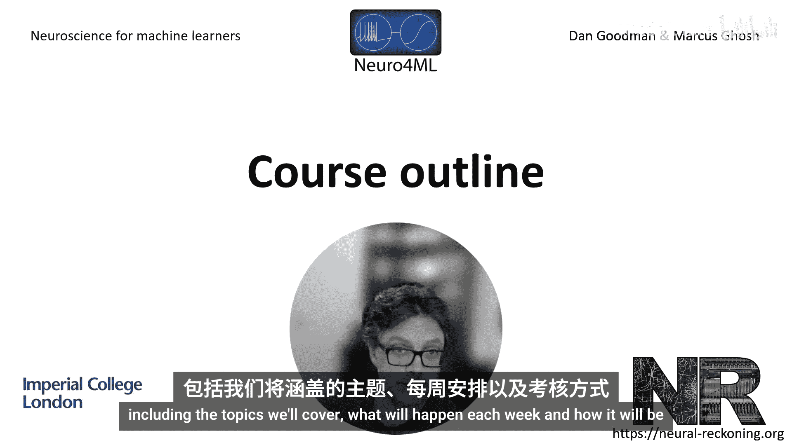
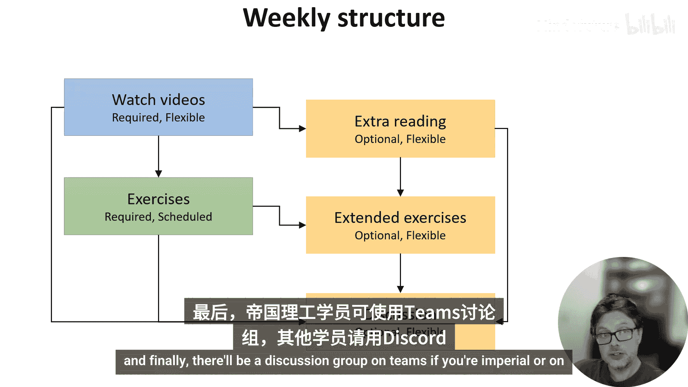
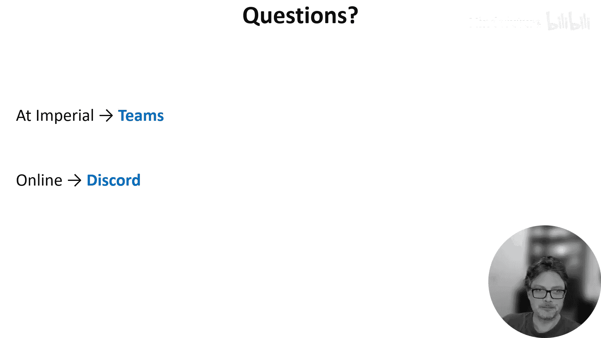

# 002：课程大纲 📚

在本节课中，我们将概述这门课程的整体结构，包括将要涵盖的主题、每周的安排以及课程的评估方式。

## 课程主题概览 🧠

课程内容大致分为四个部分。

上一节我们介绍了课程的整体安排，本节中我们来看看具体的主题构成。

以下是四个核心部分：

1.  **大脑的结构**：这部分将探讨大脑如何由被称为神经元的脑细胞构成，这些细胞通过突触连接，并划分为不同区域。我们还将讨论这些细胞如何利用信号进行通信和计算，以及我们用于理解这一过程的模型。
2.  **学习机制**：这部分将特别聚焦于学习，探讨我们已知的大脑学习方式、相关的模型，以及这些模型如何与机器学习相关联。
3.  **整合理论**：这部分课程涉及一些关于大脑如何将所有机制整合起来的理论。我们将从理解大脑（或人工神经网络）的方法论入手，然后探讨大脑如何解决特定类型任务的一些理论。
4.  **未来展望**：在最后一部分，我们将讨论未来的前景。我们将探讨神经形态计算（一种旨在模仿大脑某些功能特性的专用硬件），以及神经科学中一些我们尚不完全理解的最新进展。

## 教学模式与安排 📅

本课程采用翻转课堂的教学模式。

这意味着，不同于每周花几小时听讲座然后自行消化材料，我们将这个顺序翻转过来。以下是每周的安排：

*   你将观看一系列像本视频这样的短视频，这些视频涵盖了核心材料。
*   你可能还需要围绕这些主题进行一些额外的阅读。
*   在安排的课堂时间内，你将分小组进行基于编程的练习，我们会以更具互动性的方式提供支持。
*   如果你没有完成或想进一步探索，也可以在预定时间后继续。

很遗憾，我们无法在线进行互动式课程，但你将能够访问所有练习材料。最后，帝国理工的学生将在Teams上建立讨论组，其他在线学习者则使用Discord。

## 课程评估方式 📝

对于在帝国理工学院学习的学生，本课程设有评估环节。

上一节我们了解了学习过程，本节中我们来看看如何评估学习成果。以下是三个评估节点：

1.  **两次课程作业**：各占总成绩的40%。这些作业将以两人小组形式完成，基于编程。我们鼓励你使用Python笔记本，最简单的方式是使用Google Colab，我们将为你设置好，无需任何安装。你甚至可以报销本学期Google Colab Pro账户的费用。评估将部分由你的同伴完成，即每个人都将阅读和评估他人的笔记本。这样做的目的是鼓励你清晰地展示工作成果，并让你从不同小组采用的不同方法和策略中学习。我们将在发布第一次作业时提供详细指南。
2.  **期末在线选择题测验**：在学期末进行，占总成绩的20%。

如果你有任何进一步的问题，帝国理工的学生请在Teams上提问，在线学习者请在Discord上提问。希望你能享受这门课程。

## 总结 ✨

本节课中我们一起学习了《机器学习人员的神经科学》课程的整体框架。我们了解了课程将围绕大脑结构、学习机制、整合理论和未来展望四个部分展开，采用了翻转课堂的教学模式，并通过两次小组编程作业和一次期末测验进行评估。接下来，我们将深入每个部分的具体内容。