# 003：神经科学与机器学习的历史 🧠💻

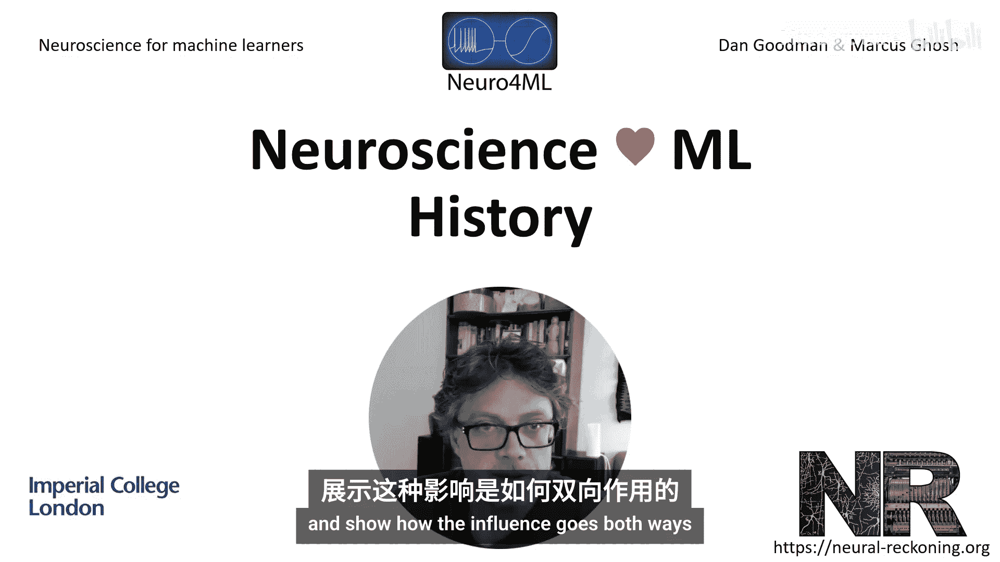

在本节课中，我们将回顾神经科学与机器学习之间相互影响的悠久历史。我们将聚焦几个关键的发展脉络，展示这种影响是如何双向流动的。

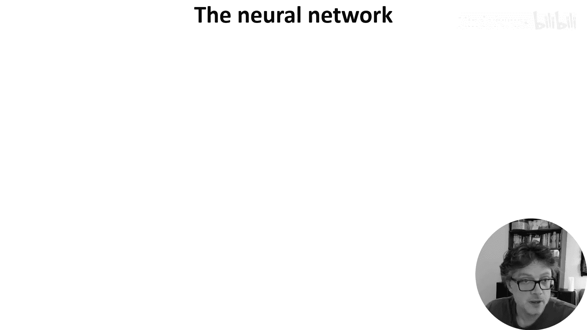

神经科学、机器学习乃至更广义的计算科学，长期以来一直相互影响，历史丰富。我们无法涵盖所有内容，因此本节将选取历史中的几条主线，展示这种双向影响。

## 神经网络概念的起源

上一节我们概述了课程目标，本节中我们来看看神经网络思想的起源。1943年，McCulloch和Pitts发表了首篇对神经元进行数学建模的论文。

这项工作最终催生了现代生物学和机器学习领域对神经网络的研究。他们的方法是基于当时已知的生物学神经元知识，明确承认未知部分，并创建一个即使在未来有新发现时也能成立的抽象模型。

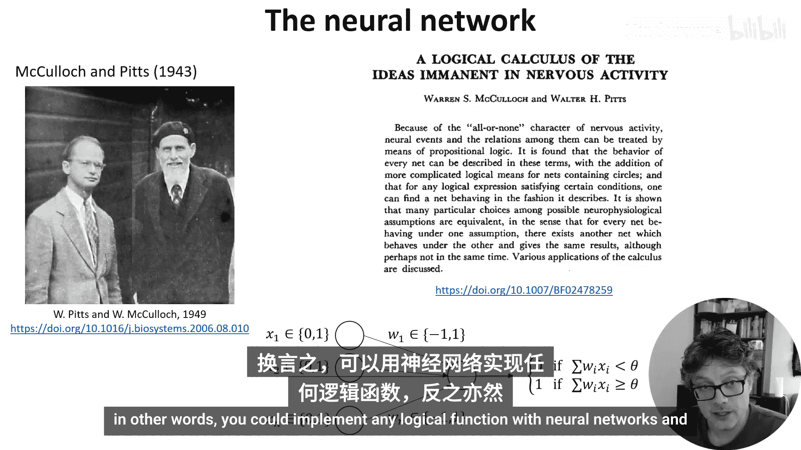

该模型本质上等同于现代的人工神经元，区别在于其输入和输出激活值是二元的，权重为+1或-1。这与当时已知的生物学事实相符：神经元通过称为动作电位或脉冲的、离散的“全或无”活动爆发进行通信。即使在今天，这仍是一个不错的神经元网络模型，尽管它缺失了本课程后续会讨论的许多有趣的时间动态特性。

他们展示的主要结果是，这类网络可计算的函数类等价于命题逻辑。换言之，你可以用神经网络实现任何逻辑函数，反之亦然。

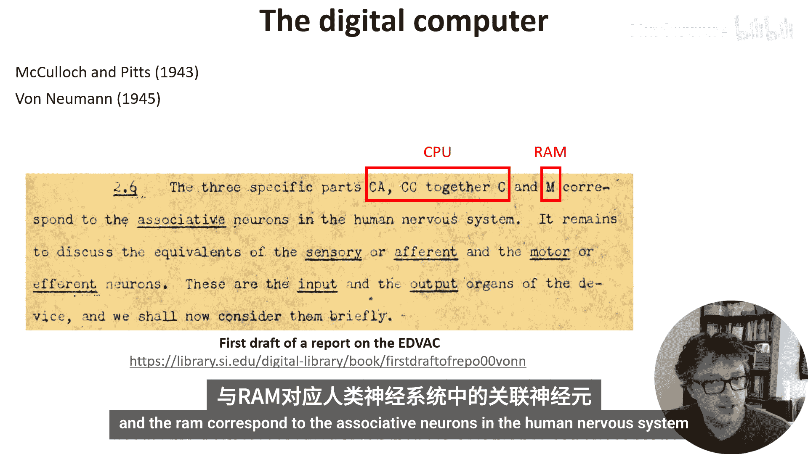

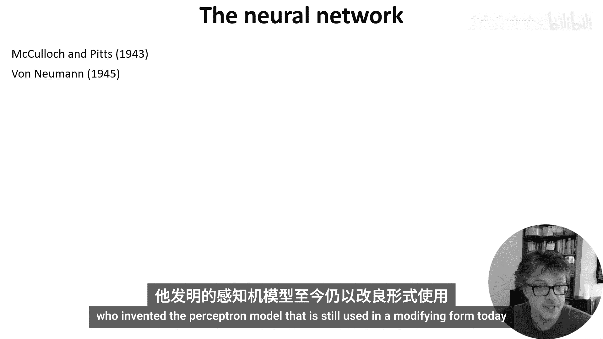

## 从生物学到计算机架构

作为一个小插曲，需要提及McCulloch和Pitts的工作以及大脑生物学直接启发了约翰·冯·诺依曼，他创造了现代数字计算机的架构。

如图所示，他指出CPU和RAM对应于人类神经系统中的联想神经元。

## 感知机：适应统计问题

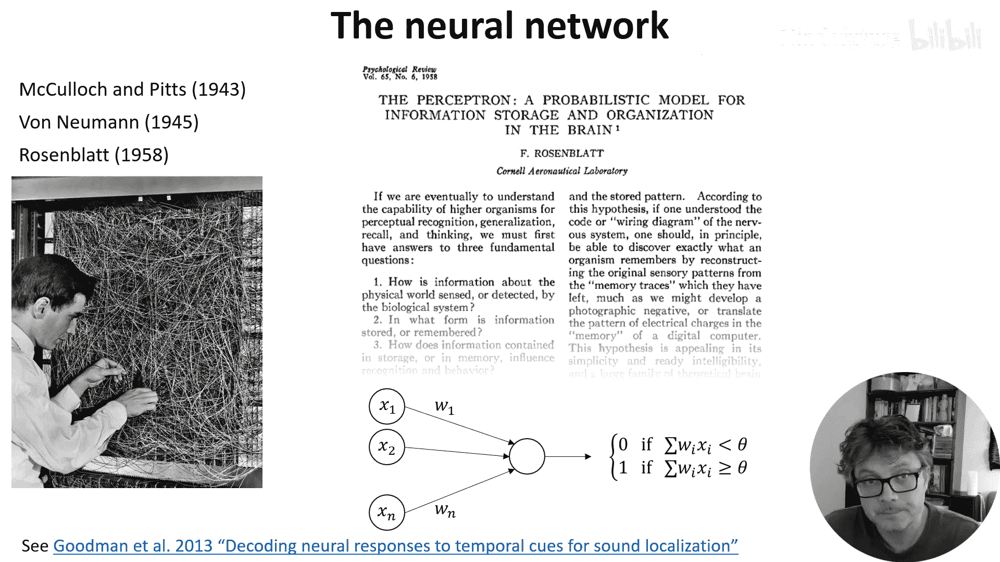

接下来神经网络概念的重大发展来自Frank Rosenblatt，他发明了感知机模型，其改良形式至今仍在沿用。

他确实用线缆构建了它，因为当时没有计算机可以模拟。它拥有512个可修改的连接，使用电机来调整权重，占满整个房间。

Rosenblatt的洞见在于，McCulloch-Pitts模型及其与命题逻辑的紧密联系过于僵化，无法处理大脑必须应对的统计问题。即，生物网络似乎是广泛且至少部分随机的，它们充满噪声，它们所处理的外部世界输入数据也是如此。

他提出的模型实际上相当复杂，此处不深入细节。与McCulloch和Pitts类似，它使用二元激活，并具有受当时生物学知识启发的循环结构和时间动态。后来的工作将其简化为你可能见过的形式，用以下方程表示：

`输出 = 激活函数(权重 * 输入 + 偏置)`

这项工作的关键结果是表明，给定来自某个分布的足够训练数据，模型在同一分布的不同样本上的测试准确率会接近训练准确率。这是早期方法不具备的特性，无疑是理解大脑的一个重要属性。

为证明其相关性，我在2013年的一篇论文中表明，感知机在统计学上是比当时该领域两种主流模型更好的哺乳动物声音定位模型。

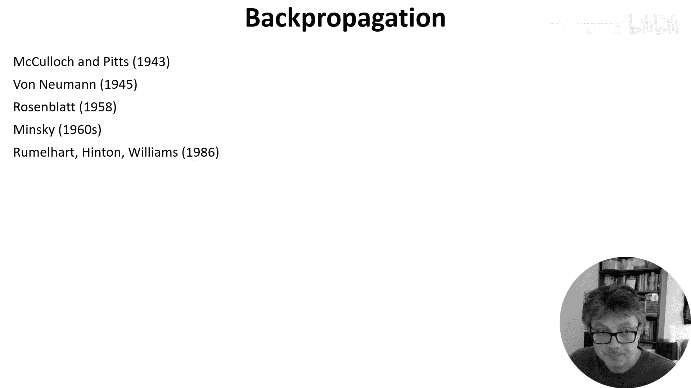

## 明斯基的批评与反向传播的诞生

接下来必须谈到的是明斯基对感知机的批评。这里不会详述，因为它与神经科学没有直接关系，但完全忽略它也不妥。在20世纪60年代，Marvin Minsky开始批评感知机，最终在1969年出版了一本书，该书被认为是导致神经网络研究资金中断、使该领域倒退数十年的原因。

他的论点是，单层感知机只能实现线性可分函数，因此无法计算诸如异或、奇偶性或连通性等函数。然而，他确实认识到多层感知机能够做到，并且众所周知McCulloch-Pitts神经元可以做到异或，因为它可以实现任何逻辑函数。他对多层感知机的批评并非它们不能实现这些函数，而是它们太难训练。显然，这后来被证明在很大程度上是错误的，但有趣的是，它并非完全错误。

尽管可以用深度或循环神经网络解决连通性问题，但如果不通过非常具体且高度受限的架构来“喂入”答案，仍然很难通过训练找到这个或任何其他解决方案。事实上，这仍然是一个开放的研究问题。为了证明在神经科学与机器学习历史中讨论此事的合理性，我能找到的最新相关论文实际上来自一个神经科学研究小组。

明斯基认为多层神经网络可能难以训练，但Rumelhart、Hinton和Williams在反向传播中找到了解决方案。

此处有一个非常简短的总结，如需可暂停阅读。简而言之，他们找到了一种高效算法来计算损失函数相对于网络参数的梯度，从而为多层神经网络提供了一种高效的梯度下降方法。这被证明在很大程度上解决了明斯基关于可训练性的问题，例如找到了异或问题的解决方案。尽管理论上仍未完全证明它何时有效，并且我们之前看到了一个它失败的例子。

顺便提一下，基于梯度的方法在明斯基发展其论点的60年代就已为人知，但当时认为它们对于高维问题效率太低且收敛太慢。

## 反向传播与生物合理性

回到神经科学，Rumelhart及其同事明确认识到，尽管他们的方法有效，但并不具有生物合理性。但这里有一些有趣的转折。首先，一些具有生物合理性的学习规则可以被视为反向传播的数学近似，我们将在课程后期讨论。其次，反向传播不具有生物合理性的原因可能最终无关紧要。

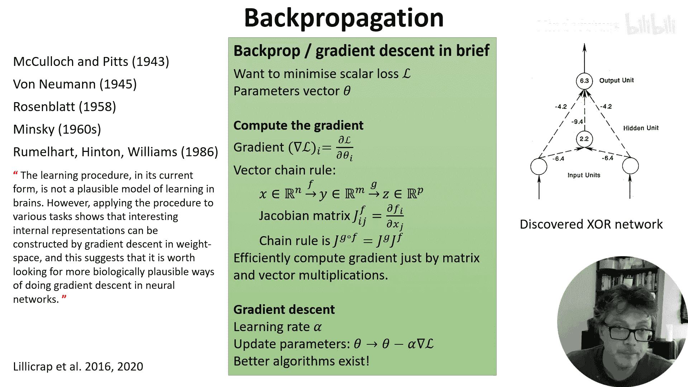

论点在于，反向传播需要通过网络反向传递误差信号，而目前没有已知的生物机制能做到这一点。理论上，可以用一个次级反馈网络来携带误差信号反向通过网络，但它必须与前馈网络完全对称，而大脑中并未观察到类似结构。

但在2016年之后的一个引人入胜的进展中，Timothy Lillicrap及其同事发现，即使使用一个不对称的随机前馈网络，它仍然有效。事实证明，前馈网络会学习与反馈网络对齐，最终，反馈网络为已学习或已对齐的前馈网络携带正确的误差信号。这种反馈对齐方法被证明无法扩展到非常深的网络，但故事尚未结束，该领域仍有大量有趣的研究在进行。

## 视觉系统与卷积神经网络

在结束关于神经网络的讨论前，我们想在本视频结束前再涵盖几个主题。第一个是视觉系统的神经科学研究与卷积神经网络发展之间的相互作用。

在50年代末60年代初，神经科学家Hubel和Wiesel在视觉系统早期部分发现了两种主导细胞类型。他们分析的大多数细胞都有一个感受野，即视野中一个小的局部区域，在该区域照射光线可引起神经元放电，而在其他区域则无效。

一些细胞是简单细胞，这意味着基本上可以通过了解它们对不同光点照射的反应来预测它们对任何信号的反应。这大致相当于说它们充当线性滤波器。以下是一个他们记录的例子：在标有X的地方照射光线会使细胞更活跃，在标有小菱形的地方照射会使它活跃度降低。

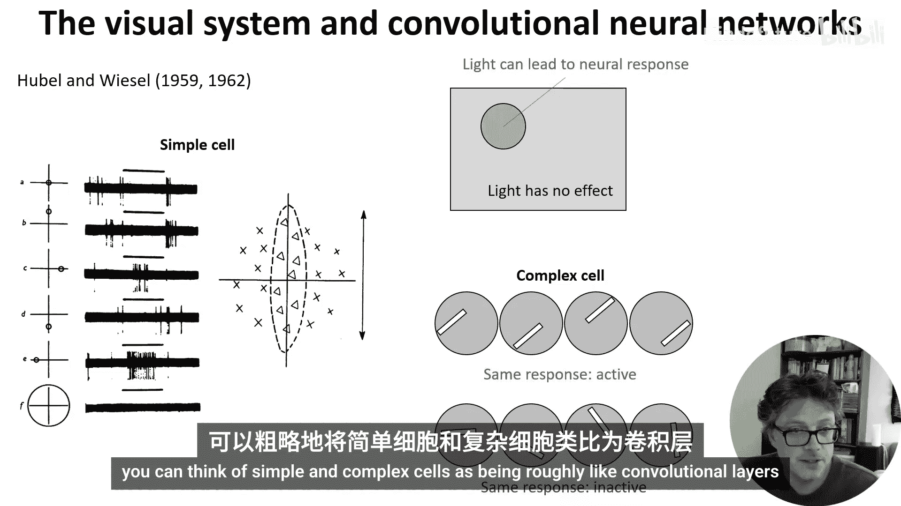

他们还发现了复杂细胞。这些被定义为任何非简单细胞，但在许多情况下，他们发现这些细胞具有这样的特性：例如，对具有特定朝向的光棒有反应，但不介意光棒出现在其感受野内的哪个位置。如果你了解卷积神经网络的工作原理，这可能不会让你感到惊讶。你可以将简单细胞和复杂细胞大致视为卷积层和池化层。

这种简单细胞和复杂细胞结构直接启发了Fukushima在1980年提出的新认知机。这是一个明确受Hubel和Wiesel启发的计算模型，具有交替的S层和C层，分别对应简单细胞和复杂细胞。该网络通过一种定制的无监督学习规则进行训练。1989年，Yann LeCun等人采用了基本相同的架构，但使用反向传播进行训练，后来改进此模型并称之为卷积神经网络。这导致了接下来几十年机器学习领域的蓬勃发展，并在当前机器学习成功的大爆发中扮演了重要角色。

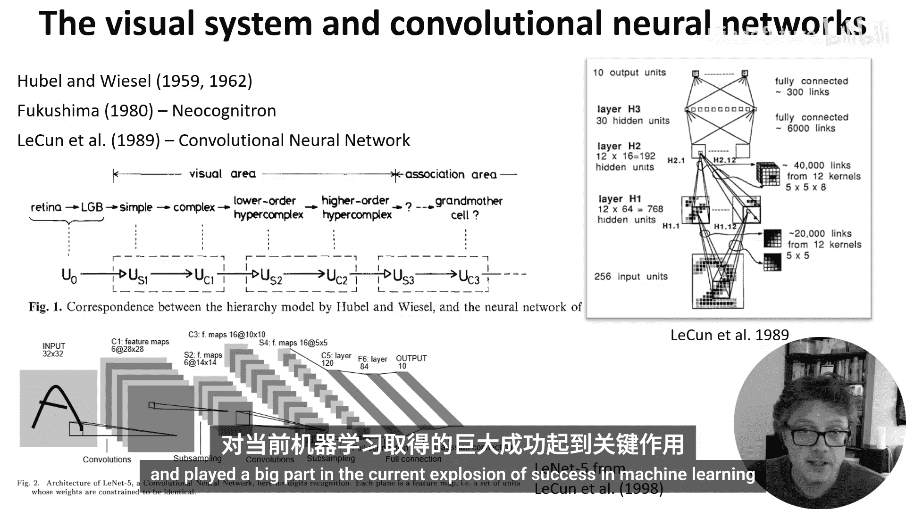

## 从机器学习回到神经科学

在结束关于视觉系统的讨论之前，我想简要地将其带回神经科学，以表明影响并非单向。2014年，Dan Yamins及其同事发现，训练CNN以良好执行某项任务，实际上使其内部表征与视觉系统中记录的神经数据高度匹配。Alex Kell及其同事在听觉皮层中也发现了同样的情况。

这促使Martin Schrimpf等人提出了“大脑评分”和排行榜，以追踪哪些模型与神经数据最匹配。但故事并未结束，许多人对此并不信服。例如，Jacob Billeh发现这些网络无法预测人类在面对分布外刺激时的成功与失败模式。我的研究小组在听觉刺激中也发现了同样的问题，与此同时，另一个小组也独立发现了同样的情况。

因此，关于深度神经网络作为大脑模型有多好，尚无定论。但可以肯定的是，机器学习目前对神经科学产生了巨大的影响。

## 强化学习：从动物心理学到现代AI

本视频要讨论的最后一个主题是强化学习。这个词实际上可以追溯到1927年的巴甫洛夫（研究狗的那位）。对这种学习的研究，实际上可以追溯到1898年的Thorndike。此时，它更多是动物心理学而非神经科学。有趣的是，Thorndike的论文现在看来很滑稽，因为他的主要目的似乎是证明动物实际上相当愚蠢，这也许是当时的一个活跃辩论话题。

他建造了具有不同复杂度的开启机制的笼子，动物必须从中逃脱，并追踪它们在多次试验中逃脱所需的时间。在我看来，这些数据与现代的训练曲线惊人地相似。在结论中，你甚至可以看到一些暗示，用现代强化学习的术语来说，就是优化价值而非优化奖励。

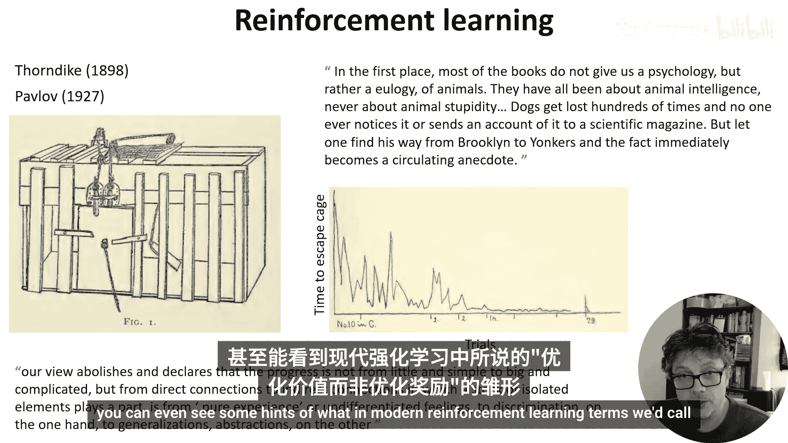

心理学和神经科学的研究人员在这一领域有许多发展，我不想深入整个历史。如果你感兴趣，Sutton和Barto有一本很棒的在线免费书籍，深入探讨了这段历史。

这里仅提及其历史中的几个有趣时刻。例如Alan Turing在1948年的论文，其中描述了一个明确作为大脑皮层模型的计算学习器。有一段很长的时期，强化学习的数学建模主要由计算机科学家和最优控制领域的研究人员进行。它在80年代和90年代以巨大的声势回归神经科学，通过对多巴胺神经元的实验以及模型表明，它们的活动符合时间差分学习的预期。这引发了神经科学领域的巨大研究浪潮，其中许多工作发生在UCL的Gatsby计算神经科学部门，由Peter Dayan及其同事领导。为了展示至今仍有紧密联系，DeepMind创始人Demis Hassabis在创立DeepMind前的最后一个学术职位就是在UCL与Peter Dayan共事，他至今仍倡导人工智能应受神经科学影响。

## 总结与延伸阅读

本节课中，我们一起学习了神经科学与机器学习相互影响的一段非常简要且不完整的历史。还有更多内容值得探索。

以下是几篇优秀的论文，如果你有兴趣了解更多关于这段历史以及该领域当前的进展：

*   （此处可插入推荐的论文标题或主题，因原文未提供具体名称，故保留概括性描述）

此外，Patrick Mineault的时事通讯也非常值得订阅，它涵盖了有时被称为“神经AI”领域的所有最新进展。

或许，下一个重大进展就将由你来创造。

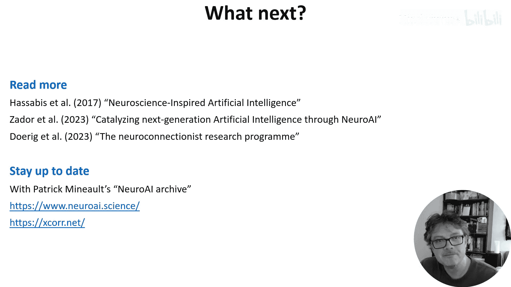

