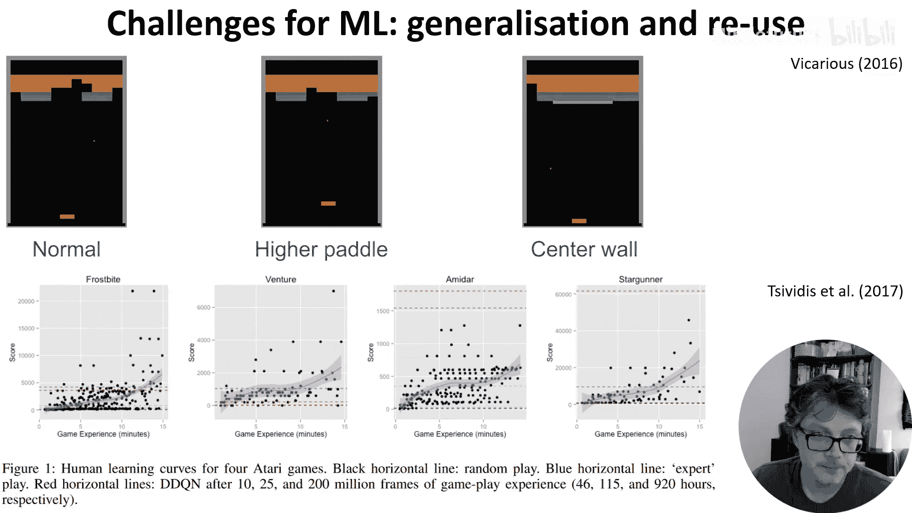
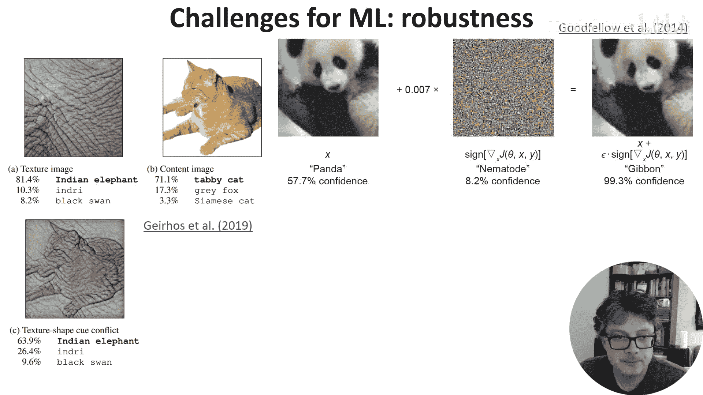
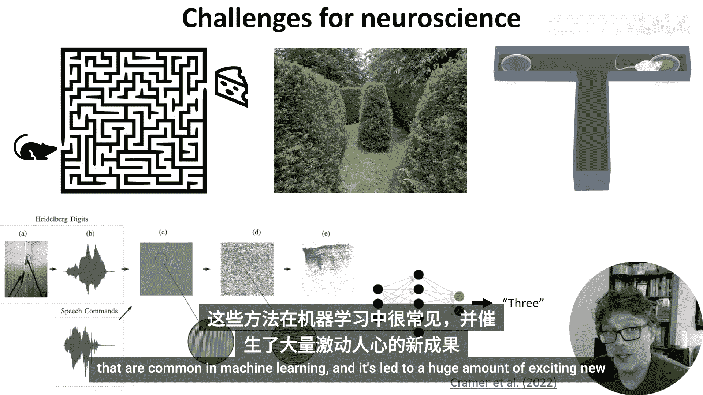
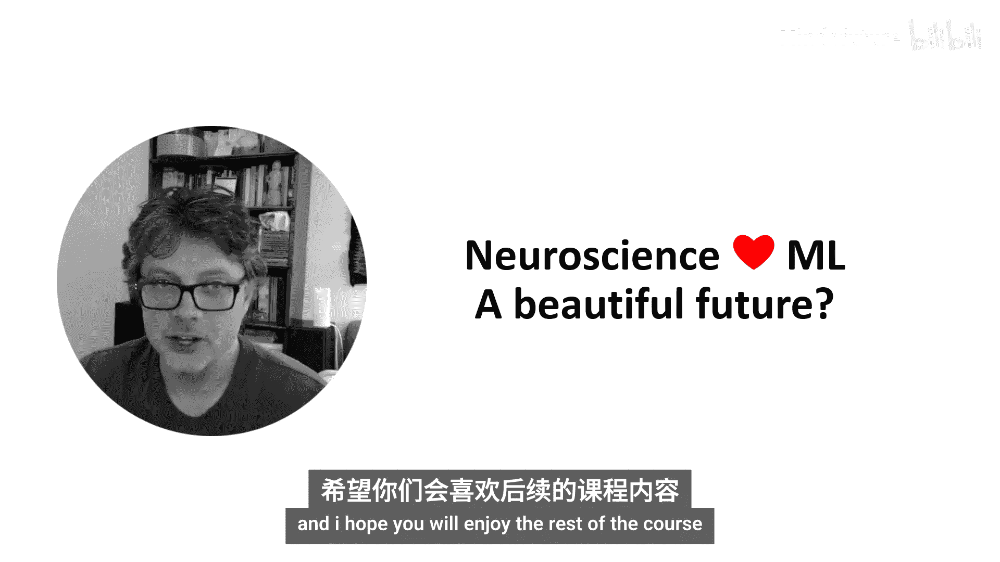

# 004：机器学习与神经科学面临的挑战

在本节课中，我们将探讨机器学习与神经科学各自面临的挑战，并分析这两个领域如何通过相互借鉴来推动彼此的进步。

## 概述

上一节我们讨论了神经科学与机器学习的历史渊源。本节中，我们将具体审视当前机器学习在**能效**、**训练数据需求**与**鲁棒性**方面的挑战，同时也会探讨神经科学在实验设计上的局限性。理解这些挑战，有助于我们看清两个领域互补合作的前景。

## 挑战一：能效问题

我们先从能效挑战谈起。一个著名的例子是AlphaGo与李世石之间的围棋比赛。

1997年，计算机在国际象棋上超越了人类，但在搜索空间更大的围棋领域，人类一直保持优势，直到2016年DeepMind的AlphaGo击败了顶尖棋手李世石。

据估算，在那场比赛中，AlphaGo的功耗大约在**100到1000千瓦**之间，而李世石可怜的人脑功耗大约只有**20瓦**。这意味着AlphaGo的能效比人脑低了约**5000到50000倍**，并且人脑同时还在处理许多其他任务。

显然，这是一个巨大的差距。但到第二年，DeepMind推出了AlphaGo Zero，其棋力更强，据称功耗仅约为**1到2千瓦**，相当于**50到100个人脑**的功耗。虽然这仍然很低效，但一年内能效就提升了50倍以上，因此机器的进步速度不容小觑。

## 挑战二：训练数据需求

机器学习面临的另一个挑战是达到高性能所需的海量训练数据。

AlphaGo Zero的训练使用了超过**500万局**棋谱。我们不知道李世石下了多少局棋，但比赛时他33岁，假设他从5岁开始，每天下5局棋，总计也只下了大约**5万局**。当然，这不完全公平，因为李世石利用了人类历史上积累的集体围棋知识。但AlphaGo Zero也尝试利用人类棋谱进行训练，结果发现帮助不大：训练速度虽略有提升，但最终达到的棋力水平反而更低。

这背后的原因之一是，人类拥有大量知识，并能将其灵活应用于新场景，而机器学习方法在这方面仍然落后，尽管进步很快。

以下是另一个说明泛化能力不足的例子：

*   2016年，被谷歌收购的Vicarious公司对游戏《打砖块》进行了有趣的分析。当时的深度强化学习方法能轻松掌握原版游戏，但当引入细微变化时，问题就出现了。
*   例如，仅仅将挡板的位置调高一点，人类玩家毫无问题，但DRL智能体几乎需要从头开始重新训练。
*   同样，在游戏中添加一道灰色的不可摧毁的墙，也会导致智能体失效。

另一项针对人类学习雅达利游戏的研究发现，对于某些被DRL“掌握”的游戏，人类在**不到15分钟**的训练后，就能达到与经过**数十甚至数百小时**训练的DRL智能体相似或更好的水平。

## 挑战三：鲁棒性不足

本节要讨论的机器学习最后一个挑战是**鲁棒性**。尽管近期有所改善，但机器学习解决方案往往很脆弱，容易出错。

这体现在许多方面，上一张幻灯片讨论的泛化与复用问题就是一个例子。另一种表现是它们容易被操纵，即所谓的**对抗性攻击**。

一个经典例子是：向一张图像添加人眼无法察觉的、看似随机的微小噪声，就能让图像识别系统以高置信度输出任何你想要的标签。这本身就告诉我们，神经网络处理图像的方式与人类截然不同。

部分原因在于，与人类相比，这些网络更重视**纹理**而非**形状**。例如，给一张猫的图片加上大象的纹理，网络会识别为“大象”，而大多数人仍会认为是“猫”。

但你甚至不需要这么复杂的操作，只需添加一点文字就能让它改变主意。例如，在一张苹果的图片上贴上“iPod”文字，它就会识别为“iPod”而不是“Apple”。

## 神经科学面临的挑战

现在，让我们把目光从机器学习转向神经科学面临的一些挑战。

第一个挑战与实验设计有关。你可能知道科学家喜欢研究老鼠在迷宫中奔跑。你想象的可能是这样的迷宫，或者，如果你常去英国乡村，也许是这样的。但现实中的实验往往是这样**极其简单**的。

在神经科学中，我们的实验通常非常简单，常常归结为**二元选择**。这有充分的理由：训练动物完成实验很困难，并且我们需要一种简单的方式来解释结果。

但这意味着，我们试图通过研究动物来理解智能行为，却使用那些实际上并不真正需要任何智能的任务。如果我们真想理解智能，目前的方法是否足够，尚不清楚。

我们的模型也存在同样的问题。对于生物启发的脉冲神经网络来说，最具挑战性的数据集之一是**Spiking Heidelberg数据集**，而这只是一个包含**20个**口语单词的分类数据库。

尽管如此，近年来神经科学领域出现了一个新趋势，即开始关注机器学习中常见的那种具有挑战性的复杂任务，这已经催生了大量令人兴奋的新工作。

## 总结与展望

我认为这是一个结束本周课程的好节点。历史上，神经科学与机器学习曾紧密相连，并因此在两个领域都催生了出色且开创性的工作。

我确信，如果两个领域的研究者能更多地了解彼此的进展，双方都将取得更大的进步。希望你能享受课程后续的内容。