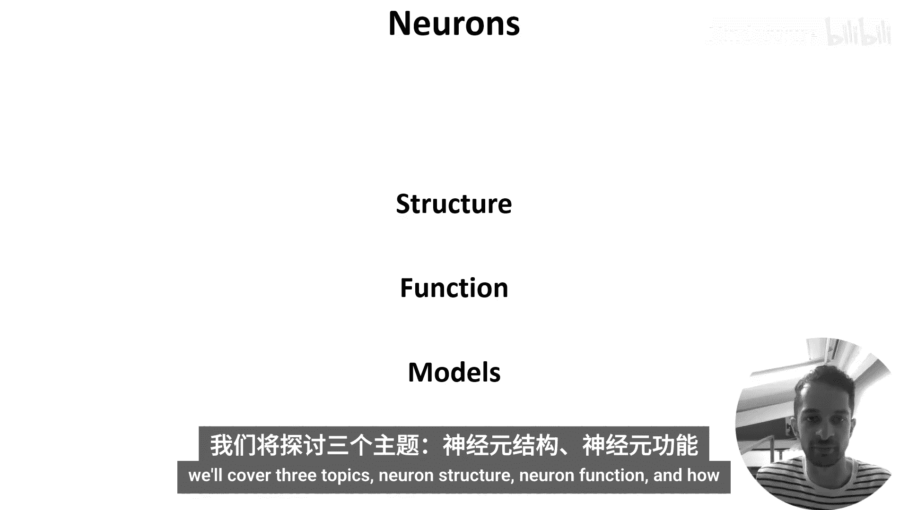
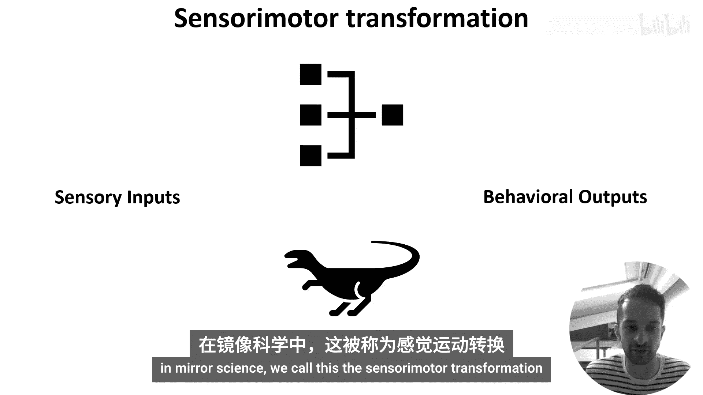
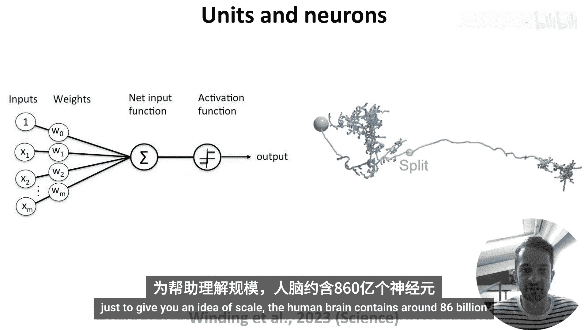
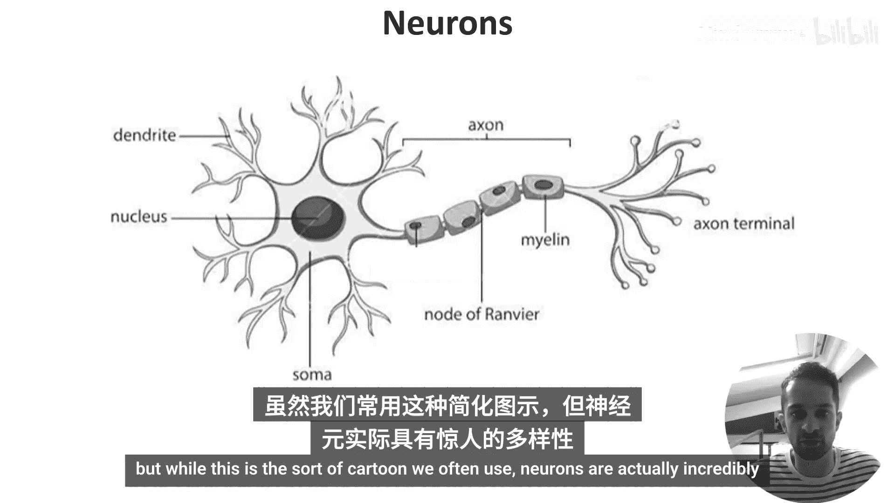
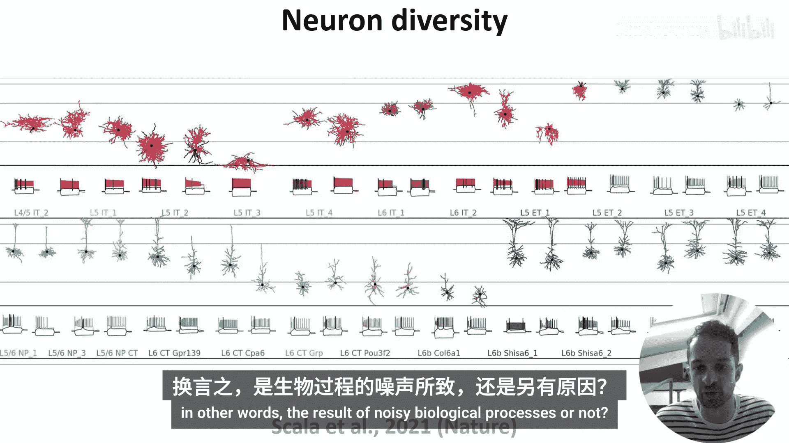
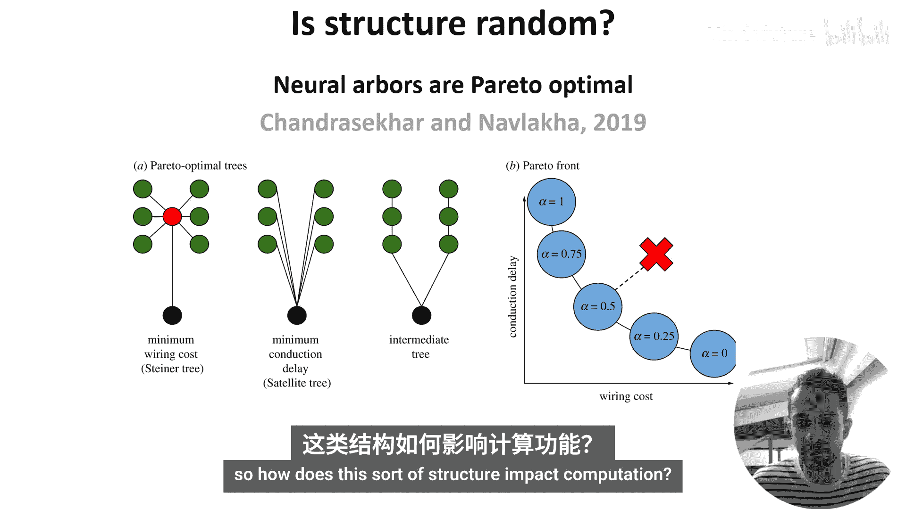
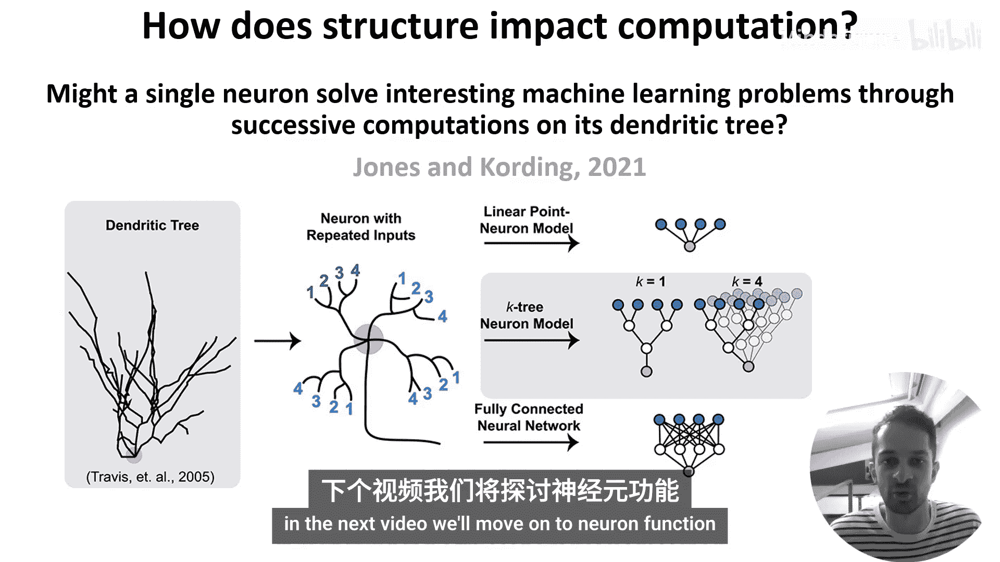

# 005：神经元结构 🧠

在本节课中，我们将学习神经元的结构。神经元被认为是大脑的主要处理单元，理解其结构是理解大脑如何工作的第一步。我们将探讨神经元的基本组成部分、其形态的多样性，以及这种结构如何可能影响其计算功能。

## 概述

在人工神经网络中，计算由“单元”完成，这些单元对加权输入求和，并通过激活函数（如ReLU）传递结果。在大脑中，对应的基本单元是神经元。然而，神经元并非简单的点，而是复杂的立体结构。人类大脑包含约860亿个神经元。

## 神经元的基本组成部分

与其它细胞类似，神经元也有一层脂肪膜，将其内部内容物与外部环境隔开。内部充满称为细胞质的液体。在细胞质中，可以找到细胞核等常见细胞器，细胞核包含遗传物质，通常位于神经元的主要细胞体（即胞体）中。

但与其他许多细胞不同，神经元是信息处理单元。它们通过左侧所示的**树突树**接收来自其他神经元的输入，然后通过右侧所示的**轴突**向其他神经元、肌肉或腺体发送信号。

## 神经元的形态多样性

我们常用的示意图是一种简化。实际上，神经元具有惊人的多样性。例如，一项研究对超过1000个神经元进行了详细测量，得出结论认为存在大约70种类型，它们在包括形态在内的多个特征上存在差异。

一些神经元（图中蓝色部分）看起来像上一张幻灯片中的示意图，但另一些（如粉色部分）则看起来相当不同。你可能会认为这种复杂性是人类大脑所独有的，但事实上，这70种神经元类型的研究都只聚焦于小鼠大脑的一个部分。

## 结构是随机的吗？

这种结构多样性是随机的吗？换句话说，是嘈杂的生物过程的结果吗？答案是否定的。

在一篇论文中，作者分析了一个开源数据集中超过10,000个真实神经元的形态，并证明它们在**布线成本**（构建分支所需的材料量）和**传导延迟**（胞体与其他神经元接触点之间的距离）之间取得了平衡。

图A展示了如何以不同方式连接输入点（绿色圆圈）和胞体（黑色圆圈）。左侧是布线成本最小的树，中间是传导延迟最小的树，右侧是一个折中的树。最小化布线成本和传导延迟这两个目标相互竞争，形成了一个帕累托前沿：改善一个会导致另一个的损失。

作者得出结论，神经元的树状结构比随机情况更接近帕累托最优。这表明神经元结构并非随机，而是在优化布线成本和传导延迟之间取得了平衡。

## 结构如何影响计算？

坦白说，这是一个开放性问题。这里我们提供一个例子，展示人们在这个方向上的研究类型。

在这项研究中，作者对单个神经元进行建模，研究改变其树突树（负责处理输入）的特性如何影响其解决经典机器学习基准任务（如MNIST）的能力。

从对真实树突树的检查中，研究人员发现了两个有趣的特征：**分支形态**和**重复输入**。作者研究了改变这种树结构（他们称之为K树模型）如何影响任务性能。他们使用线性点神经元模型作为性能下限，使用具有相同可训练参数数量的全连接神经网络作为性能上限。

他们的结论是，树模型的性能随着重复子树数量的增加而提高，但当使树结构更真实（即不对称）时，性能开始下降。这表明，关于结构如何精确影响计算，仍有大量探索空间。

## 总结

本节课中，我们一起学习了神经元的基本结构，了解了其作为复杂立体信息处理单元的特性。我们看到了神经元形态的惊人多样性，并了解到这种结构并非随机，而是在布线成本和信号传导速度之间取得了优化平衡。最后，我们探讨了结构如何可能影响计算功能，认识到这是一个活跃的研究领域。在下一节视频中，我们将转向神经元的功能。